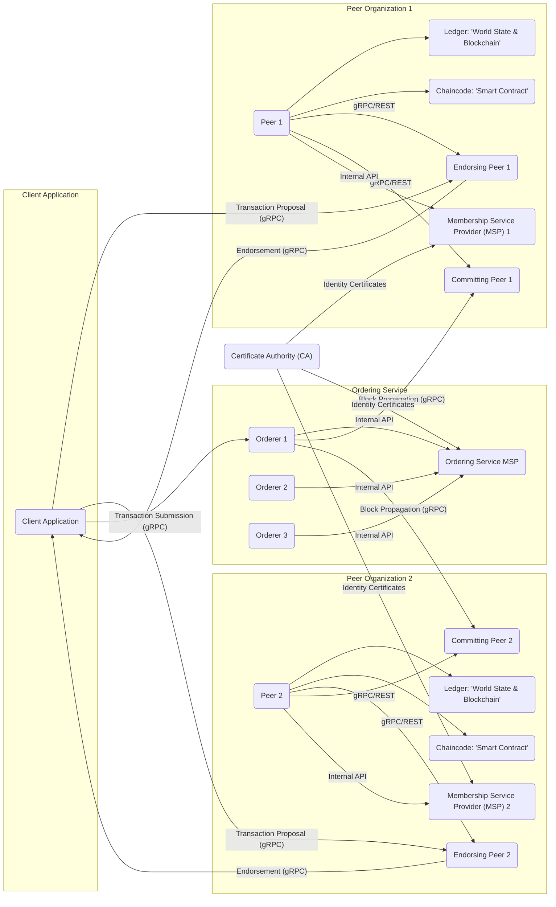
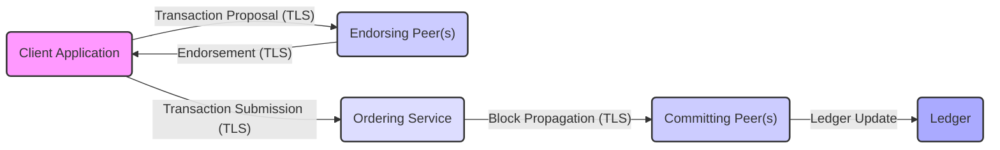

## Project Design Document: Hyperledger Fabric for Threat Modeling (Improved)

**1. Introduction**

This document provides an enhanced architectural overview of the Hyperledger Fabric project, specifically tailored for effective threat modeling. It details the core components, their interactions, data flows, and inherent security mechanisms, aiming to facilitate the identification of potential vulnerabilities and threats. This document serves as a comprehensive resource for security analysts, developers, and operators involved in securing Hyperledger Fabric deployments.

**2. Goals and Objectives**

The primary goal remains to provide a clear and detailed understanding of the Hyperledger Fabric architecture to enable robust threat modeling. Specific objectives include:

*   Clearly defining key components and their specific security responsibilities.
*   Precisely mapping the interactions and communication protocols between components, highlighting security implications.
*   Describing the complete data lifecycle within the system, emphasizing sensitive data handling.
*   Detailing the security mechanisms implemented at each layer and their limitations.
*   Providing a solid foundation for systematically identifying potential attack surfaces, threat actors, and threat vectors.

**3. System Architecture Overview**

Hyperledger Fabric's modular architecture provides a flexible and secure foundation for enterprise blockchain solutions.

**4. Key Components and Their Functionality (with Security Focus)**

*   **Client Application:**
    *   **Functionality:** Initiates transactions, queries the ledger, and interacts with the network on behalf of users or systems.
    *   **Security Relevance:**  A compromised client application can submit malicious transactions or leak sensitive data. Secure storage of client identities and secure communication channels are critical.
    *   **Potential Threats:** Key compromise, injection attacks, insecure API usage.

*   **Peers:**
    *   **Functionality:** Maintain the ledger, execute chaincode, and participate in transaction endorsement and commitment.
    *   **Security Relevance:** Peers hold sensitive data (ledger) and execute critical business logic (chaincode). Their security is paramount.
    *   **Endorsing Peers:** Simulate transactions and sign the results. Vulnerable endorsing peers can provide faulty endorsements.
    *   **Committing Peers:** Validate and commit transactions. Compromised committing peers could potentially commit invalid transactions (though difficult with proper endorsement policies).
    *   **Potential Threats:**  Code injection in chaincode execution, unauthorized access to the ledger, denial-of-service attacks, data breaches.

*   **Ledger:**
    *   **Functionality:** Stores the immutable transaction history (blockchain) and the current state of assets (world state).
    *   **Security Relevance:** The ledger contains all transactional data and must be protected against unauthorized access and modification.
    *   **World State:**  Often stored in a database (e.g., CouchDB, LevelDB). Security depends on the underlying database security.
    *   **Blockchain:** Cryptographically linked blocks ensure immutability and tamper-evidence.
    *   **Potential Threats:**  Unauthorized read access to sensitive data, though modification is cryptographically protected. Vulnerabilities in the underlying database.

*   **Chaincode (Smart Contract):**
    *   **Functionality:** Defines the business logic and rules for interacting with the ledger.
    *   **Security Relevance:** Chaincode vulnerabilities are a major attack vector. Bugs can lead to asset manipulation, data leaks, or denial of service.
    *   **Potential Threats:**  Code injection, business logic flaws, reentrancy attacks, denial-of-service vulnerabilities.

*   **Ordering Service:**
    *   **Functionality:** Orders transactions into blocks and ensures consistent ordering across the network.
    *   **Security Relevance:** The ordering service ensures agreement on the transaction order. Its compromise could lead to transaction manipulation or censorship.
    *   **Potential Threats:**  Denial-of-service attacks, consensus mechanism vulnerabilities, unauthorized access to transaction data before commitment.

*   **Membership Service Provider (MSP):**
    *   **Functionality:** Manages identities, authentication, and authorization for organizations within the network.
    *   **Security Relevance:**  The MSP is critical for access control. Misconfiguration or compromise can lead to unauthorized access and actions.
    *   **Potential Threats:**  MSP configuration errors leading to overly permissive access, compromise of MSP administrator keys.

*   **Certificate Authority (CA):**
    *   **Functionality:** Issues and manages digital certificates for network participants.
    *   **Security Relevance:** The CA is the root of trust. Its compromise would have catastrophic consequences, allowing attackers to impersonate any network participant.
    *   **Potential Threats:**  CA key compromise, rogue CA issuance, vulnerabilities in CA software.

**5. Data Flow (with Security Considerations)**

The transaction flow highlights critical points for security analysis:

1. **Transaction Proposal:**
    *   **Data:** Transaction details, client signature.
    *   **Security:**  Integrity and authenticity of the proposal are ensured by the client's digital signature. Communication should be over secure channels (TLS).
2. **Transaction Simulation and Endorsement:**
    *   **Data:** Proposed changes to the world state, endorsement signature.
    *   **Security:** Endorsing peers verify the client's signature and execute the chaincode in a secure environment. Endorsements are signed to prevent tampering.
3. **Transaction Submission:**
    *   **Data:** Signed transaction proposal and endorsements.
    *   **Security:**  Communication with the ordering service should be secured.
4. **Transaction Ordering and Block Creation:**
    *   **Data:** Ordered transactions.
    *   **Security:** The ordering service's consensus mechanism ensures the integrity and agreement on the order of transactions.
5. **Block Propagation and Validation:**
    *   **Data:** Newly created block containing ordered transactions.
    *   **Security:** Block integrity is ensured through cryptographic hashing. Peers verify the block's signature and the signatures of the transactions within.
6. **Transaction Validation and Commit:**
    *   **Data:** Validated transactions and updates to the world state.
    *   **Security:** Committing peers verify endorsements against the channel's endorsement policy before committing transactions.

**6. Security Mechanisms**

Hyperledger Fabric employs a layered security approach:

*   **Identity and Access Management:**
    *   PKI using X.509 certificates for strong identity.
    *   MSP defines organizational membership and roles.
    *   Attribute-Based Access Control (ABAC) can be implemented in chaincode.
*   **Confidentiality:**
    *   Channels for private communication between subsets of network members.
    *   Private Data Collections for restricting data access within a channel.
    *   Zero-Knowledge Proofs (potential future enhancement).
*   **Integrity:**
    *   Cryptographic hashing of blocks and transactions.
    *   Digital signatures for non-repudiation.
*   **Availability:**
    *   Distributed architecture with redundancy.
    *   Fault-tolerant ordering service.
*   **Endorsement Policies:** Define the required endorsements for a transaction to be valid.
*   **Communication Security:** TLS/SSL for secure communication between all components.

**7. Deployment Considerations (Impact on Security)**

Deployment choices significantly influence the security landscape:

*   **On-Premise:** Requires robust physical security, network segmentation, and infrastructure hardening. Organizations have full control but also full responsibility for security.
*   **Cloud-Based:** Leverages the cloud provider's security infrastructure but introduces dependencies and potential shared responsibility models. Proper configuration of cloud security services is crucial.
*   **Hybrid:** Combines the complexities of both on-premise and cloud deployments, requiring careful coordination of security measures.

Containerization (e.g., Docker) adds another layer of security considerations, including image security and container runtime security.

**8. Assumptions and Constraints**

*   The security of the underlying infrastructure (OS, network) is a prerequisite.
*   Secure key management practices are essential for protecting private keys.
*   Chaincode is developed with security best practices in mind and undergoes security reviews.
*   Network administrators properly configure MSPs, channels, and security policies.
*   The chosen consensus mechanism is appropriately configured and resilient to attacks.

**9. Potential Threat Areas (Detailed for Threat Modeling)**

This section provides a more granular breakdown of potential threats:

*   **Identity and Access Management:**
    *   **Threat:** Private Key Compromise.
        *   **Attack Vector:** Phishing, malware, insider threats, insecure key storage.
        *   **Impact:** Unauthorized transaction submission, data access, impersonation.
    *   **Threat:** MSP Configuration Errors.
        *   **Attack Vector:** Human error during configuration.
        *   **Impact:** Overly permissive access, bypassing intended access controls.
    *   **Threat:** Rogue or Compromised CA.
        *   **Attack Vector:** Exploiting vulnerabilities in CA software, insider threats.
        *   **Impact:** Issuance of fraudulent certificates, complete compromise of trust.

*   **Transaction Processing:**
    *   **Threat:** Malicious Chaincode.
        *   **Attack Vector:** Exploiting vulnerabilities in chaincode logic, backdoors.
        *   **Impact:** Unauthorized asset transfer, data manipulation, denial of service.
    *   **Threat:** Endorsement Policy Manipulation.
        *   **Attack Vector:** Compromising enough organization administrators to alter the policy.
        *   **Impact:** Allowing invalid transactions to be committed.
    *   **Threat:** Replay Attacks.
        *   **Attack Vector:** Intercepting and resubmitting valid transactions.
        *   **Impact:** Double-spending or unintended state changes (mitigated by transaction IDs).

*   **Ordering Service:**
    *   **Threat:** Denial-of-Service (DoS) Attacks.
        *   **Attack Vector:** Flooding orderers with transaction requests.
        *   **Impact:** Network disruption, inability to process transactions.
    *   **Threat:** Consensus Mechanism Exploits.
        *   **Attack Vector:** Exploiting known vulnerabilities in the chosen consensus algorithm (e.g., Raft leader election manipulation).
        *   **Impact:** Potential for transaction censorship or manipulation.
    *   **Threat:** Orderer Node Compromise.
        *   **Attack Vector:** Exploiting vulnerabilities in the orderer software or underlying infrastructure.
        *   **Impact:** Ability to manipulate transaction ordering or censor transactions.

*   **Ledger Security:**
    *   **Threat:** Unauthorized Read Access.
        *   **Attack Vector:** Exploiting vulnerabilities in peer software or underlying database.
        *   **Impact:** Exposure of confidential transaction data.
    *   **Threat:** Data Tampering (highly difficult).
        *   **Attack Vector:** Requires breaking cryptographic hashes and consensus mechanisms.
        *   **Impact:** Loss of data integrity and trust in the ledger.

*   **Communication Security:**
    *   **Threat:** Man-in-the-Middle (MITM) Attacks.
        *   **Attack Vector:** Intercepting and potentially modifying communication between components.
        *   **Impact:** Data breaches, transaction manipulation (mitigated by signatures).
    *   **Threat:** Eavesdropping.
        *   **Attack Vector:** Capturing network traffic.
        *   **Impact:** Exposure of sensitive data if not properly encrypted.

*   **Infrastructure Security:**
    *   **Threat:** Vulnerabilities in Operating Systems or Containerization Platforms.
        *   **Attack Vector:** Exploiting known vulnerabilities.
        *   **Impact:** Compromise of network components.
    *   **Threat:** Network Segmentation Failures.
        *   **Attack Vector:** Misconfigured firewalls or network policies.
        *   **Impact:** Allowing unauthorized access between network segments.

This improved document provides a more detailed and security-focused overview of Hyperledger Fabric, better equipping security professionals for comprehensive threat modeling exercises.