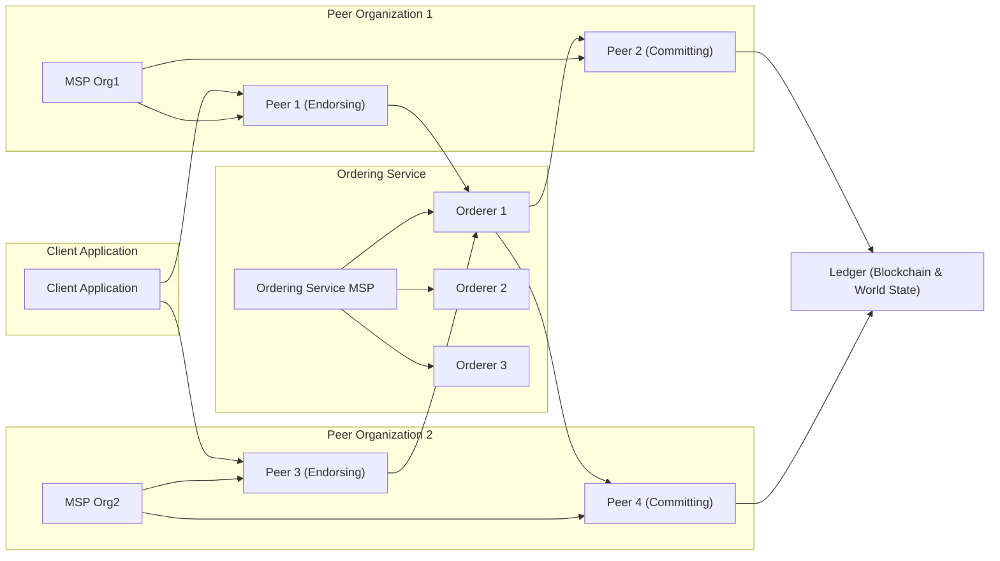
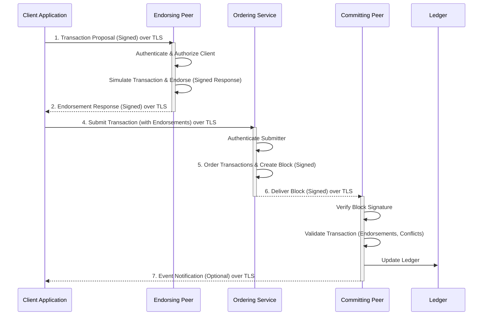

# Hyperledger Fabric Project Design Document for Threat Modeling

**Version:** 1.1
**Date:** 2023-10-27
**Author:** AI Cybersecurity Expert

## 1. Project Overview

**Project Name:** Hyperledger Fabric

**Project Repository:** [https://github.com/hyperledger/fabric](https://github.com/hyperledger/fabric)

**Project Description:** Hyperledger Fabric is an enterprise-grade, permissioned distributed ledger technology (DLT) platform, designed for use in enterprise contexts. It offers a modular and versatile architecture for developing blockchain-based applications and solutions. Fabric is designed to support a wide range of industry use cases, providing high degrees of confidentiality, resilience, flexibility, and scalability within a permissioned environment.

**Purpose of this Document:** This document provides a detailed design overview of Hyperledger Fabric, focusing on its architecture, components, and data flow. It is specifically created to serve as a foundation for subsequent threat modeling activities. The document highlights key security-relevant aspects of the system to facilitate the identification and mitigation of potential threats. This document aims to provide a clear understanding of the system's boundaries, components, and interactions to enable effective threat identification and risk assessment.

## 2. System Architecture

Hyperledger Fabric's architecture is modular and comprises several key components that work together to provide a robust and secure blockchain platform. The core components are:

*   **Peers:** Maintain the ledger and execute chaincode (smart contracts). Peers can have different roles:
    *   **Endorsing Peers:** Simulate and endorse transactions based on chaincode execution, acting as policy enforcers.
    *   **Committing Peers:** Validate endorsed transactions, ensure consistency with the ordering service, and commit valid transactions to the ledger.
*   **Orderer Service (Ordering Nodes):**  Provides a shared communication channel to broadcast ordered transactions to peers. It implements a consensus mechanism to ensure transaction order consistency and achieve agreement on the canonical history of transactions.
*   **Membership Service Provider (MSP):** Manages identities and permissions within the network. It handles certificate management, user authentication, and authorization, defining organizational roles and access control.
*   **Ledger:** Consists of two parts:
    *   **Blockchain:** An immutable, ordered sequence of blocks, where each block contains a set of transactions cryptographically linked to the previous block, ensuring tamper-evidence.
    *   **World State:** A current state database that holds the latest values of all assets on the blockchain, providing efficient access to current asset states.
*   **Chaincode (Smart Contracts):**  Business logic executed on peers. Chaincode defines the rules for interacting with the ledger and assets, implementing the core business functions of the blockchain application.
*   **Channels:** Private "sub-blockchains" that allow for data isolation and confidentiality within the network, enabling organizations to transact privately.
*   **Client Applications:** Interact with the Fabric network to submit transactions, query the ledger, and manage assets, acting as the user interface to the blockchain network.

The following diagram provides a high-level architectural overview:

## 3. Component Descriptions

### 3.1. Peers

**Functionality:** Peers are fundamental nodes in the Fabric network. They maintain a copy of the ledger (or parts of it depending on channel participation), execute chaincode, endorse transactions, and commit valid transactions to the ledger. Peers are the workhorses of the network, processing transactions and maintaining the distributed ledger.

**Types of Peers:**

*   **Endorsing Peers:**  Specifically configured to execute chaincode and endorse transaction proposals. They simulate transactions in a sandboxed environment and return endorsement signatures if the transaction is valid according to the chaincode logic and their organization's endorsement policies. Endorsing peers are critical for enforcing business rules and policies before transactions are committed.
*   **Committing Peers:** Validate endorsed transactions against endorsement policies and ordering service validity. If valid and consistent with the ordered block, they append the block of transactions to the blockchain and update the world state. Committing peers ensure the integrity and consistency of the ledger.

**Security Considerations:**

*   **Identity and Access Management (IAM) Vulnerabilities:**
    *   **Threat:** Unauthorized access to peer functions or data due to weak MSP configuration or compromised identities.
    *   **Consideration:** Robust MSP configuration, regular certificate rotation, and strong access control policies are crucial.
*   **Chaincode Execution Vulnerabilities:**
    *   **Threat:** Malicious or vulnerable chaincode exploiting peer execution environments.
    *   **Consideration:** Secure chaincode development practices, code reviews, static and dynamic analysis of chaincode, and resource limits for chaincode execution are necessary.
*   **Ledger Data Tampering:**
    *   **Threat:** Attempts to modify ledger data directly on a peer's storage.
    *   **Consideration:** File system permissions, disk encryption, and regular integrity checks can mitigate this. However, Fabric's design relies heavily on distributed consensus and cryptographic integrity to prevent ledger tampering across the network.
*   **Confidentiality Breaches:**
    *   **Threat:** Unauthorized access to channel data stored on peers.
    *   **Consideration:** Channel access control, data encryption at rest (if implemented), and secure key management are important.
*   **Communication Interception and Manipulation:**
    *   **Threat:** Man-in-the-middle attacks intercepting or modifying communication between peers and other components.
    *   **Consideration:** Mandatory TLS for all peer communication channels and mutual authentication are essential.
*   **Denial of Service (DoS) Attacks:**
    *   **Threat:** Overloading peers with transaction requests or exploiting vulnerabilities to cause service disruption.
    *   **Consideration:** Rate limiting, input validation, resource management, and robust error handling are needed.

### 3.2. Orderer Service (Ordering Nodes)

**Functionality:** The Orderer Service is responsible for establishing a total order of transactions and packaging them into blocks. It forms the communication fabric for the blockchain network, ensuring that all peers receive transactions in the same consistent order. The orderer service is a central point for transaction sequencing and block creation, but it does not execute chaincode or maintain the world state.

**Key Features:**

*   **Transaction Ordering:** Implements a pluggable consensus mechanism (e.g., Raft, Kafka, Solo) to agree on the deterministic order of transactions across the network.
*   **Block Creation and Broadcast:** Batches ordered transactions into blocks, adds necessary metadata (like block hash and digital signature), and broadcasts these blocks to all committing peers participating in the relevant channels.
*   **Channel Management:**  Orderers are aware of channels and ensure that blocks are delivered only to authorized peers participating in those specific channels, enforcing channel isolation at the ordering level.

**Security Considerations:**

*   **Consensus Mechanism Vulnerabilities:**
    *   **Threat:** Exploitation of vulnerabilities in the chosen consensus algorithm (e.g., Raft, Kafka) leading to network disruption, transaction manipulation, or consensus failure.
    *   **Consideration:** Thoroughly vetted and robust consensus algorithm selection, secure configuration, and regular security audits of the consensus implementation are crucial.
*   **Access Control Violations:**
    *   **Threat:** Unauthorized entities gaining access to submit transactions to the ordering service or manipulate the ordering process.
    *   **Consideration:** Strict access control policies enforced by the Ordering Service MSP, limiting transaction submission to authorized clients and peers.
*   **Denial of Service (DoS) Attacks:**
    *   **Threat:** Overwhelming the ordering service with transaction requests, disrupting block creation and network operation.
    *   **Consideration:** Rate limiting, input validation, robust resource management, and potentially distributed ordering service deployments to enhance resilience.
*   **Block Manipulation or Forgery:**
    *   **Threat:** Attempts to tamper with blocks created by the ordering service or inject fraudulent blocks into the network.
    *   **Consideration:** Cryptographic hashing of block content, digital signatures by the ordering service, and peer validation of block integrity ensure tamper-evidence.
*   **Communication Security Weaknesses:**
    *   **Threat:** Interception or modification of communication between orderers and peers.
    *   **Consideration:** Mandatory TLS for all communication channels and mutual authentication to secure communication.
*   **Single Point of Failure (depending on consensus):**
    *   **Threat:** In some consensus mechanisms (like Solo), the orderer service can be a single point of failure.
    *   **Consideration:** Using fault-tolerant consensus mechanisms like Raft or Kafka and deploying multiple orderer nodes in a cluster for high availability.

### 3.3. Membership Service Provider (MSP)

**Functionality:** The MSP is responsible for managing digital identities, authentication, and authorization within the Fabric network. It provides a framework for managing X.509 certificates and cryptographic keys, associating them with organizations and roles, and defining organizational membership and access rights. MSP is the cornerstone of permissioned blockchain security in Fabric.

**Key Features:**

*   **Identity Management:**  Manages X.509 certificates and cryptographic keys for all network participants (organizations, peers, orderers, clients).
*   **Authentication:** Verifies the identities of participants based on their digital certificates and cryptographic signatures, ensuring only known and authorized entities can participate.
*   **Authorization:** Defines access control policies and determines whether a participant is authorized to perform specific actions (e.g., endorse transactions, query the ledger, deploy chaincode) based on their organizational role and permissions.
*   **Organization Representation:**  Each organization in the Fabric network has its own MSP, defining its members, administrators, and organizational units, enabling decentralized identity management.

**Security Considerations:**

*   **Private Key Compromise:**
    *   **Threat:** Exposure or theft of private keys associated with MSP identities, leading to identity theft, unauthorized actions, and impersonation.
    *   **Consideration:** Hardware Security Modules (HSMs) for secure key storage, strong key generation practices, and strict access control to key material are essential.
*   **Certificate Authority (CA) Compromise:**
    *   **Threat:** Compromise of the Certificate Authority issuing certificates for the MSP, allowing for the creation of fraudulent identities and undermining the entire identity system.
    *   **Consideration:** Robust CA security practices, including physical security, access control, regular audits, and potentially hierarchical CA structures to limit the impact of a single CA compromise.
*   **Certificate Revocation Failures:**
    *   **Threat:** Failure to effectively revoke compromised or expired certificates, allowing unauthorized entities to continue using compromised identities.
    *   **Consideration:**  Robust certificate revocation mechanisms (e.g., Certificate Revocation Lists - CRLs, Online Certificate Status Protocol - OCSP), timely revocation processes, and proper CRL distribution are necessary.
*   **MSP Configuration Errors:**
    *   **Threat:** Misconfiguration of MSP policies, leading to unintended access grants, bypass of access controls, or weakened security posture.
    *   **Consideration:**  Careful MSP policy definition, thorough testing of MSP configurations, and version control for MSP configurations are important.
*   **Trust in External Identity Providers:**
    *   **Threat:** If integrating with external identity providers, vulnerabilities or compromises in those systems can impact Fabric's security.
    *   **Consideration:**  Careful selection of trusted identity providers, secure integration mechanisms, and understanding the security posture of external providers.

### 3.4. Ledger (Blockchain and World State)

**Functionality:** The ledger is the distributed, synchronized database that stores the blockchain and the world state. It represents the persistent, immutable record of all transactions and the current state of the network's assets. The ledger is distributed across all committing peers in a channel, ensuring data redundancy and fault tolerance.

**Components:**

*   **Blockchain:** An immutable, append-only sequence of blocks. Each block contains a batch of ordered transactions, a hash of the previous block, and a digital signature. This cryptographic chaining ensures data integrity and tamper-evidence, making the transaction history auditable and non-repudiable.
*   **World State:** A database (pluggable, e.g., LevelDB, CouchDB) that holds the current values of all assets on the blockchain. It provides efficient, key-based access to the latest state, avoiding the need to replay the entire blockchain for current asset values.

**Security Considerations:**

*   **Data Integrity Compromise:**
    *   **Threat:** Attempts to tamper with the blockchain or world state data, altering transaction history or current asset values.
    *   **Consideration:** Cryptographic hashing of blocks, digital signatures, and distributed consensus mechanisms are designed to prevent and detect data tampering. Regular integrity checks can also be implemented.
*   **Immutability Circumvention:**
    *   **Threat:** Techniques to modify or delete committed transactions from the blockchain, violating the immutability principle.
    *   **Consideration:** Fabric's blockchain architecture and cryptographic chaining are designed to make altering historical data computationally infeasible. Strong consensus mechanisms further reinforce immutability.
*   **Data Confidentiality Breaches:**
    *   **Threat:** Unauthorized access to ledger data, potentially exposing sensitive transaction details or asset information.
    *   **Consideration:** Channel-based access control, data encryption at rest (if implemented in the chosen database or at the application level), and chaincode-level data handling practices are crucial for protecting confidentiality.
*   **Data Availability Disruption:**
    *   **Threat:** Events that could lead to data unavailability, such as node failures, network outages, or attacks targeting ledger storage.
    *   **Consideration:** Distributed ledger architecture with data replication across multiple peers, redundancy in storage infrastructure, and robust disaster recovery plans enhance data availability.
*   **World State Database Vulnerabilities:**
    *   **Threat:** Exploitation of vulnerabilities in the underlying world state database (e.g., LevelDB, CouchDB) leading to data corruption, unauthorized access, or denial of service.
    *   **Consideration:** Secure configuration and patching of the chosen database, access control to the database, and regular security assessments are important.

### 3.5. Chaincode (Smart Contracts)

**Functionality:** Chaincode is the smart contract component of Hyperledger Fabric. It contains the business logic that defines how assets are created, updated, and transferred on the blockchain. Chaincode is executed in a secure, isolated environment on endorsing and committing peers, implementing the core business rules and transaction processing logic of the blockchain application.

**Key Features:**

*   **Business Logic Execution:** Chaincode is executed by endorsing peers to simulate transactions and by committing peers to update the ledger's world state.
*   **State Management:** Chaincode interacts with the world state to read and write asset values, managing the persistent data associated with the blockchain application.
*   **Transaction Logic and Validation:** Defines the rules, conditions, and validation logic for valid transactions, ensuring business rules are enforced on the blockchain.
*   **Programming Languages:** Chaincode can be written in languages like Go, Java, and Node.js, offering flexibility in development.

**Security Considerations:**

*   **Chaincode Vulnerabilities (Software Bugs):**
    *   **Threat:** Programming errors, logic flaws, or vulnerabilities in chaincode (e.g., reentrancy, integer overflows, off-by-one errors) that can be exploited to manipulate assets, bypass access controls, or cause unexpected behavior.
    *   **Consideration:** Secure coding practices, rigorous code reviews, static and dynamic analysis tools, and thorough testing are essential for developing secure chaincode.
*   **Malicious Chaincode:**
    *   **Threat:** Intentional introduction of malicious code into chaincode to steal assets, disrupt operations, or compromise the network.
    *   **Consideration:**  Strict chaincode deployment policies, code provenance tracking, and potentially formal verification techniques to ensure chaincode integrity.
*   **Access Control Flaws in Chaincode:**
    *   **Threat:** Improperly implemented access control logic within chaincode, allowing unauthorized users or roles to perform actions they should not be permitted to.
    *   **Consideration:**  Careful design and implementation of access control logic within chaincode, leveraging MSP identities and attributes for authorization decisions.
*   **Data Validation Failures:**
    *   **Threat:** Chaincode failing to properly validate input data, leading to injection attacks (e.g., SQL injection if interacting with external databases, command injection), or data corruption.
    *   **Consideration:**  Robust input validation and sanitization within chaincode to prevent injection attacks and ensure data integrity.
*   **Resource Exhaustion:**
    *   **Threat:** Chaincode consuming excessive resources (CPU, memory, storage) on peers, leading to denial of service or performance degradation.
    *   **Consideration:** Resource limits for chaincode execution, performance testing, and careful design to avoid resource-intensive operations within chaincode.
*   **Confidentiality Leaks in Chaincode Logic:**
    *   **Threat:** Accidental or intentional exposure of sensitive data within chaincode logic, logging, or error messages.
    *   **Consideration:**  Careful handling of sensitive data within chaincode, avoiding logging sensitive information, and implementing data encryption where necessary.

### 3.6. Channels

**Functionality:** Channels provide a mechanism for creating private and isolated communication paths within the Fabric network. They allow organizations to transact privately and confidentially, restricting data visibility and participation to only authorized organizations. Channels enable data partitioning and confidentiality within a shared network.

**Key Features:**

*   **Data Isolation and Confidentiality:**  Data within a channel (transactions, ledger, chaincode instances) is only visible and accessible to peers participating in that specific channel, ensuring data privacy.
*   **Separate Ledgers:** Each channel maintains its own independent ledger, blockchain, and world state, providing complete data separation between channels.
*   **Policy Enforcement per Channel:** Channels can have their own independent policies for endorsement, access control, and other aspects of network governance, allowing for fine-grained control at the channel level.

**Security Considerations:**

*   **Channel Access Control Misconfiguration:**
    *   **Threat:** Incorrectly configured channel membership or access control policies, leading to unauthorized organizations or peers gaining access to confidential channel data.
    *   **Consideration:**  Careful channel configuration, regular audits of channel membership and policies, and principle of least privilege when granting channel access.
*   **Data Leakage Between Channels:**
    *   **Threat:** Accidental or intentional data leakage from one channel to another, violating channel isolation and confidentiality.
    *   **Consideration:**  Robust channel implementation, separation of data storage and processing for different channels, and careful design to prevent cross-channel data access.
*   **Channel Configuration Manipulation:**
    *   **Threat:** Unauthorized modification of channel configuration, potentially altering access control policies, endorsement policies, or other critical channel parameters.
    *   **Consideration:**  Secure channel configuration management, access control to channel configuration updates, and potentially multi-signature requirements for channel configuration changes.
*   **Channel Joining Vulnerabilities:**
    *   **Threat:** Vulnerabilities in the channel joining process that could allow unauthorized peers to join a channel and gain access to confidential data.
    *   **Consideration:**  Secure channel joining protocols, proper authentication and authorization during channel joining, and validation of joining peer identities.

### 3.7. Client Applications

**Functionality:** Client applications are external programs that interact with the Fabric network on behalf of users or organizations. They act as the interface between users and the blockchain, submitting transaction proposals, querying the ledger, and managing assets through interactions with peers and the ordering service.

**Key Features:**

*   **Transaction Submission:** Clients construct transaction proposals based on user actions and business logic and send them to endorsing peers for processing.
*   **Querying the Ledger:** Clients can query the world state and blockchain through peers to retrieve data and monitor network state.
*   **User Interface and Business Logic:** Client applications provide a user interface for users to interact with the blockchain and implement application-specific business logic that interacts with chaincode.
*   **Identity Management (Client-Side):** Clients use MSP-issued identities to authenticate with the network and authorize their actions.

**Security Considerations:**

*   **Client Authentication and Authorization Weaknesses:**
    *   **Threat:** Weak client-side authentication mechanisms or insufficient authorization checks, allowing unauthorized users to interact with the network.
    *   **Consideration:**  Strong client-side authentication using MSP identities, proper authorization checks based on user roles and permissions, and secure storage of client-side credentials.
*   **Insecure Communication:**
    *   **Threat:** Unencrypted or poorly secured communication between client applications and Fabric components, allowing for interception of sensitive data or man-in-the-middle attacks.
    *   **Consideration:**  Mandatory TLS for all communication between clients and Fabric components, mutual authentication where appropriate, and secure communication libraries.
*   **Input Validation Failures (Client-Side):**
    *   **Threat:** Client applications failing to properly validate user inputs, leading to injection attacks or other vulnerabilities that could be exploited by malicious users.
    *   **Consideration:**  Robust input validation and sanitization in client applications to prevent injection attacks and ensure data integrity.
*   **Private Key Management Vulnerabilities (Client-Side):**
    *   **Threat:** Insecure storage or handling of private keys on the client-side, leading to key compromise and unauthorized actions.
    *   **Consideration:**  Secure key storage mechanisms on the client-side (e.g., secure enclaves, hardware-backed keystores), user education on key security, and potentially key management delegation to secure services.
*   **Application-Level Vulnerabilities:**
    *   **Threat:** General application-level vulnerabilities in the client application code (e.g., cross-site scripting, insecure session management) that could be exploited to compromise the client or the Fabric network indirectly.
    *   **Consideration:**  Secure software development practices for client applications, regular security testing, and adherence to security best practices for web and application development.

## 4. Data Flow

A typical transaction flow in Hyperledger Fabric involves the following steps, emphasizing the security checkpoints and interactions:

1.  **Transaction Proposal Creation and Signing (Client Application):** A client application, acting on user request, constructs a transaction proposal. This includes specifying the target chaincode, the function to be invoked, arguments, and a unique transaction ID. The client then signs this proposal using its private key associated with its MSP identity, ensuring non-repudiation and authentication.

2.  **Transaction Proposal Submission to Endorsing Peers (Client Application -> Endorsing Peer):** The client application sends the signed transaction proposal to selected endorsing peers. The selection of endorsing peers is typically based on the chaincode's endorsement policy. Communication should be over TLS to ensure confidentiality and integrity.

3.  **Transaction Simulation and Endorsement (Endorsing Peer):**
    *   **Authentication and Authorization:** The endorsing peer first authenticates the client's signature using the client's certificate and verifies if the client is authorized to invoke the specified chaincode function based on MSP policies and potentially chaincode-level access control.
    *   **Transaction Simulation:** The endorsing peer executes the requested chaincode function in a secure, isolated environment (e.g., Docker container) against a local copy of the world state. This simulation does not update the actual ledger.
    *   **Endorsement Generation:** If the simulation is successful and the peer endorses the transaction according to the chaincode logic and its organization's endorsement policy, it generates an endorsement response. This response includes the simulated results (read-write set), the peer's digital signature over the response, and endorsement status. The endorsement signature proves that the peer has executed and approved the transaction proposal.

4.  **Transaction Proposal Response Collection (Client Application):** The client application collects endorsement responses from enough endorsing peers as required by the endorsement policy defined for the chaincode. The client verifies the signatures on the endorsement responses to ensure they are valid and originate from trusted endorsing peers.

5.  **Transaction Assembly and Submission to Ordering Service (Client Application -> Ordering Service):** Once the client has gathered sufficient valid endorsements, it assembles a complete transaction. This transaction includes the original transaction proposal, the collected endorsements, and other metadata. The client then submits this assembled transaction to the ordering service over a secure channel (TLS).

6.  **Transaction Ordering and Block Creation (Ordering Service):**
    *   **Authentication and Authorization:** The ordering service authenticates the submitting client or peer (depending on configuration) and verifies if it is authorized to submit transactions.
    *   **Transaction Ordering:** The ordering service receives transactions from various clients, orders them into a deterministic sequence based on the chosen consensus mechanism, and batches them into blocks.
    *   **Block Signing and Broadcast:** The ordering service cryptographically signs each block using its own identity, ensuring block integrity and origin authentication. It then broadcasts these blocks to all committing peers participating in the relevant channels.

7.  **Block Validation and Commitment (Committing Peer):**
    *   **Block Verification:** Committing peers receive blocks from the ordering service and first verify the ordering service's signature on the block to ensure its authenticity and integrity.
    *   **Transaction Validation:** For each transaction in the block, committing peers perform several validations:
        *   **Endorsement Policy Validation:** They verify that the transaction has been endorsed by the required number and types of organizations according to the chaincode's endorsement policy.
        *   **Signature Validation:** They validate the signatures on the endorsements to ensure they are valid and originate from authorized endorsing peers.
        *   **Read-Write Set Conflict Validation:** They check for read-write set conflicts to ensure transaction serializability and prevent double-spending or inconsistent state updates.
    *   **Ledger Update:** If all validations pass, the committing peer appends the block to its local blockchain and updates the world state based on the transaction's write set. This commits the transaction to the ledger.

8.  **Ledger Update and Event Notification (Committing Peer -> Client Application - Optional):** After successful commitment, the ledger is updated on the committing peer. Peers may emit events to notify client applications about the transaction outcome (success or failure). Client applications can subscribe to these events to monitor transaction processing asynchronously.

The following diagram illustrates the secure transaction flow:

## 5. Deployment Model (Brief)

Hyperledger Fabric can be deployed in various environments, each with its own security implications:

*   **Cloud Environments (Public, Private, Hybrid):**
    *   **Public Cloud (AWS, Azure, GCP):** Leverages cloud provider's infrastructure and security services. Security relies on shared responsibility model.
        *   **Security Considerations:** Cloud provider security posture, IAM configuration, network security groups, data encryption in cloud storage, and compliance with cloud security best practices.
    *   **Private Cloud (On-Premise or Hosted):** Offers more control over infrastructure and security.
        *   **Security Considerations:** Organization's own security infrastructure, physical security of data centers, network security, server hardening, and internal security policies.
    *   **Hybrid Cloud:** Combines public and private cloud elements.
        *   **Security Considerations:** Complexity of managing security across different environments, secure connectivity between cloud and on-premise, and consistent security policies across hybrid infrastructure.
*   **On-Premise Data Centers:** Traditional deployment within organization's own infrastructure.
    *   **Security Considerations:** Full responsibility for all aspects of security, physical security, network security, server security, data center security, and internal expertise.
*   **Hybrid Deployments:** Combinations of cloud and on-premise deployments are also possible, often for specific use cases or regulatory requirements.

Deployment considerations across all models include:

*   **Network Infrastructure Security:**  Robust firewalls, intrusion detection/prevention systems (IDS/IPS), network segmentation, and secure VPNs for inter-site communication.
*   **Hardware Security:** Secure server hardware, potentially Hardware Security Modules (HSMs) for key management, and physical security of server locations.
*   **Operating System and Software Security:** Server hardening, regular patching, vulnerability management, and secure configuration of operating systems and supporting software.
*   **Container Security (if using containers):** Secure container images, container runtime security, container orchestration platform security (e.g., Kubernetes security), and image scanning.
*   **Monitoring and Logging:**  Comprehensive security monitoring, logging, and alerting systems for security incident detection, audit trails, and compliance.
*   **Backup and Disaster Recovery:** Robust backup and disaster recovery plans to ensure data availability and business continuity in case of failures or attacks.

## 6. Security Considerations (High-Level)

This section provides a high-level overview of security considerations for Hyperledger Fabric, categorized by security domains to facilitate threat modeling:

*   **Confidentiality:** Protecting sensitive data from unauthorized disclosure.
    *   **Considerations:** Channel access control, data encryption at rest and in transit, chaincode-level data handling, and secure key management.
*   **Integrity:** Ensuring data is accurate, consistent, and has not been tampered with.
    *   **Considerations:** Cryptographic hashing, digital signatures, blockchain immutability, transaction validation, and robust consensus mechanisms.
*   **Availability:** Ensuring that the system and its data are accessible when needed.
    *   **Considerations:** Redundancy, fault tolerance, distributed architecture, denial-of-service (DoS) protection, and disaster recovery planning.
*   **Authentication:** Verifying the identity of users, applications, and components.
    *   **Considerations:** MSP-based identity management, X.509 certificates, digital signatures, and secure authentication protocols.
*   **Authorization:** Controlling access to resources and actions based on identity and roles.
    *   **Considerations:** MSP policies, channel access control, chaincode-level access control, and role-based access control (RBAC).
*   **Auditability:** Maintaining logs and records of system activities for security monitoring and incident investigation.
    *   **Considerations:** Comprehensive logging of transactions, security events, access attempts, and configuration changes.
*   **Non-Repudiation:** Ensuring that actions cannot be denied by the entity that performed them.
    *   **Considerations:** Digital signatures for transactions and blocks, auditable transaction history on the blockchain.
*   **Resilience:** The ability of the system to withstand attacks and recover from failures.
    *   **Considerations:** Fault-tolerant architecture, redundancy, security hardening, incident response planning, and regular security testing.
*   **Compliance:** Meeting relevant regulatory and industry security standards.
    *   **Considerations:** Data privacy regulations (GDPR, CCPA), industry standards (NIST, ISO 27001), and specific compliance requirements for the use case.

This improved design document provides a more detailed and security-focused overview of Hyperledger Fabric architecture and its key components. It is intended to be a comprehensive resource for threat modeling activities, enabling a thorough identification and mitigation of potential security risks within a Hyperledger Fabric deployment.