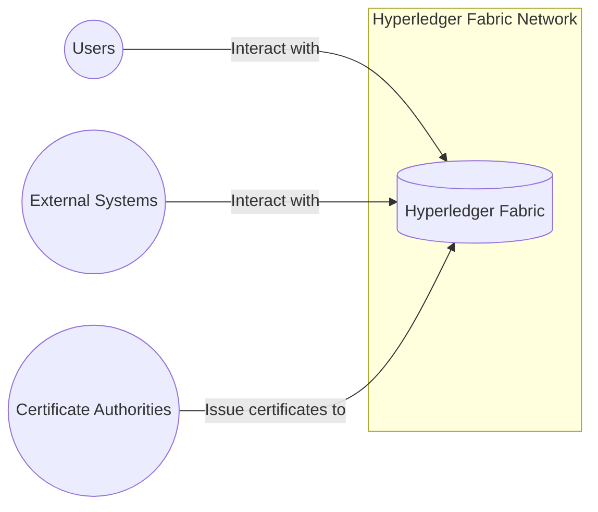
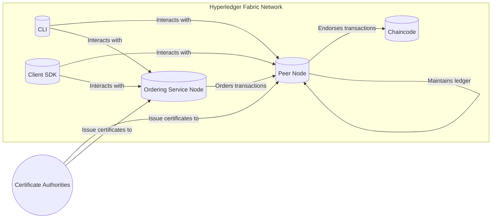
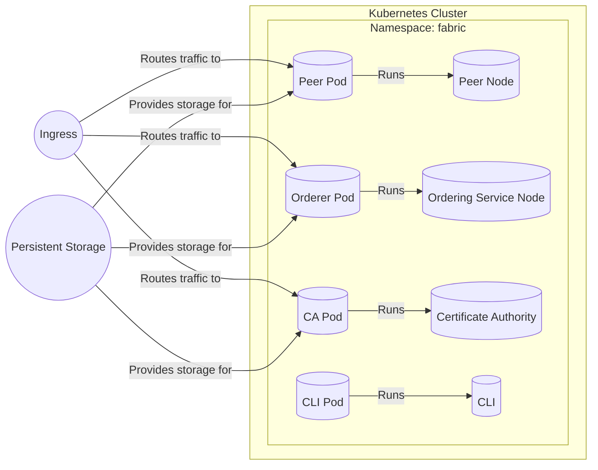
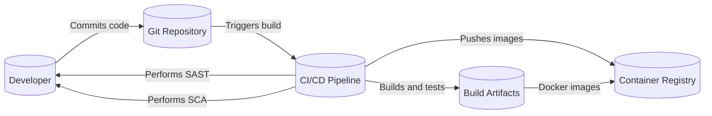

# BUSINESS POSTURE

Business Priorities and Goals:

*   Provide a modular and extensible blockchain platform for enterprise use cases.
*   Enable confidential transactions and data privacy through channels and private data collections.
*   Support a permissioned membership model, ensuring only authorized participants can join the network.
*   Offer high transaction throughput and low latency for performance-sensitive applications.
*   Facilitate the development and deployment of smart contracts (chaincode) in various programming languages.
*   Ensure the integrity and immutability of the ledger.
*   Provide robust consensus mechanisms for transaction ordering and validation.
*   Support a wide range of industries and applications, from supply chain management to financial services.

Business Risks:

*   Unauthorized access to sensitive data stored on the ledger or in private data collections.
*   Malicious or faulty chaincode execution leading to incorrect ledger state or financial loss.
*   Compromise of network nodes or consensus mechanisms, resulting in data breaches or denial of service.
*   Lack of scalability to meet the demands of high-volume transaction processing.
*   Inadequate key management practices, leading to loss or theft of cryptographic keys.
*   Vulnerabilities in the underlying infrastructure or dependencies, exposing the network to attacks.
*   Non-compliance with regulatory requirements or industry standards.
*   Insufficient monitoring and auditing capabilities, hindering incident detection and response.

# SECURITY POSTURE

Existing Security Controls:

*   security control: Permissioned membership model managed by Membership Service Providers (MSPs). (Described in Fabric documentation and implemented in MSP components).
*   security control: Channels for isolating transactions and data between specific network participants. (Described in Fabric documentation and implemented in channel configuration and ledger components).
*   security control: Private data collections for sharing data confidentially among a subset of channel members. (Described in Fabric documentation and implemented in chaincode and ledger components).
*   security control: Cryptographic identities and digital signatures for authenticating users and transactions. (Described in Fabric documentation and implemented in MSP and client SDKs).
*   security control: Endorsement policies to specify which organizations must endorse transactions before they are considered valid. (Described in Fabric documentation and implemented in chaincode and ordering service).
*   security control: Access control policies within chaincode to restrict access to specific functions and data. (Implemented within chaincode logic).
*   security control: TLS encryption for secure communication between network nodes. (Described in Fabric documentation and configured in network setup).
*   security control: Hardware Security Module (HSM) support for secure key storage and management. (Described in Fabric documentation and configured in network setup).

Accepted Risks:

*   accepted risk: Complexity of managing a permissioned blockchain network, requiring expertise in cryptography, distributed systems, and security.
*   accepted risk: Potential for human error in configuring network policies and chaincode, leading to security vulnerabilities.
*   accepted risk: Reliance on trusted Certificate Authorities (CAs) for issuing digital certificates.

Recommended Security Controls:

*   security control: Implement regular security audits and penetration testing of the Fabric network and chaincode.
*   security control: Enforce strong password policies and multi-factor authentication for all network participants.
*   security control: Implement robust monitoring and logging of all network activity, including chaincode execution and configuration changes.
*   security control: Establish a formal incident response plan for handling security breaches and vulnerabilities.
*   security control: Implement network segmentation to isolate critical components and limit the impact of potential attacks.
*   security control: Regularly update Fabric and its dependencies to patch security vulnerabilities.

Security Requirements:

*   Authentication:
    *   All users and nodes must be authenticated using strong cryptographic identities.
    *   Multi-factor authentication should be considered for privileged users and administrators.
    *   Integration with existing enterprise identity providers (e.g., LDAP, Active Directory) should be supported.

*   Authorization:
    *   Access control policies must be defined and enforced at the network, channel, and chaincode levels.
    *   The principle of least privilege should be applied, granting users only the necessary permissions.
    *   Role-Based Access Control (RBAC) should be implemented to simplify permission management.

*   Input Validation:
    *   All inputs to chaincode functions must be validated to prevent malicious or malformed data from being processed.
    *   Input validation should include checks for data type, length, format, and range.
    *   Whitelisting of allowed inputs is preferred over blacklisting.

*   Cryptography:
    *   Strong cryptographic algorithms and key lengths must be used for all encryption and digital signature operations.
    *   Key management practices must ensure the confidentiality, integrity, and availability of cryptographic keys.
    *   HSMs should be used to protect sensitive keys.
    *   Regular key rotation should be implemented.

# DESIGN

## C4 CONTEXT

Element Descriptions:

*   1.  Name: Hyperledger Fabric
    *   2.  Type: System
    *   3.  Description: A permissioned blockchain platform for enterprise use cases.
    *   4.  Responsibilities:
        *   Maintaining the distributed ledger.
        *   Executing chaincode (smart contracts).
        *   Enforcing access control policies.
        *   Providing consensus mechanisms.
        *   Managing membership and identities.
    *   5.  Security controls:
        *   Permissioned membership model.
        *   Channels and private data collections.
        *   Cryptographic identities and digital signatures.
        *   Endorsement policies.
        *   Access control policies within chaincode.
        *   TLS encryption.
        *   HSM support.

*   1.  Name: Users
    *   2.  Type: Actor
    *   3.  Description: Individuals or organizations interacting with the Fabric network.
    *   4.  Responsibilities:
        *   Submitting transactions.
        *   Invoking chaincode functions.
        *   Querying the ledger.
    *   5.  Security controls:
        *   Authentication via digital certificates.
        *   Authorization based on roles and permissions.

*   1.  Name: External Systems
    *   2.  Type: System
    *   3.  Description: External systems or applications that integrate with the Fabric network.
    *   4.  Responsibilities:
        *   Interacting with Fabric through APIs or SDKs.
        *   Providing data to or consuming data from the Fabric network.
    *   5.  Security controls:
        *   Secure communication channels (e.g., TLS).
        *   Authentication and authorization mechanisms.

*   1.  Name: Certificate Authorities
    *   2.  Type: System
    *   3.  Description: Trusted entities that issue digital certificates to Fabric network participants.
    *   4.  Responsibilities:
        *   Issuing and revoking certificates.
        *   Maintaining certificate revocation lists (CRLs).
        *   Ensuring the integrity and authenticity of certificates.
    *   5.  Security controls:
        *   Strong physical and logical security controls.
        *   Regular audits and compliance checks.

## C4 CONTAINER

Element Descriptions:

*   1.  Name: Peer Node
    *   2.  Type: Container
    *   3.  Description: A node in the Fabric network that maintains a copy of the ledger and executes chaincode.
    *   4.  Responsibilities:
        *   Endorsing transactions.
        *   Maintaining the ledger.
        *   Executing chaincode.
        *   Validating transactions.
    *   5.  Security controls:
        *   Authentication via digital certificates.
        *   Access control policies within chaincode.
        *   TLS encryption for communication.

*   1.  Name: Ordering Service Node
    *   2.  Type: Container
    *   3.  Description: A node that orders transactions into blocks and distributes them to peer nodes.
    *   4.  Responsibilities:
        *   Ordering transactions.
        *   Creating blocks.
        *   Distributing blocks to peers.
        *   Ensuring consensus.
    *   5.  Security controls:
        *   Authentication via digital certificates.
        *   TLS encryption for communication.
        *   Consensus mechanisms (e.g., Raft, Kafka).

*   1.  Name: CLI
    *   2.  Type: Container
    *   3.  Description: Command-line interface for interacting with the Fabric network.
    *   4.  Responsibilities:
        *   Submitting transactions.
        *   Invoking chaincode functions.
        *   Querying the ledger.
        *   Managing network configuration.
    *   5.  Security controls:
        *   Authentication via digital certificates.

*   1.  Name: Client SDK
    *   2.  Type: Container
    *   3.  Description: Software Development Kit for building applications that interact with the Fabric network.
    *   4.  Responsibilities:
        *   Providing APIs for interacting with Fabric.
        *   Handling transaction submission and endorsement.
        *   Managing user identities and credentials.
    *   5.  Security controls:
        *   Authentication via digital certificates.
        *   Secure communication channels (e.g., TLS).

*   1.  Name: Chaincode
    *   2.  Type: Container
    *   3.  Description: Smart contracts that run on peer nodes and define the business logic of the application.
    *   4.  Responsibilities:
        *   Defining the data schema.
        *   Implementing transaction logic.
        *   Enforcing business rules.
    *   5.  Security controls:
        *   Access control policies.
        *   Input validation.
        *   Secure coding practices.

*   1.  Name: Certificate Authorities
    *   2.  Type: System
    *   3.  Description: Trusted entities that issue digital certificates to Fabric network participants.
    *   4.  Responsibilities:
        *   Issuing and revoking certificates.
        *   Maintaining certificate revocation lists (CRLs).
        *   Ensuring the integrity and authenticity of certificates.
    *   5.  Security controls:
        *   Strong physical and logical security controls.
        *   Regular audits and compliance checks.

## DEPLOYMENT

Possible Deployment Solutions:

1.  Kubernetes: Deploying Fabric on a Kubernetes cluster provides scalability, resilience, and automated management.
2.  Docker Swarm: Similar to Kubernetes, Docker Swarm can be used for container orchestration and deployment.
3.  Cloud-based managed services: Cloud providers like AWS, Azure, and GCP offer managed blockchain services that simplify Fabric deployment and management.
4.  Bare metal or virtual machines: Fabric can be deployed directly on bare metal servers or virtual machines, providing more control over the infrastructure.

Chosen Deployment Solution: Kubernetes

Element Descriptions:

*   1.  Name: Kubernetes Cluster
    *   2.  Type: Infrastructure
    *   3.  Description: A cluster of machines managed by Kubernetes for container orchestration.
    *   4.  Responsibilities:
        *   Managing containerized applications.
        *   Providing scalability and resilience.
        *   Automating deployment and management.
    *   5.  Security controls:
        *   Kubernetes RBAC.
        *   Network policies.
        *   Pod security policies.

*   1.  Name: Namespace: fabric
    *   2.  Type: Infrastructure
    *   3.  Description: A logical grouping of resources within the Kubernetes cluster dedicated to the Fabric network.
    *   4.  Responsibilities:
        *   Isolating Fabric components from other applications.
        *   Providing a scope for resource management.
    *   5.  Security controls:
        *   Kubernetes RBAC.
        *   Network policies.

*   1.  Name: Peer Pod
    *   2.  Type: Deployment Unit
    *   3.  Description: A Kubernetes pod running a Fabric peer node.
    *   4.  Responsibilities:
        *   Running the peer node container.
    *   5.  Security controls:
        *   Inherited from the peer node container.

*   1.  Name: Orderer Pod
    *   2.  Type: Deployment Unit
    *   3.  Description: A Kubernetes pod running a Fabric ordering service node.
    *   4.  Responsibilities:
        *   Running the ordering service node container.
    *   5.  Security controls:
        *   Inherited from the ordering service node container.

*   1.  Name: CA Pod
    *   2.  Type: Deployment Unit
    *   3.  Description: A Kubernetes pod running a Fabric Certificate Authority.
    *   4.  Responsibilities:
        *   Running the CA container.
    *   5.  Security controls:
        *   Inherited from the CA container.

*   1.  Name: CLI Pod
    *   2.  Type: Deployment Unit
    *   3.  Description: A Kubernetes pod running the Fabric CLI.
    *   4.  Responsibilities:
        *   Running the CLI container.
    *   5.  Security controls:
        *   Inherited from the CLI container.

*   1.  Name: Ingress
    *   2.  Type: Infrastructure
    *   3.  Description: A Kubernetes resource that exposes services to external traffic.
    *   4.  Responsibilities:
        *   Routing external traffic to Fabric services.
        *   Providing TLS termination.
    *   5.  Security controls:
        *   TLS encryption.
        *   Access control policies.

*   1.  Name: Persistent Storage
    *   2.  Type: Infrastructure
    *   3.  Description: Storage volumes used by Fabric components to persist data.
    *   4.  Responsibilities:
        *   Storing ledger data, chaincode, and configuration files.
    *   5.  Security controls:
        *   Encryption at rest.
        *   Access control policies.

## BUILD

Build Process Description:

1.  Developers write and commit code to a Git repository (e.g., GitHub, GitLab).
2.  The code repository is configured to trigger a CI/CD pipeline (e.g., Jenkins, GitHub Actions, GitLab CI) on each commit or pull request.
3.  The CI/CD pipeline performs the following steps:
    *   Checks out the code from the repository.
    *   Builds the Fabric components (peer, orderer, chaincode) using appropriate build tools (e.g., Go build, npm).
    *   Runs unit tests and integration tests to ensure code quality and functionality.
    *   Performs Static Application Security Testing (SAST) using tools like SonarQube, GoSec to identify potential security vulnerabilities in the code.
    *   Performs Software Composition Analysis (SCA) to identify vulnerabilities in third-party dependencies.
    *   Packages the Fabric components into Docker images.
    *   Pushes the Docker images to a container registry (e.g., Docker Hub, Amazon ECR, Google Container Registry).
    *   Optionally, deploys the Fabric network to a staging or testing environment.

Security Controls:

*   security control: CI/CD pipeline for automated builds and testing.
*   security control: SAST to identify code vulnerabilities.
*   security control: SCA to identify vulnerabilities in dependencies.
*   security control: Docker images for consistent and reproducible deployments.
*   security control: Container registry for secure storage and management of Docker images.
*   security control: Code signing to ensure the integrity of the build artifacts.
*   security control: Dependency scanning to identify and mitigate vulnerabilities in third-party libraries.

# RISK ASSESSMENT

Critical Business Processes:

*   Maintaining the integrity and immutability of the ledger.
*   Ensuring the confidentiality of transactions and data.
*   Providing a reliable and available platform for business applications.
*   Enforcing access control and authorization policies.
*   Supporting compliance with regulatory requirements.

Data Sensitivity:

*   Transaction data: Highly sensitive, as it may contain financial information, personally identifiable information (PII), or other confidential data.
*   Private data: Highly sensitive, as it is explicitly intended to be kept confidential among a subset of network participants.
*   Chaincode: Moderately sensitive, as it defines the business logic and may contain intellectual property.
*   Configuration data: Moderately sensitive, as it controls the network's security and access control policies.
*   Identity information: Highly sensitive, as it includes cryptographic keys and certificates used for authentication and authorization.

# QUESTIONS & ASSUMPTIONS

Questions:

*   What specific regulatory requirements or industry standards must the Fabric network comply with?
*   What are the expected transaction volume and performance requirements?
*   What are the existing identity and access management systems that need to be integrated with Fabric?
*   What are the specific threat models and attack vectors that are of greatest concern?
*   What level of decentralization is required for the ordering service?
*   What are the specific requirements for disaster recovery and business continuity?

Assumptions:

*   BUSINESS POSTURE: The organization deploying the Fabric network has a clear understanding of its business requirements and use cases.
*   SECURITY POSTURE: The organization has a dedicated security team or personnel responsible for managing the security of the Fabric network.
*   DESIGN: The Fabric network will be deployed on a secure infrastructure with appropriate network segmentation and access controls. The organization has sufficient expertise in Kubernetes and containerization technologies.