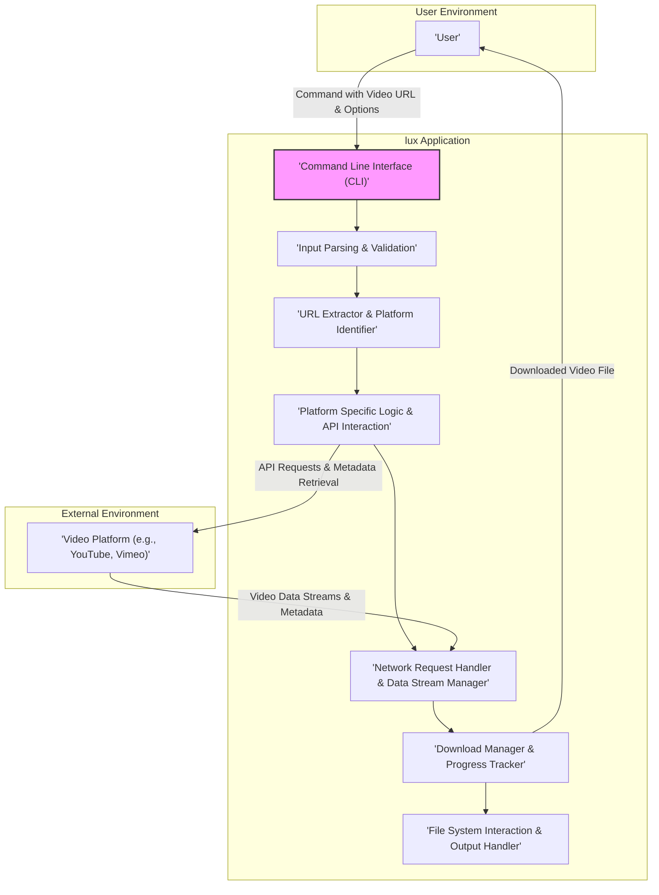
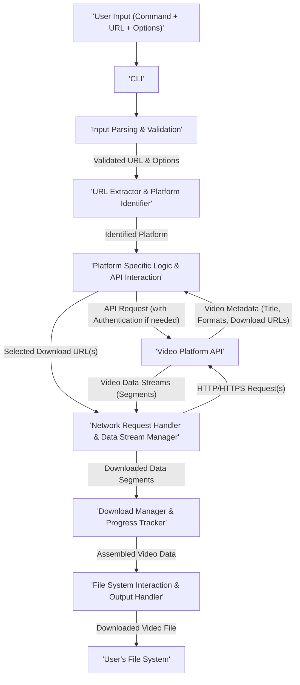

# Project Design Document: lux - A Command-Line Video Downloader

**Version:** 1.1
**Date:** October 26, 2023
**Author:** AI Software Architect

## 1. Introduction

This document provides an enhanced and more detailed design overview of the `lux` project, a command-line tool for downloading videos from various online platforms. This document serves as a comprehensive blueprint for understanding the system's architecture, components, and data flow, which is crucial for subsequent threat modeling activities. This revision aims to provide greater clarity and depth compared to the initial design.

### 1.1. Purpose

The primary purpose of this document is to clearly and comprehensively articulate the design of the `lux` application. This will enable stakeholders, including developers, security analysts, and potential contributors, to gain a thorough understanding of the system's inner workings and identify potential security vulnerabilities with greater precision.

### 1.2. Scope

This document covers the high-level architecture, key components with more granular detail, and a refined understanding of the data flow within the `lux` application. It focuses on the core functionalities related to video downloading, including error handling and basic configuration, and does not delve into specific platform implementation details at a code level or advanced UI/UX considerations beyond the command-line interface.

### 1.3. Goals

*   Provide a comprehensive and detailed overview of the `lux` application's design.
*   Identify key components and their specific responsibilities and interactions.
*   Describe the data flow within the system with greater clarity on data transformations.
*   Serve as a robust and informative foundation for threat modeling and security analysis, enabling more targeted vulnerability identification.

## 2. High-Level Architecture

The `lux` application follows a modular design, orchestrating interactions between the user and external video platforms through distinct components.

## 3. Component Details

This section provides a more detailed breakdown of the functionality and responsibilities of each key component within the `lux` application.

*   **Command Line Interface (CLI):**
    *   Responsibilities:
        *   Receives user input, including the command, video URL, and optional parameters (e.g., output directory, quality).
        *   Parses command-line arguments and options using a library like `argparse` (or similar).
        *   Provides feedback to the user, displaying progress, error messages, and completion status.
        *   Handles basic command help and version information.

*   **Input Parsing & Validation:**
    *   Responsibilities:
        *   Validates the format of the provided video URL using regular expressions or URL parsing libraries.
        *   Sanitizes user input to prevent potential injection vulnerabilities.
        *   Parses command-line options and ensures they are valid and compatible.
        *   Handles cases of missing or invalid input, providing informative error messages.

*   **URL Extractor & Platform Identifier:**
    *   Responsibilities:
        *   Analyzes the input URL to determine the specific video platform hosting the content.
        *   Uses pattern matching or domain analysis to identify the platform (e.g., `youtube.com`, `vimeo.com`).
        *   Selects and instantiates the appropriate Platform Specific Logic module based on the identified platform.
        *   Handles cases where the platform is not supported.

*   **Platform Specific Logic & API Interaction:**
    *   Responsibilities:
        *   Contains modules dedicated to interacting with the APIs or web structures of individual video platforms.
        *   Handles platform-specific authentication or authorization if required.
        *   Constructs and sends API requests to retrieve video metadata (e.g., title, available formats, download URLs).
        *   Parses API responses or web page content to extract relevant information.
        *   Manages rate limiting and error handling specific to each platform's API.

*   **Network Request Handler & Data Stream Manager:**
    *   Responsibilities:
        *   Responsible for making HTTP/HTTPS requests to download video segments or the entire video file.
        *   Manages request headers, user-agent strings, and potentially cookies.
        *   Handles secure connections (HTTPS) and verifies SSL/TLS certificates.
        *   Implements retry mechanisms for failed network requests.
        *   Manages data streams efficiently, potentially using asynchronous operations or multi-threading.

*   **Download Manager & Progress Tracker:**
    *   Responsibilities:
        *   Orchestrates the download process, managing the retrieval of video data segments.
        *   Implements progress tracking, displaying download percentage, speed, and estimated time remaining to the user.
        *   Supports resuming interrupted downloads if the platform and download method allow it.
        *   May utilize multi-threading or asynchronous operations to download multiple segments concurrently.
        *   Handles potential download errors and provides informative messages.

*   **File System Interaction & Output Handler:**
    *   Responsibilities:
        *   Writes the downloaded video data to the user's file system.
        *   Determines the output file name based on video metadata or user-specified options.
        *   Creates necessary directories if they don't exist.
        *   Handles potential file conflicts (e.g., by appending a number to the filename).
        *   Ensures proper file permissions are set for the downloaded file.
        *   Provides feedback to the user upon successful download or in case of file system errors.

## 4. Data Flow

This section describes the detailed flow of data through the `lux` application during a typical video download process, highlighting data transformations and component interactions.

**Detailed Data Flow Steps:**

1. **User Input:** The user provides a command to the `lux` CLI, including the video URL and any optional parameters.
2. **CLI Processing:** The CLI receives the command and passes the video URL and options to the Input Parsing & Validation component.
3. **Input Validation:** The Input Parsing & Validation component validates the URL format and command-line options.
4. **Platform Identification:** The URL Extractor & Platform Identifier analyzes the URL to determine the video platform.
5. **Platform Logic Invocation:** The appropriate Platform Specific Logic & API Interaction module is selected based on the identified platform.
6. **API Request:** The Platform Specific Logic module constructs and sends API requests to the video platform, potentially including authentication credentials.
7. **API Response:** The video platform's API responds with video metadata, including the available download formats and their corresponding URLs.
8. **Download URL Selection:** The Platform Specific Logic module (or potentially the user through an option) selects the desired download URL based on format preferences.
9. **Network Request Initiation:** The Network Request Handler & Data Stream Manager initiates HTTP/HTTPS requests to the video platform using the selected download URL(s).
10. **Data Stream Retrieval:** The video platform streams the video data in segments.
11. **Download Management:** The Download Manager & Progress Tracker receives and assembles the downloaded video data segments, tracking progress.
12. **File System Write:** The File System Interaction & Output Handler writes the assembled video data to a file on the user's file system.

## 5. Security Considerations (Detailed for Threat Modeling)

This section provides a more detailed analysis of potential security considerations, offering specific examples for threat modeling.

*   **Input Validation:**
    *   **Threat:** Maliciously crafted URLs containing special characters or escape sequences could be injected, potentially leading to:
        *   **Server-Side Request Forgery (SSRF):** If the application blindly follows redirects or makes requests based on the URL.
        *   **Command Injection:** If parts of the URL are used in system commands without proper sanitization.
    *   **Threat:** Insufficient validation of command-line arguments could allow:
        *   **Arbitrary File Overwrite:** If the output path is not properly validated.
        *   **Local File Inclusion (LFI):** If a user can specify a local file path that the application then processes.

*   **Network Communication:**
    *   **Threat:** Man-in-the-middle (MITM) attacks could intercept and modify downloaded video data if HTTPS is not enforced or certificate validation is weak.
    *   **Threat:** Downloading over insecure HTTP connections exposes the download URL and potentially other information.
    *   **Threat:**  If the application doesn't verify the integrity of downloaded data (e.g., using checksums), corrupted or malicious content could be introduced.

*   **Dependency Management:**
    *   **Threat:** Using vulnerable third-party libraries could introduce known security flaws that attackers could exploit. This includes vulnerabilities in:
        *   Networking libraries (e.g., `requests`).
        *   URL parsing libraries.
        *   Platform-specific API interaction libraries.

*   **File System Security:**
    *   **Threat:** Path traversal vulnerabilities could allow attackers to specify output paths that write files outside the intended directory, potentially overwriting critical system files.
    *   **Threat:** Insufficient permission checks on downloaded files could lead to unauthorized access or modification by other users on the system.

*   **Platform API Security:**
    *   **Threat:**  Abuse of platform APIs through excessive requests could lead to temporary or permanent IP blocking or account suspension.
    *   **Threat:** Hardcoding or insecurely storing API keys or authentication tokens within the application could lead to unauthorized access to platform resources.
    *   **Threat:**  Vulnerabilities in the platform's API itself could be exploited, although this is less directly a vulnerability of `lux`.

*   **Configuration Security:**
    *   **Threat:** Storing sensitive information (e.g., API keys, authentication tokens, user credentials if implemented) in plain text configuration files exposes them to unauthorized access.

*   **Error Handling:**
    *   **Threat:** Verbose error messages that reveal internal file paths, library versions, or other sensitive information could aid attackers in reconnaissance.

## 6. Assumptions and Constraints

*   The application assumes the user has a functional internet connection.
*   The application assumes the video platforms' APIs remain relatively stable and accessible.
*   The application is primarily designed for individual use and does not inherently address large-scale or enterprise deployment scenarios.
*   The application's functionality is constrained by the capabilities and limitations of the target video platforms' APIs.

## 7. Future Considerations

*   Implementation of a plugin system to easily add support for new video platforms.
*   Advanced download options, such as:
    *   Selecting specific audio or subtitle tracks.
    *   Downloading playlists or channels.
    *   Rate limiting download speeds.
*   Integration with external download managers or media libraries.
*   Enhanced logging and monitoring capabilities for debugging and troubleshooting.
*   Implementation of robust security measures based on the findings of thorough threat modeling, including:
    *   Input sanitization libraries.
    *   Secure storage of credentials.
    *   Regular dependency updates and vulnerability scanning.
*   Consideration for platform-specific features like age-restricted content handling or CAPTCHA resolution.

This enhanced design document provides a more detailed and comprehensive understanding of the `lux` video downloader, offering a stronger foundation for identifying and mitigating potential security risks through thorough threat modeling.
