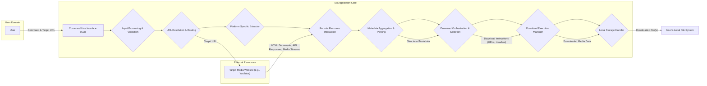
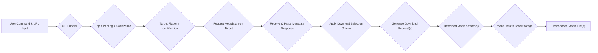

# Project Design Document: lux - A Fast and Easy-to-Use Download Manager

**Version:** 1.1
**Date:** October 26, 2023
**Author:** AI Architecture Expert

## 1. Introduction

This document provides an enhanced design overview of the `lux` project, a command-line download manager primarily focused on downloading video and audio content from various online platforms. This document aims to clearly articulate the system's architecture, components, and data flow with greater detail, explicitly serving as a foundation for subsequent threat modeling activities. We will elaborate on potential attack vectors and security considerations.

## 2. Goals and Objectives

*   Provide a robust and user-friendly command-line interface for downloading media content.
*   Broaden support for a wide range of popular video and audio platforms, ensuring adaptability to website changes.
*   Offer granular options for selecting specific resolutions, formats, audio tracks, and subtitles, enhancing user control.
*   Maintain high efficiency and speed in downloading media, optimizing resource utilization.
*   Preserve a simple and intuitive command-line experience while offering advanced features.
*   Ensure the security of the application and user data throughout the download process.

## 3. System Architecture

The `lux` application employs a modular and layered architecture, promoting clarity, maintainability, and testability. The core components interact sequentially and concurrently to fulfill a user's download request.

**Components:**

*   **User:** The individual interacting with the `lux` application through the command-line interface.
*   **Command Line Interface (CLI):** The primary interface for user interaction. It receives commands and arguments, presenting output and progress updates.
*   **Input Processing & Validation:** Responsible for parsing user-provided commands and URLs, rigorously validating their format, syntax, and ensuring they conform to expected parameters and security standards.
*   **URL Resolution & Routing:** Analyzes the provided URL to determine the target platform and routes the request to the appropriate platform-specific extractor.
*   **Platform Specific Extractor:** A modular component dedicated to understanding the unique structure, API endpoints, and data formats of specific websites (e.g., YouTube extractor, Vimeo extractor, etc.). These modules handle website-specific logic for metadata extraction and download URL retrieval.
*   **Remote Resource Interaction:** Manages communication with target websites, handling HTTP requests, session management, cookie handling, and adherence to website policies (e.g., rate limiting). This component abstracts away the complexities of network communication.
*   **Metadata Aggregation & Parsing:** Parses and aggregates metadata retrieved from the target website (e.g., HTML, JSON, XML). This includes information about available formats, resolutions, subtitles, and other media characteristics.
*   **Download Orchestration & Selection:** Based on user preferences (if provided) and the aggregated metadata, this component intelligently selects the optimal media stream(s) for download, considering factors like resolution, format, and user-specified options.
*   **Download Execution Manager:**  Manages the actual downloading process. This includes initiating and monitoring download threads, handling network interruptions, implementing retry mechanisms, and providing progress feedback to the user.
*   **Local Storage Handler:** Responsible for writing the downloaded media content to the user's local file system, managing file naming, directory creation, and handling potential file system errors.

## 4. Data Flow

The process of downloading media using `lux` involves a distinct sequence of data flow, ensuring efficient and reliable retrieval.

**Detailed Data Flow Description:**

1. **User Command & URL Input:** The user initiates the process by providing a command and the target media URL to the `lux` application.
2. **CLI Handler:** The command-line interface receives and interprets the user's input.
3. **Input Parsing & Sanitization:** The input is parsed to extract the command and the URL. Crucially, the input is sanitized to prevent potential injection attacks.
4. **Target Platform Identification:** Based on the URL, the application identifies the specific online platform hosting the media.
5. **Request Metadata from Target:** The application sends requests to the target website to retrieve metadata describing the available media formats, resolutions, and other relevant details.
6. **Receive & Parse Metadata Response:** The application receives the metadata response from the target website and parses it to extract the necessary information.
7. **Apply Download Selection Criteria:** Based on user-specified options or default settings, the application selects the appropriate media stream(s) for download.
8. **Generate Download Request(s):** The application generates specific download requests for the selected media stream(s), including necessary headers and authentication details.
9. **Download Media Stream(s):** The download manager initiates the download process, retrieving the media data in chunks from the target website.
10. **Write Data to Local Storage:** The received media data is written to a file or files on the user's local file system.
11. **Downloaded Media File(s):** The final downloaded media file(s) are stored on the user's system.

## 5. Components Deep Dive

This section provides a more in-depth look at the responsibilities and functionalities of the key components within the `lux` application.

*   **Command Line Interface (CLI):**
    *   Leverages a robust command-line argument parsing library (e.g., `click`, `argparse` in Python) for handling user input and options.
    *   Provides clear and informative output, including progress bars, download speeds, and status messages.
    *   Implements error handling and user feedback mechanisms for invalid commands or issues during the download process.

*   **Input Processing & Sanitization:**
    *   Employs regular expressions and URL parsing libraries for rigorous URL validation and sanitization.
    *   Implements checks for mandatory arguments and validates their data types and ranges.
    *   Sanitizes user input to prevent command injection and other input-based vulnerabilities.

*   **URL Resolution & Routing:**
    *   Utilizes a mapping or routing mechanism to associate URL patterns with specific platform extractor modules.
    *   Provides a centralized and extensible way to manage supported platforms.

*   **Platform Specific Extractor:**
    *   Encapsulates website-specific logic for interacting with different platforms.
    *   Handles website-specific authentication mechanisms, API key management, or session handling.
    *   Implements web scraping techniques or interacts with website APIs to retrieve metadata and download URLs.
    *   Designed to be adaptable to changes in the target website's structure or API.

*   **Remote Resource Interaction:**
    *   Utilizes a reliable HTTP client library (e.g., `requests`, `httpx` in Python) with support for secure connections (HTTPS).
    *   Manages HTTP headers, cookies, and user-agent strings.
    *   Implements mechanisms for handling redirects, retries, and potential network errors.
    *   May incorporate rate limiting or delay mechanisms to avoid overloading target websites.

*   **Metadata Aggregation & Parsing:**
    *   Employs libraries for parsing various data formats, including HTML (e.g., `Beautiful Soup`, `lxml`), JSON, and XML.
    *   Extracts relevant metadata such as title, description, available formats, resolutions, subtitles, and thumbnails.
    *   Handles potential inconsistencies or variations in metadata structures across different platforms.

*   **Download Orchestration & Selection:**
    *   Implements logic to filter and sort available media formats based on user preferences (e.g., resolution, format, file size).
    *   Provides default selection behavior if no specific preferences are provided.
    *   Handles adaptive streaming formats (e.g., DASH, HLS) by selecting appropriate segments or playlists.

*   **Download Execution Manager:**
    *   Manages concurrent download threads or processes for faster downloads.
    *   Supports resuming interrupted downloads by tracking progress and utilizing range requests.
    *   Provides real-time progress updates to the user, including download speed and estimated time remaining.
    *   Implements error handling and retry mechanisms for network issues or download failures.

*   **Local Storage Handler:**
    *   Creates necessary directories based on user-specified options or default configurations.
    *   Writes downloaded media data to files, ensuring data integrity.
    *   Handles potential file system errors, such as permission issues or insufficient disk space.
    *   Implements file naming conventions based on metadata, potentially including options for customization.

## 6. Security Considerations (For Threat Modeling)

This section details potential security considerations and potential attack vectors that should be thoroughly examined during the threat modeling process.

*   **Input Validation and Sanitization:**
    *   **Threat:** Maliciously crafted URLs could be used to trigger unexpected behavior, such as server-side request forgery (SSRF) or denial-of-service (DoS) attacks against internal systems or the user's machine.
    *   **Threat:** Command injection vulnerabilities could arise if user-provided input is not properly sanitized before being used in system commands.
    *   **Mitigation:** Implement robust input validation and sanitization techniques for all user-provided data, including URLs and command-line arguments. Utilize parameterized queries or equivalent mechanisms when interacting with external systems.

*   **Website Interaction and Data Handling:**
    *   **Threat:** Man-in-the-middle (MITM) attacks could compromise the confidentiality and integrity of downloaded media if HTTPS is not strictly enforced and certificate validation is not performed correctly.
    *   **Threat:** Sensitive user information (e.g., cookies, authentication tokens) could be inadvertently exposed if the application does not handle website interactions securely.
    *   **Threat:** Vulnerabilities in the underlying HTTP client library could be exploited by malicious websites.
    *   **Mitigation:** Enforce HTTPS for all website interactions and implement proper certificate validation. Avoid storing or logging sensitive user data. Keep the HTTP client library up-to-date with the latest security patches.

*   **Platform Extractor Vulnerabilities:**
    *   **Threat:** Vulnerabilities in the parsing logic of platform extractors could lead to buffer overflows, denial-of-service, or other exploitable conditions when processing malicious or unexpected website content.
    *   **Threat:** If platform extractors interact directly with website APIs, vulnerabilities in those APIs could be exploited.
    *   **Mitigation:** Implement rigorous input validation and error handling within platform extractors. Regularly review and update extractors to address changes in target website structures and potential vulnerabilities. Consider using secure parsing libraries.

*   **File System Security:**
    *   **Threat:** Path traversal vulnerabilities could allow malicious users to write downloaded files to arbitrary locations on the file system, potentially overwriting critical system files or introducing malware.
    *   **Threat:** The application might overwrite existing files without explicit user confirmation, leading to data loss.
    *   **Threat:** Insecure default file permissions for downloaded files could expose them to unauthorized access.
    *   **Mitigation:** Restrict the ability of users to specify arbitrary download paths. Implement checks to prevent overwriting existing files without user consent. Set appropriate file permissions for downloaded files.

*   **Dependency Management:**
    *   **Threat:** Vulnerabilities in third-party libraries used by the application could be exploited.
    *   **Mitigation:** Implement a robust dependency management strategy, regularly scanning for and updating vulnerable dependencies. Utilize software composition analysis (SCA) tools.

*   **Update Mechanism Security:**
    *   **Threat:** If the application has an auto-update feature, a compromised update server or insecure update process could be used to distribute malware.
    *   **Mitigation:** Implement secure update mechanisms, including code signing and verification of update packages. Use HTTPS for update downloads.

## 7. Future Considerations

*   **Graphical User Interface (GUI):** Development of a GUI to cater to users who prefer a visual interface, potentially using frameworks like Qt or Electron.
*   **Plugin Architecture:** Implementing a plugin system to allow users and developers to extend the functionality by adding support for new platforms, features, or post-processing tasks.
*   **Proxy Support:** Enabling users to download media through HTTP or SOCKS proxy servers for anonymity or to bypass network restrictions.
*   **Advanced Download Management:** Implementing features like segmented downloads, download scheduling, and queue management.
*   **Integration with Media Players:** Providing options to directly open downloaded media in a user's preferred media player.

This improved design document provides a more detailed and security-focused overview of the `lux` project's architecture and components. It serves as a more robust foundation for conducting thorough threat modeling and implementing appropriate security measures.