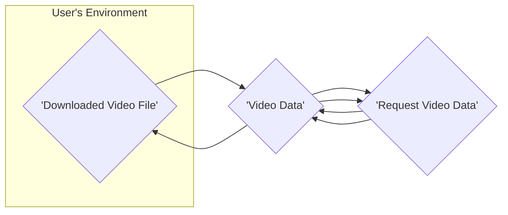
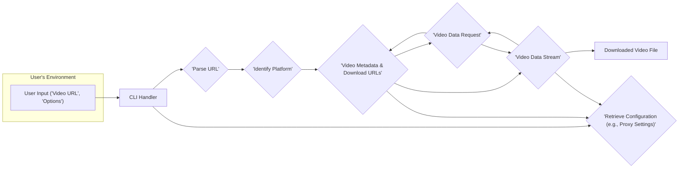

## Project Design Document: lux - A Command-Line Video Downloader

**Version:** 1.1
**Date:** October 26, 2023
**Author:** AI Software Architect

### 1. Introduction

This document provides an enhanced design overview of the `lux` project, a command-line tool for downloading videos from various online platforms. This detailed design serves as a crucial foundation for understanding the system's architecture, components, and data flow, which is essential for subsequent threat modeling activities. This revision aims to provide greater clarity and detail to facilitate a more comprehensive security analysis.

### 2. Project Overview

`lux` is a command-line interface (CLI) application developed in Go, enabling users to download videos from a diverse range of websites by simply providing the video URL. Its primary objective is to offer a versatile, efficient, and user-friendly tool for retrieving online video content.

### 3. Goals

* Provide a straightforward and intuitive command-line interface for initiating video downloads.
* Offer broad support for a wide array of video hosting platforms, minimizing platform-specific limitations.
* Empower users with the ability to specify desired download quality and format options, catering to various needs.
* Robustly handle common video download scenarios, including the downloading of entire playlists and live streams.
* Maintain cross-platform compatibility, ensuring accessibility across different operating systems.

### 4. Non-Goals

* Development of a graphical user interface (GUI) for the application.
* Inclusion of video editing or conversion functionalities within the tool.
* Involvement in hosting or distributing video content.
* Implementation of mechanisms to circumvent Digital Rights Management (DRM) or copyright restrictions.

### 5. Architecture Overview

`lux` employs a modular architecture, strategically separating concerns into distinct, well-defined components. The fundamental workflow begins with the user providing a video URL, followed by the system identifying the relevant platform, extracting necessary video information, and finally, downloading the video data.

### 6. Component Design

This section provides a detailed breakdown of the key components within the `lux` application, outlining their specific responsibilities and interactions.

* **Command Line Interface (CLI) Handler:**
    * **Responsibility:**  Manages the interaction with the user through the command line.
    * **Functionality:**
        * Parses user-provided commands and arguments.
        * Validates the syntax and semantics of user input, providing informative error messages for invalid input.
        * Invokes the appropriate core functionalities based on the parsed user commands.
        * Formats and displays output to the user, including progress updates and download completion messages.
        * Handles signals (e.g., Ctrl+C) for graceful termination.

* **URL Parser:**
    * **Responsibility:**  Analyzes the input URL to extract relevant information.
    * **Functionality:**
        * Takes the video URL string as input.
        * Employs regular expressions and pattern matching to identify the target video hosting platform.
        * Extracts key information from the URL, such as the video ID, playlist ID, or channel ID.
        * Handles URL variations and potential encoding issues.

* **Platform Detector:**
    * **Responsibility:** Determines the specific video hosting platform.
    * **Functionality:**
        * Receives the parsed URL from the URL Parser.
        * Utilizes a registry or mapping of known platform domains and URL patterns.
        * Selects the appropriate platform-specific Extractor Module based on the identified platform.
        * Implements a fallback mechanism for handling unsupported or unknown platforms (e.g., displaying an error message).

* **Extractor Modules (Platform Specific):**
    * **Responsibility:**  Handles interactions with individual video hosting platforms.
    * **Functionality:**
        * Each module is tailored to interact with a specific platform's website structure or API.
        * Sends HTTP requests (GET, POST) to the platform's endpoints to retrieve video metadata and download URLs.
        * Parses the platform's HTML responses (using libraries like `goquery`) or API responses (typically JSON or XML) to extract relevant data.
        * Handles platform-specific authentication mechanisms (e.g., cookies, API keys) if required.
        * Implements logic to navigate platform-specific structures, handle pagination, and extract information from dynamic content.
        * Addresses variations in platform layouts and API changes, potentially requiring updates to maintain functionality.
        * Examples: `extractors/youtube.go`, `extractors/vimeo.go`, `extractors/bilibili.go`.

* **Downloader:**
    * **Responsibility:** Manages the actual download process of video data.
    * **Functionality:**
        * Takes the download URL(s) and the desired output path as input.
        * Initiates HTTP/HTTPS requests to download the video data.
        * Manages the download progress, displaying progress bars or percentage indicators to the user.
        * Handles potential network interruptions, connection timeouts, and retries.
        * Supports resuming interrupted downloads if the server supports it.
        * May implement features like setting download speed limits.
        * Writes the downloaded data to the specified output file.
        * Potentially utilizes libraries for efficient data streaming and file I/O.

* **Configuration Manager:**
    * **Responsibility:**  Manages the application's configuration settings.
    * **Functionality:**
        * Loads configuration settings from a file (e.g., a `.toml` or `.yaml` file) or environment variables.
        * Stores user preferences such as the default download directory, preferred video quality, proxy settings, and API keys (if applicable).
        * Provides an interface for other components to access configuration values.
        * Allows users to modify configuration settings through command-line flags or by editing the configuration file.

* **Logger:**
    * **Responsibility:** Records application events and debugging information.
    * **Functionality:**
        * Provides different logging levels (e.g., debug, info, warning, error, fatal) to control the verbosity of the logs.
        * Outputs log messages to the console, a file, or both.
        * Includes timestamps and context information in log messages.
        * Allows for configuring the log output format.

### 7. Data Flow

The following diagram provides a more detailed illustration of the typical data flow when a user downloads a video using `lux`, highlighting the interaction between components.

**Detailed Data Flow Steps:**

1. **User Input:** The user provides the video URL and any optional parameters (e.g., quality, output path) to the `lux` command-line interface.
2. **CLI Handling and Configuration Retrieval:** The CLI Handler receives the input, parses the command and arguments, validates them, and may retrieve relevant configuration settings from the Configuration Manager.
3. **URL Parsing:** The URL Parser analyzes the provided video URL to extract key information, such as the platform and video identifier.
4. **Platform Detection:** The Platform Detector uses the parsed URL to determine the specific video hosting platform.
5. **Extractor Invocation and Configuration Retrieval:** The Platform Detector selects and invokes the appropriate Extractor Module for the identified platform. The Extractor Module may retrieve platform-specific configurations (e.g., API keys) from the Configuration Manager.
6. **Information Request:** The Extractor Module constructs and sends an HTTP request to the video hosting platform's API or website to retrieve video metadata and available download URLs.
7. **Information Retrieval:** The video hosting platform processes the request and responds with the requested information, typically in JSON, XML, or HTML format.
8. **Download Initiation:** The Extractor Module parses the response, extracts the relevant download URL(s) and metadata, and passes this information, along with user-specified options and potentially proxy settings from the Configuration Manager, to the Downloader.
9. **Data Request:** The Downloader initiates an HTTP/HTTPS request to the video hosting platform to start downloading the video data.
10. **Data Streaming:** The video hosting platform streams the video data to the Downloader.
11. **File Saving:** The Downloader receives the video data stream, manages the download process, and saves the downloaded video data to the user's specified output file.

### 8. Security Considerations (Enhanced)

This section expands upon the initial security considerations, providing more specific examples of potential threats and vulnerabilities.

* **Input Validation Vulnerabilities:**
    * **Threat:** Malicious users could inject specially crafted URLs containing script code or commands that could be executed by the application or the underlying operating system.
    * **Example:** A URL containing shell metacharacters could potentially lead to command injection if not properly sanitized.
    * **Mitigation:** Implement robust input validation and sanitization techniques for all user-provided input, especially URLs. Use parameterized queries or prepared statements if interacting with databases (though less relevant for this application).

* **Dependency Vulnerabilities:**
    * **Threat:** Using outdated or vulnerable third-party libraries can introduce security flaws that attackers can exploit.
    * **Example:** A vulnerability in an HTTP client library could allow an attacker to perform man-in-the-middle attacks.
    * **Mitigation:** Maintain a Software Bill of Materials (SBOM), regularly scan dependencies for known vulnerabilities using tools like `govulncheck`, and update dependencies promptly.

* **Insecure Communication:**
    * **Threat:** If communication with video hosting platforms occurs over unencrypted HTTP, sensitive information (e.g., cookies, authentication tokens) could be intercepted.
    * **Example:** An attacker on the same network could eavesdrop on the communication and steal session cookies.
    * **Mitigation:** Enforce HTTPS for all communication with external services. Ensure that TLS certificates are valid and up-to-date.

* **Platform Extractor Security Risks:**
    * **Server-Side Request Forgery (SSRF):**
        * **Threat:** A compromised or poorly written Extractor Module could be tricked into making requests to internal network resources or unintended external services.
        * **Example:** An attacker could manipulate the Extractor to scan internal ports or access internal APIs.
        * **Mitigation:** Implement strict output encoding and validation within Extractor Modules. Avoid directly using user input to construct URLs for external requests.
    * **Data Injection/Cross-Site Scripting (XSS) in Extractor Logic:**
        * **Threat:** If platform responses (HTML, JSON) are not properly sanitized before being processed or displayed (though less direct in a CLI), it could lead to vulnerabilities if the extracted data is later used in a web context.
        * **Example:** Maliciously crafted video metadata could contain JavaScript that could be executed if the metadata is displayed in a web application.
        * **Mitigation:** Sanitize and validate data received from external platforms before using it. Be cautious when processing HTML content.
    * **Authentication and Authorization Flaws:**
        * **Threat:** Improper handling of platform authentication credentials or authorization mechanisms could lead to unauthorized access to user accounts or resources.
        * **Example:** Storing API keys insecurely or mishandling OAuth tokens.
        * **Mitigation:** Store sensitive credentials securely (e.g., using environment variables or a secure configuration store). Follow the principle of least privilege when accessing platform APIs.

* **Download Integrity Issues:**
    * **Threat:** Downloaded files could be corrupted or tampered with during transit.
    * **Example:** A man-in-the-middle attacker could modify the downloaded video data.
    * **Mitigation:** Consider implementing checksum verification (e.g., using SHA256 hashes) to ensure the integrity of downloaded files.

* **Rate Limiting and API Abuse Vulnerabilities:**
    * **Threat:**  Aggressive or poorly implemented downloading logic could overload video hosting platform APIs, leading to IP blocking or account suspension.
    * **Example:** Making too many requests in a short period.
    * **Mitigation:** Implement rate limiting and backoff strategies to avoid overwhelming platform APIs. Respect platform usage guidelines.

* **Configuration Security Weaknesses:**
    * **Threat:** If configuration files containing sensitive information (e.g., API keys, credentials) are not properly protected, they could be accessed by unauthorized users.
    * **Example:** Storing API keys in plain text in a publicly accessible configuration file.
    * **Mitigation:** Store sensitive configuration data securely, using appropriate file permissions or encryption. Consider using environment variables for sensitive information.

* **Logging Security Concerns:**
    * **Threat:** Logging sensitive information could expose it to unauthorized individuals.
    * **Example:** Logging user credentials or API keys.
    * **Mitigation:** Avoid logging sensitive information. Implement proper log rotation and access controls for log files.

### 9. Deployment Model

`lux` is designed to be deployed as a self-contained, standalone command-line executable. Users can typically download pre-compiled binaries for their specific operating system or build the application directly from the source code. The application does not require any server-side infrastructure for its core video downloading functionality.

### 10. Future Considerations

* **Enhanced Platform Support:** Continuously expanding the range of supported video hosting platforms to cater to a broader user base.
* **Advanced Download Capabilities:** Implementing more sophisticated download features, such as segmented downloads for improved speed and reliability, handling of adaptive streaming formats, and automatic subtitle downloading.
* **Plugin Architecture for Extractors:** Developing a plugin-based architecture for Extractor Modules, enabling users or third-party developers to easily add support for new platforms without modifying the core application.
* **Improved Error Handling and User Feedback:** Providing more detailed and user-friendly error messages to assist users in troubleshooting issues.
* **Internationalization (i18n) and Localization (l10n):**  Supporting multiple languages to enhance accessibility for a global audience.

This enhanced design document provides a more in-depth understanding of the `lux` project's architecture and potential security considerations. This detailed information will be invaluable for conducting a comprehensive threat modeling exercise to proactively identify and mitigate potential security risks.