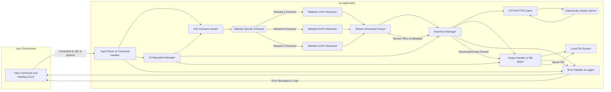

# Project Design Document: lux - Command-Line Video Downloader

**Version:** 1.1
**Date:** October 26, 2023
**Author:** Gemini (AI Expert in Software, Cloud and Cybersecurity Architecture)

## 1. Introduction

This document provides a detailed design overview of the `lux` project, a command-line video downloader available at [https://github.com/iawia002/lux](https://github.com/iawia002/lux). This document is intended to serve as a foundation for threat modeling and security analysis of the `lux` application. It outlines the system architecture, components, data flow, technology stack, and operational considerations. The information presented here will be used to identify potential vulnerabilities and inform security mitigation strategies.

## 2. Project Overview

`lux` is a command-line program written in Go designed to download videos and audio from a wide array of online streaming platforms. It prioritizes versatility, efficiency, and ease of use for users seeking to archive or consume video content offline.  `lux` boasts a comprehensive feature set, including:

*   **Multi-Platform Support:** Downloads from numerous video hosting and streaming websites (e.g., YouTube, Vimeo, Bilibili, and many others).
*   **Format and Resolution Selection:** Allows users to choose specific video and audio formats and resolutions based on availability.
*   **Audio-Only Downloads:** Enables extraction and download of audio streams independent of video.
*   **Playlist and Channel Downloading:** Supports downloading entire playlists and channels, automating the download of multiple videos.
*   **Authentication and Cookie Handling:**  Facilitates access to private or age-restricted content through cookie injection and authentication mechanisms.
*   **Proxy Support:**  Offers proxy configuration for bypassing geographical restrictions or network limitations.
*   **Concurrent Downloads:**  Implements concurrent downloading to accelerate the download process for multiple streams or videos.
*   **Subtitle Downloading:**  Supports downloading subtitles associated with videos, if available.
*   **Post-processing:** May include post-processing features like merging audio and video streams, or format conversion (though primary function is downloading).

## 3. System Architecture

The following diagram illustrates the high-level architecture of `lux`.

### 3.1. Component Description

The `lux` application is composed of the following key components, working in concert to facilitate video downloading:

*   **A. User Command Line Interface (CLI):** This is the primary interface for user interaction. It:
    *   Accepts user commands, including the target video URL, download options (format, resolution, output directory, etc.), and configuration settings.
    *   Provides feedback to the user, displaying progress, download status, error messages, and logs.
    *   Relies on standard input/output streams for communication.

*   **B. Input Parser & Command Handler:** This component is responsible for interpreting user input and directing program flow. It:
    *   **Parses Command Line Arguments:** Deconstructs the user's command into individual arguments and options.
    *   **Validates Input:** Checks for syntactical correctness, valid URLs, and acceptable option values.
    *   **Command Dispatching:**  Routes execution to the appropriate function based on the command (e.g., download, update, config).
    *   **Configuration Loading:**  Interacts with the Configuration Manager (N) to load user preferences and settings.
    *   **Error Reporting:**  Utilizes the Error Handler & Logger (O) to report parsing errors or invalid commands to the user.

*   **C. URL Extractor Router:** This component intelligently selects the correct extractor module based on the input URL. It:
    *   **URL Analysis:** Examines the domain and path of the input URL to identify the hosting website.
    *   **Extractor Mapping:** Maintains a mapping between website domains and corresponding Website Specific Extractors (D).
    *   **Dynamic Extractor Loading (Potentially):**  May dynamically load extractors or use a plugin-based architecture to support new websites without recompilation.

*   **D. Website Specific Extractor (Website A Extractor, Website B Extractor, ..., Website N Extractor):** These are modular components, each tailored to a specific website. Each extractor:
    *   **Website Protocol Understanding:** Implements the specific logic to interact with a target website's structure, API, or HTML.
    *   **Metadata Extraction:** Scrapes web pages or queries APIs to retrieve video metadata (title, description, formats, resolutions, stream URLs, thumbnails, subtitles, etc.).
    *   **Stream URL Resolution:**  Identifies and extracts direct download URLs for video and audio streams, often requiring complex logic to bypass website obfuscation or DRM.
    *   **Cookie and Authentication Handling:** Manages website-specific cookies and authentication mechanisms to access restricted content, potentially using user-provided credentials or cookies loaded from a configuration file.

*   **E, F, G. Website API Interaction:** This represents the network communication layer for each Website Specific Extractor. It involves:
    *   **HTTP/HTTPS Requests:** Sending requests to website servers to retrieve web pages, API responses, or stream manifests.
    *   **Request Header Management:** Setting appropriate HTTP headers (User-Agent, Referer, Cookies) to mimic browser behavior and avoid blocking.
    *   **Response Parsing:** Processing HTML, JSON, XML, or other response formats returned by website servers.

*   **H. Stream Information Parser:** This component standardizes and structures the data extracted by Website Specific Extractors. It:
    *   **Data Normalization:** Converts website-specific data formats into a consistent internal representation.
    *   **Stream Selection Logic:**  Provides logic for selecting the best available stream based on user preferences (resolution, format) or default settings.
    *   **Metadata Packaging:**  Bundles stream URLs, metadata, and download options into a structured data package for the Download Manager.

*   **I. Download Manager:** This component orchestrates the actual download process. It:
    *   **Download Task Management:**  Queues and manages download tasks for individual streams or multiple videos in a playlist.
    *   **Concurrent Downloading Implementation:**  Handles parallel downloads to improve download speed, managing the number of concurrent connections.
    *   **Progress Tracking:**  Monitors download progress, calculating download speed and estimated time remaining.
    *   **Resumable Downloads (Potentially):** May implement functionality to resume interrupted downloads.
    *   **Error Handling (Download Specific):**  Manages network errors, download failures, and retries.
    *   **Data Streaming to Output Handler:**  Passes downloaded data chunks to the Output Handler & File Writer (L) as they are received.
    *   **Configuration Integration:**  Retrieves download settings (chunk size, concurrency limits, proxy settings) from the Configuration Manager (N).

*   **J. HTTP/HTTPS Client:** This is the underlying network client responsible for data transfer. It:
    *   **Connection Management:** Establishes and manages HTTP/HTTPS connections to video/audio stream servers (K).
    *   **Request Execution:** Sends HTTP GET requests to retrieve stream data in chunks.
    *   **TLS/SSL Handling:**  Ensures secure communication over HTTPS, verifying server certificates.
    *   **Proxy Support Implementation:**  Routes requests through configured proxies.
    *   **Header Handling:**  Manages request and response headers.

*   **K. Video/Audio Stream Server:** This represents the infrastructure hosting the video and audio content on the target website. It serves the actual media streams to the `lux` application.

*   **L. Output Handler & File Writer:** This component manages the downloaded data and saves it to the local file system. It:
    *   **Data Assembly:**  Receives data chunks from the Download Manager (I) and assembles them into a complete file in memory or on disk.
    *   **File Naming and Path Generation:**  Generates output file names based on video titles, user preferences, and metadata, handling potential filename collisions.
    *   **Directory Management:** Creates output directories as needed.
    *   **File Writing:**  Writes the assembled data to the specified output file on the Local File System (M).
    *   **Post-processing (Potentially):** May perform post-download tasks like merging audio and video streams using external tools (e.g., `ffmpeg`).
    *   **Configuration Integration:**  Retrieves output directory and naming conventions from the Configuration Manager (N).

*   **M. Local File System:** This is the user's local storage medium where downloaded files are persistently stored.

*   **N. Configuration Manager:** This component handles application configuration. It:
    *   **Configuration Loading:**  Loads configuration settings from a configuration file (e.g., `.lux.yaml`, `.lux.json`) or environment variables.
    *   **Setting Persistence:**  Allows users to modify and save configuration settings.
    *   **Configuration Parameters:** Manages settings such as:
        *   Default download directory
        *   Preferred video/audio formats
        *   Proxy settings
        *   Cookie files
        *   Concurrency limits
        *   Logging levels

*   **O. Error Handler & Logger:** This component provides centralized error handling and logging capabilities. It:
    *   **Error Capture:**  Intercepts errors from various components within the application.
    *   **Error Logging:**  Logs errors to a file or standard error output, including timestamps, error messages, and context information.
    *   **User Feedback (Error Reporting):**  Displays user-friendly error messages on the CLI (A).
    *   **Debugging Information (Potentially):**  May provide more detailed debugging information in logs for developers.

## 4. Data Flow

The data flow for a typical video download operation is as follows:

1.  **User Command Input (A -> B):** User enters a `lux` command with a video URL and options via the CLI.
2.  **Command Parsing and Handling (B):** Input Parser & Command Handler parses the command, validates input, and loads configuration (N).
3.  **Extractor Routing (B -> C):** URL Extractor Router determines the appropriate Website Specific Extractor (D) based on the URL.
4.  **Website Interaction and Metadata Extraction (C -> D -> E/F/G -> H):** The selected Extractor interacts with the target website (E/F/G), retrieves video metadata and stream URLs, and passes structured stream information to the Stream Information Parser (H).
5.  **Stream Information Parsing (H):** Stream Information Parser normalizes and structures the extracted stream data.
6.  **Download Task Initiation (H -> I):** Stream Information Parser provides stream URLs and metadata to the Download Manager (I).
7.  **Download Management and HTTP Requests (I -> J -> K -> J -> I):** Download Manager initiates download tasks, uses the HTTP/HTTPS Client (J) to request data chunks from the Video/Audio Stream Server (K), and receives downloaded data chunks.
8.  **Data Output and File Writing (I -> L -> M):** Download Manager streams downloaded data chunks to the Output Handler & File Writer (L), which assembles the data and writes the final video/audio file to the Local File System (M).
9.  **Error Handling and Logging (Various -> O -> A):**  Throughout the process, any errors are captured by the Error Handler & Logger (O), logged, and potentially reported back to the user via the CLI (A).

## 5. Technology Stack

`lux` leverages the following technologies for its implementation:

*   **Programming Language:** Go (Golang) -  Chosen for its concurrency model (goroutines, channels), performance, static typing, and rich standard library, making it well-suited for network-intensive and concurrent applications like download managers.
*   **HTTP/HTTPS Client Library:**  Go's standard `net/http` package - Provides robust and efficient HTTP client capabilities, including TLS/SSL support, connection pooling, and request/response handling. Potentially enhanced with libraries like `fasthttp` for performance optimization in specific scenarios.
*   **URL Parsing Library:** Go's standard `net/url` package - For parsing, manipulating, and validating URLs, ensuring correct handling of URL components.
*   **Command-Line Interface Library:**  `spf13/cobra` or `urfave/cli` (or similar) - Popular Go libraries for building feature-rich command-line applications, providing argument parsing, command structure, help generation, and more.
*   **Configuration Management Library:** `spf13/viper` or `knadh/koanf` (or similar) - Go libraries for handling configuration files (YAML, JSON, TOML), environment variables, and command-line flags, simplifying configuration management.
*   **JSON/XML Parsing Libraries:** Go's standard `encoding/json` and `encoding/xml` packages - For parsing structured data formats commonly used in website APIs and responses. Potentially using libraries like `gjson` for efficient JSON parsing.
*   **HTML Parsing Library:** `net/html` (Go standard library) or `goquery` (third-party) - For parsing and traversing HTML content when website scraping is necessary for extractors. `goquery` provides a jQuery-like syntax for HTML manipulation.
*   **Logging Library:** `log` (Go standard library) or `sirupsen/logrus` or `uber-go/zap` (third-party) - For structured logging, providing different log levels, formatting options, and output destinations. `logrus` and `zap` offer more advanced features than the standard `log` package.
*   **File I/O Libraries:** Go's standard `os` and `io` packages - For all file system operations, including file creation, reading, writing, and directory management.
*   **Goroutines and Channels:** Go's built-in concurrency primitives are extensively used for managing concurrent downloads, extractors, and other asynchronous operations.

## 6. Deployment Model

`lux` is distributed as a standalone, statically linked executable, simplifying deployment across various operating systems.

1.  **Distribution as Executable Binaries:**  Pre-compiled binaries are built for major operating systems (Linux, macOS, Windows) and architectures (x86-64, ARM). These binaries are typically distributed via GitHub Releases or package managers.
2.  **Self-Contained Executable:**  The executable contains all necessary dependencies (excluding system libraries), making it portable and easy to run without complex installation procedures.
3.  **Command-Line Execution:** Users download the appropriate binary for their system, make it executable (if necessary), and run it directly from the command line.
4.  **No Server-Side Infrastructure:** `lux` operates entirely client-side, requiring no server-side components or infrastructure.
5.  **Build from Source (Alternative):**  Users can also build `lux` from source code if they have Go installed, allowing for customization or compilation for less common platforms.

## 7. Security Considerations (For Threat Modeling)

This design document is crucial for threat modeling. Security considerations are paramount across all components and data flows. Key areas for security analysis include:

*   **Input Validation & Sanitization (Component B):**
    *   **Vulnerability:** Command Injection, Path Traversal, Denial of Service.
    *   **Considerations:**  Strictly validate all user inputs, including URLs, command-line options, and configuration values. Sanitize inputs to prevent injection attacks. Implement robust URL validation to avoid unexpected behavior or malicious URLs. Limit allowed characters and lengths for file paths and names to prevent path traversal.
*   **Website Extractor Security (Component D, E, F, G):**
    *   **Vulnerability:** Server-Side Request Forgery (SSRF), Cross-Site Scripting (XSS) in Extracted Data, Denial of Service (DoS), Information Disclosure.
    *   **Considerations:**  Isolate extractors as much as possible. Implement safeguards against SSRF by preventing extractors from making requests to internal networks or arbitrary URLs. Sanitize all data extracted from websites before use to prevent XSS vulnerabilities if extracted data is ever displayed or used in contexts where XSS could be exploited (though less likely in a CLI tool, still good practice). Implement rate limiting and timeouts in extractors to mitigate DoS risks from malicious websites or poorly designed extractors. Be cautious about extracting and storing sensitive information from websites (API keys, credentials).
*   **Dependency Management (All Components):**
    *   **Vulnerability:** Exploitation of known vulnerabilities in third-party libraries.
    *   **Considerations:**  Maintain a Software Bill of Materials (SBOM) for all dependencies. Regularly audit and update dependencies to patch known vulnerabilities. Use dependency scanning tools to identify vulnerable dependencies. Employ vendoring or dependency locking to ensure reproducible builds and control dependency versions.
*   **Output File Handling (Component L):**
    *   **Vulnerability:** Path Traversal, Arbitrary File Write, Local File Inclusion (if post-processing involves file paths).
    *   **Considerations:**  Sanitize output file paths and names to prevent path traversal vulnerabilities. Enforce restrictions on output directories to prevent writing files to sensitive locations. If post-processing involves external tools and file paths, carefully validate and sanitize these paths to avoid local file inclusion or command injection vulnerabilities.
*   **HTTP/HTTPS Client Security (Component J):**
    *   **Vulnerability:** Man-in-the-Middle Attacks, Insecure Communication, Information Disclosure.
    *   **Considerations:**  Ensure proper TLS/SSL configuration for HTTPS connections, including certificate validation. Implement mechanisms to detect and prevent man-in-the-middle attacks. Avoid insecure HTTP connections where possible. Securely handle cookies and authentication credentials during HTTP requests.
*   **Configuration Management Security (Component N):**
    *   **Vulnerability:** Exposure of sensitive configuration data (API keys, credentials, proxy passwords), Configuration Injection.
    *   **Considerations:**  Store sensitive configuration data securely (encrypted configuration files, secure key storage). Avoid storing credentials directly in configuration files if possible; consider using environment variables or credential managers. Validate configuration settings to prevent configuration injection vulnerabilities. Restrict access to configuration files to authorized users.
*   **Error Handling and Logging Security (Component O):**
    *   **Vulnerability:** Information Disclosure through overly verbose error messages or logs, Log Injection.
    *   **Considerations:**  Avoid logging sensitive information in error messages or logs. Implement proper log sanitization to prevent log injection attacks. Configure logging levels appropriately for production environments to minimize information disclosure while still providing sufficient debugging information.

This enhanced design document provides a more detailed and security-focused foundation for conducting a comprehensive threat model of the `lux` application. By considering these security aspects in conjunction with the system architecture and data flow, a robust security analysis can be performed to identify and mitigate potential risks.