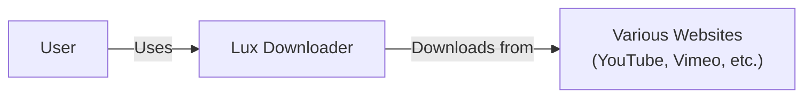
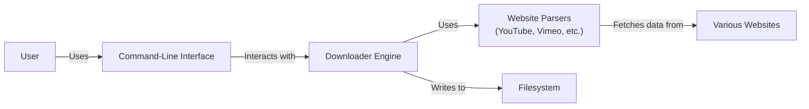
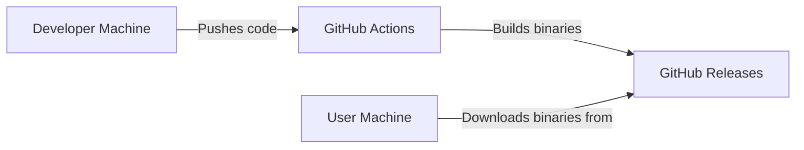
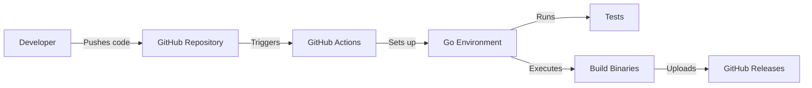

Okay, let's create a design document for the `lux` project.

# BUSINESS POSTURE

Business Priorities and Goals:

*   Provide a fast and convenient way for users to download videos from various websites.
*   Offer a command-line tool that is easy to use and accessible to a wide range of users.
*   Support a large and growing number of video platforms.
*   Maintain a project that is open-source and community-driven.
*   Minimize external dependencies to simplify installation and reduce potential conflicts.

Most Important Business Risks:

*   Legal challenges related to copyright infringement and unauthorized content distribution.
*   Reputational damage due to association with illegal or unethical downloading activities.
*   Platform changes on supported websites that break the functionality of `lux`.
*   Security vulnerabilities that could expose users to malware or other threats.
*   Difficulty in maintaining the project due to the constant evolution of video platforms.
*   Lack of funding or developer resources to keep up with the demands of the project.

# SECURITY POSTURE

Existing Security Controls:

*   security control: The project is written in Go, which offers some built-in memory safety features compared to languages like C/C++. (Described in project's README and by nature of the Go language).
*   security control: The project uses Go Modules for dependency management, which helps to ensure that dependencies are tracked and versioned. (Described in `go.mod` file).
*   security control: Basic input validation is performed to check for valid URLs and command-line options. (Described in the source code, specifically in argument parsing and URL handling functions).
*   security control: The project primarily interacts with external websites via HTTPS, which provides encryption in transit. (Observed in the source code where network requests are made).

Accepted Risks:

*   accepted risk: The project inherently deals with downloading content from websites, which may have varying levels of security and could potentially expose users to malicious content.
*   accepted risk: The project relies on external websites and their APIs, which are subject to change without notice, potentially breaking functionality or introducing security issues.
*   accepted risk: The project's functionality may be used for purposes that violate copyright laws or terms of service of video platforms.
*   accepted risk: The project does not currently have comprehensive security auditing or penetration testing.

Recommended Security Controls:

*   security control: Implement more robust input validation to prevent potential injection attacks or unexpected behavior.
*   security control: Introduce regular security audits and penetration testing to identify and address vulnerabilities.
*   security control: Consider implementing a mechanism to check for updates to `lux` and its dependencies, notifying users of potential security updates.
*   security control: Explore options for sandboxing or isolating the download process to limit the impact of potential exploits.
*   security control: Provide clear documentation and warnings about the potential risks of downloading content from untrusted sources.
*   security control: Implement static code analysis to identify potential security vulnerabilities.

Security Requirements:

*   Authentication: Not directly applicable, as `lux` primarily acts as a downloader without user accounts. However, if interaction with sites requiring authentication is implemented, secure storage and handling of credentials (e.g., API keys, cookies) are crucial.
*   Authorization: Not directly applicable in the current context. If features like user-specific downloads or access control are added, proper authorization mechanisms will be needed.
*   Input Validation: Crucial to prevent injection attacks, unexpected behavior, and potential security vulnerabilities. All user-provided inputs (URLs, command-line options, configuration files) must be strictly validated.
*   Cryptography: HTTPS is used for communication with external websites, ensuring encryption in transit. If sensitive data (e.g., credentials) is handled, appropriate cryptographic measures (e.g., hashing, encryption at rest) must be implemented.

# DESIGN

## C4 CONTEXT

Element List:

*   Element:
    *   Name: User
    *   Type: Person
    *   Description: A person who wants to download videos from the internet.
    *   Responsibilities: Provides URLs and command-line options to `lux`.
    *   Security controls: None directly implemented by the user. Relies on the security of their own system and the websites they interact with.

*   Element:
    *   Name: Lux Downloader
    *   Type: Software System
    *   Description: The command-line tool for downloading videos.
    *   Responsibilities: Parses user input, interacts with websites, downloads video content, and saves it to the local filesystem.
    *   Security controls: Basic input validation, HTTPS for communication with websites, Go's memory safety features, dependency management with Go Modules.

*   Element:
    *   Name: Various Websites
    *   Type: Software System
    *   Description: The video platforms that `lux` supports (e.g., YouTube, Vimeo, etc.).
    *   Responsibilities: Hosting video content and providing APIs or web pages for accessing it.
    *   Security controls: Implemented by the respective websites (e.g., HTTPS, access controls, content security policies). `lux` relies on these controls but does not directly manage them.

## C4 CONTAINER

Element List:

*   Element:
    *   Name: User
    *   Type: Person
    *   Description: A person who wants to download videos from the internet.
    *   Responsibilities: Provides URLs and command-line options to `lux`.
    *   Security controls: None directly implemented by the user. Relies on the security of their own system and the websites they interact with.

*   Element:
    *   Name: Command-Line Interface
    *   Type: Container
    *   Description: The entry point for user interaction.
    *   Responsibilities: Parses command-line arguments, validates user input, and passes instructions to the Downloader Engine.
    *   Security controls: Basic input validation.

*   Element:
    *   Name: Downloader Engine
    *   Type: Container
    *   Description: The core logic for downloading videos.
    *   Responsibilities: Manages the download process, handles retries, and interacts with Website Parsers.
    *   Security controls: None specific beyond Go's inherent memory safety.

*   Element:
    *   Name: Website Parsers
    *   Type: Container
    *   Description: A collection of modules, each specific to a supported website.
    *   Responsibilities: Extracts video URLs and metadata from website pages or APIs.
    *   Security controls: Relies on HTTPS for communication with websites. Input validation specific to each website's data format.

*   Element:
    *   Name: Filesystem
    *   Type: Container
    *   Description: The local storage where downloaded videos are saved.
    *   Responsibilities: Storing downloaded files.
    *   Security controls: Relies on the operating system's file system permissions.

*   Element:
    *   Name: Various Websites
    *   Type: Software System
    *   Description: The video platforms that `lux` supports (e.g., YouTube, Vimeo, etc.).
    *   Responsibilities: Hosting video content and providing APIs or web pages for accessing it.
    *   Security controls: Implemented by the respective websites (e.g., HTTPS, access controls, content security policies). `lux` relies on these controls but does not directly manage them.

## DEPLOYMENT

Possible Deployment Solutions:

1.  Manual Installation: Users download the source code and compile it themselves.
2.  Pre-built Binaries: Provide pre-compiled binaries for various operating systems and architectures.
3.  Package Managers: Distribute `lux` through package managers like `brew` (macOS), `apt` (Debian/Ubuntu), `choco` (Windows), etc.
4.  Docker Container: Provide a Docker image for running `lux` in a containerized environment.

Chosen Solution (for detailed description): Pre-built Binaries

Deployment Diagram:

Element List:

*   Element:
    *   Name: Developer Machine
    *   Type: Infrastructure Node
    *   Description: The machine where the code is developed and tested.
    *   Responsibilities: Code development, testing, and pushing to the repository.
    *   Security controls: Standard development environment security practices (e.g., secure coding, access controls).

*   Element:
    *   Name: GitHub Actions
    *   Type: Infrastructure Node
    *   Description: The CI/CD platform used to build and release `lux`.
    *   Responsibilities: Automating the build process, running tests, and creating releases.
    *   Security controls: GitHub Actions security features (e.g., access controls, secrets management).

*   Element:
    *   Name: GitHub Releases
    *   Type: Infrastructure Node
    *   Description: The platform where pre-built binaries are stored and made available for download.
    *   Responsibilities: Storing and serving release artifacts.
    *   Security controls: GitHub's security infrastructure (e.g., HTTPS, access controls).

*   Element:
    *   Name: User Machine
    *   Type: Infrastructure Node
    *   Description: The machine where the user runs `lux`.
    *   Responsibilities: Downloading and executing the `lux` binary.
    *   Security controls: Relies on the user's operating system security and their own security practices.

## BUILD

Build Process:

1.  Developer writes code and pushes it to the GitHub repository.
2.  GitHub Actions triggers a workflow on push or pull request.
3.  The workflow sets up the Go environment.
4.  The workflow runs tests (unit tests, integration tests).
5.  The workflow builds the `lux` binary for multiple platforms (e.g., Windows, macOS, Linux).
6.  The workflow creates a release on GitHub Releases and uploads the binaries.
7.  Optionally, the workflow might also build and push a Docker image.

Security Controls in Build Process:

*   security control: Go Modules are used for dependency management, ensuring that dependencies are tracked and versioned. This helps prevent supply chain attacks.
*   security control: GitHub Actions provides a secure environment for building the software.
*   security control: Code is built from a trusted source (the GitHub repository).
*   security control: Tests are run as part of the build process to ensure code quality and identify potential issues.
*   security control: (Recommended) Integrate static analysis tools (e.g., `go vet`, `staticcheck`, `gosec`) into the build process to identify potential security vulnerabilities.
*   security control: (Recommended) Implement Software Bill of Materials (SBOM) generation during the build process to track all dependencies and their versions.

Build Process Diagram:

# RISK ASSESSMENT

Critical Business Processes to Protect:

*   The ability for users to download videos.
*   The reputation and legal standing of the `lux` project.
*   The availability and maintainability of the project.

Data to Protect and Sensitivity:

*   `lux` itself does not store any user data directly. However, it interacts with external websites, and potentially sensitive information (e.g., video URLs, cookies if authentication is involved) may be handled temporarily during the download process. The sensitivity of this data depends on the specific websites and the content being downloaded.
*   Downloaded video content: The sensitivity of this data depends entirely on the content itself. It could range from publicly available videos to copyrighted material or even illegal content. `lux` does not control or monitor the content being downloaded.

# QUESTIONS & ASSUMPTIONS

Questions:

*   Are there any specific legal or compliance requirements that `lux` needs to adhere to?
*   What is the expected user base and usage patterns for `lux`?
*   What is the long-term plan for maintaining and supporting `lux`?
*   Are there any plans to implement features that require user authentication or handling of sensitive data?
*   What level of security testing and auditing is desired or feasible for the project?

Assumptions:

*   BUSINESS POSTURE: The primary goal is to provide a functional and convenient video downloader, with a secondary focus on security.
*   BUSINESS POSTURE: The project operates under the assumption that users are responsible for complying with copyright laws and terms of service of video platforms.
*   SECURITY POSTURE: The project relies on the security of external websites and the user's own system.
*   SECURITY POSTURE: The current level of security is considered "basic," with room for improvement.
*   DESIGN: The design is relatively simple and straightforward, focusing on core functionality.
*   DESIGN: The project will continue to be maintained and updated to support new websites and address issues.
*   DESIGN: The build process will be automated using GitHub Actions.
*   DESIGN: Pre-built binaries will be provided for easy installation.