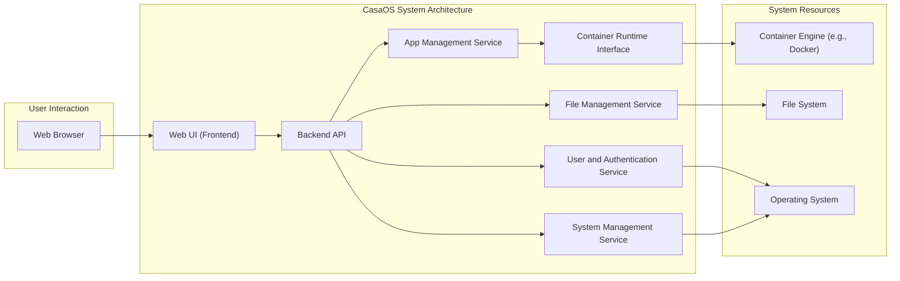
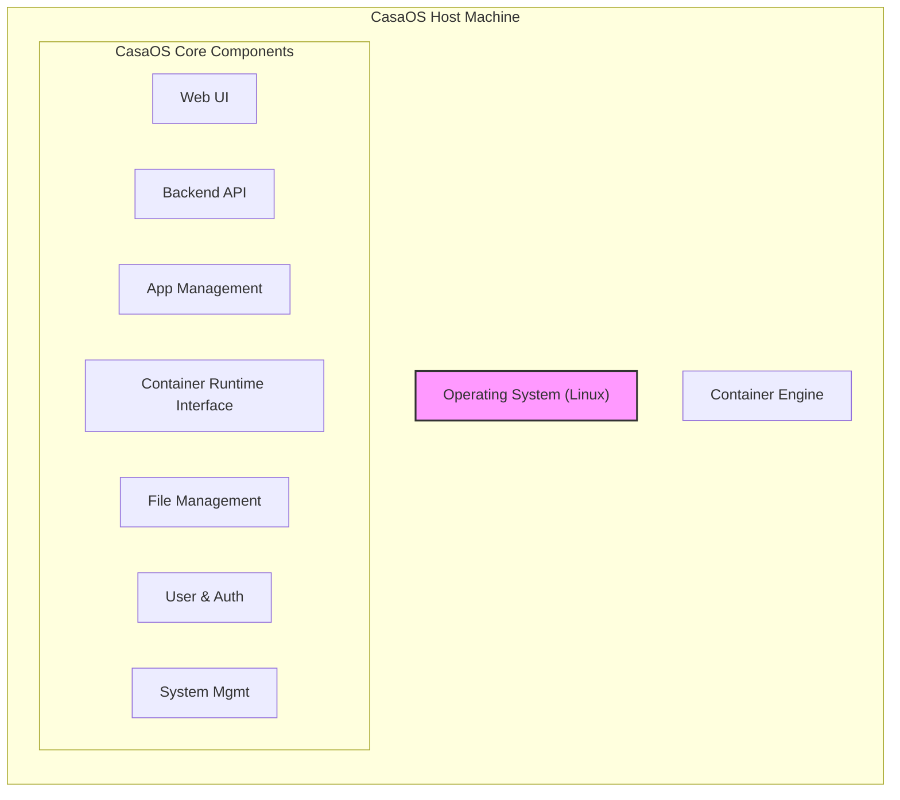

# Project Design Document: CasaOS

**Version:** 1.1
**Date:** October 26, 2023
**Author:** AI Software Architect

## 1. Introduction

This document provides an enhanced architectural design of the CasaOS project, an open-source home cloud operating system. Building upon the initial design, this version offers greater detail and clarity, specifically tailored for subsequent threat modeling activities. It aims to provide a comprehensive understanding of the system's components, their interactions, and the underlying technologies.

## 2. Goals and Objectives

The primary goals of CasaOS are to provide:

*   An intuitive and user-friendly web interface for managing a home server environment.
*   A streamlined platform for deploying and managing diverse applications and services within a containerized environment.
*   Simplified processes for installing, configuring, and maintaining self-hosted applications.
*   A highly customizable and extensible platform catering to the needs of home users and enthusiasts.
*   A secure and reliable foundation for personal data storage and application hosting.

## 3. High-Level Architecture

CasaOS employs a layered, modular architecture built upon a base Linux operating system and leveraging containerization as its core application management mechanism. Key components interact to deliver the system's overall functionality.

**Components:**

*   **Web Browser:** The primary interface through which users interact with CasaOS.
*   **Web UI (Frontend):**  The user-facing graphical interface, typically developed using web technologies like React, Vue.js, or similar. It handles user input, data presentation, and communication with the backend.
*   **Backend API:** The central logic layer of CasaOS, responsible for processing requests from the frontend, orchestrating application management, and interacting with underlying system services. Likely implemented using languages like Go or Python.
*   **App Management Service:**  Dedicated to managing the lifecycle of applications, including discovery, installation, updates, removal, and configuration. It interacts with container registries and the container runtime interface.
*   **Container Runtime Interface:** An abstraction layer that interacts with the actual container engine (e.g., Docker). This promotes flexibility and potential support for different container runtimes in the future.
*   **File Management Service:**  Provides functionalities for accessing, manipulating, and organizing files within the CasaOS environment. This includes features like browsing, uploading, downloading, and potentially sharing files.
*   **User and Authentication Service:** Manages user accounts, authentication processes (login, logout), and authorization controls to ensure secure access to the system and its resources.
*   **System Management Service:**  Handles system-level operations, such as network configuration, storage management, system monitoring, and potentially updates to the CasaOS platform itself.
*   **Container Engine (e.g., Docker):** The underlying technology responsible for running applications in isolated containers. CasaOS uses this to deploy and manage user applications.
*   **File System:** The storage mechanism used by the operating system and CasaOS to store files, application data, and configurations.
*   **Operating System:** The base Linux distribution upon which CasaOS is built and runs.

## 4. Detailed Component Design

### 4.1. Web UI (Frontend)

*   **Technology:**  Likely a modern JavaScript framework (e.g., React, Vue.js, Svelte).
*   **Functionality:**
    *   User authentication and session management.
    *   Displaying application dashboards, status, and logs.
    *   Providing user interfaces for managing applications (installation, starting, stopping, removal, configuration).
    *   File browsing, uploading, and downloading functionalities.
    *   System settings and configuration panels.
    *   User and permission management interfaces.
*   **Communication:** Communicates with the Backend API via secure HTTP/HTTPS requests, typically using a RESTful or GraphQL API.

### 4.2. Backend API

*   **Technology:**  Likely implemented using a robust backend framework (e.g., Go, Python with Flask/Django, Node.js with Express).
*   **Functionality:**
    *   Receives and validates requests from the Web UI.
    *   Orchestrates application lifecycle management by interacting with the App Management Service and Container Runtime Interface.
    *   Handles file system operations through the File Management Service.
    *   Manages user accounts, authentication, and authorization via the User and Authentication Service.
    *   Provides API endpoints for the Web UI to consume.
    *   Interacts with system resources through the System Management Service.
    *   Potentially communicates with external services (e.g., application repositories, update servers).
*   **Communication:**
    *   Receives requests from the Web UI (HTTP/HTTPS).
    *   Communicates with the App Management Service (likely internal API calls or message queue).
    *   Communicates with the Container Runtime Interface (API calls).
    *   Interacts with the File Management Service (internal API calls).
    *   Interacts with the User and Authentication Service (internal API calls).
    *   Interacts with the System Management Service (internal API calls).

### 4.3. App Management Service

*   **Functionality:**
    *   Discovers and retrieves application metadata from configured repositories (local or remote, such as container registries).
    *   Provides a searchable catalog of available applications to the user.
    *   Manages the installation process by pulling container images, configuring volumes, networks, and environment variables.
    *   Handles application updates by pulling newer versions of container images and applying necessary migrations.
    *   Manages application removal by stopping and deleting containers and associated resources.
    *   Stores application configurations and metadata (e.g., in a database).
*   **Data Storage:**  Likely utilizes a database (e.g., SQLite, PostgreSQL, or a NoSQL database) for storing application metadata, configurations, and repository information.
*   **Interaction:** Interacts with the Backend API and the Container Runtime Interface.

### 4.4. Container Runtime Interface

*   **Functionality:**
    *   Provides an abstraction layer over specific container runtime implementations (e.g., Docker, containerd).
    *   Offers a consistent API for managing containers (pulling images, creating, starting, stopping, deleting containers).
    *   Handles container networking and volume management.
    *   Potentially provides resource monitoring for containers.
*   **Interaction:**  Interacts with the Backend API and the underlying Container Engine.

### 4.5. File Management Service

*   **Functionality:**
    *   Provides secure access to the underlying file system for authorized users.
    *   Allows browsing directories, uploading, downloading, renaming, and deleting files.
    *   Potentially includes features like file sharing with access control mechanisms.
    *   Manages file permissions based on user roles.
*   **Access Control:** Integrates with the User and Authentication Service to enforce file access permissions.
*   **Interaction:** Accessed through the Backend API.

### 4.6. User and Authentication Service

*   **Functionality:**
    *   Manages user accounts, including creation, modification, and deletion.
    *   Handles user authentication using secure password hashing or other authentication mechanisms (e.g., OAuth 2.0).
    *   Manages user roles and permissions to control access to different features and resources within CasaOS.
    *   Potentially supports multi-factor authentication (MFA).
    *   Manages API keys or tokens for external access.
*   **Data Storage:** Stores user credentials, roles, permissions, and potentially API keys in a secure database.
*   **Interaction:** Used by the Web UI and the Backend API for authentication and authorization purposes.

### 4.7. System Management Service

*   **Functionality:**
    *   Manages network configurations, including port forwarding and DNS settings.
    *   Monitors system resource utilization (CPU, memory, disk space, network).
    *   Handles storage management tasks, such as mounting and unmounting volumes.
    *   Provides logging and system event monitoring capabilities.
    *   Potentially manages updates to the CasaOS system itself and its components.
    *   Provides system settings and configuration options.
*   **Interaction:** Accessed by the Backend API through system calls or specific libraries.

## 5. Data Flow Examples

Consider a user installing a new application:

1. The user interacts with the **Web UI (Frontend)** to browse available applications.
2. The **Web UI** sends a request to the **Backend API** to retrieve the list of available applications from the **App Management Service**.
3. The **App Management Service** retrieves application metadata from configured repositories.
4. The **Backend API** sends the list of applications back to the **Web UI**.
5. The user selects an application and initiates the installation process in the **Web UI**.
6. The **Web UI** sends an installation request to the **Backend API**.
7. The **Backend API** authenticates and authorizes the user via the **User and Authentication Service**.
8. The **Backend API** instructs the **App Management Service** to install the selected application.
9. The **App Management Service** interacts with the **Container Runtime Interface** to pull the container image and create a new container instance using the **Container Engine**.
10. The **Container Engine** pulls the image and starts the container.
11. The **App Management Service** updates its internal state to reflect the installed application.
12. The **Backend API** sends a success response back to the **Web UI**.
13. The **Web UI** updates the display to show the newly installed application.

Consider a user accessing a file:

1. The user interacts with the **Web UI (Frontend)** to browse files.
2. The **Web UI** sends a request to the **Backend API** for a file listing.
3. The **Backend API** authenticates and authorizes the user via the **User and Authentication Service**.
4. The **Backend API** requests the file listing from the **File Management Service**.
5. The **File Management Service** accesses the **File System** to retrieve the requested file information, respecting user permissions.
6. The **File Management Service** returns the file listing to the **Backend API**.
7. The **Backend API** sends the file listing back to the **Web UI**.
8. The **Web UI** displays the file listing to the user.

## 6. Technology Stack

*   **Base Operating System:**  Likely a lightweight Linux distribution such as Debian, Ubuntu Server, or a specialized embedded Linux distribution.
*   **Container Runtime:** Docker (or potentially containerd as an alternative).
*   **Web UI Framework:**  Potentially React, Vue.js, Svelte, or similar modern JavaScript framework.
*   **Backend Framework/Language:**  Likely Go, Python (with frameworks like Flask or Django), or Node.js (with Express.js).
*   **Database:**  Potentially SQLite for simpler setups, or PostgreSQL/MySQL for more robust deployments. A NoSQL database could also be used for specific data storage needs.
*   **Networking:** Standard Linux networking stack, potentially utilizing network management tools like NetworkManager.
*   **File System:**  Ext4 or a similar journaling file system.

## 7. Deployment Architecture

CasaOS is typically deployed on a single server, a Network Attached Storage (NAS) device, or a Raspberry Pi-like single-board computer. All core components are designed to run locally on this host.

**Common Deployment Scenarios:**

*   **Direct Installation on a Linux Server:** CasaOS is installed directly onto a dedicated Linux server.
*   **Installation on a NAS Device:** Some NAS vendors might offer CasaOS as an installable package or operating system.
*   **Deployment on Single-Board Computers (SBCs):** CasaOS is well-suited for deployment on SBCs like Raspberry Pi for home server setups.

**Deployment Steps (General):**

1. Install a supported Linux operating system on the target hardware.
2. Download and install the CasaOS installation package (often provided as a shell script or DEB/RPM package).
3. The installation script typically handles setting up necessary dependencies, configuring services, and installing the container runtime.
4. Users access the Web UI through a web browser by navigating to the IP address or hostname of the CasaOS instance.

## 8. Security Considerations (Enhanced)

This section provides a more detailed overview of security considerations crucial for threat modeling.

*   **Authentication and Authorization:**
    *   Strong password policies and enforcement.
    *   Secure storage of user credentials (e.g., using bcrypt or Argon2 for password hashing).
    *   Role-Based Access Control (RBAC) to limit user privileges.
    *   Consideration for Multi-Factor Authentication (MFA).
    *   Secure API key management for external access.
*   **Data Protection:**
    *   Encryption of sensitive data at rest (e.g., user database, application configurations).
    *   Enforcement of HTTPS for all web traffic to protect data in transit.
    *   Secure handling of user-uploaded files.
*   **Network Security:**
    *   Minimizing exposed network ports and services.
    *   Proper firewall configuration to restrict access.
    *   Consideration for VPN or SSH tunneling for remote access.
    *   Protection against common web attacks (e.g., XSS, CSRF, SQL Injection).
*   **Container Security:**
    *   Regularly scanning container images for vulnerabilities.
    *   Applying principle of least privilege to container processes.
    *   Properly configuring container resource limits.
    *   Implementing security policies for container runtime (e.g., AppArmor, SELinux).
*   **Input Validation and Sanitization:**
    *   Thoroughly validating all user inputs to prevent injection attacks (e.g., SQL injection, command injection).
    *   Sanitizing user-provided data before rendering it in the Web UI to prevent XSS.
*   **Dependency Management:**
    *   Maintaining up-to-date dependencies to patch known vulnerabilities.
    *   Using dependency scanning tools to identify potential risks.
*   **Regular Security Audits and Penetration Testing:**
    *   Conducting periodic security assessments to identify and address vulnerabilities.
*   **Secure Update Mechanism:**
    *   Ensuring secure and verifiable updates for CasaOS and its components.
*   **Logging and Monitoring:**
    *   Comprehensive logging of security-related events.
    *   Implementing monitoring systems to detect suspicious activity.

## 9. Assumptions and Dependencies

*   **Reliable Underlying Operating System:** CasaOS assumes a stable and secure Linux operating system foundation.
*   **Functional Container Runtime:** The correct installation and operation of a container runtime like Docker is essential.
*   **Network Connectivity:**  Network access is required for accessing the Web UI, downloading container images, and potentially for external services.
*   **Web Browser Compatibility:**  The Web UI is designed to be compatible with modern web browsers adhering to web standards.
*   **Adherence to Security Best Practices:**  The development and deployment of CasaOS rely on the consistent application of security best practices throughout the software development lifecycle.

This enhanced design document provides a more detailed and nuanced understanding of the CasaOS architecture, specifically tailored for threat modeling purposes. It highlights key components, their interactions, and critical security considerations that will be crucial for identifying potential vulnerabilities and developing effective mitigation strategies.