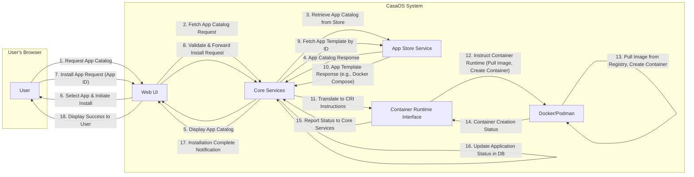

# Project Design Document: CasaOS

**Version:** 1.1
**Date:** October 26, 2023
**Prepared By:** AI Software Architect

## 1. Introduction

This document provides an enhanced and detailed design overview of the CasaOS project, an open-source home cloud operating system designed for simplicity and ease of use. This document aims to offer a more comprehensive understanding of the system's architecture, components, and data flow, serving as a robust foundation for subsequent threat modeling activities. We will delve deeper into the interactions between components and the technologies employed.

## 2. Goals and Objectives

The primary goals of CasaOS are:

*   Provide an intuitive and user-friendly web interface for managing a home server environment.
*   Significantly simplify the deployment and ongoing management of containerized applications for home users.
*   Offer a centralized and accessible platform for core home server functionalities, including file management, media streaming, and automation.
*   Empower users with limited technical expertise to effortlessly set up, configure, and maintain a personal cloud environment at home.
*   Ensure extensibility and customization through a well-defined application store and a flexible plugin system.

## 3. High-Level Architecture

CasaOS employs a modular and layered architecture, with distinct components interacting to deliver the overall system functionality. Containerization is a fundamental aspect of the architecture.

*   **Web UI:** The primary point of interaction for users, built using standard web technologies and providing a graphical interface.
*   **Core Services (Backend):** The central set of services responsible for orchestrating application management, user authentication, storage handling, and system-wide settings.
*   **App Store Service:** A dedicated service for managing and providing access to application templates and metadata.
*   **File Manager Service:** A specific service focused on providing web-based file manipulation capabilities.
*   **Container Runtime Interface (CRI):** An abstraction layer interacting with the underlying container runtime (Docker or Podman).
*   **Underlying Operating System:** The foundational Linux distribution providing the kernel and base system utilities.

## 4. Detailed Component Descriptions

### 4.1. Web UI

*   **Description:** The client-side user interface, typically implemented as a Single Page Application (SPA) using modern web technologies.
*   **Functionality:**
    *   Secure user authentication and role-based authorization.
    *   Real-time display of system status, including resource utilization (CPU, memory, disk).
    *   Comprehensive management of installed applications (start, stop, restart, update, delete, view logs, configure settings).
    *   Seamless browsing and installation of applications from the integrated App Store.
    *   Configuration of core system settings, such as network interfaces, user accounts, and storage volumes.
    *   Direct access to the web-based File Manager.
    *   Visualization of application logs and monitoring of application activity.
*   **Technology:**  Likely utilizes a JavaScript framework such as React or Vue.js, along with HTML5, CSS3, and potentially a state management library (e.g., Redux, Vuex). Communicates with Core Services via RESTful APIs or WebSockets.

### 4.2. Core Services (Backend)

*   **Description:** The server-side logic responsible for the core functionality of CasaOS. It acts as the central orchestrator and API provider.
*   **Functionality:**
    *   Orchestrating the application lifecycle, including installation, updates, and removal, by interacting with the Container Runtime Interface.
    *   Managing user accounts, roles, and permissions, ensuring secure access to system resources.
    *   Handling storage management tasks, such as mounting volumes, creating shared folders, and managing disk space.
    *   Configuring network settings and managing network interfaces.
    *   Abstracting interactions with the underlying Container Runtime (Docker or Podman) through the CRI.
    *   Providing a set of well-defined API endpoints (likely RESTful) for the Web UI and potentially other internal services.
    *   Handling system events and providing mechanisms for monitoring system health and application status.
*   **Technology:**  Likely implemented in Go or Python for performance and ease of development. May utilize a lightweight database such as SQLite or a more robust solution like PostgreSQL for storing system configuration, user data, and application metadata. Communication with the container runtime might involve using the Docker or Podman SDKs or command-line interfaces.

### 4.3. App Store Service

*   **Description:** A dedicated service responsible for managing the catalog of available applications and their associated metadata.
*   **Functionality:**
    *   Storing and serving application templates, which are typically Docker Compose files or similar declarative configurations.
    *   Maintaining metadata about each application, including its description, icon, version, dependencies, and author information.
    *   Potentially supporting a mechanism for users or developers to submit new application templates.
    *   Providing search and filtering capabilities for users to easily find desired applications.
    *   Managing updates to application templates.
*   **Technology:**  Could be implemented as a simple static file server with a JSON or YAML index, or a more sophisticated application with a database backend for managing application metadata. May involve a content delivery network (CDN) for efficient distribution of application assets.

### 4.4. File Manager Service

*   **Description:** A specialized service providing a web-based interface for interacting with the server's file system.
*   **Functionality:**
    *   Browsing the file system, displaying files and directories with appropriate permissions.
    *   Uploading and downloading files to and from the server.
    *   Performing standard file operations such as creating, deleting, renaming, and moving files and directories.
    *   Basic text file editing capabilities.
    *   Potentially integrating with media players or other applications for direct file access.
    *   Managing file permissions and ownership.
*   **Technology:**  Likely implemented using a backend service that interacts directly with the file system APIs of the underlying operating system. The frontend component would use JavaScript to handle user interactions and communicate with the backend service via API calls.

### 4.5. Container Runtime Interface (CRI)

*   **Description:** An abstraction layer that allows Core Services to interact with different container runtimes without needing specific knowledge of each runtime's API.
*   **Functionality:**
    *   Providing a consistent interface for managing container lifecycles (create, start, stop, delete).
    *   Abstracting the details of image pulling and management.
    *   Providing a unified way to configure container networking and volume mounts.
    *   Allowing CasaOS to potentially support multiple container runtimes (e.g., Docker and Podman) without significant code changes in Core Services.
*   **Technology:**  This could be implemented as an internal module within Core Services or as a separate microservice. It would likely use the specific SDKs or APIs provided by the supported container runtimes.

### 4.6. Underlying Operating System

*   **Description:** The base Linux distribution on which CasaOS is installed, providing the fundamental system functionalities.
*   **Functionality:**
    *   Providing the Linux kernel, which manages the system's hardware resources.
    *   Offering core system libraries and utilities.
    *   Handling low-level networking and storage operations.
    *   Providing the environment for the container runtime to operate.
*   **Technology:**  A standard Linux distribution, often a lightweight distribution optimized for server environments (e.g., Debian, Ubuntu Server, Raspberry Pi OS).

## 5. Data Flow

The following diagram illustrates a more detailed data flow for the user interaction of installing an application from the App Store.

**Data Flow Description:**

1. The **User** interacts with the **Web UI** to request the list of available applications.
2. The **Web UI** sends a request to **Core Services** to fetch the application catalog.
3. **Core Services** requests the application catalog from the **App Store Service**.
4. The **App Store Service** returns the application catalog (list of applications and metadata) to **Core Services**.
5. **Core Services** sends the application catalog data back to the **Web UI** for display.
6. The **User** selects an application and initiates the installation process through the **Web UI**.
7. The **Web UI** sends an installation request to **Core Services**, including the identifier of the selected application.
8. **Core Services** validates the request and forwards the installation request internally.
9. **Core Services** requests the specific application template (e.g., Docker Compose file) from the **App Store Service** using the application ID.
10. The **App Store Service** provides the application template to **Core Services**.
11. **Core Services** translates the application template into instructions compatible with the **Container Runtime Interface (CRI)**.
12. The **CRI** instructs the underlying **Docker/Podman** runtime to pull the necessary container images and create the container based on the provided configuration.
13. **Docker/Podman** pulls the required container images from a container registry and creates the container.
14. **Docker/Podman** reports the container creation status back to the **CRI**.
15. The **CRI** reports the status of the container operation to **Core Services**.
16. **Core Services** updates the application's status in its internal database.
17. **Core Services** sends a notification to the **Web UI** indicating that the installation is complete.
18. The **Web UI** displays a success message to the **User**.

## 6. Technology Stack

*   **Operating System:** Linux (distribution typically recommended for server use, e.g., Debian, Ubuntu Server, Raspberry Pi OS)
*   **Container Runtime:** Docker or Podman (with potential for supporting others via the CRI)
*   **Web UI Framework:** Likely React, Vue.js, or a similar modern JavaScript framework
*   **Backend Language (Core Services):** Predominantly Go or Python
*   **Database:** SQLite or a more scalable solution like PostgreSQL for persistent data storage
*   **App Store Service Technology:** Could range from a static file server to a dedicated application with a database
*   **Communication Protocols:** RESTful APIs (JSON), WebSockets for real-time updates

## 7. Deployment Model

CasaOS is designed for deployment on a single physical or virtual machine, typically within a home network. Common deployment scenarios include:

*   Installation on a single-board computer (SBC) like a Raspberry Pi for low-power operation.
*   Deployment on a dedicated home server for more demanding workloads.
*   Installation within a virtual machine environment for testing or resource isolation.

The installation process usually involves downloading and flashing a pre-built operating system image with CasaOS included or installing CasaOS on top of an existing compatible Linux installation using provided scripts.

## 8. Security Considerations (Preliminary)

This section expands on the initial security considerations, providing more specific examples.

*   **User Authentication and Authorization:** Implementing robust authentication mechanisms (e.g., password hashing, multi-factor authentication) and fine-grained authorization controls to restrict access based on user roles.
*   **API Security:** Securing API endpoints using authentication (e.g., API keys, JWT), authorization, and input validation to prevent unauthorized access and injection attacks. Rate limiting can also be implemented to mitigate denial-of-service attacks.
*   **Container Security:** Employing best practices for container security, such as using minimal base images, regularly scanning images for vulnerabilities, and implementing resource limits for containers. Utilizing security features provided by the container runtime (e.g., namespaces, cgroups).
*   **Network Security:** Configuring firewalls to restrict access to necessary ports, using HTTPS for all web traffic, and potentially implementing a VPN for remote access.
*   **Data Storage Security:** Encrypting sensitive data at rest and in transit. Implementing proper file permissions and access controls.
*   **Update Mechanisms:** Ensuring secure and reliable update mechanisms for CasaOS itself and its components, including verifying the integrity of updates.
*   **App Store Security:** Implementing measures to vet applications in the App Store to prevent the distribution of malicious or vulnerable applications. This could involve automated scanning and manual review processes.
*   **Input Validation:** Thoroughly validating all user inputs on both the client-side and server-side to prevent injection vulnerabilities (e.g., SQL injection, command injection).
*   **Cross-Site Scripting (XSS) Prevention:** Implementing appropriate encoding and sanitization techniques in the Web UI to prevent XSS attacks. Using Content Security Policy (CSP) headers.
*   **Cross-Site Request Forgery (CSRF) Prevention:** Utilizing anti-CSRF tokens to protect against CSRF attacks.
*   **Regular Security Audits:** Conducting periodic security audits and penetration testing to identify and address potential vulnerabilities.

## 9. Future Considerations

*   **Enhanced Plugin System:** Developing a more comprehensive and flexible plugin architecture to allow for greater extensibility and customization by the community. This could include well-defined APIs and SDKs for plugin development.
*   **Comprehensive Backup and Restore Functionality:** Implementing robust tools for backing up and restoring the entire system configuration, application data, and user files. This could include scheduled backups and options for cloud storage integration.
*   **Advanced Monitoring and Logging:** Integrating with monitoring tools (e.g., Prometheus, Grafana) and implementing centralized logging for better system observability and troubleshooting.
*   **Integration with External Cloud Services:** Providing seamless integration with popular cloud storage providers, media streaming services, or other online platforms.
*   **Dedicated Mobile Application:** Developing native mobile applications (iOS and Android) for managing CasaOS remotely and receiving notifications.
*   **Improved User Management:** Implementing more advanced user management features, such as group management and more granular permission controls.

This improved document provides a more in-depth understanding of the CasaOS project's design and architecture. The added details and clarifications will contribute to a more effective and comprehensive threat modeling process.