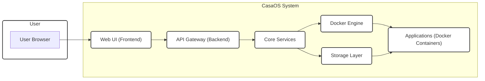

# Project Design Document: CasaOS

**Project Name:** CasaOS

**Project Repository:** [https://github.com/icewhaletech/casaos](https://github.com/icewhaletech/casaos)

**Document Version:** 1.1
**Date:** 2023-10-27
**Author:** AI Cloud & Security Expert

## 1. Project Overview

CasaOS is an open-source home cloud system designed to simplify the management of personal servers and applications. It provides a user-friendly web interface to manage Docker containers, files, system settings, and more. CasaOS aims to make self-hosting accessible to users with varying technical skills, offering a centralized platform for managing home server functionalities. Key features include an app store for one-click application deployment, file management, system monitoring, and user-friendly settings.

This document outlines the high-level design of CasaOS to facilitate threat modeling and security analysis. It describes the system architecture, key components, data flow, technology stack, deployment model, and key security considerations. This document will serve as a foundation for subsequent threat modeling activities.

## 2. System Architecture

CasaOS adopts a modular architecture centered around a web interface and a backend API, leveraging Docker for application management. The system is designed to be lightweight and resource-efficient, suitable for running on various hardware, including resource-constrained devices like Raspberry Pi. The following diagram illustrates the high-level system architecture:



**Description of Components:**

*   **User Browser ("User Browser"):** The web browser used by the end-user (administrator or authorized user) to interact with the CasaOS web interface. This is the primary access point for managing the CasaOS system.
*   **Web UI (Frontend) ("Web UI (Frontend)"):**  The frontend application, likely built using a modern JavaScript framework such as React or Vue.js. It is responsible for:
    *   Rendering the user interface and providing a user-friendly experience.
    *   Handling user interactions (clicks, form submissions, etc.).
    *   Communicating with the backend API Gateway via HTTP requests (typically RESTful API calls).
    *   Managing user sessions and potentially some client-side state.
    *   Displaying real-time updates and notifications from the backend.
*   **API Gateway (Backend) ("API Gateway (Backend)"):** The backend API server, likely implemented using Go (potentially with frameworks like Gin or Echo) or Node.js (with Express.js). It acts as the central entry point for all requests from the Web UI and potentially other clients. Its responsibilities include:
    *   **Authentication and Authorization:** Verifying user credentials and ensuring users have the necessary permissions to access specific resources and functionalities.
    *   **Request Routing:** Directing incoming requests to the appropriate Core Services based on the requested endpoint.
    *   **API Logic:** Implementing some API-specific business logic, request validation, and data transformation.
    *   **Communication with Core Services:** Interacting with the Core Services component to fulfill requests.
    *   **Rate Limiting and Security:** Implementing measures to protect against abuse and common web attacks.
*   **Core Services ("Core Services"):**  The central component containing the core business logic and orchestration capabilities of CasaOS. It is responsible for:
    *   **Application Management:** Handling the installation, uninstallation, starting, stopping, and management of applications (Docker containers).
    *   **System Settings Management:** Managing system-level configurations, such as network settings, user accounts, storage configurations, and update mechanisms.
    *   **User Account Management:** Handling user creation, deletion, and permission management.
    *   **File Operations:** Providing file management functionalities, potentially including file browsing, uploading, downloading, and editing.
    *   **System Monitoring:** Collecting and exposing system metrics (CPU usage, memory usage, disk space, network activity) for monitoring and display in the Web UI.
    *   **Interaction with Docker Engine:** Communicating with the Docker Engine to manage containers.
    *   **Interaction with Storage Layer:** Accessing and managing data within the Storage Layer.
*   **Docker Engine ("Docker Engine"):** The containerization platform used by CasaOS to run and manage applications in isolated environments. It is responsible for:
    *   Pulling Docker images from registries.
    *   Creating and managing Docker containers.
    *   Providing resource isolation and management for containers.
    *   Exposing container logs and status information.
*   **Storage Layer ("Storage Layer"):**  Represents the underlying file system and storage mechanisms used by CasaOS. It is responsible for:
    *   Storing system configurations and application metadata.
    *   Storing user data and files.
    *   Providing persistent storage for Docker containers (volumes).
    *   Interacting with the host operating system's file system. This could be local storage, network-attached storage (NAS), or other storage solutions mounted to the host system.
*   **Applications (Docker Containers) ("Applications (Docker Containers)"):** User-installed applications packaged as Docker containers. These are isolated and run within the Docker Engine, managed and orchestrated by CasaOS through the Core Services.  These applications provide the actual functionalities and services offered by the CasaOS system (e.g., media servers, file sharing, home automation tools).

## 3. Data Flow

The following diagram illustrates a simplified data flow for a common user action: **Installing an Application from the App Store**. This example highlights the interaction between different components during a typical operation.

```mermaid
graph LR
    subgraph "User"
        UB["User Browser"]
    end
    subgraph "CasaOS System"
        WUI["Web UI"]
        API_GW["API Gateway"]
        CORE_SVC["Core Services"]
        APP_STORE["App Store (Metadata)"]
        DOCKER_REG["Docker Registry"]
        DOCKER_ENG["Docker Engine"]
        STORAGE_LAYER["Storage Layer"]
        INSTALLED_APPS["Installed Applications"]
    end

    UB --> WUI: "Request App Store"
    WUI --> API_GW: "API Request (Get App List)"
    API_GW --> CORE_SVC: "Get App List Command"
    CORE_SVC --> APP_STORE: "Fetch App Metadata"
    APP_STORE --> CORE_SVC: "App Metadata List"
    CORE_SVC --> API_GW: "App Metadata Response"
    API_GW --> WUI: "App List Data"
    WUI --> UB: "Display App Store"

    UB --> WUI: "Select 'Install' App"
    WUI --> API_GW: "API Request (Install App)"
    API_GW --> CORE_SVC: "Install App Command"
    CORE_SVC --> APP_STORE: "Fetch App Details"
    APP_STORE --> CORE_SVC: "App Details"
    CORE_SVC --> DOCKER_REG: "Pull Docker Image"
    DOCKER_REG --> DOCKER_ENG: "Docker Image"
    DOCKER_ENG --> STORAGE_LAYER: "Store Container Data"
    DOCKER_ENG --> INSTALLED_APPS: "Run Container"
    CORE_SVC --> WUI: "Installation Status Updates"
    WUI --> UB: "Installation Progress"

    classDef box stroke:#333,fill:#fff,stroke-width:2px,rx:5px,ry:5px
    class User,CasaOSSystem box
    class WUI,API_GW,CORE_SVC,APP_STORE,DOCKER_REG,DOCKER_ENG,STORAGE_LAYER,INSTALLED_APPS box
```

**Data Flow Description (App Installation):**

1.  **Request App Store:** The user initiates the process by requesting to view the App Store through the Web UI, typically by clicking on an "App Store" icon or menu item.
2.  **Get App List API Request:** The Web UI, upon user interaction, sends an asynchronous API request (e.g., HTTP GET) to the API Gateway. This request is for retrieving the list of available applications and their basic metadata.
3.  **Get App List Command:** The API Gateway receives the request and routes it to the Core Services component. It translates the API request into an internal command or function call within the Core Services.
4.  **Fetch App Metadata:** The Core Services component, upon receiving the command, interacts with the App Store component. The App Store is responsible for maintaining the catalog of available applications and their metadata. This metadata might be stored in a local file (e.g., JSON, YAML), a lightweight database (e.g., SQLite), or even fetched from a remote service.
5.  **App Metadata List:** The App Store retrieves the requested metadata for all available applications and returns it to the Core Services as a list or structured data format.
6.  **App Metadata Response:** The Core Services packages the received app metadata into a response format suitable for the API Gateway (e.g., JSON) and sends it back.
7.  **App List Data:** The API Gateway receives the response from the Core Services and forwards it to the Web UI, potentially performing some data transformation or formatting if needed.
8.  **Display App Store:** The Web UI receives the app list data and dynamically renders the App Store interface, displaying the available applications with their names, descriptions, icons, and "Install" buttons.
9.  **Select 'Install' App:** The user browses the App Store and selects a specific application they wish to install. They then click the "Install" button associated with that application.
10. **Install App API Request:** Upon clicking "Install," the Web UI sends another API request (e.g., HTTP POST) to the API Gateway. This request includes information about the selected application to be installed.
11. **Install App Command:** The API Gateway routes the installation request to the Core Services component.
12. **Fetch App Details:** The Core Services may need to fetch more detailed information about the selected application before proceeding with the installation. This might involve querying the App Store again for specific details related to the chosen application, such as Docker image name, required configurations, etc.
13. **App Details:** The App Store returns the detailed application information to the Core Services.
14. **Pull Docker Image:** The Core Services instructs the Docker Engine to pull the Docker image associated with the selected application. This involves communicating with a Docker Registry (e.g., Docker Hub, a private registry) to download the necessary image layers.
15. **Docker Image:** The Docker Registry provides the Docker image to the Docker Engine.
16. **Store Container Data:** The Docker Engine stores the downloaded Docker image and related container configuration data in the Storage Layer. This includes setting up Docker volumes for persistent data storage if defined for the application.
17. **Run Container:** The Docker Engine creates and starts a new Docker container based on the pulled image and configuration. This effectively installs and runs the application within the CasaOS environment.
18. **Installation Status Updates:** The Core Services monitors the installation process and receives status updates from the Docker Engine. It then sends these updates to the Web UI via the API Gateway, allowing the user to track the installation progress.
19. **Installation Progress:** The Web UI displays the installation progress to the user, providing feedback on the status of the application installation.

## 4. Technology Stack

Based on the project repository analysis and common practices for similar systems, the likely technology stack for CasaOS includes:

*   **Backend Programming Language:** **Go** (Likely, based on project structure, performance characteristics, and common use for backend services and container orchestration). Frameworks like **Gin** or **Echo** could be used for API development. *[To be confirmed by examining the repository]*
*   **Frontend Framework:**  **React** or **Vue.js** (Popular choices for building modern, interactive user interfaces). *[To be confirmed by examining the repository]*
*   **Containerization Platform:** **Docker** (Standard for container management and orchestration).
*   **Operating System:** **Linux-based distributions** (Target platform for CasaOS, offering flexibility and Docker compatibility). Distributions like Debian, Ubuntu, or CentOS are likely candidates.
*   **Database:**  Likely a lightweight database for storing system configuration, application metadata, and potentially user preferences. Options include:
    *   **SQLite:** File-based, simple to embed, suitable for smaller datasets and configurations.
    *   **BoltDB:**  A key-value store written in Go, performant and suitable if the backend is Go-based.
    *   Alternatively, configuration might be stored in flat files (JSON, YAML) for simplicity, especially for initial configurations. *[To be confirmed by examining the repository]*
*   **Web Server:**  Likely embedded within the API Gateway application. For Go-based backends, the standard `net/http` package or frameworks like Gin/Echo include web server capabilities. For Node.js, Express.js handles web server functionalities.

**Note:** This technology stack is based on common assumptions and project characteristics. A definitive technology stack should be confirmed by a detailed examination of the CasaOS project repository and codebase.

## 5. Deployment Model

CasaOS is primarily designed for on-premises deployment, focusing on providing a personal cloud experience within a user's home or local network. Common deployment scenarios include:

*   **Single-Board Computers (SBCs):**  Raspberry Pi, Orange Pi, and similar low-power, cost-effective devices are ideal for running CasaOS as a personal home server.
    *   **Considerations:** Resource constraints (CPU, RAM, storage) need to be considered when selecting applications. Suitable for basic home automation, file sharing, and media streaming for personal use.
*   **Home Servers:** Dedicated hardware servers within a home environment offer more processing power and storage capacity.
    *   **Considerations:** Allows for running more resource-intensive applications, serving multiple users within the household, and providing more robust services.
*   **Virtual Machines (VMs):** CasaOS can be deployed within VMs on hypervisors like VirtualBox, VMware, KVM, or cloud-based VM platforms (e.g., AWS EC2, Google Compute Engine, Azure Virtual Machines).
    *   **Considerations:** Offers flexibility in resource allocation and scalability. Cloud VMs enable remote access and management of CasaOS from anywhere with an internet connection.
*   **Potentially Cloud Instances:** While primarily for home use, deploying CasaOS on cloud instances can be useful for specific scenarios, such as:
    *   **Remote Access to Personal Cloud:** Accessing personal files and applications from anywhere in the world.
    *   **Offsite Backup and Disaster Recovery:** Using a cloud-based CasaOS instance as a backup location for critical data.
    *   **Experimentation and Testing:** Quickly setting up and testing CasaOS in a cloud environment before deploying it on local hardware.

**Deployment Process:**

The typical deployment process involves:

1.  **Operating System Installation:** Installing a supported Linux-based operating system on the target hardware (SBC, server, VM).
2.  **CasaOS Installation:** Downloading and installing the CasaOS software package onto the OS. This usually involves running a script or using a package manager.
3.  **Initial Configuration:** Accessing the CasaOS web interface through a browser and completing the initial setup, which may include setting up user accounts, network configurations, and storage settings.
4.  **Application Deployment:** Using the App Store or manual Docker image deployment to install and configure desired applications.

## 6. Security Considerations (Detailed)

This design document is intended to facilitate threat modeling.  The following outlines key security areas and potential threats to consider for CasaOS, along with suggested mitigation strategies.

*   **Web UI Security:**
    *   **Threats:**
        *   **Cross-Site Scripting (XSS):** Malicious scripts injected into the Web UI to steal user credentials, session tokens, or perform actions on behalf of the user.
        *   **Cross-Site Request Forgery (CSRF):**  Attacker tricks a logged-in user into making unintended requests on the CasaOS system.
        *   **Insecure Authentication:** Weak password policies, lack of multi-factor authentication (MFA), session hijacking.
        *   **Clickjacking:**  Tricking users into clicking hidden elements on the Web UI to perform unintended actions.
        *   **Information Disclosure:**  Sensitive information leaked through error messages, source code, or insecure configurations.
    *   **Mitigation Strategies:**
        *   **Input Validation and Output Encoding:** Sanitize user inputs and properly encode outputs to prevent XSS.
        *   **CSRF Protection:** Implement CSRF tokens to prevent CSRF attacks.
        *   **Strong Authentication:** Enforce strong password policies, consider implementing MFA, secure session management (HTTP-only, Secure flags for cookies).
        *   **Clickjacking Protection:** Implement frame-busting techniques or Content Security Policy (CSP) headers.
        *   **Secure Configuration:**  Minimize information disclosure in error messages, secure web server configurations, and remove unnecessary debugging information.
        *   **Regular Security Audits and Penetration Testing:**  Identify and address potential vulnerabilities in the Web UI code.

*   **API Security:**
    *   **Threats:**
        *   **Broken Authentication and Authorization:**  Bypassing authentication mechanisms, unauthorized access to API endpoints, privilege escalation.
        *   **Injection Attacks (SQL Injection, Command Injection, etc.):**  Exploiting vulnerabilities in API endpoints to execute malicious code or access sensitive data.
        *   **API Rate Limiting and Denial of Service (DoS):**  Overwhelming the API with requests to cause service disruption.
        *   **Data Exposure:**  Sensitive data exposed through API responses due to insecure design or lack of proper filtering.
        *   **Man-in-the-Middle (MitM) Attacks:**  Eavesdropping or tampering with API traffic if communication is not encrypted.
    *   **Mitigation Strategies:**
        *   **Robust Authentication and Authorization:** Implement secure authentication mechanisms (e.g., JWT, OAuth 2.0), role-based access control (RBAC) to restrict access based on user roles.
        *   **Input Validation and Parameterized Queries:**  Validate all API inputs and use parameterized queries or prepared statements to prevent injection attacks.
        *   **API Rate Limiting and Throttling:** Implement rate limiting to prevent DoS attacks and abuse.
        *   **Data Filtering and Output Encoding:**  Filter sensitive data from API responses and properly encode outputs.
        *   **HTTPS Enforcement:**  Enforce HTTPS for all API communication to encrypt traffic and prevent MitM attacks.
        *   **API Security Audits and Penetration Testing:** Regularly assess API security for vulnerabilities.

*   **Docker Security:**
    *   **Threats:**
        *   **Container Breakout:**  Escaping the container environment to gain access to the host system.
        *   **Privilege Escalation within Containers:**  Gaining root privileges within a container and potentially impacting other containers or the host.
        *   **Vulnerable Docker Images:**  Using Docker images with known vulnerabilities that can be exploited.
        *   **Supply Chain Attacks:**  Compromised Docker images from untrusted registries.
        *   **Resource Exhaustion:**  Containers consuming excessive resources and impacting system performance or other containers.
    *   **Mitigation Strategies:**
        *   **Principle of Least Privilege:** Run containers with minimal necessary privileges, avoid running containers as root whenever possible.
        *   **Container Security Scanning:**  Regularly scan Docker images for vulnerabilities using vulnerability scanners.
        *   **Trusted Docker Registries:**  Use trusted and reputable Docker registries for pulling images. Verify image signatures and checksums.
        *   **Resource Limits and Quotas:**  Implement resource limits (CPU, memory, storage) for containers to prevent resource exhaustion.
        *   **Regular Docker Engine Updates:**  Keep the Docker Engine updated with the latest security patches.
        *   **Security Hardening of Docker Host:**  Harden the host operating system running Docker.
        *   **Container Runtime Security:** Consider using security-focused container runtimes like gVisor or Kata Containers for enhanced isolation.

*   **Storage Security:**
    *   **Threats:**
        *   **Unauthorized Access to Data:**  Accessing sensitive system configurations, user data, or application data without proper authorization.
        *   **Data Breaches:**  Exposure or theft of sensitive data stored in the Storage Layer.
        *   **Data Loss:**  Data loss due to hardware failures, software errors, or malicious attacks.
        *   **Data Tampering:**  Unauthorized modification of data, leading to data integrity issues.
    *   **Mitigation Strategies:**
        *   **Access Control Lists (ACLs) and Permissions:**  Implement proper file system permissions and ACLs to restrict access to sensitive data.
        *   **Data Encryption at Rest:**  Encrypt sensitive data at rest using disk encryption or file-level encryption.
        *   **Data Encryption in Transit:**  Use HTTPS for all communication involving sensitive data transfer.
        *   **Regular Backups:**  Implement regular data backups to protect against data loss.
        *   **Data Integrity Checks:**  Implement mechanisms to verify data integrity and detect tampering.
        *   **Physical Security:**  Secure physical access to the hardware where CasaOS and its storage are deployed.

*   **Application Security:**
    *   **Threats:**
        *   **Vulnerabilities in Applications:**  Applications running within Docker containers may have their own vulnerabilities that can be exploited.
        *   **Malicious Applications:**  Users may install malicious applications from untrusted sources or compromised App Stores.
        *   **Application Misconfiguration:**  Insecure configuration of applications can introduce vulnerabilities.
    *   **Mitigation Strategies:**
        *   **App Store Security:**  Curate and vet applications in the App Store to minimize the risk of malicious or vulnerable applications. Implement application review processes.
        *   **User Education:**  Educate users about the risks of installing applications from untrusted sources and the importance of selecting reputable applications.
        *   **Container Isolation:**  Docker provides container isolation, but further network isolation and security policies can be implemented to limit the impact of compromised applications.
        *   **Application Security Scanning (if feasible):**  Explore options for scanning applications for vulnerabilities before or after installation (though this can be complex for third-party Docker images).
        *   **Regular Application Updates:** Encourage users to keep their applications updated to patch known vulnerabilities.

*   **Update Mechanism Security:**
    *   **Threats:**
        *   **Malicious Updates:**  Attackers compromising the update mechanism to distribute malicious updates that can compromise the CasaOS system.
        *   **Man-in-the-Middle Attacks on Updates:**  Intercepting update traffic and injecting malicious updates.
        *   **Lack of Update Verification:**  Updates not properly verified for authenticity and integrity.
    *   **Mitigation Strategies:**
        *   **Secure Update Channels (HTTPS):**  Use HTTPS for downloading updates to prevent MitM attacks.
        *   **Digital Signatures for Updates:**  Digitally sign updates to ensure authenticity and integrity. Verify signatures before applying updates.
        *   **Trusted Update Sources:**  Obtain updates from trusted and official sources.
        *   **Rollback Mechanism:**  Implement a rollback mechanism to revert to a previous version in case of a failed or malicious update.
        *   **Update Testing:**  Thoroughly test updates before releasing them to users.

## 7. Conclusion

This detailed design document provides a comprehensive overview of the CasaOS project, including its architecture, data flow, technology stack, deployment model, and critical security considerations. It serves as a valuable resource for understanding the system's inner workings and identifying potential security vulnerabilities. This document is intended to be a living document and should be updated as the CasaOS project evolves. The information presented here will be instrumental in conducting thorough threat modeling exercises and developing effective security strategies to protect CasaOS and its users. Moving forward, a detailed threat model should be created based on this design document to systematically analyze and mitigate the identified security risks.