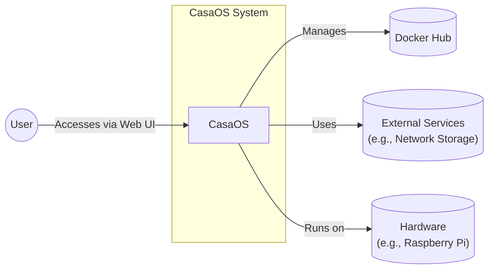
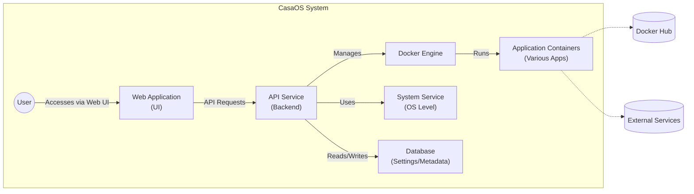
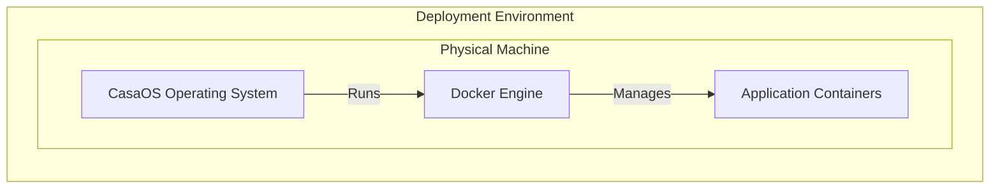
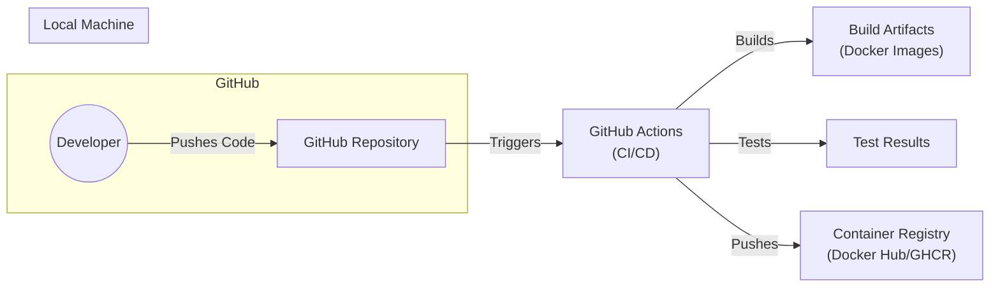

Okay, let's create a design document for the CasaOS project, focusing on aspects relevant for threat modeling.

# BUSINESS POSTURE

CasaOS aims to provide a simple, easy-to-use, and elegant home cloud system centered around the Docker ecosystem.  It appears to be targeted at home users and enthusiasts who want to self-host applications and services.  The project prioritizes ease of use and a visually appealing interface over enterprise-grade features or strict security hardening.  This suggests a higher risk tolerance than a mission-critical enterprise system.

Business Priorities:

*   Ease of Use:  The system must be simple to install, configure, and manage, even for users with limited technical expertise.
*   Community Driven:  Foster a strong community around the project for support, contributions, and feedback.
*   Extensibility: Allow users to easily add and manage new applications via Docker containers.
*   Aesthetically Pleasing:  Provide a visually attractive and intuitive user interface.
*   Open Source: Maintain the project as open-source software, encouraging transparency and collaboration.

Business Goals:

*   Become a leading home cloud operating system.
*   Grow a large and active user base.
*   Attract developers to contribute to the project and expand its capabilities.

Most Important Business Risks:

*   Data Loss/Corruption:  Users' personal data stored within the home cloud environment could be lost or corrupted due to software bugs, hardware failures, or security breaches.
*   Unauthorized Access:  Attackers could gain unauthorized access to the system and its data, potentially leading to data theft, system compromise, or misuse of resources.
*   System Instability:  Software defects or misconfigurations could lead to system instability, making the home cloud unreliable.
*   Lack of User Awareness:  Users may not be aware of the security risks associated with self-hosting and may not take appropriate precautions.
*   Supply Chain Attacks: Compromised dependencies or Docker images could introduce vulnerabilities into the system.

# SECURITY POSTURE

Existing Security Controls:

*   security control: Web Application Firewall (potentially): The GitHub repository mentions using a reverse proxy (potentially Nginx or similar), which *could* be configured with WAF capabilities, but this is not explicitly stated.
*   security control: Docker Containerization: Applications run within Docker containers, providing some level of isolation and resource management. Described in multiple files, including Dockerfiles and docker-compose configurations.
*   security control: User Authentication (Basic): CasaOS likely has some form of user authentication to access the web interface, although the specifics (e.g., password hashing, session management) are not detailed in the provided repository overview. Implemented in backend services.
*   security control: Regular Updates: The project seems to be actively maintained, suggesting that security updates and bug fixes are released regularly.

Accepted Risks:

*   accepted risk: Limited Hardening: The focus on ease of use likely means that the system is not hardened to the same degree as an enterprise-grade server operating system.
*   accepted risk: User Misconfiguration: Users may misconfigure the system or the applications they run, creating security vulnerabilities.
*   accepted risk: Reliance on Third-Party Images: The system relies heavily on Docker images from third-party sources, which may contain vulnerabilities or malicious code.
*   accepted risk: Limited Auditing/Logging: The repository does not provide details about system auditing or logging capabilities, which are crucial for detecting and responding to security incidents.

Recommended Security Controls (High Priority):

*   Implement robust input validation on all user-facing interfaces and API endpoints.
*   Enforce strong password policies and use secure password hashing algorithms (e.g., bcrypt, Argon2).
*   Implement session management with secure, randomly generated session IDs and appropriate timeouts.
*   Provide clear documentation and guidance on secure configuration and best practices for users.
*   Implement a mechanism for users to easily update the system and its components.
*   Consider integrating with a vulnerability scanner for Docker images.
*   Implement centralized logging and auditing to track system events and user activity.

Security Requirements:

*   Authentication:
    *   The system must authenticate users before granting access to the web interface and API.
    *   User passwords must be stored securely using a strong, one-way hashing algorithm.
    *   The system should support multi-factor authentication (MFA) as an optional security enhancement.
*   Authorization:
    *   The system must implement role-based access control (RBAC) to restrict user access to specific resources and functionalities.
    *   Access control policies should be clearly defined and enforced consistently.
*   Input Validation:
    *   All user input must be validated to prevent common web vulnerabilities such as cross-site scripting (XSS), SQL injection, and command injection.
    *   Input validation should be performed on both the client-side (for user experience) and the server-side (for security).
*   Cryptography:
    *   Sensitive data, such as passwords and API keys, must be encrypted at rest and in transit.
    *   Strong, industry-standard cryptographic algorithms and protocols should be used.
    *   Key management practices should be secure and follow best practices.

# DESIGN

## C4 CONTEXT

Element Descriptions:

*   Element:
    *   Name: User
    *   Type: Person
    *   Description: A person who interacts with CasaOS to manage their home cloud.
    *   Responsibilities: Accessing the CasaOS web interface, installing and managing applications, configuring system settings.
    *   Security controls: User authentication, authorization (RBAC).

*   Element:
    *   Name: CasaOS
    *   Type: Software System
    *   Description: The core CasaOS system, providing a web-based interface for managing Docker containers and home cloud services.
    *   Responsibilities: Providing a user interface, managing Docker containers, handling user authentication and authorization, interacting with external services.
    *   Security controls: Input validation, web application firewall (potential), user authentication, authorization (RBAC), session management.

*   Element:
    *   Name: Docker Hub
    *   Type: External System
    *   Description: A public registry for Docker images.
    *   Responsibilities: Providing a repository of Docker images for users to download and deploy.
    *   Security controls: Relies on Docker Hub's security measures; CasaOS should implement image vulnerability scanning.

*   Element:
    *   Name: External Services
    *   Type: External System
    *   Description: External services that CasaOS may interact with, such as network storage, media servers, or other home automation systems.
    *   Responsibilities: Providing specific services to the user's home network.
    *   Security controls: Depend on the specific external service; CasaOS should use secure communication protocols (e.g., HTTPS) when interacting with these services.

*   Element:
    *   Name: Hardware
    *   Type: Infrastructure
    *   Description: Physical hardware that CasaOS runs.
    *   Responsibilities: Providing compute, storage, and network.
    *   Security controls: Physical security.

## C4 CONTAINER

Element Descriptions:

*   Element:
    *   Name: Web Application (UI)
    *   Type: Web Application
    *   Description: The user interface of CasaOS, providing a visual way for users to interact with the system.
    *   Responsibilities: Rendering the user interface, handling user input, making API requests to the backend.
    *   Security controls: Input validation, client-side security headers (e.g., X-Frame-Options, Content-Security-Policy).

*   Element:
    *   Name: API Service (Backend)
    *   Type: Server-side Application
    *   Description: The backend service that handles API requests from the web application and interacts with other system components.
    *   Responsibilities: Handling API requests, managing user authentication and authorization, interacting with the Docker Engine and system services.
    *   Security controls: Input validation, authentication, authorization (RBAC), session management, API rate limiting.

*   Element:
    *   Name: Docker Engine
    *   Type: Container Runtime
    *   Description: The Docker Engine, responsible for running and managing Docker containers.
    *   Responsibilities: Creating, starting, stopping, and deleting Docker containers, managing container images, networking, and storage.
    *   Security controls: Docker security best practices (e.g., using non-root users within containers, limiting container capabilities).

*   Element:
    *   Name: Application Containers (Various Apps)
    *   Type: Docker Container
    *   Description: Docker containers running various applications and services chosen by the user.
    *   Responsibilities: Providing specific application functionality (e.g., media server, file sharing, home automation).
    *   Security controls: Depend on the specific application; users should choose reputable images and keep them updated. Image vulnerability scanning is recommended.

*   Element:
    *   Name: System Service (OS Level)
    *   Type: System Service
    *   Description: System-level services, such as network configuration, file system management, and hardware interaction.
    *   Responsibilities: Providing low-level system functionality.
    *   Security controls: Operating system security best practices, regular security updates.

*   Element:
    *   Name: Database (Settings/Metadata)
    *   Type: Database
    *   Description: A database for storing CasaOS settings, user data, and application metadata.
    *   Responsibilities: Storing and retrieving data.
    *   Security controls: Data encryption at rest, access control restrictions, regular backups.

## DEPLOYMENT

Possible Deployment Solutions:

1.  Bare Metal Installation: Installing CasaOS directly onto a physical machine (e.g., Raspberry Pi, old PC).
2.  Virtual Machine: Running CasaOS within a virtual machine (e.g., using VirtualBox, VMware, Proxmox).
3.  Docker Container (ironic): Running CasaOS itself within a Docker container. This is less common but possible.

Chosen Solution (for detailed description): Bare Metal Installation

Element Descriptions:

*   Element:
    *   Name: Physical Machine
    *   Type: Infrastructure
    *   Description: The physical hardware on which CasaOS is installed.
    *   Responsibilities: Providing compute, storage, and network resources.
    *   Security controls: Physical security of the device.

*   Element:
    *   Name: CasaOS Operating System
    *   Type: Operating System
    *   Description: The base operating system, likely a Linux distribution, with CasaOS installed on top.
    *   Responsibilities: Managing hardware resources, providing a platform for running CasaOS and Docker.
    *   Security controls: Operating system security best practices, regular security updates, firewall configuration.

*   Element:
    *   Name: Docker Engine
    *   Type: Container Runtime
    *   Description: The Docker Engine, responsible for running and managing Docker containers.
    *   Responsibilities: Creating, starting, stopping, and deleting Docker containers.
    *   Security controls: Docker security best practices.

*   Element:
    *   Name: Application Containers
    *   Type: Docker Container
    *   Description: Docker containers running various applications.
    *   Responsibilities: Providing application-specific functionality.
    *   Security controls: Application-specific security measures, image vulnerability scanning.

## BUILD

CasaOS uses GitHub Actions for its CI/CD pipeline. The build process is triggered by events like pushes to the repository or pull requests. The process involves building Docker images for different architectures and pushing them to a container registry (likely Docker Hub or GitHub Container Registry).

Security Controls in Build Process:

*   Code Review: Pull requests are likely reviewed before being merged, providing an opportunity for security checks.
*   Automated Builds: GitHub Actions automates the build process, ensuring consistency and reducing the risk of manual errors.
*   Dependency Management: Dependencies are likely managed using a package manager (e.g., `go mod` for Go projects), allowing for tracking and updating of dependencies.
*   SAST Scanning (Potential): The repository *could* integrate with static application security testing (SAST) tools to scan the codebase for vulnerabilities during the build process. This is not explicitly mentioned but is a recommended practice.
*   Image Signing (Potential): Docker images *could* be signed to ensure their integrity and authenticity. This is not explicitly mentioned but is a recommended practice.

# RISK ASSESSMENT

Critical Business Processes to Protect:

*   User Data Management: Ensuring the confidentiality, integrity, and availability of user data stored within the home cloud.
*   System Availability: Maintaining the uptime and accessibility of the CasaOS system and its applications.
*   Software Update Process: Ensuring that security updates are delivered and applied in a timely and reliable manner.

Data to Protect and Sensitivity:

*   User Credentials (Passwords, API Keys): Highly sensitive; must be protected with strong encryption and secure storage.
*   Personal Files (Photos, Videos, Documents): Sensitivity varies depending on the user's data; should be protected with appropriate access controls and encryption.
*   Application Data: Sensitivity varies depending on the application; should be protected according to the application's security requirements.
*   System Configuration: Moderately sensitive; unauthorized modification could lead to system compromise.

# QUESTIONS & ASSUMPTIONS

Questions:

*   What specific web server/reverse proxy is used, and how is it configured (including WAF capabilities)?
*   What are the details of the user authentication mechanism (hashing algorithm, session management)?
*   Are there any existing logging or auditing capabilities?
*   What database is used to store settings and metadata, and how is it secured?
*   Are there any plans to integrate with vulnerability scanners for Docker images?
*   Are there any plans to implement more robust security features, such as multi-factor authentication or role-based access control?
*   What is the process for handling security vulnerabilities reported by users or researchers?

Assumptions:

*   BUSINESS POSTURE: The primary target audience is home users and enthusiasts, not enterprise customers. The project prioritizes ease of use and a positive user experience over strict security hardening.
*   SECURITY POSTURE: The system relies heavily on Docker containerization for security isolation. Users are expected to have some basic understanding of Docker and security best practices. There is a reliance on third-party Docker images, which may introduce vulnerabilities.
*   DESIGN: The system uses a standard web application architecture with a frontend UI, a backend API service, and a Docker Engine for running applications. The system interacts with external services, such as Docker Hub, for image management. The deployment model is primarily bare-metal installation on a physical device. The build process is automated using GitHub Actions.