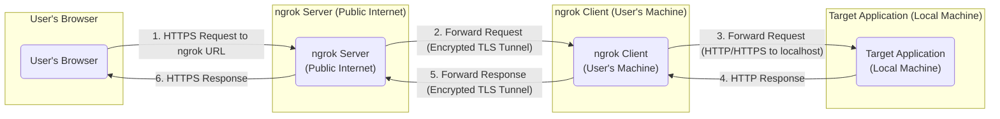
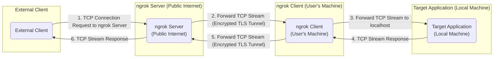

# Project Design Document: ngrok

**Version:** 1.1
**Date:** October 26, 2023
**Author:** AI Software Architect

## 1. Introduction

This document provides an enhanced and detailed design overview of the ngrok project, an open-source tool facilitating secure exposure of local servers behind Network Address Translation (NAT) and firewalls to the public internet via encrypted tunnels. This revised document aims to offer a more in-depth understanding of ngrok's architecture, individual components, and the intricate flow of data, serving as a robust foundation for subsequent threat modeling exercises.

## 2. Goals and Objectives

The fundamental goals of ngrok are:

*   **Securely expose local services:** To enable developers and testers to make applications running on their local machines accessible over the internet securely, eliminating the complexities of manual network configuration.
*   **Simplified development and testing workflows:** To streamline the testing of webhooks, Application Programming Interfaces (APIs), and other internet-facing services during development, without requiring deployment to staging environments.
*   **Cross-platform compatibility:** To ensure operability across a wide range of operating systems, including macOS, Linux, and Windows.
*   **Ease of use and intuitive interface:** To provide a straightforward and user-friendly command-line interface (CLI) for managing tunnels.
*   **End-to-end secure tunneling:** To guarantee the confidentiality and integrity of all traffic traversing the tunnel between the ngrok client and the ngrok server through robust encryption.

## 3. High-Level Architecture

ngrok employs a client-server architectural pattern. The primary components involved are:

*   **ngrok Client:** An application that runs on the user's local machine, responsible for initiating and maintaining a secure, persistent connection to the ngrok server.
*   **ngrok Server:** A publicly accessible service, either managed by ngrok or self-hosted, acting as a central relay point for incoming requests destined for the tunneled local service.
*   **Target Application:** The specific application running locally that the user intends to expose to the internet via ngrok.

The operational sequence is as follows:

1. The user initiates the ngrok client, specifying the network port on which the target application is listening for connections.
2. The ngrok client establishes a secure, long-lived connection to the ngrok server over Transport Layer Security (TLS).
3. The ngrok server, upon successful connection, allocates a unique public URL (e.g., `https://<random-string>.ngrok-free.app`) associated with this specific tunnel.
4. When an external user accesses the assigned public URL, the Domain Name System (DNS) resolves to the ngrok server's IP address, and the server receives the incoming Hypertext Transfer Protocol (HTTP) or Transmission Control Protocol (TCP) request.
5. The ngrok server inspects the request and routes it through the established, encrypted tunnel to the corresponding ngrok client based on the assigned tunnel identifier.
6. The ngrok client, upon receiving the forwarded request, directs it to the target application listening on the specified local port.
7. The target application processes the received request and generates a response, which is then sent back to the ngrok client.
8. The ngrok client encapsulates the response and transmits it back through the secure tunnel to the ngrok server.
9. The ngrok server receives the response from the client and forwards it back to the original user who initiated the request from the public internet.

## 4. Component Details

### 4.1. ngrok Client

*   **Functionality:**
    *   **Secure Connection Establishment:** Initiates and persistently maintains a secure TLS connection with the ngrok server. This connection is the backbone of the tunnel.
    *   **Request Reception:** Listens for incoming requests forwarded by the ngrok server over the established secure tunnel.
    *   **Local Forwarding:** Forwards received requests to the designated local port where the target application is running.
    *   **Response Handling:** Receives responses generated by the target application.
    *   **Response Transmission:** Sends the received responses back to the ngrok server through the secure tunnel.
    *   **Authentication:** Handles authentication procedures with the ngrok server, which may involve API keys or other credentials, especially for paid features or self-hosted instances.
    *   **Protocol Support:** Supports various tunneling protocols, including HTTP, TCP, and TLS for establishing secure TCP tunnels.
    *   **Local Web Interface (Optional):** Provides an optional local web interface, typically accessible at `http://localhost:4040`, for inspecting tunnel status, request details, and other diagnostic information.

*   **Key Technologies:**
    *   **Go Programming Language:** Primarily developed using Go, leveraging its concurrency and networking capabilities.
    *   **TLS (Transport Layer Security):**  Employs TLS for end-to-end encryption of all communication with the ngrok server, ensuring data confidentiality and integrity.
    *   **WebSockets or Persistent Connections:** Utilizes WebSockets or similar persistent connection technologies to maintain a long-lived, bidirectional communication channel with the server.
    *   **Command-Line Interface (CLI):** Offers a user-friendly command-line interface for starting, stopping, and managing tunnels.

### 4.2. ngrok Server

*   **Functionality:**
    *   **Client Connection Acceptance:** Accepts incoming secure connections from various ngrok clients distributed across the internet.
    *   **Tunnel Management and Multiplexing:** Manages and efficiently multiplexes numerous concurrent tunnels established by different clients.
    *   **Public URL Assignment:** Dynamically assigns unique, publicly accessible URLs to each active tunnel, enabling external access.
    *   **Request Reception and Routing:** Receives incoming requests directed to the assigned public URLs and intelligently routes them to the correct ngrok client through the corresponding established tunnel.
    *   **Response Handling and Forwarding:** Receives responses from the ngrok clients and forwards them back to the original requester on the public internet.
    *   **Authentication and Authorization:** Implements authentication mechanisms to verify the identity of ngrok clients, particularly for accessing paid features, reserving custom domains, or utilizing self-hosted instances. Authorization rules govern which clients can perform specific actions.
    *   **API Provision:** Offers Application Programming Interfaces (APIs) for programmatic management of tunnels, accounts, and other resources.
    *   **Traffic Management Features:** May include advanced features such as request inspection, replay capabilities for debugging, and traffic shaping to manage bandwidth usage.

*   **Key Technologies:**
    *   **Go Programming Language:** Primarily implemented in Go for its performance and scalability in handling network traffic.
    *   **TLS (Transport Layer Security):**  Enforces TLS for all client connections and for serving traffic on the public URLs (HTTPS).
    *   **Load Balancers:** Employs load balancers to distribute incoming traffic across multiple server instances, ensuring high availability and scalability.
    *   **Databases:** Utilizes databases to persistently store information about tunnels, user accounts, authentication credentials, and configuration settings.
    *   **Reverse Proxy Functionality:** Acts as a reverse proxy, accepting requests from the internet and forwarding them to the appropriate backend (ngrok client).

### 4.3. Target Application

*   **Functionality:**
    *   **Local Service Provision:** Represents the local application or service that the user intends to make accessible over the internet.
    *   **Protocol Agnostic:** Can be any type of application that listens for network connections on a local port, such as web servers, API servers, TCP-based services, or game servers.
    *   **Transparent Proxying:** ngrok operates as a largely transparent proxy, forwarding requests and responses with minimal modification, allowing the target application to function as if it were directly exposed to the internet.

*   **Key Technologies:**
    *   **Varies:** The technologies used for the target application are independent of ngrok and depend on the specific application being exposed (e.g., Node.js, Python with frameworks like Flask or Django, Java with Spring Boot).

## 5. Data Flow Diagrams

### 5.1. HTTP Tunneling

### 5.2. TCP Tunneling

## 6. Security Considerations

This section outlines key security considerations relevant for threat modeling:

*   **End-to-End TLS Encryption:** All communication between the ngrok client and the ngrok server is encrypted using TLS, protecting sensitive data in transit from eavesdropping and tampering. This includes HTTP headers, request bodies, and response bodies.
*   **Client Authentication:** ngrok employs authentication mechanisms, such as API keys or OAuth, to verify the identity of clients attempting to establish tunnels. This prevents unauthorized users from creating tunnels.
*   **Authorization Controls:** Access control policies determine which authenticated users are permitted to create tunnels, reserve specific subdomains, or access premium features.
*   **Public URL Obscurity:** The randomly generated public URLs provide a degree of security through obscurity, making it difficult for unauthorized individuals to guess active tunnel endpoints. However, this should not be considered a primary security control.
*   **Rate Limiting and Abuse Prevention:** ngrok implements rate limiting on tunnel creation and traffic volume to mitigate potential abuse, such as denial-of-service attacks or excessive resource consumption.
*   **Self-Hosted Option Security:** The self-hosted ngrok server option provides users with greater control over their infrastructure and security configurations. However, it also places the responsibility for securing the server environment on the user. This includes patching vulnerabilities, configuring firewalls, and implementing intrusion detection systems.
*   **Local Web Interface Security:** The optional local web interface of the ngrok client, while convenient, can be a potential attack vector if not properly secured. Access should be restricted, and users should be aware of the risks of exposing this interface.
*   **Tunnel Inspection and Replay Risks:** Features like request inspection and replay, while useful for debugging, could be misused by malicious actors if they gain unauthorized access to the ngrok server or client.
*   **Subdomain Takeover Risks:** If users are allowed to reserve custom subdomains, there's a potential risk of subdomain takeover if the user's account is compromised or if DNS records are not properly managed.
*   **Dependency Vulnerabilities:** Like any software, ngrok and its components rely on third-party libraries. Vulnerabilities in these dependencies could potentially be exploited.

## 7. Deployment Considerations

*   **ngrok Client Deployment:**
    *   Typically deployed as a standalone, statically linked executable on the user's local machine.
    *   Installation is usually straightforward, involving downloading the appropriate binary for the user's operating system.
    *   Configuration is primarily done through command-line arguments or a configuration file.

*   **ngrok Server Deployment (Managed by ngrok):**
    *   Deployed and managed by the ngrok team on their infrastructure, typically utilizing major cloud providers like AWS, Google Cloud, or Azure.
    *   Involves a complex infrastructure including:
        *   **Load Balancers:** Distribute incoming traffic across multiple backend servers for scalability and high availability.
        *   **Multiple Application Servers:** Handle the core ngrok logic, including tunnel management, request routing, and authentication.
        *   **Databases (e.g., PostgreSQL, MySQL):** Store persistent data such as user accounts, API keys, tunnel configurations, and billing information.
        *   **Caching Layers (e.g., Redis, Memcached):** Improve performance by caching frequently accessed data.
        *   **Message Queues (e.g., Kafka, RabbitMQ):** Facilitate asynchronous communication between different components.
        *   **Monitoring and Logging Systems:** Track system health, performance, and potential issues.

*   **ngrok Server Deployment (Self-Hosted):**
    *   Can be deployed on various cloud platforms (e.g., AWS EC2, Google Compute Engine, Azure VMs) or on-premises infrastructure.
    *   Requires the user to manage the entire server infrastructure, including:
        *   **Operating System Configuration and Hardening.**
        *   **Network Configuration (Firewalls, Load Balancers).**
        *   **Database Setup and Maintenance.**
        *   **TLS Certificate Management.**
        *   **Security Patching and Updates.**
        *   **Monitoring and Logging.**
        *   **Scalability Planning.**

## 8. Future Considerations

*   **Enhanced Authentication and Authorization Mechanisms:** Implementing more granular access control policies, potentially integrating with existing Identity Providers (IdPs) via protocols like SAML or OpenID Connect.
*   **Deeper Integration with CI/CD Pipelines:** Providing more seamless integration with Continuous Integration and Continuous Delivery (CI/CD) pipelines to automate the process of exposing applications during development, testing, and deployment.
*   **Advanced Monitoring and Logging Capabilities:** Offering more detailed and customizable insights into tunnel activity, traffic patterns, and potential errors, potentially through integration with popular monitoring tools.
*   **Expanded Protocol Support:** Extending support beyond HTTP and TCP to accommodate other network protocols, such as UDP, for a wider range of use cases.
*   **Improved Security Features:** Continuously enhancing security measures to address emerging threats, such as implementing Web Application Firewall (WAF) capabilities or more sophisticated intrusion detection and prevention systems.
*   **GUI for Client Management:** Developing a graphical user interface (GUI) for the ngrok client to provide a more user-friendly alternative to the command-line interface.

This enhanced document provides a more detailed and comprehensive design overview of the ngrok project, offering a solid foundation for conducting thorough threat modeling activities. The refined descriptions of components, more detailed data flow diagrams, and expanded security considerations will be invaluable in identifying potential vulnerabilities and designing effective security mitigations.
