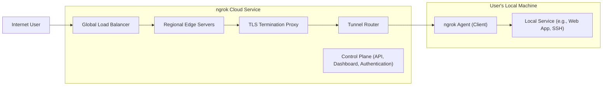
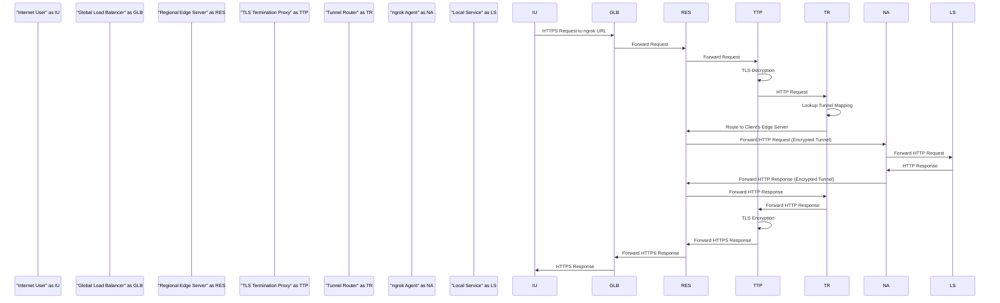
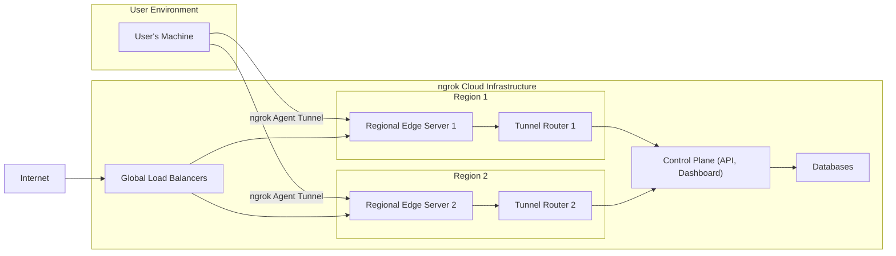

# Project Design Document: ngrok

**Version:** 1.1
**Date:** October 26, 2023
**Author:** Gemini (AI Language Model)

## 1. Introduction

This document provides a detailed design overview of the ngrok system, a reverse proxy service that establishes secure tunnels from public-facing URLs to services running on private networks. This document is specifically tailored to facilitate subsequent threat modeling activities by providing a comprehensive understanding of the system's architecture, components, and data flow.

## 2. Goals

* Provide a clear, detailed, and accurate architectural overview of the ngrok system.
* Thoroughly identify key components and elucidate their interactions within the system.
* Precisely describe the data flow within the ngrok infrastructure, highlighting critical pathways.
* Emphasize initial security considerations, providing a strong foundation for threat analysis and risk assessment.

## 3. Non-Goals

* In-depth implementation details of the ngrok Agent or Cloud Service codebase.
* Granular performance metrics, benchmarking results, or optimization techniques.
* Exhaustive listing of all configuration options, command-line arguments, or API parameters.
* Discussion of ngrok's business model, pricing structures, or service level agreements (SLAs).

## 4. High-Level Architecture

The ngrok system operates on a client-server model, connecting the **ngrok Agent (Client)** running on a user's private network to the **ngrok Cloud Service (Server)**, a globally accessible infrastructure. This connection creates a secure tunnel through which traffic can flow.

**Key Interactions:**

* The **ngrok Agent**, initiated by the user, establishes an outbound, mutually authenticated, and encrypted tunnel to the **ngrok Cloud Service**.
* The **ngrok Cloud Service** assigns a unique, publicly accessible URL (or allows the use of custom domains) to this established tunnel.
* Incoming requests directed to this public URL are intercepted by the **ngrok Cloud Service**.
* The **ngrok Cloud Service** routes these requests through the established tunnel to the specific **ngrok Agent** that created it.
* The **ngrok Agent** then proxies these requests to the designated **Local Service** running on the user's machine.
* Responses from the **Local Service** traverse the reverse path, back through the tunnel and the **ngrok Cloud Service**, to the originating **Internet User**.

## 5. Component Design

This section provides a more detailed breakdown of the key components within the ngrok system.

### 5.1. ngrok Agent (Client)

* **Purpose:**  Acts as the secure endpoint on the user's private network, facilitating the connection to the ngrok Cloud Service and proxying traffic.
* **Responsibilities:**
    * Initiating and maintaining a persistent, mutually authenticated, and encrypted TLS connection to the ngrok Cloud Service.
    * Authenticating itself to the ngrok Cloud Service using API keys, OAuth tokens, or other credentials managed by the Control Plane.
    * Receiving traffic forwarded from the ngrok Cloud Service and proxying it to the configured Local Service.
    * Receiving responses from the Local Service and sending them back through the secure tunnel to the ngrok Cloud Service.
    * Managing the lifecycle of the tunnel (e.g., starting, stopping, reconnecting).
    * Optionally implementing features like request inspection, modification (through plugins or configuration), and local authentication enforcement.

### 5.2. ngrok Cloud Service

* **Purpose:** The core infrastructure responsible for managing tunnels, assigning public URLs, routing traffic, and providing management interfaces.
* **Key Components:**

    * **5.2.1. Tunnel Router:**
        * **Purpose:**  The central routing engine responsible for mapping incoming public requests to the correct active client tunnels.
        * **Responsibilities:**
            * Receiving decrypted HTTP/S requests from the TLS Termination Proxy.
            * Performing a lookup based on the hostname or tunnel identifier in the request to determine the appropriate active ngrok Agent.
            * Forwarding the request to the specific Regional Edge Server that maintains the connection to the target ngrok Agent.
            * Managing the state of active tunnels and their associated metadata.

    * **5.2.2. TLS Termination Proxy:**
        * **Purpose:**  Handles the termination of TLS/SSL connections originating from internet users, ensuring secure communication.
        * **Responsibilities:**
            * Decrypting incoming HTTPS traffic using server-side TLS certificates.
            * Performing certificate validation and potentially other security checks on the incoming connection.
            * Optionally re-encrypting traffic for internal communication within the ngrok Cloud Service (although often the connection to the Tunnel Router is within a trusted network).
            * Forwarding the decrypted HTTP request to the Tunnel Router.

    * **5.2.3. Global Load Balancer:**
        * **Purpose:**  Distributes incoming internet traffic across multiple geographically distributed Regional Edge Servers to ensure high availability and reduce latency.
        * **Responsibilities:**
            * Distributing incoming requests based on factors like geographic proximity, server load, and health status.
            * Performing health checks on Regional Edge Servers to ensure traffic is only routed to healthy instances.
            * Providing a single point of entry for internet traffic destined for ngrok tunnels.

    * **5.2.4. Regional Edge Servers:**
        * **Purpose:**  Serve as the entry points into the ngrok Cloud Service, establishing and maintaining the secure, persistent connections with individual ngrok Agents.
        * **Responsibilities:**
            * Accepting connections from ngrok Agents and establishing mutually authenticated and encrypted TLS tunnels.
            * Receiving forwarded requests from the Tunnel Router destined for connected ngrok Agents.
            * Forwarding these requests through the established secure tunnel to the appropriate ngrok Agent.
            * Receiving responses from the ngrok Agent and forwarding them back to the Tunnel Router (which then routes them back to the internet user).

    * **5.2.5. Control Plane (API, Dashboard, Authentication):**
        * **Purpose:** Provides the management interface for users to interact with the ngrok service, manage their accounts, and configure tunnels.
        * **Responsibilities:**
            * Handling user registration, login, and authentication (using methods like passwords, multi-factor authentication, and potentially integration with third-party identity providers).
            * Providing a RESTful API for programmatic management of tunnels, domains, and other resources.
            * Offering a web-based dashboard for users to monitor tunnel status, configure settings, and view usage.
            * Managing user accounts, API keys, authentication tokens, and billing information.
            * Enforcing authorization policies to control access to resources and actions.

## 6. Data Flow

This section details the step-by-step journey of a request from an internet user to a locally running service exposed through ngrok.

**Detailed Steps:**

1. **Internet User initiates a request:** An **Internet User (IU)** sends an HTTPS request to the public URL provided by ngrok.
2. **Global Load Balancer receives the request:** The request arrives at the **Global Load Balancer (GLB)** of the ngrok Cloud Service.
3. **Load Balancer distributes the request:** The **GLB** selects an appropriate **Regional Edge Server (RES)** based on its load balancing algorithm and forwards the request.
4. **Regional Edge Server receives the request:** The chosen **RES** receives the incoming HTTPS request.
5. **TLS Termination:** The **RES** forwards the request to the **TLS Termination Proxy (TTP)**. The **TTP** decrypts the HTTPS traffic, exposing the underlying HTTP request.
6. **Forwarding to Tunnel Router:** The **TTP** forwards the decrypted HTTP request to the **Tunnel Router (TR)**.
7. **Tunnel Router Lookup:** The **TR** examines the hostname or tunnel identifier in the HTTP request to determine the corresponding active ngrok Agent.
8. **Routing to Client's Edge Server:** The **TR** identifies the specific **RES** that maintains the active, encrypted tunnel with the target **ngrok Agent (NA)** and routes the request to that **RES**.
9. **Forwarding to ngrok Agent:** The identified **RES** forwards the HTTP request through the established, encrypted tunnel to the **NA**.
10. **Forwarding to Local Service:** The **NA** receives the request and proxies it to the configured **Local Service (LS)** running on the user's machine.
11. **Local Service processes the request:** The **LS** handles the request and generates an HTTP response.
12. **Response back to ngrok Agent:** The **LS** sends the HTTP response back to the **NA**.
13. **Response through the tunnel:** The **NA** sends the HTTP response back through the encrypted tunnel to the **RES**.
14. **Response through Tunnel Router:** The **RES** forwards the HTTP response back to the **TR**.
15. **Response Encryption:** The **TR** forwards the HTTP response back to the **TTP**. The **TTP** encrypts the HTTP response using TLS.
16. **Response through Load Balancer:** The **TTP** forwards the HTTPS response back to the originating **RES**, which then forwards it to the **GLB**.
17. **Response to Internet User:** The **GLB** sends the HTTPS response back to the originating **IU**.

## 7. Security Considerations

This section expands on the security aspects of the ngrok system, providing a more detailed foundation for threat modeling.

* **Tunnel Security:**
    * **Mutual TLS Authentication:** The connection between the ngrok Agent and the ngrok Cloud Service utilizes mutual TLS authentication, ensuring both the client and server authenticate each other, preventing unauthorized clients from connecting.
    * **End-to-End Encryption:** The tunnel itself provides end-to-end encryption for the traffic passing through it, protecting data in transit.
* **TLS Termination Security:**
    * **Secure Key Management:** Private keys used for TLS termination are securely managed and protected.
    * **Regular Certificate Rotation:** TLS certificates are regularly rotated to minimize the impact of potential key compromise.
    * **Vulnerability Scanning:** The TLS termination infrastructure is regularly scanned for vulnerabilities.
* **Authentication and Authorization:**
    * **Strong API Key Management:** API keys used for client authentication should be treated as secrets and managed securely by users.
    * **OAuth 2.0 Support:** ngrok supports OAuth 2.0 for more secure authentication and authorization workflows.
    * **Role-Based Access Control (RBAC):** The Control Plane likely implements RBAC to manage user permissions and access to resources.
    * **Tunnel Authentication:** ngrok offers features to add authentication to individual tunnels (e.g., HTTP Basic Auth, OAuth), providing an additional layer of security.
* **Data Privacy and Security:**
    * **Data Minimization:** Only necessary data is collected and stored.
    * **Encryption at Rest:** Sensitive data stored by the ngrok Cloud Service (e.g., API keys, user credentials) should be encrypted at rest.
    * **Compliance with Regulations:** ngrok likely adheres to relevant data privacy regulations (e.g., GDPR, CCPA).
* **Abuse Prevention and Rate Limiting:**
    * **Request Rate Limiting:** Mechanisms are in place to limit the number of requests per tunnel or user to prevent abuse and denial-of-service attacks.
    * **Traffic Monitoring and Analysis:** Suspicious traffic patterns are monitored and analyzed to detect and mitigate potential attacks.
    * **Abuse Reporting Mechanisms:** Users have mechanisms to report abuse or malicious activity.
* **Infrastructure Security:**
    * **Regular Security Audits:** The ngrok Cloud Service infrastructure undergoes regular security audits and penetration testing.
    * **Vulnerability Management Program:** A robust vulnerability management program is in place to identify and remediate security vulnerabilities.
    * **Intrusion Detection and Prevention Systems (IDPS):** IDPS are likely deployed to detect and prevent malicious activity targeting the infrastructure.
* **Subdomain Security:**
    * **Prevention of Subdomain Takeover:** Measures are implemented to prevent attackers from taking over subdomains associated with ngrok tunnels.
    * **DNS Security (DNSSEC):**  Consideration for DNSSEC to ensure the integrity of DNS records.
* **Control Plane Security:**
    * **Protection Against Web Application Vulnerabilities:** The API and dashboard are protected against common web application vulnerabilities (e.g., XSS, CSRF, SQL Injection).
    * **Secure Session Management:** Secure session management practices are implemented to prevent session hijacking.

## 8. Deployment Diagram

This diagram provides a visual representation of the deployment architecture of the ngrok system.

**Key Elements:**

* **User Environment:** Represents the user's local machine where the ngrok Agent application is running.
* **ngrok Cloud Infrastructure:**
    * **Global Load Balancers:** Distribute incoming internet traffic across different geographical regions.
    * **Region 1 & Region 2:** Illustrate geographically distributed regions, each containing:
        * **Regional Edge Servers:** Handle TLS termination and establish tunnels with ngrok Agents.
        * **Tunnel Routers:** Route traffic to the appropriate Regional Edge Servers based on tunnel mappings.
    * **Control Plane:**  The central management infrastructure hosting the API, dashboard, and authentication services.
    * **Databases:** Store persistent data such as user accounts, API keys, and tunnel configurations.
* **Internet:** Represents the public internet from which user requests originate.

## 9. Future Considerations

* **Advanced Security Integrations:** Exploring integrations with Security Information and Event Management (SIEM) systems for enhanced threat detection and response, and potentially Web Application Firewalls (WAFs) for additional protection.
* **Enhanced Observability and Monitoring:** Implementing more granular logging, metrics, and tracing capabilities for improved troubleshooting and security analysis.
* **Scalability and Resilience Enhancements:** Continuously optimizing the architecture to handle increasing traffic volumes and ensure high availability through redundancy and fault tolerance.
* **Granular Access Controls:** Implementing more fine-grained access control mechanisms for managing tunnel access and permissions.
* **Support for Emerging Protocols:**  Adapting the architecture to support new network protocols and security standards.

This improved design document provides a more detailed and nuanced understanding of the ngrok system, specifically tailored for threat modeling exercises. The enhanced descriptions of components, data flow, and security considerations offer a more robust foundation for identifying potential vulnerabilities and developing effective mitigation strategies.