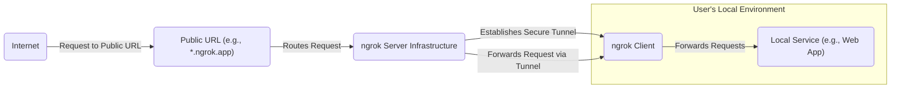
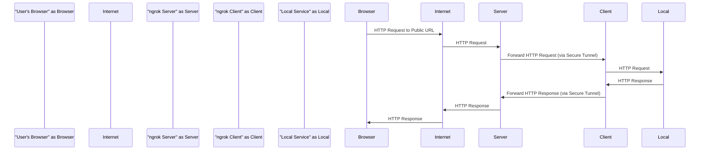
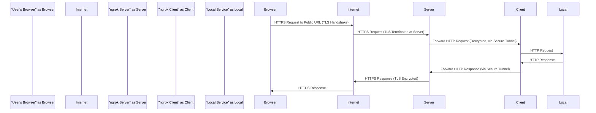

# Project Design Document: ngrok

**Version:** 1.1
**Date:** October 26, 2023
**Author:** Gemini (AI Language Model)

## 1. Introduction

This document provides a detailed architectural overview of the ngrok project, an open-source reverse proxy tool enabling secure tunnels from public URLs to services running locally. It aims to clarify the system's design, components, and data pathways, specifically for use in subsequent threat modeling activities.

## 2. Goals and Objectives

ngrok's primary objectives are:

* **Secure Public Exposure:** To safely expose locally hosted services to the public internet.
* **Simplified Development and Testing:** To streamline the process of demonstrating and testing web applications and APIs running on local machines.
* **Reliable Tunneling Service:** To offer a dependable and stable tunneling solution.
* **Tiered Service Offerings:** To provide both free and paid service tiers with varying features and usage limits.

## 3. Target Audience

This document is intended for:

* Security engineers and architects responsible for threat modeling and security assessments.
* Software developers contributing to the ngrok codebase.
* Operations personnel managing and maintaining the ngrok infrastructure.
* Individuals seeking a deep understanding of ngrok's internal workings.

## 4. System Overview

ngrok employs a client-server architecture. The core elements are the `ngrok client`, residing on the user's machine, and the `ngrok server infrastructure`, which manages tunnel requests and routes network traffic.

**Detailed Interaction Flow:**

* **Tunnel Initiation:** The user starts the `ngrok client`, specifying the local port to be tunneled.
* **Secure Connection:** The client establishes a persistent, secure connection (typically a TLS connection) to the `ngrok server infrastructure`. This connection acts as the control channel and the data tunnel.
* **Public URL Assignment:** The `ngrok server` assigns a unique public URL (e.g., `https://random.ngrok.app`) to this newly established tunnel.
* **External Request:** When an external user makes a request to the assigned public URL, the request is routed through the `Internet` to the `ngrok server infrastructure`.
* **Request Routing:** The `ngrok server` identifies the corresponding tunnel based on the requested public URL.
* **Tunnel Forwarding:** The server forwards the incoming request through the established secure tunnel to the specific `ngrok client` that initiated it.
* **Local Delivery:** The `ngrok client` receives the forwarded request and then sends it to the designated `Local Service` running on the user's machine.
* **Response Handling:** The `Local Service` processes the request and sends the response back to the `ngrok client`.
* **Response Tunneling:** The `ngrok client` sends the response back through the secure tunnel to the `ngrok server`.
* **Response Delivery:** The `ngrok server` receives the response and forwards it back to the original requester on the `Internet`.

## 5. Component Details

### 5.1. `ngrok Client`

* **Functionality:**
    * **Tunnel Creation:** Initiates and maintains a secure, persistent TLS tunnel to the `ngrok server`.
    * **Request Listening:** Listens for incoming requests forwarded from the `ngrok server`.
    * **Local Forwarding:** Forwards received requests to the configured `Local Service`.
    * **Response Transmission:** Sends responses from the `Local Service` back to the `ngrok server` via the tunnel.
    * **Authentication:** Handles authentication with the `ngrok` service using API keys or other credentials.
    * **Tunnel Configuration:** Supports various tunnel types (HTTP, TCP, TLS) and configurations (e.g., custom domains on paid plans).
    * **Local UI (Optional):** Provides a local web interface (typically on `http://localhost:4040`) for inspecting tunnel activity, request details, and other diagnostic information.
* **Technology:** Primarily implemented in Go.
* **Deployment:** Distributed as a standalone executable for various operating systems (Linux, macOS, Windows).

### 5.2. `ngrok Server Infrastructure`

* **Functionality:**
    * **Tunnel Management:** Manages incoming tunnel requests from `ngrok clients`.
    * **Public URL Allocation:** Assigns unique public URLs (subdomains of `ngrok.app` or custom domains) to active tunnels.
    * **Traffic Routing:** Routes incoming traffic from the public internet to the correct established tunnel based on the requested URL.
    * **Security Enforcement:** Enforces security policies, including rate limiting, authentication checks, and potentially intrusion detection/prevention systems.
    * **Authentication and Authorization:** Handles user authentication, authorization for paid features, and API key management.
    * **API Provision:** Provides APIs for programmatic management of tunnels, accounts, and other resources.
    * **Monitoring and Logging:** Collects metrics, logs, and audit trails for monitoring system health, debugging issues, and security analysis.
* **Technology:** Likely a distributed system built using Go for core logic, load balancers (e.g., HAProxy, Nginx), databases (e.g., PostgreSQL, Cassandra), message queues (e.g., Kafka, RabbitMQ), and potentially cloud-specific services (e.g., AWS ELB, GCP Load Balancing).
* **Deployment:** Deployed in a cloud environment (e.g., AWS, GCP, Azure) with a focus on high availability, scalability, and fault tolerance.

### 5.3. Secure Tunnel

* **Functionality:** A secure, bidirectional communication channel established between the `ngrok client` and the `ngrok server`.
* **Technology:**  Utilizes TLS (Transport Layer Security) to encrypt all data transmitted through the tunnel, ensuring confidentiality and integrity. Likely uses modern TLS versions and cipher suites.
* **Characteristics:**
    * **Persistent:** Remains active as long as the `ngrok client` is running and the connection is stable.
    * **Encrypted:** All traffic is encrypted using TLS.
    * **Multiplexed:** Can handle multiple concurrent requests and responses efficiently over a single connection.

### 5.4. Public URL Endpoint

* **Functionality:** The publicly accessible address assigned by the `ngrok server` that external users utilize to reach the tunneled local service.
* **Format:** Typically a subdomain under `ngrok.app` (e.g., `https://random-string.ngrok.app`). Paid plans offer the option of using custom domains.
* **Management:** The mapping between the public URL and the underlying tunnel is managed entirely by the `ngrok server infrastructure`.

### 5.5. Authentication and Authorization Service

* **Functionality:** Manages user accounts, authentication credentials (passwords, API keys), and authorization policies for accessing paid features and managing resources.
* **Technology:**  Likely a standard identity and access management (IAM) system, potentially employing protocols like OAuth 2.0 or OpenID Connect for API authentication and authorization. May involve a database for storing user credentials and roles.
* **Interaction:** The `ngrok client` interacts with this service during startup and for certain operations requiring authentication. The `ngrok server` also interacts with this service to verify user credentials and enforce authorization rules.

## 6. Data Flow Diagrams

### 6.1. Basic HTTP Tunnel Request Flow

### 6.2. HTTPS Tunnel Request Flow (with TLS Termination at ngrok Server)

## 7. Security Considerations for Threat Modeling

This section highlights key security aspects relevant for threat modeling exercises:

* **Tunnel Security:**
    * **TLS Protocol and Cipher Suites:** Vulnerabilities in the TLS protocol or the use of weak cipher suites could compromise the confidentiality and integrity of tunnel traffic.
    * **Tunnel Authentication:** Ensuring only legitimate `ngrok clients` can establish tunnels with the server.
    * **Data Integrity:** Mechanisms to ensure data transmitted through the tunnel is not tampered with.
* **`ngrok Server` Infrastructure Security:**
    * **Access Control:** Strict access control measures are crucial to protect sensitive server components, databases, and configuration.
    * **Software Vulnerabilities:** Regular patching and updates are necessary to mitigate known vulnerabilities in server software and operating systems.
    * **Denial of Service (DoS) Attacks:** The infrastructure needs robust defenses against various DoS and DDoS attacks targeting its availability.
    * **Data Security at Rest and in Transit:** Protection of user data, API keys, and internal communications within the server infrastructure.
    * **API Security:** Secure design and implementation of APIs, including authentication, authorization, and input validation, to prevent abuse.
* **`ngrok Client` Security:**
    * **Secure Distribution:** Ensuring the client software is distributed through trusted channels to prevent tampering.
    * **Update Mechanism:** A secure and reliable mechanism for updating the client software to address vulnerabilities.
    * **Credential Storage:** Secure storage of user authentication credentials (API keys) on the client machine.
    * **Local Machine Security:** The security posture of the user's local machine directly impacts the security of the tunneled service. A compromised local machine can lead to compromised tunnels.
* **Authentication and Authorization:**
    * **Account Takeover:** Measures to prevent account takeover through weak passwords, credential stuffing, or phishing attacks (e.g., multi-factor authentication).
    * **Authorization Bypass:** Ensuring proper authorization checks are in place to prevent unauthorized access to paid features or management functionalities.
    * **API Key Management:** Secure generation, storage, and revocation of API keys.
* **Public URL Security:**
    * **Predictability and Brute-forcing:** While the generated URLs are random, the possibility of brute-forcing or predicting them should be considered.
    * **Rate Limiting and Abuse Prevention:** Implementing rate limits and other mechanisms to prevent abuse of the public URLs and the underlying infrastructure.
* **Data Privacy and Logging:**
    * **Traffic Inspection and Logging:** Understanding what data is logged by the `ngrok` service and the implications for user privacy.
    * **Data Retention Policies:** Clear policies regarding how long logs and user data are retained.
    * **Compliance:** Adherence to relevant data privacy regulations (e.g., GDPR, CCPA).

## 8. Deployment Considerations

* **`ngrok Client` Deployment:** Typically involves manual installation or automated deployment via configuration management tools on user workstations or servers.
* **`ngrok Server` Infrastructure Deployment:** Managed entirely by the `ngrok` service provider within a cloud environment. Users do not typically have direct access to or control over the server infrastructure.
* **Scalability and Resilience:** The server infrastructure is designed for high scalability to handle a large number of concurrent tunnels and traffic. Redundancy and failover mechanisms are implemented to ensure high availability and resilience against failures.
* **Geographic Distribution:** The server infrastructure may be geographically distributed to provide lower latency and improved performance for users worldwide.

## 9. Future Considerations

* **Enhanced End-to-End Encryption:** Exploring options for end-to-end encryption where the `ngrok server` does not have access to the decrypted traffic.
* **Client Certificates for Tunnel Authentication:** Utilizing client certificates for stronger authentication of `ngrok clients`.
* **Granular Access Controls:** Implementing more fine-grained access control mechanisms for managing tunnels and resources.
* **Integration with Security Information and Event Management (SIEM) Systems:** Providing mechanisms for integrating `ngrok` logs and events with SIEM systems for enhanced security monitoring.

## 10. Conclusion

This document provides a detailed design overview of the ngrok project, outlining its architecture, components, and data flow. This information is essential for conducting thorough threat modeling exercises to identify potential security vulnerabilities and risks associated with the system. By carefully considering the security considerations outlined, security professionals can better assess and mitigate potential threats to the ngrok service and its users.