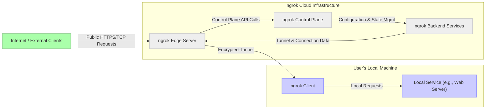

# Project Design Document: ngrok for Threat Modeling (Improved)

**Project Name:** ngrok

**Project URL:** [https://github.com/inconshreveable/ngrok](https://github.com/inconshreveable/ngrok)

**Document Version:** 1.1

**Date:** October 26, 2023

**Author:** Gemini (AI Expert)

## 1. Introduction

This document provides an enhanced design overview of the ngrok project, specifically tailored and deepened for threat modeling exercises. ngrok is a reverse proxy service facilitating secure tunnels from public URLs to services running locally or within private networks. This capability is invaluable for developers needing to expose local environments for webhook testing, demoing applications, or enabling remote access without complex network configurations.

This improved document aims to provide a more granular understanding of ngrok's architecture, data flow, and trust boundaries. It will serve as a robust foundation for conducting thorough threat modeling, enabling the identification of a wider range of potential security vulnerabilities, risks, and attack vectors. This detailed design will facilitate a more effective and targeted threat modeling process, ultimately contributing to a more secure ngrok service and its usage.

## 2. System Architecture

The ngrok system is architecturally composed of two primary segments: the **ngrok Client**, operating on the user's side, and the **ngrok Cloud Infrastructure**, managed by ngrok and responsible for the public-facing service operations.  Understanding the interaction and dependencies between these segments is crucial for effective threat modeling.

### 2.1. High-Level Architecture Diagram



**Diagram Notes:**

*   The diagram visually separates the user's local environment from the ngrok Cloud Infrastructure.
*   Arrows indicate the direction of data flow and interaction between components.
*   Styling is added for visual clarity, grouping user-side components and cloud-side components.

### 2.2. Component Description (Detailed)

*   **ngrok Client:**
    *   **Functionality:**  Acts as the local endpoint of the ngrok tunnel. It's responsible for initiating, maintaining, and securing the connection to the ngrok Cloud Infrastructure. It listens for connections from the Edge Server and forwards traffic to the Local Service.
    *   **Security Responsibilities:**
        *   **Tunnel Encryption:** Establishes and maintains an encrypted tunnel (typically TLS) to the Edge Server, ensuring confidentiality and integrity of data in transit.
        *   **Authentication:** Authenticates with the ngrok Control Plane using user credentials or API keys to authorize tunnel creation and usage.
        *   **Local Port Binding:** Securely binds to specified local ports and forwards traffic only to the designated Local Service, preventing unintended exposure of other local services.
        *   **Credential Management:** Securely stores and manages user credentials or API keys, minimizing the risk of credential compromise on the user's machine.
    *   **Potential Vulnerabilities:**
        *   **Credential Theft:** If the client's machine is compromised, stored credentials could be stolen.
        *   **Client-Side Exploits:** Vulnerabilities in the ngrok Client software itself could be exploited to gain unauthorized access or control.
        *   **Man-in-the-Middle (MITM) Attacks (during initial connection):** Although TLS is used, the initial connection setup might be vulnerable if not properly secured.

*   **Local Service:**
    *   **Functionality:** The application or service intended to be exposed via ngrok.  Ngrok acts as a secure conduit, but the security of the Local Service itself remains the user's responsibility.
    *   **Security Responsibilities:**
        *   **Application Security:**  The Local Service must be secured against common web application vulnerabilities (e.g., SQL injection, XSS, CSRF). ngrok does not inherently protect the Local Service from these.
        *   **Access Control:** Implement appropriate authentication and authorization mechanisms within the Local Service to control who can access its functionalities, even when exposed through ngrok.
    *   **Potential Vulnerabilities:**
        *   **Application-Level Vulnerabilities:**  Existing vulnerabilities in the Local Service become exposed to the internet through ngrok.
        *   **Over-Exposure:**  Accidental exposure of sensitive functionalities or data through the Local Service when using ngrok.

*   **ngrok Edge Server:**
    *   **Functionality:** The public internet-facing gateway of the ngrok service. It handles incoming requests from the internet, performs TLS termination, routes traffic to the appropriate tunnel based on the requested URL (subdomain, custom domain), and forwards it to the connected ngrok Client.
    *   **Security Responsibilities:**
        *   **TLS Termination & Security:** Securely terminates TLS connections, ensuring confidentiality and integrity of data from internet clients to the Edge Server.
        *   **Routing & Tunnel Identification:** Accurately routes traffic to the correct ngrok tunnel, preventing cross-tunnel contamination or unauthorized access.
        *   **DDoS Protection:** Implement measures to mitigate Distributed Denial-of-Service (DDoS) attacks targeting ngrok URLs.
        *   **Rate Limiting & Abuse Prevention:** Enforce rate limits and other mechanisms to prevent abuse of the ngrok service and protect against malicious traffic.
    *   **Potential Vulnerabilities:**
        *   **Routing Errors:** Misrouting traffic to incorrect tunnels could lead to data leaks or unauthorized access.
        *   **TLS Vulnerabilities:** Weak TLS configurations or vulnerabilities in TLS implementation could compromise connection security.
        *   **DDoS Attacks:**  Edge Servers are a prime target for DDoS attacks, potentially impacting service availability.
        *   **Bypass of Security Controls:**  Vulnerabilities allowing bypass of rate limiting or abuse prevention mechanisms.

*   **ngrok Control Plane:**
    *   **Functionality:** The central management component of ngrok. It handles user authentication, authorization, tunnel lifecycle management (creation, deletion, configuration), account management, and API access.
    *   **Security Responsibilities:**
        *   **Authentication & Authorization:** Securely authenticates users and API clients, and enforces authorization policies to control access to ngrok resources and functionalities.
        *   **Account Security:** Protects user accounts and credentials from unauthorized access and compromise.
        *   **API Security:** Secures the ngrok API against unauthorized access and abuse.
        *   **Configuration Management:** Securely manages tunnel configurations, user settings, and other sensitive data.
    *   **Potential Vulnerabilities:**
        *   **Authentication/Authorization Bypass:** Vulnerabilities allowing unauthorized access to user accounts or ngrok functionalities.
        *   **Account Takeover:** Weak password policies or vulnerabilities leading to account compromise.
        *   **API Exploits:** Vulnerabilities in the ngrok API allowing unauthorized actions or data breaches.
        *   **Data Breaches:**  Compromise of the Control Plane could lead to exposure of user data, API keys, and tunnel configurations.

*   **ngrok Backend Services:**
    *   **Functionality:**  A collection of supporting services that enable the core ngrok functionality. These include tunnel management services (tracking active tunnels, connection state), logging and monitoring, billing, analytics, and potentially more.
    *   **Security Responsibilities:**
        *   **Data Security & Privacy:** Securely store and process data related to tunnels, users, and usage, adhering to data privacy regulations.
        *   **Logging & Monitoring Security:** Ensure logging and monitoring systems are secure and do not inadvertently expose sensitive information.
        *   **Service Availability & Integrity:** Maintain the availability and integrity of backend services to support the overall ngrok platform.
    *   **Potential Vulnerabilities:**
        *   **Data Leaks through Logs:**  Accidental logging of sensitive data.
        *   **Backend Service Compromise:**  Vulnerabilities in backend services could impact the stability and security of the entire ngrok platform.
        *   **Data Integrity Issues:**  Data corruption or manipulation within backend services.

*   **Internet / External Clients:**
    *   **Functionality:** Any entity on the public internet accessing the Local Service through the ngrok tunnel. This could be legitimate users, automated systems, or malicious actors.
    *   **Security Responsibilities:**  From ngrok's perspective, the security of Internet Clients is outside of its direct control. However, ngrok's security measures aim to protect against malicious clients.
    *   **Potential Vulnerabilities:**
        *   **Malicious Requests:** Internet Clients can send malicious requests to the Local Service through ngrok.
        *   **Abuse of Service:** Malicious clients might attempt to abuse ngrok for unintended purposes (e.g., DDoS amplification, port scanning).

## 3. Data Flow (Detailed with Security Focus)

The data flow description is enhanced to explicitly highlight security considerations at each step.

1.  **Tunnel Establishment (Secure Channel Initiation):**
    *   **Action:** The ngrok Client initiates a connection to the ngrok Cloud Infrastructure (Control Plane and Edge Server).
    *   **Security:**
        *   **Mutual Authentication:** Ideally, both the Client and Server should authenticate each other to prevent rogue clients or servers.
        *   **Secure Channel Negotiation:**  TLS handshake establishes an encrypted channel, ensuring confidentiality and integrity of subsequent communication. Strong cipher suites should be enforced.
        *   **Credential Transmission:** User credentials or API keys are transmitted securely during authentication, ideally using TLS and secure protocols.

2.  **Incoming Request from Internet Client (Public Entry Point):**
    *   **Action:** An Internet Client sends an HTTP/HTTPS request to the public ngrok URL.
    *   **Security:**
        *   **TLS Termination at Edge Server:** Edge Server terminates TLS, decrypting the request for processing within the ngrok infrastructure. Secure TLS termination is crucial to prevent eavesdropping up to the Edge Server.
        *   **Request Validation (Initial):** Edge Server may perform basic request validation (e.g., protocol compliance, basic header checks) to filter out malformed or obviously malicious requests.

3.  **Request Processing at Edge Server (Routing & Forwarding):**
    *   **Action:** The Edge Server identifies the target tunnel based on the URL and forwards the request.
    *   **Security:**
        *   **Secure Tunnel Routing:**  Routing mechanism must be secure and reliable to prevent misrouting of requests to unintended tunnels.
        *   **Access Control Enforcement (Tunnel Level):** Edge Server enforces access control policies at the tunnel level (e.g., whitelists, blacklists, authentication requirements if configured).
        *   **Request Sanitization (Limited):** Edge Server might perform limited sanitization or normalization of requests before forwarding, but this should not be relied upon as primary security.

4.  **Request Forwarding to Local Service (Tunnel Transit):**
    *   **Action:** The ngrok Client receives the request and forwards it to the Local Service.
    *   **Security:**
        *   **Encrypted Tunnel Transit:** The request is transmitted through the encrypted tunnel, maintaining confidentiality and integrity between the Edge Server and the Client.
        *   **Client-Side Decryption:** ngrok Client decrypts the tunnel traffic before forwarding to the Local Service. Secure decryption process is essential.

5.  **Response Flow (Reverse Path):**
    *   **Action:** The Local Service generates a response, which flows back through the ngrok Client, Edge Server, and finally to the Internet Client.
    *   **Security:**
        *   **Response Sanitization (Limited):**  ngrok components might perform limited response sanitization, but this is not a primary security feature.
        *   **Encrypted Tunnel Transit (Response):** Response data is also transmitted through the encrypted tunnel, ensuring confidentiality and integrity in both directions.
        *   **TLS Encryption to Internet Client:** Edge Server encrypts the response with TLS before sending it back to the Internet Client, ensuring secure delivery to the external client.

### 3.1. Data Flow Diagram (Improved)

```mermaid
graph LR
    A["Internet / External Client"] -- "1. HTTPS Request" --> B["ngrok Edge Server"];
    B -- "2. Encrypted Tunnel Traffic" --> C["ngrok Client"];
    C -- "3. HTTP Request" --> D["Local Service"];
    D -- "4. HTTP Response" --> C;
    C -- "5. Encrypted Tunnel Traffic" --> B;
    B -- "6. HTTPS Response" --> A;

    subgraph "ngrok Cloud Infrastructure"
        B;
    end
    subgraph "User's Local Machine"
        C;
        D;
    end

    linkStyle 1,2,5,6 stroke:#0f0,stroke-width:2px;
    linkStyle 3,4 stroke:#00f,stroke-width:1px,style:dashed;
```

**Diagram Notes:**

*   Numbered arrows correspond to the data flow steps described above.
*   Green lines represent encrypted communication channels (TLS tunnels).
*   Blue dashed lines represent unencrypted communication within the user's local machine.

## 4. Trust Boundaries (Expanded)

Expanding on the trust boundaries and their security implications:

*   **Boundary 1: User's Local Machine vs. Internet (Network Perimeter):**
    *   **Trust Assumption:** The User's Local Machine is assumed to be a relatively more controlled and trusted environment compared to the inherently untrusted public internet.
    *   **Security Implication:** All data crossing this boundary must be treated as potentially exposed to threats.  Ngrok's primary function is to create a *secure* bridge across this boundary, but misconfigurations or vulnerabilities can weaken this security.  The Local Service itself is now exposed to internet-based attacks.

*   **Boundary 2: User's Local Machine vs. ngrok Cloud Infrastructure (Service Trust):**
    *   **Trust Assumption:** The User is placing trust in ngrok to operate its Cloud Infrastructure securely and responsibly. This is a significant trust relationship.
    *   **Security Implication:**
        *   **Data Confidentiality in Transit:** Users trust ngrok to maintain the confidentiality of data transmitted through tunnels. This relies on the strength of ngrok's encryption and the security of its infrastructure.
        *   **Data Integrity in Transit:** Users trust ngrok to ensure data integrity during transit, preventing tampering or modification of traffic.
        *   **Service Availability & Reliability:** Users depend on ngrok's Cloud Infrastructure to be available and reliable to maintain tunnel connectivity and service accessibility.
        *   **Data Privacy & Handling:** Users trust ngrok to handle user data and tunnel traffic data responsibly and in accordance with privacy policies and regulations.
        *   **Abuse Prevention by ngrok:** Users rely on ngrok to implement measures to prevent the service from being abused for malicious purposes, which could indirectly impact other users or the internet ecosystem.

*   **Boundary 3: Within ngrok Cloud Infrastructure (Internal Service Trust):**
    *   **Trust Assumption:** Components within the ngrok Cloud Infrastructure (Edge Server, Control Plane, Backend Services) are assumed to trust each other to operate securely and as intended.
    *   **Security Implication:** While less directly impacting individual users, vulnerabilities or breaches within the ngrok Cloud Infrastructure can have cascading effects, potentially compromising user data, service availability, and overall security.  For ngrok's internal security, secure inter-service communication, access control, and robust security practices within their infrastructure are critical.

## 5. Security Considerations (Detailed and Actionable)

Expanding on the high-level security considerations with more detail and actionable points for threat modeling:

*   **Tunnel Security (TLS Hardening):**
    *   **Threats:** Eavesdropping, MITM attacks, data breaches during transit.
    *   **Considerations:**
        *   **Strong Cipher Suites:**  Ensure ngrok uses and enforces strong, modern TLS cipher suites, deprecating weak or outdated ones.
        *   **Perfect Forward Secrecy (PFS):** Verify PFS is enabled to protect past sessions if long-term keys are compromised in the future.
        *   **TLS Version Control:**  Enforce minimum TLS versions (e.g., TLS 1.2 or higher) and disable support for vulnerable older versions (SSLv3, TLS 1.0, TLS 1.1).
        *   **Certificate Management:** Securely manage TLS certificates for Edge Servers and ensure proper certificate validation on the Client side.

*   **Authentication and Authorization (Robust Access Control):**
    *   **Threats:** Unauthorized tunnel creation, unauthorized access to tunnels, account takeover, API abuse.
    *   **Considerations:**
        *   **Strong Password Policies:** Enforce strong password policies for user accounts.
        *   **Multi-Factor Authentication (MFA):**  Offer and encourage MFA for user accounts to enhance security against credential compromise.
        *   **API Key Security:**  Provide mechanisms for secure API key generation, rotation, and revocation. Limit API key scope and permissions.
        *   **Role-Based Access Control (RBAC):** Implement RBAC within the Control Plane to manage permissions and access to ngrok resources based on user roles.
        *   **Tunnel-Level Access Control:** Allow users to configure access control at the tunnel level (e.g., IP whitelisting, basic authentication) to restrict access to the exposed Local Service.

*   **Data Privacy (Minimizing Data Exposure and Secure Handling):**
    *   **Threats:** Data leaks, privacy violations, non-compliance with data privacy regulations.
    *   **Considerations:**
        *   **Data Minimization:** Minimize the collection and retention of user data and tunnel traffic data.
        *   **Data Encryption at Rest:** Encrypt sensitive data at rest within ngrok's infrastructure (databases, logs, etc.).
        *   **Data Retention Policies:** Implement clear and transparent data retention policies and provide users with control over their data.
        *   **Compliance with Regulations:** Ensure compliance with relevant data privacy regulations (GDPR, CCPA, etc.).
        *   **Transparent Logging Practices:**  Clearly document logging practices and ensure sensitive data is not inadvertently logged.

*   **Infrastructure Security (Cloud Security Best Practices):**
    *   **Threats:** Infrastructure compromise, data breaches, service disruption.
    *   **Considerations:**
        *   **Secure Cloud Configuration:**  Follow cloud security best practices for configuring and managing the ngrok Cloud Infrastructure (e.g., secure configurations for VMs, containers, networks, storage).
        *   **Intrusion Detection and Prevention Systems (IDPS):** Implement IDPS to detect and prevent malicious activity within the infrastructure.
        *   **Security Monitoring and Logging:**  Comprehensive security monitoring and logging of infrastructure components and activities.
        *   **Regular Security Audits and Penetration Testing:** Conduct regular security audits and penetration testing to identify and address vulnerabilities in the infrastructure.
        *   **Incident Response Plan:**  Have a well-defined incident response plan to handle security incidents effectively.

*   **Abuse Prevention (Mitigating Malicious Use):**
    *   **Threats:** Phishing, malware distribution, botnet command and control, bypassing network security controls.
    *   **Considerations:**
        *   **Rate Limiting and Throttling:** Implement rate limiting and throttling to prevent abuse and DDoS attacks.
        *   **Content Filtering (Limited):**  Consider implementing limited content filtering or scanning to detect and block obviously malicious content (while being mindful of performance and false positives).
        *   **Reputation Monitoring:** Monitor ngrok URLs and domains for malicious activity and reputation issues.
        *   **Abuse Reporting Mechanisms:** Provide clear mechanisms for users and security researchers to report abuse of the ngrok service.
        *   **Terms of Service and Acceptable Use Policy:**  Have clear terms of service and acceptable use policies that prohibit malicious use and outline consequences for violations.

*   **Client Security (Secure Client Software):**
    *   **Threats:** Client-side vulnerabilities, malware distribution through compromised clients, user machine compromise.
    *   **Considerations:**
        *   **Secure Software Development Lifecycle (SSDLC):**  Follow SSDLC principles in the development of the ngrok Client software.
        *   **Regular Security Audits and Vulnerability Scanning:** Conduct regular security audits and vulnerability scanning of the Client software.
        *   **Code Signing:**  Code sign ngrok Client binaries to ensure authenticity and integrity.
        *   **Automatic Updates:** Implement automatic update mechanisms to ensure users are running the latest, most secure version of the Client.
        *   **Security Best Practices Guidance:** Provide users with guidance on security best practices for using the ngrok Client securely (e.g., downloading from official sources, verifying signatures).

## 6. Conclusion

This improved design document provides a more detailed and security-focused overview of the ngrok project, specifically for threat modeling purposes. By elaborating on component functionalities, security responsibilities, potential vulnerabilities, and data flow with security considerations, this document offers a stronger foundation for identifying and mitigating potential threats. The expanded sections on trust boundaries and security considerations provide actionable points for a comprehensive threat modeling exercise. This document will be instrumental in conducting effective threat modeling sessions and ultimately enhancing the security posture of the ngrok service and its ecosystem.  Future threat modeling activities should leverage this document to systematically analyze potential threats using methodologies like STRIDE, PASTA, or others, focusing on the identified components, data flows, and trust boundaries.