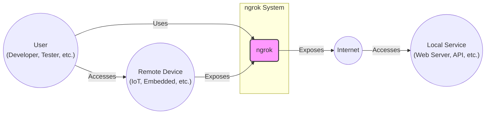
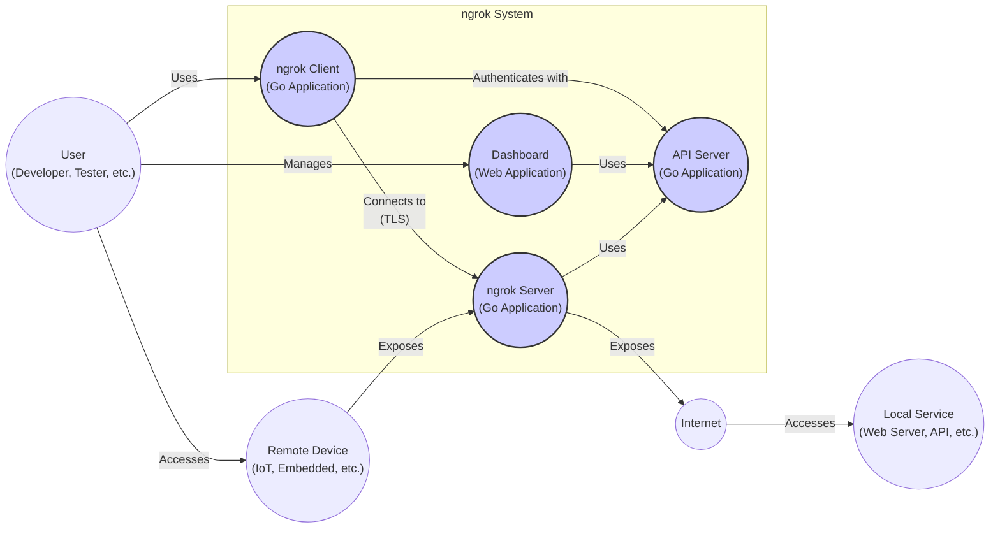
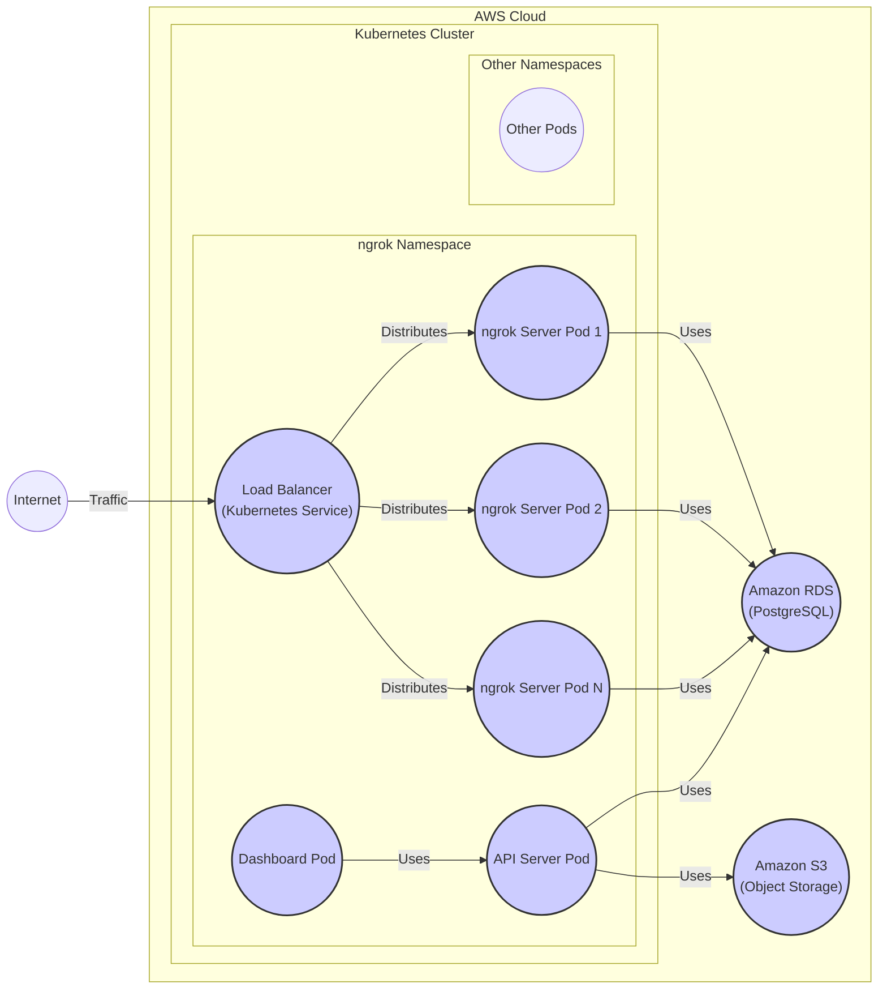
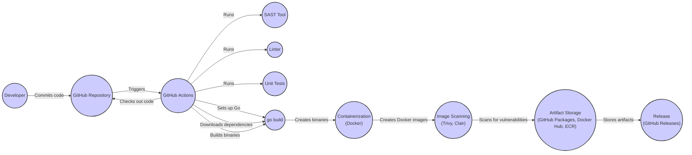

Okay, let's create a design document for ngrok based on the provided GitHub repository.

# BUSINESS POSTURE

Ngrok is a mature, widely-used product.  The primary business goal is to provide a reliable and secure way for developers and organizations to expose local services to the internet.  This includes use cases like testing webhooks, demonstrating software without deployment, remote access to devices, and building networked applications.  Maintaining a strong reputation for security and reliability is paramount, as ngrok is often used in production environments and handles potentially sensitive traffic.

Business Priorities:

*   Reliability and Uptime:  Ngrok must be highly available and resilient to failures. Downtime directly impacts users' ability to work and can damage ngrok's reputation.
*   Security:  Protecting user data and preventing unauthorized access to exposed services is critical.  A security breach could have severe consequences for both ngrok and its users.
*   Ease of Use:  Ngrok's value proposition is its simplicity.  The user experience must remain straightforward, even as new features are added.
*   Scalability:  The service must be able to handle a large and growing number of concurrent users and tunnels.
*   Performance:  Tunnels should have low latency and high throughput to provide a good user experience.

Most Important Business Risks:

*   Service Disruption:  Outages or performance degradation impacting a large number of users.
*   Data Breach:  Unauthorized access to user data or exposed services.
*   Abuse of Service:  Malicious actors using ngrok for phishing, malware distribution, or other illegal activities.
*   Reputational Damage:  Negative publicity resulting from security incidents, service disruptions, or poor customer support.
*   Competition:  Emergence of competing services that offer better features, performance, or pricing.

# SECURITY POSTURE

Existing Security Controls (based on the repository and general knowledge of ngrok):

*   security control: TLS Encryption:  All traffic between the ngrok client and server, and optionally between the ngrok server and the public internet, is encrypted using TLS. (Implemented in client and server software, documented in ngrok documentation).
*   security control: Authentication:  Users authenticate with ngrok using accounts and API keys. (Implemented in client and server software, documented in ngrok documentation).
*   security control: Tunnel Authentication:  Ngrok supports various methods for authenticating incoming requests to tunnels, including basic auth, OAuth, and webhooks. (Implemented in server software, configurable by users).
*   security control: Access Control:  Ngrok provides features for restricting access to tunnels based on IP address or other criteria. (Implemented in server software, configurable by users).
*   security control: Input Validation: Ngrok server and client validate input to prevent attacks. (Implemented in client and server software).
*   security control: Regular Security Audits: Ngrok likely undergoes regular security audits and penetration testing. (Assumed based on industry best practices).
*   security control: Secure Coding Practices: The development team likely follows secure coding practices to minimize vulnerabilities. (Assumed based on industry best practices).
*   security control: Dependency Management: The project uses Go modules, which helps manage dependencies and track vulnerabilities. (Visible in go.mod and go.sum files).
*   security control: Automated testing: The repository contains automated tests. (Visible in test files).

Accepted Risks:

*   accepted risk: User Misconfiguration:  Users may misconfigure their tunnels or exposed services, leading to security vulnerabilities. Ngrok provides documentation and tools to help users configure their services securely, but ultimately the responsibility lies with the user.
*   accepted risk: Zero-Day Exploits:  Like all software, ngrok is potentially vulnerable to zero-day exploits.  Ngrok likely has a process for rapidly patching and deploying fixes for newly discovered vulnerabilities.
*   accepted risk: DDoS Attacks: Ngrok's infrastructure is potentially vulnerable to DDoS attacks. Ngrok likely employs DDoS mitigation techniques, but a sufficiently large attack could still cause service disruption.

Recommended Security Controls:

*   Implement comprehensive logging and monitoring to detect and respond to security incidents.
*   Offer two-factor authentication (2FA) for user accounts.
*   Provide more granular access control options for tunnels.
*   Implement rate limiting to prevent abuse of the service.
*   Regularly conduct static and dynamic code analysis to identify and fix vulnerabilities.
*   Implement a bug bounty program to incentivize security researchers to report vulnerabilities.

Security Requirements:

*   Authentication:
    *   All users must be authenticated before accessing ngrok services.
    *   API keys should be used for programmatic access.
    *   Support for strong password policies.
    *   Consider offering two-factor authentication (2FA).

*   Authorization:
    *   Access to tunnels should be controlled based on user roles and permissions.
    *   Implement fine-grained access control lists (ACLs) for managing tunnel access.

*   Input Validation:
    *   All input from clients and the public internet must be validated to prevent injection attacks.
    *   Implement strict validation rules for tunnel names, hostnames, and other parameters.

*   Cryptography:
    *   Use strong, up-to-date TLS configurations for all encrypted communication.
    *   Securely store sensitive data, such as API keys and user credentials.
    *   Use cryptographically secure random number generators.

# DESIGN

## C4 CONTEXT

C4 Context Element List:

*   Element: User
    *   Name: User
    *   Type: Person
    *   Description: A developer, tester, or other individual who uses ngrok to expose local services or access remote devices.
    *   Responsibilities: Configures and runs the ngrok client, manages tunnels, and accesses exposed services.
    *   Security Controls: Authentication (account, API key), tunnel authentication (basic auth, OAuth, etc.).

*   Element: ngrok
    *   Name: ngrok
    *   Type: Software System
    *   Description: The ngrok system, including the client software, server infrastructure, and control plane.
    *   Responsibilities: Provides a secure and reliable way to expose local services to the internet, manages tunnels, and handles authentication and authorization.
    *   Security Controls: TLS encryption, authentication, access control, input validation, rate limiting.

*   Element: Internet
    *   Name: Internet
    *   Type: External Entity
    *   Description: The public internet.
    *   Responsibilities: Provides connectivity between ngrok users and exposed services.
    *   Security Controls: None (assumed to be untrusted).

*   Element: Local Service
    *   Name: Local Service
    *   Type: Software System
    *   Description: A web server, API, or other service running on the user's local machine or network.
    *   Responsibilities: Provides the service that the user wants to expose.
    *   Security Controls: Depends on the specific service (user's responsibility).

*   Element: Remote Device
    *   Name: Remote Device
    *   Type: Device
    *   Description: An IoT device, embedded system, or other device that the user wants to access remotely.
    *   Responsibilities: Runs a service that can be accessed via ngrok.
    *   Security Controls: Depends on the specific device (user's responsibility).

## C4 CONTAINER

C4 Container Element List:

*   Element: ngrok Client
    *   Name: ngrok Client
    *   Type: Application (Go)
    *   Description: The ngrok client software, which runs on the user's machine and establishes a secure tunnel to the ngrok server.
    *   Responsibilities: Establishes and maintains the tunnel, handles authentication, forwards traffic between the local service and the ngrok server.
    *   Security Controls: TLS encryption, authentication (with API server), input validation.

*   Element: ngrok Server
    *   Name: ngrok Server
    *   Type: Application (Go)
    *   Description: The ngrok server software, which runs on ngrok's infrastructure and acts as a reverse proxy for exposed services.
    *   Responsibilities: Accepts connections from ngrok clients, routes traffic to the appropriate tunnels, enforces access control policies.
    *   Security Controls: TLS encryption, authentication (with API server), access control, input validation, rate limiting.

*   Element: API Server
    *   Name: API Server
    *   Type: Application (Go)
    *   Description: Provides an API for managing ngrok accounts, tunnels, and other resources.
    *   Responsibilities: Handles authentication and authorization, manages user data, provides programmatic access to ngrok features.
    *   Security Controls: TLS encryption, authentication, authorization, input validation, rate limiting.

*   Element: Dashboard
    *   Name: Dashboard
    *   Type: Web Application
    *   Description: A web-based interface for managing ngrok accounts, tunnels, and other resources.
    *   Responsibilities: Provides a user-friendly way to interact with the ngrok API.
    *   Security Controls: TLS encryption, authentication (via API server), input validation.

*   Element: User
    *   Name: User
    *   Type: Person
    *   Description: A developer, tester, or other individual who uses ngrok.
    *   Responsibilities: Configures and runs the ngrok client, manages tunnels, and accesses exposed services.
    *   Security Controls: Authentication (account, API key), tunnel authentication (basic auth, OAuth, etc.).

*   Element: Internet
    *   Name: Internet
    *   Type: External Entity
    *   Description: The public internet.
    *   Responsibilities: Provides connectivity between ngrok users and exposed services.
    *   Security Controls: None (assumed to be untrusted).

*   Element: Local Service
    *   Name: Local Service
    *   Type: Software System
    *   Description: A web server, API, or other service running on the user's local machine or network.
    *   Responsibilities: Provides the service that the user wants to expose.
    *   Security Controls: Depends on the specific service (user's responsibility).

*   Element: Remote Device
    *   Name: Remote Device
    *   Type: Device
    *   Description: An IoT device, embedded system, or other device that the user wants to access remotely.
    *   Responsibilities: Runs a service that can be accessed via ngrok.
    *   Security Controls: Depends on the specific device (user's responsibility).

## DEPLOYMENT

Possible Deployment Solutions:

1.  **Cloud Provider (AWS, GCP, Azure, etc.):**  Deploying ngrok server infrastructure on a major cloud provider offers scalability, reliability, and a wide range of managed services.
2.  **Kubernetes:**  Deploying ngrok as a set of containers within a Kubernetes cluster provides flexibility, scalability, and self-healing capabilities.
3.  **Bare Metal:**  Deploying ngrok on dedicated physical servers offers maximum control over the infrastructure, but requires more manual management.

Chosen Solution (for detailed description):  **Kubernetes on AWS**

Deployment Element List:

*   Element: AWS Cloud
    *   Name: AWS Cloud
    *   Type: Cloud Provider
    *   Description: Amazon Web Services, providing the infrastructure for hosting ngrok.
    *   Responsibilities: Provides compute, storage, networking, and other services.
    *   Security Controls: AWS security features (IAM, VPC, security groups, etc.).

*   Element: Kubernetes Cluster
    *   Name: Kubernetes Cluster
    *   Type: Container Orchestration Platform
    *   Description: A Kubernetes cluster running on AWS, managing the ngrok containers.
    *   Responsibilities: Orchestrates the deployment, scaling, and management of ngrok containers.
    *   Security Controls: Kubernetes security features (RBAC, network policies, pod security policies, etc.).

*   Element: ngrok Namespace
    *   Name: ngrok Namespace
    *   Type: Kubernetes Namespace
    *   Description: A logical grouping of ngrok resources within the Kubernetes cluster.
    *   Responsibilities: Isolates ngrok resources from other applications running in the cluster.
    *   Security Controls: Kubernetes namespace-level security policies.

*   Element: Server Pod (1, 2, N)
    *   Name: Server Pod (1, 2, N)
    *   Type: Kubernetes Pod
    *   Description: Instances of the ngrok server container, running within the Kubernetes cluster.
    *   Responsibilities: Handles incoming connections from ngrok clients and routes traffic to the appropriate tunnels.
    *   Security Controls: Container-level security measures, network policies.

*   Element: API Pod
    *   Name: API Pod
    *   Type: Kubernetes Pod
    *   Description: An instance of the ngrok API server container.
    *   Responsibilities: Handles API requests for managing ngrok accounts and tunnels.
    *   Security Controls: Container-level security measures, network policies.

*   Element: Dashboard Pod
    *   Name: Dashboard Pod
    *   Type: Kubernetes Pod
    *   Description: An instance of the ngrok dashboard container.
    *   Responsibilities: Provides a web-based interface for managing ngrok.
    *   Security Controls: Container-level security measures, network policies.

*   Element: Load Balancer
    *   Name: Load Balancer
    *   Type: Kubernetes Service (LoadBalancer type)
    *   Description: A Kubernetes service that distributes incoming traffic across the ngrok server pods.
    *   Responsibilities: Provides a single point of entry for ngrok clients, distributes traffic evenly across server pods.
    *   Security Controls: Kubernetes service-level security policies, AWS load balancer security features.

*   Element: Amazon RDS (PostgreSQL)
    *   Name: Amazon RDS (PostgreSQL)
    *   Type: Managed Database Service
    *   Description: A managed PostgreSQL database service provided by AWS.
    *   Responsibilities: Stores ngrok user data, tunnel information, and other persistent data.
    *   Security Controls: AWS RDS security features (encryption at rest, encryption in transit, access control).

*   Element: Amazon S3 (Object Storage)
    *   Name: Amazon S3 (Object Storage)
    *   Type: Object Storage Service
    *   Description: Object storage for logs, backups, and potentially other data.
    *   Responsibilities: Provides scalable and durable storage for ngrok data.
    *   Security Controls: AWS S3 security features (encryption at rest, encryption in transit, access control).

*   Element: Internet
    *   Name: Internet
    *   Type: External Entity
    *   Description: The public internet.
    *   Responsibilities: Provides connectivity between ngrok users and the ngrok service.
    *   Security Controls: None (assumed to be untrusted).

*   Element: Other Namespaces
    *   Name: Other Namespaces
    *   Type: Kubernetes Namespace
    *   Description: Other namespaces within the Kubernetes cluster, potentially running other applications.
    *   Responsibilities: Isolates other applications from the ngrok namespace.
    *   Security Controls: Kubernetes namespace-level security policies.

*   Element: Other Pods
    *   Name: Other Pods
    *   Type: Kubernetes Pod
    *   Description: Pods running within other namespaces.
    *   Responsibilities: Varies depending on the applications running in those pods.
    *   Security Controls: Container-level security measures, network policies.

## BUILD

The ngrok project is primarily written in Go. The repository includes a `Makefile` and references to GitHub Actions, indicating an automated build process.

Build Process:

1.  **Developer:** A developer writes code and commits it to the ngrok repository on GitHub.
2.  **GitHub Actions Trigger:** A push to the repository or a pull request triggers a GitHub Actions workflow.
3.  **Checkout Code:** The workflow checks out the code from the repository.
4.  **Setup Go:** The workflow sets up the Go environment.
5.  **Dependency Management:**  `go mod download` is likely used to download and verify project dependencies (based on `go.mod` and `go.sum`).
6.  **Static Analysis (SAST):**  A SAST tool (e.g., `go vet`, `staticcheck`, or a commercial tool) is likely run to analyze the code for potential vulnerabilities.
7.  **Linting:** A linter (e.g., `golangci-lint`) is likely run to enforce code style and identify potential errors.
8.  **Unit Tests:**  `go test` is used to run unit tests and ensure code quality.
9.  **Build:**  `go build` is used to compile the ngrok client and server binaries.
10. **Containerization (Likely):**  The binaries are likely packaged into Docker containers for deployment.
11. **Image Scanning (Likely):** A container image scanning tool (e.g., Trivy, Clair) is likely used to scan the Docker images for vulnerabilities.
12. **Artifact Storage:** The built binaries and/or Docker images are stored in a repository (e.g., GitHub Packages, Docker Hub, AWS ECR).
13. **Release (Optional):**  If the build is triggered by a tagged commit, a new release may be created on GitHub.

Security Controls in Build Process:

*   Dependency Management: Using Go modules to manage dependencies and track vulnerabilities.
*   Static Analysis (SAST): Running SAST tools to identify potential vulnerabilities in the code.
*   Linting: Using linters to enforce code style and identify potential errors.
*   Unit Tests: Running unit tests to ensure code quality and prevent regressions.
*   Containerization: Packaging the binaries into Docker containers for consistent and reproducible deployments.
*   Image Scanning: Scanning Docker images for vulnerabilities before deployment.
*   Automated Build: Using GitHub Actions to automate the build process and ensure consistency.

# RISK ASSESSMENT

Critical Business Processes to Protect:

*   Tunnel Creation and Management:  Ensuring that users can reliably create and manage tunnels.
*   Traffic Routing:  Ensuring that traffic is routed securely and efficiently between clients and exposed services.
*   Authentication and Authorization:  Protecting user accounts and preventing unauthorized access to tunnels.
*   API Availability:  Ensuring that the ngrok API is available for managing accounts and tunnels.

Data to Protect and Sensitivity:

*   User Account Data (email addresses, hashed passwords, API keys):  High sensitivity.
*   Tunnel Configuration Data (tunnel names, hostnames, authentication credentials):  High sensitivity.
*   Traffic Data (data transmitted through tunnels):  Variable sensitivity, depending on the user's application.  Potentially very high sensitivity.
*   Logs (system logs, audit logs):  Medium to high sensitivity, depending on the content.

# QUESTIONS & ASSUMPTIONS

Questions:

*   What specific SAST and image scanning tools are used in the build process?
*   What are the specific DDoS mitigation techniques employed?
*   What is the incident response plan for security incidents?
*   What is the process for handling vulnerability reports?
*   Are there any specific compliance requirements (e.g., SOC 2, GDPR) that ngrok must adhere to?
*   What is the data retention policy for user data and logs?
*   What monitoring and alerting systems are in place?
*   What is the process for managing secrets (e.g., API keys, database credentials)?
*   How is the infrastructure secured (e.g., network segmentation, firewalls)?
*   What is the disaster recovery plan?

Assumptions:

*   BUSINESS POSTURE: Assumed that maintaining a strong reputation for security and reliability is paramount.
*   SECURITY POSTURE: Assumed regular security audits, penetration testing, and secure coding practices are followed. Assumed DDoS mitigation techniques are in place.
*   DESIGN: Assumed Kubernetes on AWS is a representative deployment model. Assumed Docker containers are used for packaging and deployment. Assumed a standard CI/CD pipeline with GitHub Actions.