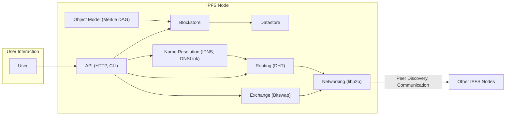
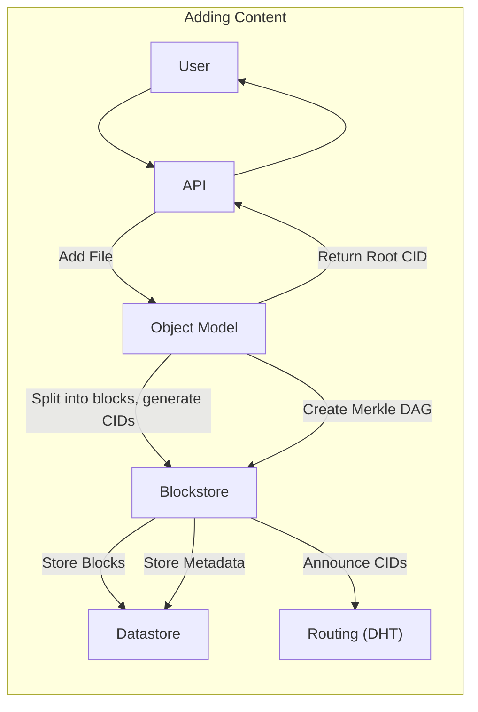
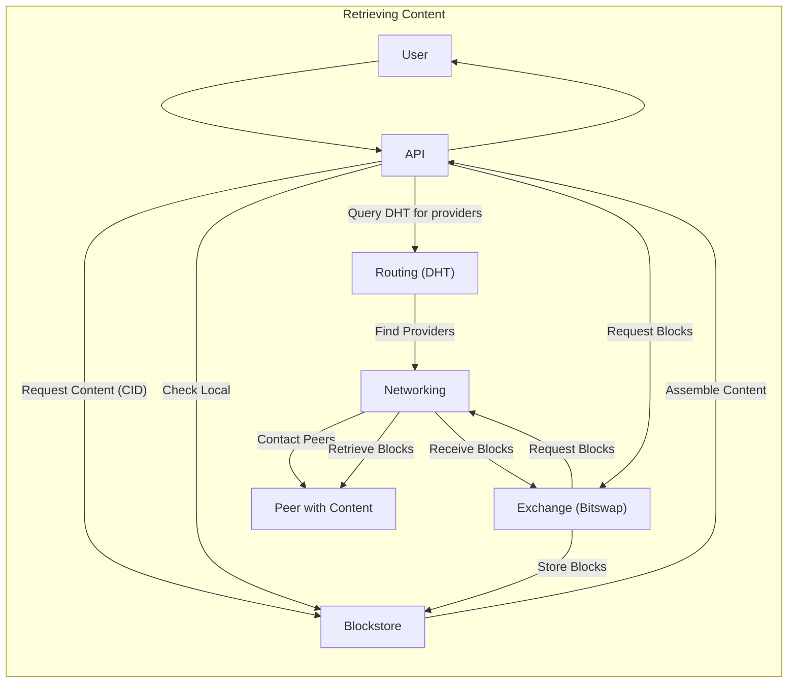

## Project Design Document: go-ipfs (Improved)

**1. Introduction**

This document provides a detailed design overview of the `go-ipfs` project, the Go implementation of the InterPlanetary File System (IPFS). IPFS is a peer-to-peer distributed file system that seeks to connect all computing devices with the same system of files. It aims to replace the traditional HTTP-based web with a content-addressed, decentralized, and permanent web. This document will serve as the foundation for subsequent threat modeling activities, providing the necessary context and details about the system's architecture and functionality.

**2. Goals and Objectives**

* **Decentralized Storage:** Enable users to store and retrieve data without reliance on single points of failure or centralized authorities. This enhances resilience and censorship resistance.
* **Content Addressing:** Identify data uniquely and immutably based on its cryptographic hash (CID - Content Identifier). This ensures data integrity and enables efficient deduplication.
* **Peer-to-Peer Networking:** Facilitate direct communication and data transfer between participating nodes in the IPFS network, reducing reliance on intermediaries.
* **Content Availability:** Increase the resilience and availability of data by distributing it across multiple nodes. If one node fails, others can still provide the content.
* **Version Control:** Support inherent versioning of files and directories through the immutable nature of the Merkle DAG data structure. Every change creates a new version identified by a unique CID.
* **Immutable Content:** Ensure that once content is added to IPFS, it cannot be altered without changing its CID. This provides a strong guarantee of data integrity.
* **Global Namespace:** Provide a unified, decentralized namespace for all content on the IPFS network, accessible through CIDs.

**3. High-Level Architecture**

The `go-ipfs` implementation consists of several interconnected components working together to achieve the project's goals. Understanding the interactions between these components is crucial for identifying potential attack surfaces.

**4. Detailed Design**

This section provides a more in-depth look at the key components within a `go-ipfs` node, highlighting their functionality and potential security considerations.

* **Networking (libp2p):**
    * **Purpose:** Provides the foundational peer-to-peer networking layer, handling connection establishment, data transport, and security.
    * **Functionality:**
        * Peer discovery: Utilizes various mechanisms (e.g., mDNS, DHT) to find other nodes on the network. *Potential threat: Malicious peers advertising false information.*
        * Connection management: Establishes and maintains connections with peers using protocols like TCP or QUIC. *Potential threat: Connection flooding attacks, man-in-the-middle attacks if encryption is not properly configured.*
        * Secure communication: Implements transport encryption (e.g., TLS) and authenticated key exchange. *Security consideration: Importance of strong cryptographic algorithms and proper key management.*
        * Protocol negotiation: Allows peers to agree on communication protocols. *Potential threat: Protocol downgrade attacks.*
        * Stream multiplexing: Enables multiple communication streams over a single connection, improving efficiency.
        * NAT traversal: Employs techniques like hole punching to establish connections through Network Address Translation. *Security consideration: Potential vulnerabilities in NAT traversal implementations.*
    * **Key Security Aspects:** Secure channel establishment, peer authentication, protection against eavesdropping and tampering.

* **Routing (DHT - Distributed Hash Table):**
    * **Purpose:**  Enables the efficient location of peers holding specific content based on its CID, without relying on a central index.
    * **Functionality:**
        * Content provider records: Nodes announce that they host specific CIDs, storing this information in the DHT. *Potential threat: Storing false provider records to redirect requests or perform denial of service.*
        * Peer routing: Finds the closest peers to a given CID based on network proximity and node IDs. *Potential threat: Routing table manipulation attacks, eclipse attacks.*
        * Data replication for redundancy:  DHT implementations often involve replicating routing information for resilience.
        * Handling node joins and leaves: The DHT adapts to changes in network membership. *Potential threat: Malicious nodes disrupting the join/leave process.*
        * Security considerations for DHT integrity and Sybil resistance: Mechanisms to prevent a single entity from controlling a large portion of the DHT. *Security consideration: Choice of DHT algorithm and its resistance to attacks.*
    * **Key Security Aspects:** Resistance to manipulation, ensuring accurate content routing, preventing denial-of-service attacks targeting the DHT.

* **Exchange (Bitswap):**
    * **Purpose:**  Manages the efficient and incentivized exchange of data blocks between peers.
    * **Functionality:**
        * Block requesting: Nodes request specific data blocks they need from peers.
        * Block providing: Nodes send requested data blocks to other peers.
        * Want lists: Nodes maintain lists of blocks they are currently requesting. *Potential threat: Malicious peers exploiting want lists to infer user interests.*
        * Have lists: Nodes advertise the blocks they possess. *Potential threat: False advertisements to lure requests or perform denial of service.*
        * Strategy for prioritizing block transfers: Algorithms to optimize data exchange.
        * Credit and debt system to incentivize sharing: Tracks data exchanged between peers to encourage participation. *Potential threat: Exploiting the credit/debt system for unfair advantage.*
    * **Key Security Aspects:** Preventing free-riding, ensuring data integrity during transfer, mitigating denial-of-service attacks on data exchange.

* **Blockstore:**
    * **Purpose:**  Persistently stores the raw data blocks that constitute files and directories in IPFS.
    * **Functionality:**
        * Adding and retrieving data blocks by their CID: Core functionality for data management.
        * Local storage management:  Handles the allocation and organization of storage space.
        * Garbage collection of unused blocks: Reclaims storage space from blocks no longer referenced. *Potential threat: Vulnerabilities in garbage collection leading to data loss or corruption.*
        * Integration with the Datastore: Uses the Datastore to track block locations and metadata.
    * **Key Security Aspects:** Ensuring data integrity at rest, protecting against unauthorized access or modification of stored blocks.

* **Datastore:**
    * **Purpose:** Provides a key-value store for metadata, configuration, and internal state information.
    * **Functionality:**
        * Storing mappings between CIDs and block locations: Essential for retrieving content.
        * Storing peer information, routing table data, and other metadata: Critical for network operation.
        * Different datastore backends (e.g., BadgerDB, LevelDB): Allows for flexibility in storage implementation. *Security consideration: Security vulnerabilities in the chosen datastore backend.*
    * **Key Security Aspects:** Protecting sensitive metadata, ensuring data integrity, preventing unauthorized access or modification.

* **Object Model (Merkle DAG - Directed Acyclic Graph):**
    * **Purpose:** Defines the structure and representation of files and directories using content addressing, ensuring immutability and verifiability.
    * **Functionality:**
        * Representing files as a DAG of data blocks:  Large files are broken into smaller blocks, linked by their CIDs.
        * Representing directories as objects linking to file and subdirectory objects: Creates a hierarchical structure.
        * Using CIDs to link objects, ensuring content integrity: Any modification to a block results in a new CID for that block and all its parent objects.
        * Enabling efficient content deduplication: Identical blocks across different files are stored only once.
    * **Key Security Aspects:** Inherent data integrity due to content addressing, verifiability of content through cryptographic hashes.

* **API (HTTP API, CLI):**
    * **Purpose:** Provides interfaces for users and applications to interact with the IPFS node, managing data and network operations.
    * **Functionality:**
        * Adding files and directories to IPFS: Initiates the process of chunking, hashing, and storing content. *Potential threat: Uploading malicious content, exceeding resource limits.*
        * Retrieving content by its CID: Triggers the process of locating and downloading data blocks.
        * Publishing and resolving IPNS names: Manages mutable pointers to immutable content. *Potential threat: IPNS record hijacking, unauthorized updates.*
        * Managing peer connections: Allows users to connect to or disconnect from specific peers.
        * Configuring node settings: Controls various aspects of the node's behavior. *Potential threat: Misconfiguration leading to security vulnerabilities.*
        * Monitoring node status: Provides information about the node's operation.
    * **Key Security Aspects:** Authentication and authorization to prevent unauthorized actions, input validation to prevent injection attacks, rate limiting to mitigate denial-of-service.

* **Name Resolution (IPNS, DNSLink):**
    * **Purpose:** Provides mechanisms for creating mutable pointers to immutable content on IPFS, allowing users to access frequently updated content without needing to remember new CIDs.
    * **Functionality:**
        * **IPNS (InterPlanetary Name System):**
            * Mapping a public key hash to a CID: Creates a mutable identifier.
            * Updating the mapping by signing new records: Allows for changing the content associated with an IPNS name. *Potential threat: Private key compromise leading to unauthorized updates.*
            * Relying on the DHT for distribution and resolution: IPNS records are stored and retrieved using the DHT. *Potential threat: Attacks on the DHT affecting IPNS resolution.*
        * **DNSLink:**
            * Using DNS TXT records to point to IPFS CIDs: Leverages the existing DNS infrastructure. *Potential threat: DNS record manipulation, DNS spoofing.*
    * **Key Security Aspects:** Secure management of private keys for IPNS, reliance on the security of the underlying DHT and DNS systems.

**5. Data Flow**

Understanding the typical data flows within `go-ipfs` helps identify potential points of interception or manipulation.

* **Adding Content:**
    1. User adds a file through the API.
    2. The API component receives the file and passes it to the Object Model.
    3. The Object Model splits the file into blocks and generates the CID for each block.
    4. The blocks are passed to the Blockstore for local storage.
    5. The Blockstore stores the blocks in the Datastore.
    6. Metadata about the file (represented as a Merkle DAG) is created by the Object Model, with CIDs linking the blocks. This metadata is also stored in the Blockstore.
    7. The root CID of the file is returned to the user via the API.
    8. The local node may announce to the Routing (DHT) component that it is a provider for the blocks associated with the file's CID.

* **Retrieving Content:**
    1. User requests content by its CID through the API.
    2. The API component checks the local Blockstore for the requested blocks.
    3. If the blocks are not found locally, the API queries the Routing (DHT) component to find peers providing the content.
    4. The Routing component returns a list of potential providers.
    5. The API instructs the Exchange (Bitswap) component to request the necessary blocks from the identified peers.
    6. The Exchange component uses the Networking (libp2p) layer to establish connections and request blocks.
    7. Peers with the content send the requested blocks back to the requesting node via the Networking layer.
    8. The Exchange component receives the blocks and stores them in the local Blockstore.
    9. Once all necessary blocks are retrieved, the API assembles the content and returns it to the user.

**6. Key Technologies**

* **Go Programming Language:** The primary implementation language, influencing security considerations related to memory safety and concurrency.
* **libp2p:** A modular networking stack providing transport, peer discovery, and security features. Security vulnerabilities in libp2p directly impact `go-ipfs`.
* **Protocol Buffers:** Used for efficient and extensible data serialization. Potential vulnerabilities related to deserialization need consideration.
* **Multiformats:** A collection of self-describing formats for various data types (e.g., CIDs, multiaddrs). Ensuring correct parsing and validation of multiformats is important.
* **Cryptographic Libraries:**  Employed for hashing (e.g., SHA-256), signing, and encryption. The strength and proper usage of these libraries are critical.
* **Various Datastore Backends:** Options for persistent storage (e.g., BadgerDB, LevelDB). Each backend has its own security characteristics and potential vulnerabilities.

**7. Security Considerations**

This section expands on the initial security considerations, providing more specific examples of potential threats and areas requiring careful attention during threat modeling.

* **Peer Identity and Authentication:**
    * **Threats:** Sybil attacks, impersonation, man-in-the-middle attacks.
    * **Considerations:** Robust peer ID generation, secure key exchange mechanisms, certificate management.
* **Data Integrity:**
    * **Threats:** Content corruption, data tampering.
    * **Considerations:** Reliance on cryptographic hashes (CIDs), verification of data integrity upon retrieval.
* **Denial of Service (DoS) Attacks:**
    * **Threats:** Flooding attacks on the API, DHT, or data exchange mechanisms.
    * **Considerations:** Rate limiting, resource management, input validation, circuit breakers.
* **Sybil Attacks:**
    * **Threats:** Malicious actors controlling a large number of nodes to influence the DHT or disrupt the network.
    * **Considerations:** Mechanisms to limit the influence of individual nodes, reputation systems (though not currently a core feature).
* **Routing Attacks:**
    * **Threats:** Manipulation of DHT routing tables to redirect requests or isolate nodes.
    * **Considerations:** Secure DHT implementations, monitoring for routing anomalies.
* **Content Poisoning:**
    * **Threats:** Injecting malicious or incorrect content into the network.
    * **Considerations:** Content verification, trust mechanisms (namespaces, verifiable builds).
* **Privacy Concerns:**
    * **Threats:** Exposure of user data or browsing history through network activity.
    * **Considerations:** Onion routing integration (e.g., Tor support), encryption of data in transit and at rest.
* **Remote Code Execution (RCE):**
    * **Threats:** Vulnerabilities in the `go-ipfs` codebase or its dependencies that could allow attackers to execute arbitrary code.
    * **Considerations:** Secure coding practices, regular security audits, dependency management.
* **API Security:**
    * **Threats:** Unauthorized access to the API, manipulation of node settings or data.
    * **Considerations:** Authentication and authorization mechanisms, secure API endpoints (HTTPS), input validation.
* **Supply Chain Security:**
    * **Threats:** Compromised dependencies or build processes leading to the introduction of malicious code.
    * **Considerations:** Verifying checksums of dependencies, using trusted build environments, software bill of materials (SBOM).

This improved design document provides a more detailed and security-focused overview of the `go-ipfs` project. It aims to equip threat modelers with the necessary information to effectively identify and analyze potential security vulnerabilities within the system.