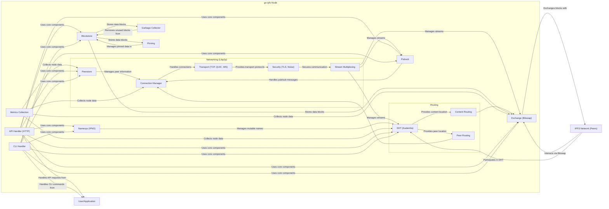
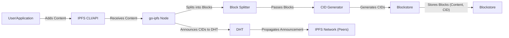
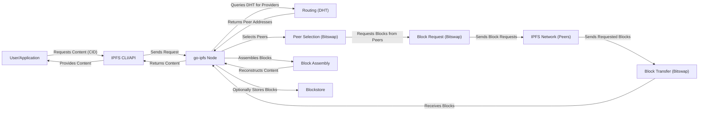
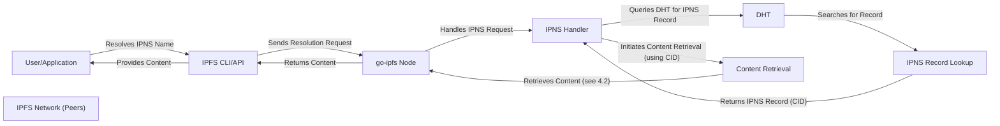

# Project Design Document: go-ipfs

**Version:** 1.1
**Date:** October 26, 2023
**Author:** AI Software Architect

## 1. Introduction

This document provides an enhanced design overview of the `go-ipfs` project, the Go implementation of the InterPlanetary File System (IPFS). IPFS is a peer-to-peer hypermedia protocol designed to make the web faster, safer, and more open. This document details the key architectural components, data flow, and security considerations of `go-ipfs`, serving as a robust foundation for subsequent threat modeling activities. This revision aims to provide more granular detail and clarity compared to the previous version.

## 2. Goals and Objectives

The primary goals of `go-ipfs` are to:

* Implement the complete IPFS protocol specification accurately and efficiently in the Go programming language.
* Provide a highly performant and stable IPFS node implementation suitable for various deployment scenarios.
* Offer comprehensive and user-friendly interfaces, including both a Command Line Interface (CLI) and an Application Programming Interface (API), for seamless interaction with the IPFS network.
* Enable truly decentralized storage and content addressing, removing reliance on centralized servers.
* Facilitate robust content distribution and sharing mechanisms without single points of failure.

## 3. System Architecture

`go-ipfs` employs a modular architecture, with distinct components interacting to provide the full functionality of an IPFS node. The following diagram provides a more detailed view of the internal architecture:

### 3.1. Core Components (Detailed)

*   **Networking (Libp2p):**
    *   **Peerstore:**  Stores information about known peers, including their addresses, protocols, and public keys.
    *   **Connection Manager:**  Establishes, maintains, and closes connections with other peers.
    *   **Transport (TCP, QUIC, WebSockets):**  Provides the underlying transport protocols for communication.
    *   **Security (TLS, Noise):**  Handles encryption and authentication of connections.
    *   **Stream Multiplexing:** Allows multiple independent streams of data to be transmitted over a single connection.
*   **Routing:**
    *   **DHT (Kademlia):** Implements a distributed hash table for peer and content discovery. Uses a Kademlia-based algorithm.
    *   **Content Routing:**  Specifically responsible for finding peers that hold specific content based on its CID.
    *   **Peer Routing:**  Responsible for finding the network addresses of other IPFS peers.
*   **Blockstore:**  The local storage layer for data blocks. Supports various backends (e.g., filesystem, BadgerDB).
*   **Exchange (Bitswap):**  The block exchange protocol. Manages requests for and delivery of data blocks between peers, employing a want-list and a ledger for tracking exchanges.
*   **Namesys (IPNS):**  Manages the mapping of mutable names to IPFS content. Relies on the DHT for record distribution and uses public-key cryptography for ownership verification.
*   **Pubsub:**  Provides a publish/subscribe messaging system, allowing peers to subscribe to topics and receive messages published to those topics.
*   **Garbage Collector:**  Identifies and removes unpinned data blocks from the Blockstore to reclaim storage space.
*   **Pinning:**  Allows users to mark specific data blocks as important, preventing them from being garbage collected. Pinsets are maintained to track pinned data.
*   **Metrics Collection:**  Gathers performance and operational data about the node, which can be used for monitoring and debugging.
*   **API Handler (HTTP):**  Listens for and processes HTTP requests to the IPFS API, exposing functionality to external applications.
*   **CLI Handler:**  Parses and executes commands entered by the user through the command-line interface.

### 3.2. External Interfaces

*   **IPFS API (HTTP):**  A RESTful API providing programmatic access to `go-ipfs` functionality. Secured by API tokens or other authentication mechanisms.
*   **IPFS CLI:**  A command-line tool (`ipfs`) for interacting with the IPFS node, allowing users to manage files, peers, and node settings.

### 3.3. Data Structures

*   **Content Identifier (CID):**  A self-describing content-addressed identifier. Includes information about the hashing algorithm and multicodec used.
*   **Directed Acyclic Graph (DAG):**  The fundamental data structure in IPFS, used to represent files and directories as interconnected blocks.
*   **Merkle Tree:**  The underlying structure of IPFS DAGs, providing content integrity and efficient verification.
*   **IPNS Record:**  A signed record stored in the DHT that maps an IPNS name (public key hash) to a CID.

## 4. Data Flow (Detailed)

This section provides a more detailed breakdown of data flow for key operations.

### 4.1. Adding Content (Detailed)

1. A user or application initiates content addition via the CLI or API.
2. The `go-ipfs` node receives the content.
3. The **Block Splitter** divides the content into smaller, fixed-size blocks (configurable).
4. The blocks are passed to the **CID Generator**.
5. The **CID Generator** creates a unique CID for each block based on its content.
6. The blocks, along with their corresponding CIDs, are stored in the local **Blockstore**.
7. The node announces the CIDs of the newly added content to the **DHT**, making it discoverable to other peers.
8. The DHT propagates this announcement throughout the IPFS network.

### 4.2. Retrieving Content (Detailed)

1. A user or application requests content by its CID.
2. The `go-ipfs` node receives the request.
3. The node queries the **DHT** to find peers providing the requested CID.
4. The DHT returns the network addresses of peers holding the content.
5. The **Peer Selection** component in Bitswap chooses suitable peers to request blocks from.
6. **Block Request** initiates requests for the necessary data blocks from the selected peers using the Bitswap protocol.
7. The requests are sent to the **IPFS Network**.
8. Peers holding the requested blocks send them back to the requesting node via **Block Transfer**.
9. The `go-ipfs` node receives the blocks.
10. The **Block Assembly** component reconstructs the original content from the received blocks.
11. The retrieved blocks can be optionally stored in the local **Blockstore** for caching.
12. The reconstructed content is returned to the user or application.

### 4.3. Name Resolution (IPNS) (Detailed)

1. A user or application requests content using an IPNS name.
2. The `go-ipfs` node receives the resolution request.
3. The **IPNS Handler** processes the request.
4. The handler queries the **DHT** to find the IPNS record associated with the given name.
5. The **DHT** searches for the relevant IPNS record.
6. The **DHT** returns the IPNS record, which contains the CID of the latest content associated with the name.
7. The **IPNS Handler** receives the CID.
8. The node then initiates **Content Retrieval** using the resolved CID (as described in section 4.2).
9. The content is retrieved.
10. The `go-ipfs` node returns the content to the user or application.

## 5. Security Considerations (Enhanced)

This section provides a more structured and detailed overview of security considerations.

*   **Identity and Access Management:**
    *   **Peer Identity:** Libp2p uses cryptographic keys (public/private key pairs) to establish peer identities.
    *   **Authentication:**  Mutual authentication using TLS or the Noise protocol ensures that communicating peers are who they claim to be.
    *   **Authorization:**  IPFS itself has limited built-in authorization. Higher-level applications built on IPFS need to implement their own authorization mechanisms. API access can be controlled via API tokens.
*   **Data Security:**
    *   **Integrity:** Content addressing (CIDs) guarantees data integrity. Any modification results in a different CID.
    *   **Confidentiality:** IPFS does not provide default encryption at rest. Encryption can be implemented at the application layer before adding data to IPFS. Transport encryption (TLS, Noise) protects data in transit.
*   **Network Security:**
    *   **Secure Communication:** Libp2p's security features (TLS, Noise) provide encrypted communication channels.
    *   **Peer Discovery Security:** Mechanisms in libp2p aim to prevent malicious peers from injecting false information into the peer discovery process.
    *   **Firewall Considerations:**  Proper firewall configuration is crucial to restrict access to the `go-ipfs` node and limit exposure to potential attacks.
*   **Denial of Service (DoS) Resilience:**
    *   **Resource Limits:** `go-ipfs` implements various resource limits (e.g., connection limits, memory limits) to mitigate resource exhaustion attacks.
    *   **Rate Limiting:**  Rate limiting can be applied to API requests and peer interactions to prevent abuse.
    *   **Bitswap Strategies:** Bitswap's credit system helps to mitigate some forms of DoS by incentivizing fair sharing.
*   **Sybil Attack Mitigation:**
    *   **Reputation Systems:** While not fully implemented in core `go-ipfs`, research and development are ongoing for reputation systems to identify and penalize malicious peers.
    *   **Peer Scoring:** Libp2p includes peer scoring mechanisms that can be used to prioritize connections with trusted peers.
*   **Content Poisoning Prevention:**
    *   **CID Verification:**  Users can verify the integrity of content by checking its CID.
    *   **Trust Models:**  Higher-level applications need to implement trust models to determine the trustworthiness of content sources.
*   **Key Management Security:**
    *   **Secure Key Generation and Storage:**  Private keys used for IPNS and peer identity must be securely generated and stored.
    *   **Key Rotation:**  Mechanisms for key rotation are important for long-term security.
*   **Supply Chain Security:**
    *   **Dependency Management:**  Regularly auditing and updating dependencies is crucial to mitigate vulnerabilities in external libraries. Using tools like `go mod tidy` helps manage dependencies.
    *   **Binary Verification:**  Verifying the integrity of `go-ipfs` binaries before deployment is recommended.
*   **API and CLI Security:**
    *   **Authentication and Authorization:**  The HTTP API should be protected with strong authentication and authorization mechanisms.
    *   **Input Validation:**  Proper input validation is necessary to prevent injection attacks.
    *   **Secure Defaults:**  Using secure default configurations is important.

## 6. Deployment (Expanded)

`go-ipfs` offers flexible deployment options, each with its own security implications:

*   **Desktop/Laptop:**
    *   **Security Considerations:**  Focus on securing the local machine, as the `go-ipfs` node's security is tied to the host's security. Consider firewall rules and protecting the IPFS repository.
*   **Server (Dedicated or VPS):**
    *   **Security Considerations:**  Implement standard server hardening practices, including strong passwords, regular security updates, and firewall configuration. Secure the API and consider using a reverse proxy.
*   **Cloud Environments (AWS, Azure, GCP):**
    *   **Security Considerations:**  Leverage cloud provider security features like security groups, network ACLs, and IAM roles. Secure storage for the IPFS repository. Consider using managed IPFS services if available.
*   **Containerized Environments (Docker, Kubernetes):**
    *   **Security Considerations:**  Follow container security best practices, including using minimal base images, scanning images for vulnerabilities, and implementing network policies. Secure the container orchestration platform.
*   **Embedded Devices/IoT:**
    *   **Security Considerations:**  Address resource constraints and potential physical access. Secure key storage and consider the limited processing power for cryptographic operations.

## 7. Future Considerations (Security Focused)

*   **Enhanced End-to-End Encryption:**  Exploring and implementing more robust end-to-end encryption options for data stored on IPFS.
*   **Improved Sybil Resistance:**  Researching and implementing advanced techniques to mitigate Sybil attacks in the DHT.
*   **Formal Verification of Core Components:**  Applying formal verification methods to critical components to ensure their security and correctness.
*   **Standardized Trust Models:**  Developing and promoting standardized trust models for content verification on IPFS.
*   **Auditing and Logging Enhancements:**  Improving auditing and logging capabilities for security monitoring and incident response.
*   **Integration with Hardware Security Modules (HSMs):**  Supporting the use of HSMs for secure key management.

This improved design document provides a more detailed and structured understanding of the `go-ipfs` project, particularly focusing on aspects relevant to security and threat modeling. The enhanced descriptions of components, data flows, and security considerations should provide a solid foundation for identifying potential vulnerabilities and developing appropriate mitigation strategies.