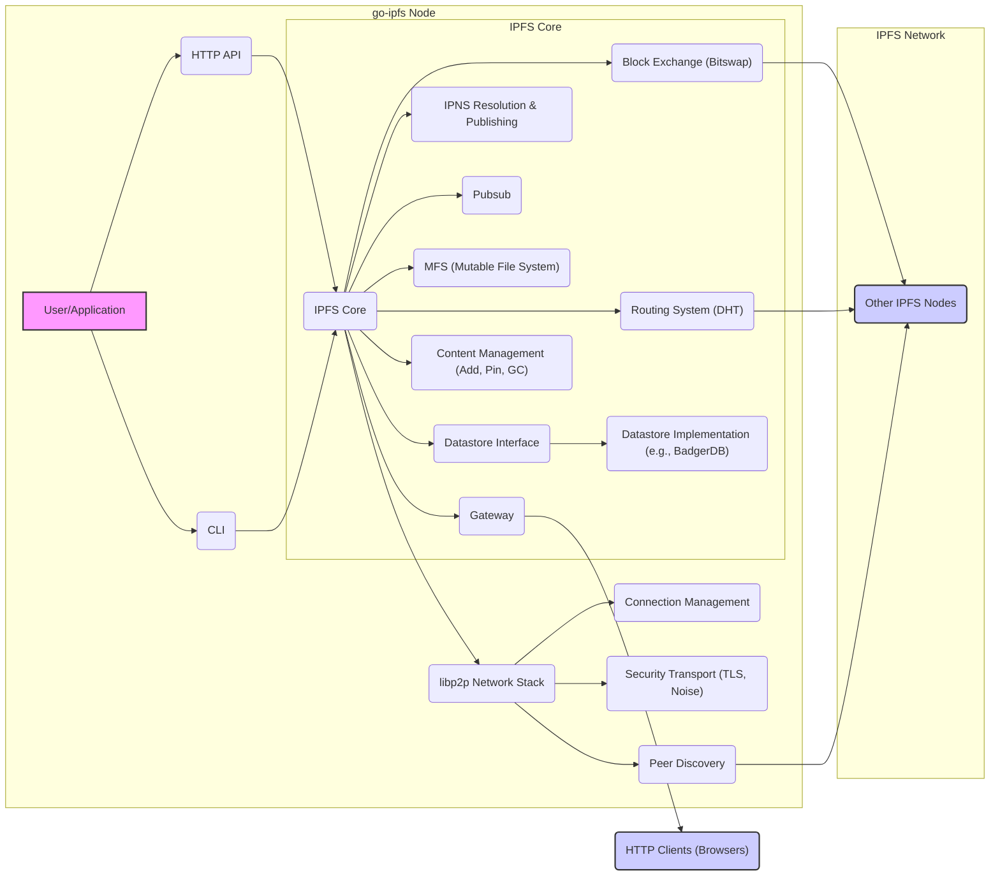
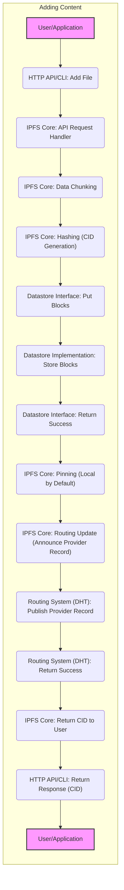
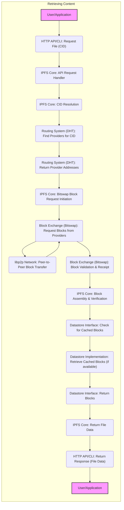

# Project Design Document: go-ipfs for Threat Modeling - Improved

**Project Name:** go-ipfs

**Project Repository:** [https://github.com/ipfs/go-ipfs](https://github.com/ipfs/go-ipfs)

**Version:** v0.14.0 (Specify the exact version for threat modeling. This example uses v0.14.0, replace with your target version)

**Document Version:** 1.1
**Date:** October 26, 2023
**Author:** [Your Name/Organization]

## 1. Introduction

This document provides an enhanced design overview of go-ipfs, the Go implementation of the InterPlanetary File System (IPFS), specifically tailored for threat modeling. Building upon the initial design document, this version provides more detail and clarity to facilitate a comprehensive threat modeling exercise. It outlines the key components, architecture, data flow, and security considerations of go-ipfs, enabling security professionals to effectively identify, analyze, and mitigate potential security threats.

IPFS aims to revolutionize data storage and sharing by offering a decentralized, content-addressed alternative to the traditional HTTP-based web. go-ipfs, a primary implementation of the IPFS protocol, provides the tools and infrastructure for users and applications to participate in this decentralized network. This document serves as a crucial input for security assessments and threat modeling activities focused on go-ipfs deployments and integrations.

## 2. Project Overview

**Purpose:** go-ipfs serves as a node implementation of the IPFS protocol, empowering users to store, retrieve, and distribute data in a decentralized, content-addressed, and peer-to-peer manner. It functions as a building block for decentralized applications and infrastructure, contributing to a more resilient and censorship-resistant web.

**Key Features (Expanded):**

*   **Content Addressing (CID):**  Data is uniquely identified by its cryptographic hash (CID), ensuring immutability and integrity. CIDs are fundamental to IPFS and are used for all data references. Different CID versions and codecs exist, which might have security implications.
*   **Decentralized Storage & Distribution:** Data is distributed across a network of nodes, enhancing fault tolerance and availability. Redundancy depends on the number of nodes pinning the content.
*   **Peer-to-Peer Networking (libp2p):** Leverages libp2p for robust peer discovery, connection management, multiplexing, and secure communication. libp2p's modularity allows for various transport and security configurations.
*   **Block Exchange (Bitswap) - Optimized Data Transfer:** Implements the Bitswap protocol for efficient, market-based block exchange between peers. Bitswap optimizes bandwidth usage and prioritizes block retrieval based on need and peer reputation (in some implementations/extensions).
*   **HTTP API - Programmable Interface:** Provides a RESTful HTTP API for programmatic interaction, enabling applications to integrate with IPFS functionalities. This API is a critical attack surface.
*   **Command-Line Interface (CLI) - User Interaction:** Offers a user-friendly CLI for node management, data manipulation, and network interaction. CLI commands can have security implications if misused or exploited.
*   **Pluggable Datastore - Storage Flexibility:** Supports various datastore backends (e.g., BadgerDB, LevelDB, RocksDB) for storing IPFS data. The choice of datastore impacts performance and potentially security characteristics.
*   **IPNS (InterPlanetary Name System) - Mutable Naming:** Enables mutable pointers to content-addressed data, allowing updates to content while maintaining a stable, human-readable name. IPNS relies on the DHT or Pubsub for record distribution and resolution, which are potential attack vectors.
*   **Pubsub (Publish-Subscribe) - Real-time Communication:** Facilitates real-time communication and data dissemination across the network through a publish-subscribe mechanism. Pubsub can be used for various applications, including chat, notifications, and distributed signaling.
*   **File System over IPFS (MFS):** Provides a mutable file system interface on top of IPFS, allowing users to interact with IPFS as if it were a traditional file system. MFS operations are translated into IPFS operations.
*   **Gateway Functionality:** go-ipfs can act as a gateway, allowing users to access IPFS content through standard HTTP browsers. Gateways introduce specific security considerations.

**Target Users (Detailed):**

*   **Decentralized Application (dApp) Developers:** Building applications requiring decentralized storage, content distribution, and peer-to-peer communication.
*   **Decentralized Web Infrastructure Providers:** Organizations and individuals running IPFS nodes to support the network and provide storage/bandwidth.
*   **Content Creators and Publishers:**  Publishing content in a censorship-resistant and globally accessible manner.
*   **Researchers and Academics:** Studying decentralized systems, distributed ledgers, and peer-to-peer networking.
*   **Organizations Requiring Resilient and Censorship-Resistant Data Storage:**  Seeking alternatives to centralized cloud storage for data integrity and availability.
*   **Users Concerned with Data Privacy and Control:**  Seeking alternatives to centralized platforms that control user data.

## 3. System Architecture (Enhanced)

The go-ipfs architecture is designed for modularity and extensibility. This diagram expands on the previous version, providing more detail within the "IPFS Core" and highlighting key interfaces.

**Components Description (Expanded):**

*   **"User/Application"**: External entities interacting with go-ipfs.
*   **"HTTP API"**: RESTful API for programmatic control and data access.
*   **"CLI"**: Command-Line Interface for user interaction and node management.
*   **"IPFS Core"**: The central orchestrator, managing all IPFS functionalities.
    *   **"Routing System (DHT)"**: KadDHT for peer and content discovery.
    *   **"Block Exchange (Bitswap)"**: Protocol for efficient block trading.
    *   **"Datastore Interface"**: Abstraction layer for interacting with different datastore implementations.
        *   **"Datastore Implementation (e.g., BadgerDB)"**:  Actual storage backend.
    *   **"IPNS Resolution & Publishing"**: Handles IPNS name resolution and record publishing.
    *   **"Pubsub"**: Publish-Subscribe system for real-time communication.
    *   **"MFS (Mutable File System)"**: Provides a mutable file system interface.
    *   **"Gateway"**: Enables access to IPFS content via HTTP.
    *   **"Content Management (Add, Pin, GC)"**: Manages content addition, pinning (preventing garbage collection), and garbage collection.
*   **"libp2p Network Stack"**: Networking foundation for peer-to-peer communication.
    *   **"Peer Discovery"**: Mechanisms for finding peers (mDNS, DHT, Bootstrap nodes).
    *   **"Connection Management"**: Establishes and maintains connections.
    *   **"Security Transport (TLS, Noise)"**: Provides secure communication channels.
*   **"IPFS Network"**: The broader IPFS peer-to-peer network.
*   **"HTTP Clients (Browsers)"**: External clients accessing IPFS content through the Gateway.

## 4. Data Flow (Detailed)

This section expands on the data flow diagrams, providing more granular steps and highlighting security-relevant operations.

**4.1. Adding Content (Detailed Flow):**

**Adding Content Data Flow Description:**

1.  **"User/Application"** initiates content addition via **"HTTP API/CLI: Add File"**.
2.  **"IPFS Core: API Request Handler"** receives and processes the request.
3.  **"IPFS Core: Data Chunking"** splits the input data into blocks. Chunking strategy can impact performance and potentially security (e.g., block size).
4.  **"IPFS Core: Hashing (CID Generation)"** calculates the cryptographic hash (CID) for each block and the root CID. Hash algorithm choice is security-relevant.
5.  **"Datastore Interface: Put Blocks"** sends blocks to the datastore interface.
6.  **"Datastore Implementation: Store Blocks"** stores the blocks in the chosen datastore backend. Datastore security is critical for data integrity and confidentiality at rest.
7.  **"Datastore Interface: Return Success"** confirms successful storage.
8.  **"IPFS Core: Pinning (Local by Default)"** pins the content locally to prevent garbage collection. Pinning policy is important for data availability.
9.  **"IPFS Core: Routing Update (Announce Provider Record)"** announces to the routing system that this node provides the content.
10. **"Routing System (DHT): Publish Provider Record"** publishes the provider record to the DHT, making the content discoverable. DHT security is crucial for content discovery.
11. **"Routing System (DHT): Return Success"** confirms successful publication.
12. **"IPFS Core: Return CID to User"** returns the root CID to the user.
13. **"HTTP API/CLI: Return Response (CID)"** sends the CID back to the user/application.
14. **"User/Application"** receives the CID, which is now the content address.

**4.2. Retrieving Content (Detailed Flow):**

**Retrieving Content Data Flow Description:**

1.  **"User/Application"** requests content by CID via **"HTTP API/CLI: Request File (CID)"**.
2.  **"IPFS Core: API Request Handler"** receives and processes the request.
3.  **"IPFS Core: CID Resolution"** initiates the content retrieval process.
4.  **"Routing System (DHT): Find Providers for CID"** queries the DHT to find peers providing the content. DHT query mechanisms and responses are potential attack surfaces.
5.  **"Routing System (DHT): Return Provider Addresses"** returns a list of peer addresses that claim to have the content. Malicious peers could provide incorrect addresses.
6.  **"IPFS Core: Bitswap Block Request Initiation"** initiates a Bitswap request to retrieve blocks from the identified providers.
7.  **"Block Exchange (Bitswap): Request Blocks from Providers"** sends block requests to peers via **"libp2p Network: Peer-to-Peer Block Transfer"**. Peer selection and request strategies in Bitswap are important for performance and security.
8.  **"libp2p Network: Peer-to-Peer Block Transfer"** handles the peer-to-peer transfer of blocks. Secure transport (TLS, Noise) is crucial here.
9.  **"Block Exchange (Bitswap): Block Validation & Receipt"** receives blocks and validates them against their CIDs to ensure integrity. Block validation is critical to prevent data corruption and malicious data injection.
10. **"IPFS Core: Block Assembly & Verification"** assembles the file from received blocks and verifies the overall content integrity using the root CID.
11. **"Datastore Interface: Check for Cached Blocks"** checks if blocks are already cached in the local datastore. Caching can improve performance but also introduces cache-related security considerations.
12. **"Datastore Implementation: Retrieve Cached Blocks (if available)"** retrieves cached blocks from the datastore if available.
13. **"Datastore Interface: Return Blocks"** returns the retrieved blocks.
14. **"IPFS Core: Return File Data"** returns the assembled file data.
15. **"HTTP API/CLI: Return Response (File Data)"** sends the file data back to the user/application.
16. **"User/Application"** receives the requested content.

## 5. Security Considerations (Expanded & Categorized)

This section provides a more detailed and categorized breakdown of security considerations for go-ipfs, using CIA Triad and Authentication/Authorization as categories.

**5.1. Confidentiality:**

*   **Data at Rest Encryption:** go-ipfs itself does not enforce encryption at rest. Datastore backends might offer encryption options, but this needs to be configured and managed separately. Lack of encryption at rest can expose sensitive data if the storage medium is compromised.
*   **Data in Transit Encryption:** libp2p supports secure transport protocols (TLS, Noise) for encrypted communication between peers. However, encryption is not always mandatory and depends on the configured transport protocols and peer capabilities. Unencrypted communication can expose data in transit to eavesdropping.
*   **Application-Layer Encryption:** Applications can encrypt data before adding it to IPFS to ensure confidentiality. This is the recommended approach for sensitive data. However, key management and secure encryption implementation are application responsibilities.
*   **Gateway Security:** Gateways, if not properly secured (e.g., HTTPS), can expose data in transit between the gateway and HTTP clients.

**5.2. Integrity:**

*   **Content Addressing (CID):** CIDs inherently provide strong content integrity. Any modification to data results in a different CID, making tampering easily detectable. This is a core security feature of IPFS.
*   **Block Validation:** Bitswap includes block validation mechanisms to ensure received blocks match their expected CIDs. This prevents malicious peers from injecting corrupted or malicious data.
*   **Datastore Integrity:** The integrity of the datastore is crucial. Datastore corruption or manipulation can lead to data loss or serving of incorrect data. Datastore choice and configuration impact integrity.
*   **Code Integrity:** Compromised go-ipfs binaries or dependencies can undermine the entire system's integrity. Secure software distribution and dependency management are essential.

**5.3. Availability:**

*   **Decentralization & Redundancy:** IPFS's decentralized nature enhances availability by distributing data across multiple nodes. However, availability depends on sufficient nodes pinning the content.
*   **Pinning Management:**  Effective pinning strategies are crucial for ensuring data availability. If content is not pinned by enough nodes, it might become unavailable if the original providers go offline.
*   **Denial of Service (DoS) Attacks:** go-ipfs nodes can be targeted by DoS attacks at various levels (network, DHT, Bitswap, API). DoS attacks can impact node availability and network performance.
*   **Eclipse Attacks:** Attackers might attempt to isolate a node from the network (eclipse attack), reducing its availability and potentially manipulating its view of the network.
*   **DHT Attacks:** Attacks targeting the DHT (e.g., DHT poisoning, Sybil attacks) can disrupt content discovery and availability.
*   **Network Partitioning:** Network issues or attacks causing network partitioning can impact the reachability and availability of content across different parts of the IPFS network.

**5.4. Authentication and Authorization:**

*   **Peer Identity (PeerID):** libp2p uses PeerIDs for identifying nodes. However, PeerIDs alone do not provide strong authentication or authorization.
*   **No Built-in User Authentication/Authorization:** go-ipfs itself does not have built-in user authentication or authorization mechanisms for the HTTP API or CLI. These need to be implemented at the application level or through external security layers.
*   **API Security:** The HTTP API is a significant attack surface. Lack of authentication and authorization on the API can allow unauthorized access and manipulation of the IPFS node.
*   **IPNS Security:** IPNS record updates and resolution rely on the DHT or Pubsub. Security vulnerabilities in these systems can impact IPNS name ownership and control.
*   **Pubsub Security:** Pubsub topics can be open or permissioned. Security mechanisms for controlling access to Pubsub topics and message publishing/subscription need to be considered.

**5.5. Other Security Considerations:**

*   **Sybil Attacks:** Attackers can create multiple identities (Sybil nodes) to gain disproportionate influence in the DHT or Bitswap, potentially disrupting routing or data exchange.
*   **Routing Attacks:** Malicious nodes can manipulate the DHT routing information to redirect traffic, censor content, or perform man-in-the-middle attacks.
*   **Resource Exhaustion:** Malicious peers can attempt to exhaust node resources (CPU, memory, bandwidth, storage) through excessive requests or data transfer.
*   **Dependency Vulnerabilities:** go-ipfs relies on numerous dependencies. Vulnerabilities in these dependencies can impact go-ipfs security. Regular dependency updates and security audits are crucial.
*   **Configuration Security:** Misconfiguration of go-ipfs nodes (e.g., exposing API without authentication, insecure datastore settings) can create security vulnerabilities.

## 6. Threat Modeling Methodology Recommendation

For effective threat modeling of go-ipfs, consider using a structured methodology such as **STRIDE** or **PASTA**.

*   **STRIDE (Spoofing, Tampering, Repudiation, Information Disclosure, Denial of Service, Elevation of Privilege):**  Focuses on identifying threats based on these categories for each component and data flow.
*   **PASTA (Process for Attack Simulation and Threat Analysis):** A more risk-centric methodology that involves defining objectives, technical scope, application decomposition, threat analysis, vulnerability analysis, and attack simulation.

Using this design document, a threat modeling exercise would typically involve:

1.  **Decomposition:** Breaking down go-ipfs into its components and data flows as described in this document.
2.  **Threat Identification:** Using a methodology like STRIDE to identify potential threats for each component and data flow, considering the security considerations outlined in Section 5.
3.  **Vulnerability Analysis:**  Investigating potential vulnerabilities that could enable the identified threats.
4.  **Risk Assessment:** Evaluating the likelihood and impact of each threat and vulnerability.
5.  **Mitigation Strategies:** Developing and implementing security controls to mitigate identified risks.

## 7. Key Technologies (Reiterated for Clarity)

*   **Go Programming Language:** Implementation language, influencing performance and security characteristics.
*   **libp2p:** Core networking library, responsible for peer-to-peer communication and security.
*   **Protocol Buffers (protobuf):** Data serialization format, impacting efficiency and parsing security.
*   **Multiformats (Multihash, Multibase, Multicodec):** Self-describing data formats, essential for content addressing and interoperability.
*   **CID (Content Identifier):** Fundamental content addressing mechanism, ensuring integrity.
*   **DHT (KadDHT):** Distributed Hash Table for routing and discovery, a critical component for network functionality and security.
*   **Bitswap:** Data exchange protocol, impacting performance and security of data transfer.
*   **Datastore (BadgerDB, LevelDB, RocksDB, etc.):** Local storage backend, affecting performance, persistence, and data security at rest.
*   **IPNS (InterPlanetary Name System):** Mutable naming system, adding complexity and specific security considerations.
*   **Pubsub:** Publish-Subscribe system, enabling real-time communication and introducing its own security aspects.

## 8. Conclusion

This improved design document provides a more detailed and structured foundation for threat modeling go-ipfs. By expanding on the architecture, data flow, and security considerations, and recommending a threat modeling methodology, this document aims to facilitate a more comprehensive and effective security analysis.  The next steps for security professionals using this document should include:

1.  **Detailed Threat Modeling Exercise:** Conduct a structured threat modeling exercise using a methodology like STRIDE or PASTA, leveraging the information in this document.
2.  **Attack Surface Analysis:**  Identify and analyze the attack surfaces of go-ipfs, including the HTTP API, CLI, network interfaces, and interactions with other components.
3.  **Vulnerability Research:**  Investigate known vulnerabilities in go-ipfs and its dependencies, and proactively search for new vulnerabilities.
4.  **Security Testing:** Perform penetration testing and security audits to validate the effectiveness of existing security controls and identify potential weaknesses.
5.  **Mitigation Implementation:** Implement appropriate security controls and mitigation strategies based on the threat modeling and vulnerability analysis findings.
6.  **Continuous Security Monitoring:** Establish ongoing security monitoring and incident response processes to detect and respond to security threats in a timely manner.

By following these steps, organizations and individuals deploying or using go-ipfs can significantly improve the security posture of their systems and applications.