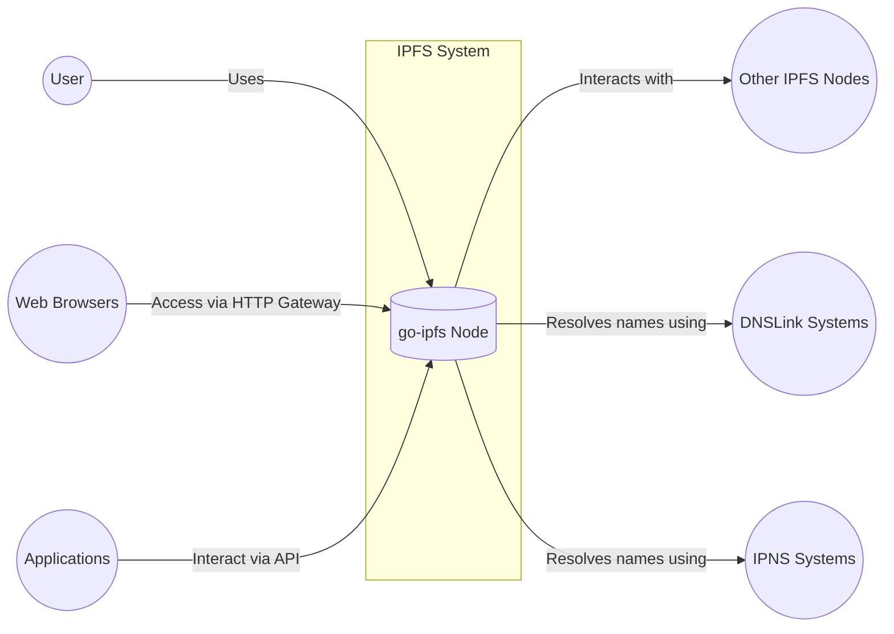
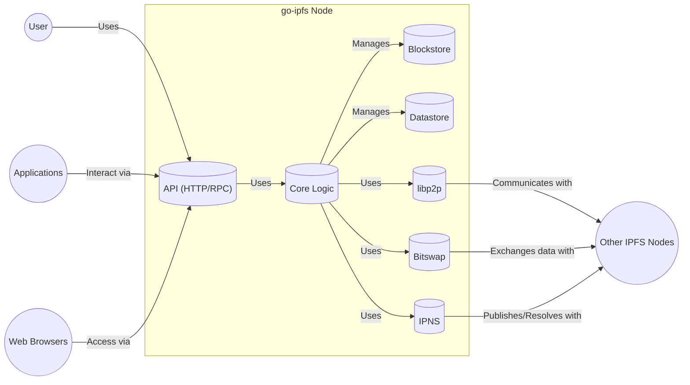
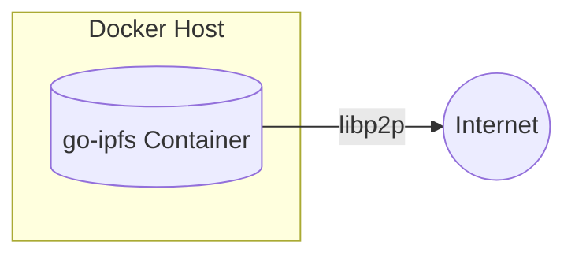
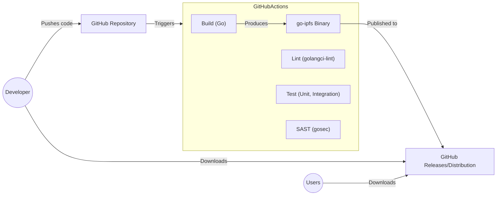

Okay, let's create a design document for the go-ipfs project, keeping in mind its purpose and potential security considerations.

# BUSINESS POSTURE

Business Priorities and Goals:

*   Decentralized Storage: Provide a robust and reliable decentralized storage solution, moving away from centralized data silos.
*   Data Integrity and Availability: Ensure data stored on IPFS is tamper-proof and remains accessible.
*   Content Addressing: Enable efficient and secure content retrieval based on content identifiers (CIDs), not location.
*   Performance and Scalability: Offer a performant and scalable solution that can handle large amounts of data and a growing network.
*   Open Source and Community Driven: Foster a collaborative and transparent development process, encouraging community contributions.
*   Interoperability: Integrate with other decentralized and traditional systems.

Most Important Business Risks:

*   Data Loss or Corruption: Failure of the network or individual nodes leading to permanent data loss.
*   Malicious Content Distribution: The network being used to distribute illegal or harmful content.
*   Network Attacks: Attacks targeting the network's integrity, availability, or performance (e.g., DDoS, Sybil attacks).
*   Reputation Damage: Security vulnerabilities or misuse of the network damaging the project's reputation.
*   Lack of Adoption: Insufficient user and developer adoption hindering the project's growth and sustainability.
*   Regulatory Uncertainty: Evolving regulations around decentralized technologies impacting the project's operations.

# SECURITY POSTURE

Existing Security Controls:

*   security control: Cryptographic Hashing: Content addressing using cryptographic hashes (CIDs) ensures data integrity. Implemented throughout the codebase, particularly in data storage and retrieval mechanisms.
*   security control: Public Key Infrastructure (PKI): Uses public-key cryptography for node identity and secure communication. Implemented in the libp2p library used by go-ipfs.
*   security control: Data Encryption (Optional): While not enforced by default, IPFS supports encryption of data at rest and in transit. Users/applications can implement encryption on top of IPFS.
*   security control: Peer-to-Peer Networking (libp2p): Leverages libp2p for secure and authenticated communication between nodes. Implemented as a core dependency.
*   security control: Bitswap Protocol: Uses a relatively secure protocol for data exchange between peers, with mechanisms to prevent abuse. Implemented in the bitswap module.
*   security control: Code Audits and Reviews: The project undergoes regular code reviews and occasional security audits. Documented in the project's GitHub repository and community forums.
*   security control: Community Security Reporting: A process for reporting security vulnerabilities is in place. Documented in the project's security guidelines.

Accepted Risks:

*   accepted risk: Data Availability Relies on Network Health: Data availability depends on the availability of peers hosting the content. If no peers have the data, it becomes inaccessible.
*   accepted risk: No Built-in Content Moderation: IPFS itself does not have mechanisms to prevent the distribution of malicious or illegal content. This is left to higher-level applications.
*   accepted risk: Potential for Network Attacks: Like any distributed network, IPFS is susceptible to various network attacks (DDoS, Sybil, Eclipse attacks).
*   accepted risk: Mutable Content Requires External Mechanisms: While content addressing ensures immutability, mutable content requires external mechanisms like IPNS or DNSLink, which have their own security considerations.

Recommended Security Controls:

*   security control: Implement Regular External Security Audits: Conduct regular, independent security audits to identify and address vulnerabilities.
*   security control: Develop a Threat Model: Create a comprehensive threat model to proactively identify and mitigate potential security risks.
*   security control: Enhance Network Monitoring: Implement robust network monitoring to detect and respond to malicious activity.
*   security control: Improve Documentation on Security Best Practices: Provide clear and comprehensive documentation on security best practices for users and developers.
*   security control: Explore Decentralized Reputation Systems: Investigate the integration of decentralized reputation systems to mitigate the risk of malicious nodes.

Security Requirements:

*   Authentication:
    *   Nodes should authenticate each other using libp2p's built-in PKI.
    *   Consider mechanisms for user authentication when interacting with IPFS gateways or APIs.

*   Authorization:
    *   Access control mechanisms may be needed for private data stored on IPFS. This is typically handled at the application layer.
    *   Consider role-based access control (RBAC) for administrative functions.

*   Input Validation:
    *   All input received from external sources (e.g., user input, network requests) should be strictly validated.
    *   Validate CIDs and other identifiers to prevent attacks like path traversal.

*   Cryptography:
    *   Use strong, well-vetted cryptographic algorithms for hashing, encryption, and digital signatures.
    *   Ensure proper key management practices.
    *   Regularly review and update cryptographic libraries.

# DESIGN

## C4 CONTEXT

Element Descriptions:

*   Element:
    *   Name: User
    *   Type: Person
    *   Description: A person interacting with the IPFS network, either directly or through an application.
    *   Responsibilities: Adding data, retrieving data, managing their local IPFS node.
    *   Security controls: May use a local password, or other authentication method, to protect their local IPFS node.

*   Element:
    *   Name: go-ipfs Node
    *   Type: Software System
    *   Description: A single instance of the go-ipfs software, running on a user's computer or server.
    *   Responsibilities: Storing data, retrieving data, participating in the IPFS network, providing an API for interaction.
    *   Security controls: Cryptographic Hashing, Public Key Infrastructure (PKI), Data Encryption (Optional), Peer-to-Peer Networking (libp2p), Bitswap Protocol.

*   Element:
    *   Name: Other IPFS Nodes
    *   Type: Software System
    *   Description: Other instances of IPFS software (go-ipfs, js-ipfs, etc.) running on the network.
    *   Responsibilities: Storing data, retrieving data, participating in the IPFS network.
    *   Security controls: Cryptographic Hashing, Public Key Infrastructure (PKI), Data Encryption (Optional), Peer-to-Peer Networking (libp2p), Bitswap Protocol.

*   Element:
    *   Name: Web Browsers
    *   Type: Software System
    *   Description: Standard web browsers accessing IPFS content through an HTTP gateway.
    *   Responsibilities: Displaying IPFS content to users.
    *   Security controls: Browser security mechanisms (sandboxing, same-origin policy, etc.).

*   Element:
    *   Name: Applications
    *   Type: Software System
    *   Description: Applications built on top of IPFS, using its API to interact with the network.
    *   Responsibilities: Providing specific functionality using IPFS as a storage layer.
    *   Security controls: Application-specific security controls, in addition to leveraging IPFS's security features.

*   Element:
    *   Name: DNSLink Systems
    *   Type: External System
    *   Description: The Domain Name System (DNS), used to map human-readable domain names to IPFS CIDs.
    *   Responsibilities: Resolving domain names to IPFS content.
    *   Security controls: DNSSEC (if implemented).

*   Element:
    *   Name: IPNS Systems
    *   Type: External System
    *   Description: The InterPlanetary Name System (IPNS), used to create mutable pointers to IPFS content.
    *   Responsibilities: Resolving IPNS names to IPFS CIDs.
    *   Security controls: Public Key Infrastructure (PKI).

## C4 CONTAINER

Element Descriptions:

*   Element:
    *   Name: API (HTTP/RPC)
    *   Type: Container
    *   Description: Provides an interface for interacting with the go-ipfs node.
    *   Responsibilities: Handling requests from users and applications, exposing node functionality.
    *   Security controls: Input validation, potentially authentication and authorization mechanisms.

*   Element:
    *   Name: Core Logic
    *   Type: Container
    *   Description: Contains the main logic for managing the IPFS node.
    *   Responsibilities: Coordinating data storage, retrieval, and network interactions.
    *   Security controls: Internal consistency checks, error handling.

*   Element:
    *   Name: Blockstore
    *   Type: Container
    *   Description: Manages the storage of raw blocks of data.
    *   Responsibilities: Storing and retrieving blocks based on their CIDs.
    *   Security controls: Data integrity checks (hashing).

*   Element:
    *   Name: Datastore
    *   Type: Container
    *   Description: Provides a key-value store for metadata and other internal data.
    *   Responsibilities: Storing and retrieving data associated with keys.
    *   Security controls: Data integrity checks.

*   Element:
    *   Name: libp2p
    *   Type: Container
    *   Description: Handles peer-to-peer networking.
    *   Responsibilities: Establishing connections with other peers, managing the peer-to-peer network.
    *   Security controls: Public Key Infrastructure (PKI), authenticated and encrypted communication.

*   Element:
    *   Name: Bitswap
    *   Type: Container
    *   Description: Implements the Bitswap protocol for exchanging data with other peers.
    *   Responsibilities: Requesting and providing blocks to other peers.
    *   Security controls: Mechanisms to prevent abuse and ensure fair exchange.

*   Element:
    *   Name: IPNS
    *   Type: Container
    *   Description: Implements the InterPlanetary Name System.
    *   Responsibilities: Publishing and resolving IPNS records.
    *   Security controls: Public Key Infrastructure (PKI).

## DEPLOYMENT

Possible Deployment Solutions:

1.  Local Machine: Running go-ipfs directly on a user's computer (desktop, laptop, server).
2.  Cloud VM: Deploying go-ipfs on a virtual machine in a cloud environment (AWS, GCP, Azure, etc.).
3.  Containerized (Docker): Running go-ipfs within a Docker container.
4.  Kubernetes: Deploying go-ipfs as part of a Kubernetes cluster.
5.  IPFS Cluster: Using ipfs-cluster to coordinate multiple go-ipfs nodes for increased redundancy and scalability.

Chosen Solution (for detailed description): Containerized (Docker)

Deployment Diagram:

Element Descriptions:

*   Element:
    *   Name: Docker Host
    *   Type: Infrastructure Node
    *   Description: A physical or virtual machine running Docker Engine.
    *   Responsibilities: Hosting and managing Docker containers.
    *   Security controls: Operating system security, Docker security best practices (e.g., user namespaces, resource limits).

*   Element:
    *   Name: go-ipfs Container
    *   Type: Container
    *   Description: A Docker container running the go-ipfs software.
    *   Responsibilities: Running a single instance of go-ipfs.
    *   Security controls: Container isolation, image security scanning, minimal base image.

*   Element:
    *   Name: Internet
    *   Type: External System
    *   Description: The global network, allowing the go-ipfs node to connect to other peers.
    *   Responsibilities: Facilitating communication between IPFS nodes.
    *   Security controls: Network-level security controls (firewalls, intrusion detection systems).

## BUILD

The go-ipfs project uses a robust build process managed primarily through GitHub Actions, leveraging Go's build system and various tools for testing, linting, and security checks.

Build Process Diagram:

Build Process Description:

1.  Code Commit: Developers commit code changes to the go-ipfs repository on GitHub.
2.  GitHub Actions Trigger: The commit triggers a GitHub Actions workflow.
3.  Build: The Go compiler builds the go-ipfs binary.
4.  Linting: `golangci-lint` is used to enforce code style and identify potential issues.
5.  Testing: Unit and integration tests are run to ensure code correctness.
6.  SAST: `gosec` is used to perform static analysis security testing, identifying potential security vulnerabilities in the code.
7.  Artifact Creation: If all checks pass, the go-ipfs binary is created as a build artifact.
8.  Release: The artifact is published to GitHub Releases and potentially other distribution channels.

Security Controls in Build Process:

*   security control: Automated Build: GitHub Actions ensures a consistent and automated build process, reducing the risk of manual errors.
*   security control: Linting: `golangci-lint` helps enforce code quality and identify potential bugs that could lead to security vulnerabilities.
*   security control: Testing: Comprehensive testing helps ensure the code functions as expected and reduces the risk of introducing vulnerabilities.
*   security control: SAST (Static Application Security Testing): `gosec` scans the code for potential security vulnerabilities, such as buffer overflows, SQL injection, and hardcoded credentials.
*   security control: Dependency Management: Go modules are used for dependency management, and tools like `dependabot` help keep dependencies up-to-date, reducing the risk of using vulnerable libraries.
*   security control: Code Review: All code changes undergo code review by other developers before being merged.

# RISK ASSESSMENT

Critical Business Processes to Protect:

*   Data Storage and Retrieval: Ensuring users can reliably store and retrieve data on the IPFS network.
*   Network Participation: Maintaining a healthy and robust network of IPFS nodes.
*   Name Resolution (IPNS/DNSLink): Ensuring users can reliably resolve names to IPFS content.

Data to Protect and Sensitivity:

*   User Data (Stored on IPFS): Sensitivity varies greatly depending on the data stored by users. IPFS itself does not enforce any particular sensitivity level.  Users are responsible for encrypting sensitive data before storing it on IPFS.
*   Node Identity Keys: Highly sensitive. Compromise of a node's private key allows an attacker to impersonate the node.
*   IPNS Records: Moderately sensitive.  Tampering with IPNS records can redirect users to malicious content.
*   Configuration Files:  Potentially sensitive, depending on the configuration settings.  May contain API keys or other credentials.

# QUESTIONS & ASSUMPTIONS

Questions:

*   What specific threat actors are we most concerned about (e.g., nation-state actors, script kiddies, malicious insiders)? This will help prioritize security controls.
*   What level of data loss is acceptable? This will inform decisions about redundancy and backup strategies.
*   What are the performance requirements for the system? This will influence design choices and resource allocation.
*   Are there any specific regulatory requirements that need to be considered?
*   What is the budget for security measures?

Assumptions:

*   BUSINESS POSTURE: The primary goal is to provide a decentralized, resilient, and performant storage solution.  We assume a moderate risk appetite, balancing innovation with security.
*   SECURITY POSTURE: We assume that users are responsible for managing the security of their own data, including encryption if necessary. We assume that the network will be subject to attacks, and we need to implement defenses accordingly.
*   DESIGN: We assume that the Docker containerized deployment model is a common and representative deployment scenario. We assume that the build process is secure and that dependencies are managed responsibly. We assume that libp2p provides a sufficient level of security for peer-to-peer communication.