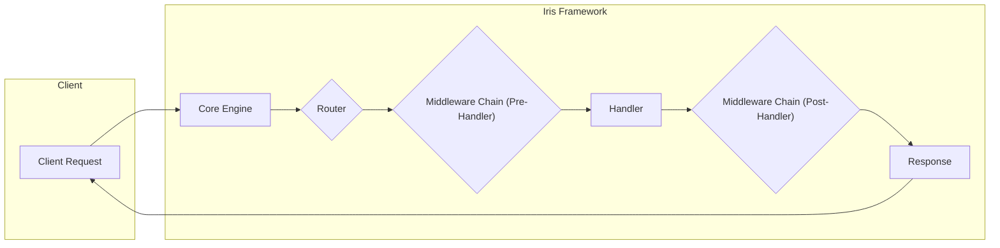
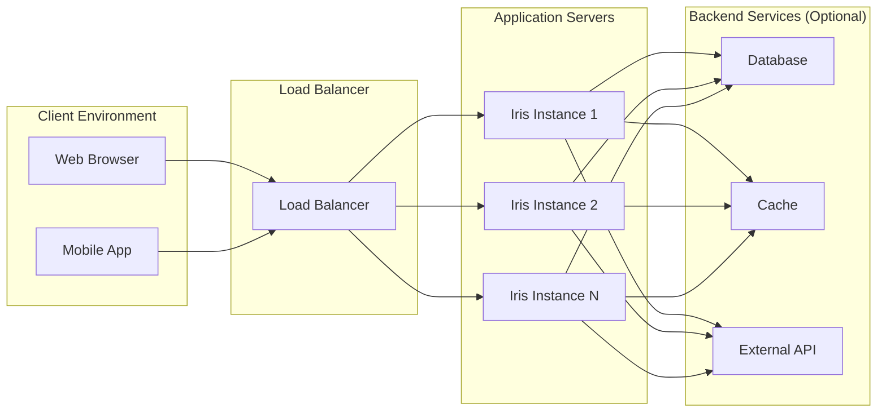

## Project Design Document: Iris Web Framework

**Project Name:** Iris Web Framework

**Project Repository:** https://github.com/kataras/iris

**Version:** 1.0 (Draft for Threat Modeling)

**1. Introduction**

This document provides a high-level design overview of the Iris web framework. It aims to describe the system's architecture, key components, and data flow, serving as a foundation for subsequent threat modeling activities. Iris is a fast, simple, yet fully featured and efficient web framework for Go. It provides a robust set of features for building web applications and APIs.

**2. Goals**

*   Provide a clear understanding of the Iris framework's architecture.
*   Identify key components and their interactions.
*   Describe the typical request lifecycle within the framework.
*   Outline potential deployment scenarios.
*   Serve as a basis for identifying potential security vulnerabilities during threat modeling.

**3. System Overview**

Iris is a Go-based web framework designed for building high-performance web applications. It follows an MVC-inspired architecture and provides features such as routing, middleware, templating, and WebSocket support. The framework is designed to be developer-friendly while offering the performance benefits of the Go language.

**4. Architectural Components**

*   **Core Engine:** This is the central part of the framework, responsible for managing the request lifecycle, routing, and middleware execution.
*   **Router:**  The router is responsible for mapping incoming HTTP requests to specific handlers based on defined routes. It supports various routing patterns, including dynamic parameters.
*   **Context:**  The `Context` object is central to each request. It holds request and response information, user data, and provides methods for interacting with the request and response.
*   **Middleware:** Middleware functions are executed before or after the main request handler. They can be used for tasks like authentication, logging, request modification, and response manipulation. Iris supports both global and route-specific middleware.
*   **Handlers:** These are the functions that process incoming requests and generate responses. They have access to the `Context` object.
*   **View Engine (Templating):** Iris supports various template engines for rendering dynamic HTML content. This component handles the parsing and execution of templates.
*   **WebSocket:**  Iris provides built-in support for WebSocket connections, enabling real-time communication between the server and clients.
*   **Sessions:**  The framework offers session management capabilities for maintaining user state across multiple requests.
*   **Error Handling:** Iris provides mechanisms for handling errors and exceptions that occur during request processing.
*   **File Server:**  A built-in component for serving static files like images, CSS, and JavaScript.

**5. Data Flow**

The following diagram illustrates the typical flow of an HTTP request through the Iris framework:

**Detailed Request Lifecycle:**

1. **Client Request:** A client (e.g., a web browser) sends an HTTP request to the Iris application.
2. **Core Engine Receives Request:** The Iris core engine receives the incoming request.
3. **Routing:** The router analyzes the request's URL and method to determine the matching route and associated handler.
4. **Pre-Handler Middleware:**  Any configured pre-handler middleware functions for the matched route are executed sequentially. These can perform actions like authentication or request logging.
5. **Handler Execution:** The designated handler function for the route is executed. This function processes the request and generates a response.
6. **Post-Handler Middleware:** Any configured post-handler middleware functions for the route are executed sequentially. These can perform actions like response modification or logging.
7. **Response Generation:** The handler generates an HTTP response, which may include data, headers, and a status code.
8. **Response Sent to Client:** The Iris core engine sends the generated response back to the client.

**6. Deployment Diagram**

**Deployment Considerations:**

*   Iris applications can be deployed as standalone executables.
*   Deployment can involve a single instance or multiple instances behind a load balancer for scalability and high availability.
*   Applications may interact with various backend services like databases, caching systems, and external APIs.
*   Containerization (e.g., Docker) is a common deployment method.

**7. Data Storage and Management**

Iris itself does not dictate a specific data storage mechanism. Applications built with Iris can interact with various types of databases or storage solutions, including:

*   Relational Databases (e.g., PostgreSQL, MySQL)
*   NoSQL Databases (e.g., MongoDB, Redis)
*   File Storage (e.g., local file system, cloud storage)

Data management logic is typically implemented within the application's handlers or separate data access layers.

**8. External Dependencies**

Iris relies on the Go standard library and may optionally utilize external libraries for specific functionalities. Some common external dependencies include:

*   **Database Drivers:**  Libraries for interacting with specific database systems (e.g., `github.com/lib/pq` for PostgreSQL).
*   **Template Engines:** Libraries for rendering templates (e.g., `html/template` from the standard library, or third-party engines).
*   **WebSocket Libraries:** While Iris has built-in support, applications might use specialized libraries for advanced WebSocket features.
*   **Logging Libraries:**  For structured logging (e.g., `go.uber.org/zap`).
*   **Security Libraries:** For tasks like encryption, authentication, and authorization (though Iris provides some built-in features).

**9. Security Considerations (High-Level)**

This section provides a preliminary overview of security considerations. A more detailed threat model will build upon this.

*   **Input Validation:**  The framework relies on developers to implement proper input validation within their handlers to prevent injection attacks.
*   **Output Encoding:** Developers are responsible for encoding output data to prevent cross-site scripting (XSS) vulnerabilities. Template engines often provide automatic encoding features.
*   **Authentication and Authorization:** Iris provides middleware and context features that can be used to implement authentication and authorization mechanisms.
*   **Session Management:** Secure session management is crucial. Iris provides session management features, and developers should configure them appropriately (e.g., using secure cookies).
*   **CORS:**  Cross-Origin Resource Sharing (CORS) needs to be configured correctly to control which domains can access the API.
*   **HTTPS:**  Enforcing HTTPS is essential for securing communication between clients and the server. This is typically handled at the deployment level (e.g., using a reverse proxy).
*   **Dependency Management:**  Keeping dependencies up-to-date is important to mitigate vulnerabilities in external libraries.

**10. Future Considerations**

*   Further detailing of specific security features provided by Iris.
*   Inclusion of more detailed diagrams for specific components (e.g., the routing mechanism).
*   Elaboration on error handling and logging practices within the framework.

This document provides a foundational understanding of the Iris web framework's architecture and serves as a starting point for a comprehensive threat modeling exercise.
