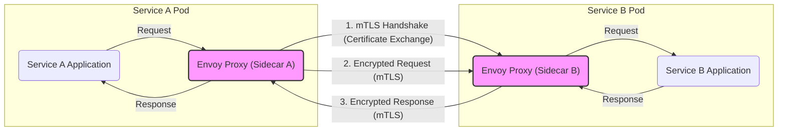
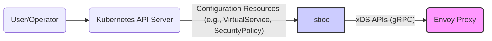
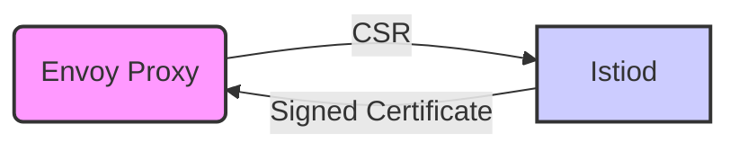

# Project Design Document: Istio Service Mesh

**Version:** 1.1
**Date:** October 26, 2023
**Author:** AI Software Architect

## 1. Project Overview

This document outlines the design of the Istio service mesh project, focusing on aspects relevant to security threat modeling. Istio is an open-source service mesh that transparently layers onto existing distributed applications. It provides a comprehensive suite of features to connect, secure, control, and observe services. This document details Istio's architecture, key components, their interactions, and security considerations, serving as a foundation for subsequent threat modeling activities.

## 2. Goals and Objectives

*   Provide a detailed and security-focused description of Istio's architecture and components.
*   Clearly identify key interactions, data flows, and trust boundaries within the Istio ecosystem.
*   Establish a solid understanding of Istio's functionality and security mechanisms for effective security analysis.
*   Serve as a comprehensive reference document for threat modeling exercises, enabling the identification of potential vulnerabilities and attack vectors.

## 3. Target Audience

This document is intended for:

*   Security engineers and architects responsible for threat modeling Istio deployments and identifying potential security risks.
*   Developers and operators working with Istio who require a deep understanding of its architecture and security implications.
*   Anyone involved in the security assessment, hardening, or incident response for systems utilizing Istio.

## 4. System Architecture

Istio's architecture is logically separated into the **Data Plane** and the **Control Plane**, each with distinct responsibilities and security characteristics.

### 4.1. Data Plane

*   Composed of intelligent proxies (Envoy) deployed as sidecars alongside application containers.
*   These proxies intercept all network traffic to and from their associated services, acting as policy enforcement points.
*   They operate at Layer 7, enabling sophisticated routing, load balancing, and security policy enforcement based on application-level attributes.

### 4.2. Control Plane

*   Manages and configures the data plane proxies, providing a centralized point of control for the mesh.
*   Exposes APIs for configuring traffic management, security policies, and observability settings.
*   Translates high-level configuration into low-level configurations understood by the Envoy proxies.

## 5. Key Components and Interactions

This section provides a detailed description of the major components within Istio and their interactions, with a focus on security-relevant aspects.

### 5.1. Istiod

*   **Description:** The core of the control plane, responsible for service discovery, configuration management, and certificate provisioning. It consolidates the functionalities of previous components like Pilot, Citadel, and Galley.
*   **Responsibilities:**
    *   **Configuration Management:** Aggregates and validates configuration from various sources (Kubernetes CRDs, configuration files), ensuring consistency and correctness.
    *   **Service Discovery:** Monitors service instances and their endpoints, providing this information to Envoy proxies for intelligent routing.
    *   **Certificate Authority (CA):** Issues and manages TLS certificates for mutual TLS (mTLS), providing strong service identities.
    *   **Policy Distribution:** Translates high-level security and traffic policies into configurations that can be enforced by Envoy proxies.
*   **Interactions:**
    *   Receives configuration from users and operators via the Kubernetes API server or configuration files.
    *   Monitors Kubernetes API server for changes in services, deployments, and other relevant resources.
    *   Pushes configuration updates to Envoy proxies securely via gRPC using the Secret Discovery Service (SDS), Listener Discovery Service (LDS), Route Discovery Service (RDS), and Cluster Discovery Service (CDS).
    *   Issues certificates to Envoy proxies via the Certificate Signing Request (CSR) API.
    *   Interacts with the Kubernetes API server to manage secrets for certificate storage.

### 5.2. Envoy Proxy

*   **Description:** A high-performance, extensible proxy deployed as a sidecar to each service instance, forming the data plane.
*   **Responsibilities:**
    *   **Traffic Interception:** Intercepts all inbound and outbound traffic for its associated service using `iptables` or similar mechanisms.
    *   **Traffic Management:** Enforces routing rules, load balancing algorithms, retries, timeouts, and fault injection based on configuration received from Istiod.
    *   **Security Enforcement:** Enforces authentication and authorization policies, including mTLS, access control lists (ACLs), and role-based access control (RBAC).
    *   **Telemetry Collection:** Collects metrics, logs, and traces about traffic flowing through it, providing observability into service behavior.
*   **Interactions:**
    *   Receives configuration updates from Istiod via secure gRPC channels using xDS APIs (SDS, LDS, RDS, CDS).
    *   Establishes mTLS connections with other Envoy proxies based on certificates provided by Istiod.
    *   Forwards and routes traffic to upstream services based on routing configuration.
    *   Performs health checks on upstream services to determine their availability.
    *   Reports telemetry data to configured backends (e.g., Prometheus, Jaeger).

### 5.3. Sidecar Injector

*   **Description:** A Kubernetes admission controller that automatically injects the Envoy proxy container into application pods during their creation.
*   **Responsibilities:**
    *   **Automatic Proxy Injection:** Modifies pod specifications to include the Envoy sidecar container, simplifying deployment and ensuring consistent policy enforcement.
    *   **Initial Configuration:** Configures the injected Envoy proxy with basic settings required for communication with the control plane.
*   **Interactions:**
    *   Interacts with the Kubernetes API server to intercept pod creation requests.
    *   Retrieves configuration information from Istiod (indirectly, based on namespace or pod annotations) to configure the injected proxy.

## 6. Data Flow Diagrams

### 6.1. Secure Service-to-Service Communication (mTLS)

### 6.2. Control Plane Configuration Distribution

### 6.3. Certificate Issuance and Rotation

## 7. Security Considerations

Istio incorporates several key security features and considerations:

*   **Mutual TLS (mTLS):** Provides strong cryptographic authentication of service identities and encrypts all communication between services within the mesh. This prevents eavesdropping and man-in-the-middle attacks.
*   **Authorization Policies:** Enables fine-grained, attribute-based access control (ABAC) to restrict which services can access other services, and under what conditions. This helps prevent unauthorized access and lateral movement.
*   **Authentication Policies:** Verifies the identity of clients making requests to services, supporting various authentication mechanisms like JWT and custom authentication providers.
*   **Secure Bootstrapping of Proxies:** Ensures the integrity and authenticity of Envoy proxies during startup by securely providing them with initial configuration and credentials.
*   **Certificate Management:** Automates the issuance, rotation, and revocation of TLS certificates, reducing the operational burden and the risk of using expired or compromised credentials.
*   **Secret Management:** Istio leverages Kubernetes secrets for storing sensitive information like TLS keys and certificates, relying on Kubernetes' security mechanisms for protecting these secrets.
*   **Audit Logging:** Provides detailed logs of security-related events, such as authentication attempts, authorization decisions, and policy changes, enabling security monitoring and incident response.
*   **Isolation:** Envoy proxies provide a level of isolation between application containers, preventing compromised applications from directly accessing the network or other applications without going through the proxy.
*   **Denial of Service (DoS) Protection:** Istio's traffic management features can be used to implement rate limiting, circuit breaking, and other mechanisms to protect services from DoS attacks.

## 8. Trust Boundaries

Understanding trust boundaries is crucial for threat modeling. Key trust boundaries within Istio include:

*   **Between the Control Plane and Data Plane:** The control plane (Istiod) is a highly trusted component responsible for configuring the data plane (Envoy proxies). Compromise of the control plane can have significant impact. Communication between them should be secured (e.g., using gRPC with TLS).
*   **Within the Data Plane:** While mTLS provides authentication and encryption, the Envoy proxies themselves are part of the trusted computing base for each service. Vulnerabilities in Envoy could be exploited.
*   **Between the Mesh and External Services:** Communication with services outside the mesh requires careful consideration of security policies and authentication mechanisms.
*   **Between the User/Operator and the Control Plane:** Access to configure Istio should be restricted and audited.

## 9. Potential Attack Surfaces

Based on the architecture, potential attack surfaces include:

*   **Compromise of Istiod:** Attackers could gain control over the entire mesh by compromising the control plane, allowing them to manipulate configurations, intercept traffic, or steal secrets.
*   **Vulnerabilities in Envoy Proxy:** Exploiting vulnerabilities in the Envoy proxy could allow attackers to bypass security policies, gain access to sensitive data, or disrupt service availability.
*   **Sidecar Injection Vulnerabilities:** If the sidecar injection mechanism is compromised, attackers could inject malicious proxies or prevent legitimate proxies from being injected.
*   **Man-in-the-Middle Attacks (without mTLS):** If mTLS is not properly configured or enforced, attackers could intercept and manipulate traffic between services.
*   **Authorization Policy Bypass:** Flaws in authorization policy configuration or enforcement could allow unauthorized access to services.
*   **Exploitation of Telemetry Data:** If telemetry data is not properly secured, attackers could gain insights into application behavior or sensitive information.
*   **Supply Chain Attacks:** Compromise of dependencies or components used in building or deploying Istio could introduce vulnerabilities.

## 10. Deployment Considerations

*   Istio is primarily deployed on Kubernetes, leveraging its features for orchestration and management.
*   The control plane components are typically deployed as Kubernetes deployments with high availability considerations.
*   The data plane proxies are injected as sidecar containers, requiring careful resource planning.
*   Configuration is managed through Kubernetes Custom Resource Definitions (CRDs), requiring proper RBAC controls to restrict access.

## 11. Future Considerations

*   Further integration with external identity providers for more flexible authentication and authorization.
*   Advanced threat detection and mitigation capabilities integrated into the mesh.
*   Enhanced observability and troubleshooting tools for security analysis.
*   Support for emerging security standards and protocols.

This document provides a comprehensive and security-focused overview of the Istio service mesh architecture. This information is essential for conducting thorough threat modeling exercises to identify potential vulnerabilities, assess risks, and design appropriate security mitigations for Istio deployments.
