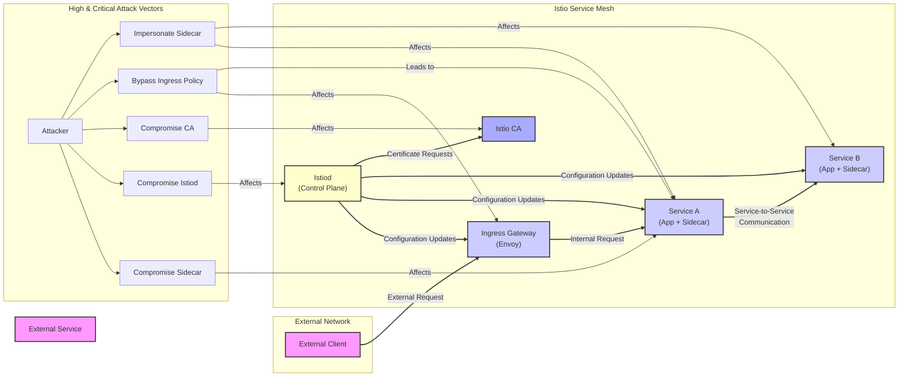

Here are the high and critical threats directly involving Istio:

*   **Threat:** Sidecar Compromise
    *   **Description:** An attacker gains control of an Envoy sidecar proxy. This could involve exploiting vulnerabilities in Envoy itself, leveraging misconfigurations in the sidecar's deployment or configuration. Once compromised, the attacker can intercept, modify, or redirect traffic passing through the sidecar, potentially injecting malicious content, stealing sensitive data, or disrupting communication.
    *   **Impact:**  Data breaches (sensitive data intercepted or exfiltrated), service disruption (traffic redirection or denial of service), integrity compromise (modified data or requests), potential for lateral movement within the mesh.
    *   **Affected Component:** Envoy Proxy (specifically the sidecar instance associated with a service).
    *   **Risk Severity:** High
    *   **Mitigation Strategies:**
        *   Keep Istio and Envoy versions up-to-date to patch known vulnerabilities.
        *   Implement strong container security practices (e.g., least privilege for containers, regular vulnerability scanning).
        *   Enforce strict network policies to limit communication between sidecars and other components.
        *   Utilize secure sidecar injection mechanisms to prevent rogue sidecars.
        *   Regularly audit sidecar configurations for misconfigurations.

*   **Threat:** Control Plane Compromise (Istiod)
    *   **Description:** An attacker gains unauthorized access to the Istiod control plane. This could be achieved through exploiting vulnerabilities in Istiod itself, compromising the underlying infrastructure where Istiod is running, or through leaked credentials. A compromised Istiod allows the attacker to manipulate the configuration of the entire service mesh, including routing rules, security policies, and certificate management.
    *   **Impact:** Widespread service disruption or outage, complete compromise of the service mesh security posture, unauthorized access to all services within the mesh, data breaches on a large scale, ability to inject malicious configurations affecting all services.
    *   **Affected Component:** Istiod (specifically its core functionalities for configuration management and distribution).
    *   **Risk Severity:** Critical
    *   **Mitigation Strategies:**
        *   Harden the infrastructure where Istiod is deployed (e.g., strong access controls, regular security patching).
        *   Implement strong authentication and authorization for accessing Istiod (e.g., mutual TLS for control plane communication).
        *   Regularly audit Istiod configurations and access logs.
        *   Minimize the attack surface of Istiod by disabling unnecessary features.
        *   Implement intrusion detection and prevention systems for the control plane.
        *   Use a separate, hardened environment for the control plane.

*   **Threat:** Ingress Gateway Bypass
    *   **Description:** An attacker bypasses the security policies enforced at the Ingress Gateway. This could involve exploiting vulnerabilities in the Ingress Gateway's Envoy configuration or finding loopholes in the defined routing rules or authorization policies. Successful bypass allows unauthorized access to internal services.
    *   **Impact:** Unauthorized access to internal applications and data, potential for further exploitation of internal services, circumvention of intended security controls.
    *   **Affected Component:** Ingress Gateway (specifically the Envoy proxy and its configured routing and security policies).
    *   **Risk Severity:** High
    *   **Mitigation Strategies:**
        *   Thoroughly review and test Ingress Gateway configurations and routing rules.
        *   Implement robust authorization policies at the Ingress Gateway (e.g., using Istio's AuthorizationPolicy).
        *   Regularly audit Ingress Gateway configurations for misconfigurations.
        *   Keep the Ingress Gateway's Envoy version up-to-date.
        *   Implement rate limiting and other traffic management techniques to mitigate abuse.

*   **Threat:** Certificate Authority (CA) Compromise
    *   **Description:** The Istio Certificate Authority (or an integrated certificate management system) is compromised. This could involve gaining access to the CA's private key or exploiting vulnerabilities in the CA software. A compromised CA allows an attacker to issue rogue certificates for any service within the mesh, enabling man-in-the-middle attacks and service impersonation.
    *   **Impact:** Complete loss of trust within the service mesh, ability to intercept and decrypt all communication, impersonation of any service, leading to data breaches and service disruption.
    *   **Affected Component:** Certificate Management (Istio CA or integrated solution like cert-manager).
    *   **Risk Severity:** Critical
    *   **Mitigation Strategies:**
        *   Securely store and manage the CA's private key using hardware security modules (HSMs) or similar secure storage.
        *   Implement strong access controls for the CA.
        *   Regularly rotate the CA's signing key.
        *   Monitor the CA for suspicious activity.
        *   Consider using a trusted external Certificate Authority.
        *   Implement certificate revocation mechanisms.

*   **Threat:** Sidecar Impersonation
    *   **Description:** An attacker deploys a rogue sidecar proxy that pretends to be a legitimate one within the mesh. This could be achieved by exploiting weaknesses in the sidecar injection process. A rogue sidecar can intercept traffic intended for the legitimate service, potentially stealing data or injecting malicious responses.
    *   **Impact:** Data breaches, service disruption, potential for man-in-the-middle attacks, compromise of service-to-service communication.
    *   **Affected Component:** Sidecar Injection mechanism and Envoy Proxy.
    *   **Risk Severity:** High
    *   **Mitigation Strategies:**
        *   Utilize automatic sidecar injection with namespace selectors to control where sidecars are injected.
        *   Implement validating admission webhooks to verify the authenticity and integrity of injected sidecars.
        *   Enforce mutual TLS (mTLS) to authenticate service identities and prevent unauthorized connections.
        *   Regularly monitor the service mesh for unexpected or unauthorized sidecars.

Here's the updated threat flow diagram:

