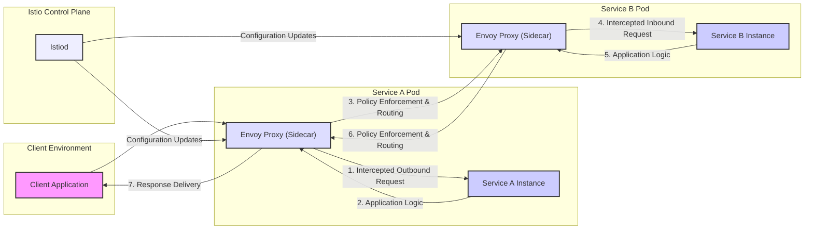

## Project Design Document: Istio Service Mesh - Revised

**1. Introduction**

This document provides a comprehensive design overview of the Istio service mesh architecture. It details the core components, their interactions, and the flow of requests within the mesh. This document is specifically crafted to serve as a foundational resource for subsequent threat modeling exercises.

**2. Project Overview**

Istio is a powerful, open-source service mesh that transparently integrates with existing distributed applications, primarily those running on container orchestration platforms like Kubernetes. It provides a unified platform to connect, secure, control, and observe microservices, significantly reducing the operational complexity of managing these architectures. Istio achieves this without requiring modifications to application code in most scenarios.

**3. Goals**

* **Secure Service Communication:**  Establish secure, authenticated, and encrypted communication between services using mutual TLS (mTLS).
* **Intelligent Traffic Management:** Enable fine-grained control over traffic flow, including routing, load balancing, retries, and fault injection.
* **Comprehensive Observability:** Provide deep insights into service behavior through metrics, distributed tracing, and access logs.
* **Robust Policy Enforcement:** Implement and enforce consistent security and operational policies across the service mesh.
* **Simplified Deployment Strategies:** Facilitate advanced deployment techniques like canary releases, blue/green deployments, and A/B testing.
* **Enhanced Reliability and Resilience:** Improve the overall stability and fault tolerance of microservice-based applications.

**4. Target Audience**

This document is primarily intended for:

* Security architects and engineers responsible for identifying and mitigating potential security threats.
* Software architects and developers designing and deploying applications within an Istio environment.
* DevOps and operations engineers managing and maintaining Istio infrastructure and applications.

**5. Scope**

This design document focuses on the fundamental architectural elements of Istio, specifically the data plane and control plane, and their interactions. It outlines the typical path a request takes within the mesh. While it touches upon key security features, detailed configurations and feature-specific implementations are outside the scope of this document.

**6. High-Level Architecture**

Istio's architecture is characterized by a clear separation of concerns, dividing the system into two primary planes:

* **Data Plane:** This layer handles the actual network traffic between services. It consists of intelligent proxy servers (Envoy) deployed as sidecar containers alongside each application instance. These proxies intercept all inbound and outbound traffic.
* **Control Plane:** This layer manages and configures the data plane proxies. It provides the intelligence, policies, and configuration necessary for the data plane to operate effectively.

**7. Key Components**

* **Envoy Proxy:**
    * A high-performance, open-source edge and service proxy, designed for cloud-native applications.
    * Deployed as a sidecar container alongside each service instance.
    * Key responsibilities include:
        * Dynamic service discovery.
        * Load balancing.
        * TLS termination.
        * HTTP/2 and gRPC proxying.
        * Circuit breaking.
        * Health checks.
        * Staged rollouts with percentage-based traffic splits.
        * Fault injection.
        * Rich metrics, logging, and tracing.
        * Authorization and authentication.

* **Istiod:**
    * The core component of the Istio control plane, representing a consolidation of previous control plane components.
    * Provides several key functionalities:
        * **Pilot (Traffic Management):**  Abstracts away the complexities of underlying infrastructure and enables sophisticated traffic routing rules, retries, timeouts, and fault injection. It translates high-level routing configurations into Envoy-specific configurations.
        * **Citadel (Security):** Provides service-to-service and end-user authentication with built-in identity and credential management. It handles certificate provisioning and rotation for mutual TLS.
        * **Galley (Configuration Management):**  Acts as the central configuration validation, processing, and distribution component. It isolates the rest of the Istio control plane from the details of underlying platform configuration mechanisms (like Kubernetes CRDs).
        * **Policy and Telemetry (Integrated):**  While the standalone Mixer component is deprecated, its core functionalities for policy enforcement (authorization, quotas) and telemetry collection are now integrated within Istiod and Envoy.

* **Istioctl:**
    * The command-line interface (CLI) tool for interacting with the Istio control plane.
    * Used for:
        * Installing and managing the Istio control plane.
        * Configuring routing rules, traffic policies, and security settings.
        * Inspecting the state of the service mesh.
        * Troubleshooting issues.

**8. Data Flow**

The following illustrates a typical request flow between two services within an Istio service mesh:

**Detailed Steps:**

* **1. Client Initiates Request:** The client application sends a request intended for Service B. This request is intercepted by the Envoy proxy running as a sidecar alongside the client application (assuming the client is also part of the mesh).
* **2. Service A Outbound Processing:** The request, now within the Service A pod, is handled by the Service A instance. When Service A needs to communicate with Service B, the outbound request is intercepted by the Service A's sidecar Envoy proxy.
* **3. Policy Enforcement and Routing (Service A Proxy):**
    * The Envoy proxy consults with the Istiod control plane to determine the appropriate destination for the request based on configured routing rules.
    * It enforces relevant policies, such as authentication (verifying Service B's identity using mTLS), authorization (checking if Service A is permitted to access Service B), and rate limiting.
    * Service discovery is performed to locate healthy instances of Service B.
* **4. Intercepted Inbound Request (Service B Proxy):** The request is routed to an Envoy proxy running as a sidecar alongside an instance of Service B. This proxy also intercepts the inbound request.
* **5. Service B Processing:** The Service B's Envoy proxy forwards the request to the actual Service B instance.
* **6. Policy Enforcement and Routing (Service B Proxy):** Before sending the response back, the Service B's Envoy proxy can enforce outbound policies and collect telemetry data.
* **7. Response Delivery:** The response from Service B is routed back through the Envoy proxies of both Service B and Service A, potentially undergoing further policy enforcement or telemetry collection, before finally reaching the client application.
* **Configuration Updates:** Istiod continuously distributes configuration updates (routing rules, security policies, etc.) to the Envoy proxies in the data plane, ensuring they have the latest information.

**9. Security Considerations**

* **Mutual TLS (mTLS) Everywhere:** Istio strongly emphasizes secure communication through automatic mTLS, ensuring that all service-to-service communication is authenticated and encrypted. Citadel (within Istiod) acts as the Certificate Authority (CA) for this process.
* **Strong Service Identity:** Istio provides a strong, verifiable identity for each service, which is used for authentication and authorization decisions.
* **Fine-grained Authorization:**  Istio enables the implementation of granular access control policies, allowing you to define precisely which services can access other services, based on service identities and other attributes.
* **Secure Control Plane Communication:** Communication between the control plane components and the data plane proxies is secured, preventing unauthorized access and manipulation.
* **Policy Enforcement Points:** Envoy proxies act as policy enforcement points, ensuring that security policies are consistently applied across the mesh.
* **Auditing and Logging:** Istio provides detailed audit logs and access logs, enabling monitoring and investigation of security events.
* **Vulnerability Management:** Regularly updating Istio components and Envoy proxies is crucial for patching security vulnerabilities.
* **Secure Secrets Management:**  Istio integrates with secure secret management solutions for managing sensitive credentials.

**10. Technology Stack**

* **Primary Programming Languages:** Go (primarily for control plane components), C++ (for the Envoy Proxy).
* **Containerization Platform:** Primarily designed for and deeply integrated with Docker.
* **Container Orchestration:** Primarily Kubernetes, but also supports other platforms like HashiCorp Nomad.
* **Proxy Server:** Envoy Proxy.
* **Configuration Management:** Kubernetes Custom Resource Definitions (CRDs) are the primary mechanism for configuring Istio.

**11. Diagrams**

* **High-Level Architecture Diagram:** A visual representation depicting the separation of the data plane and control plane, highlighting the key components within each.
* **Data Flow Diagram:** (As presented in section 8) Illustrating the path a request takes as it traverses the service mesh.

**12. Deployment Models (Brief Overview)**

* **In-cluster Deployment:** The most common model, where Istio control plane and data plane components run within the same Kubernetes cluster as the application services.
* **Multi-cluster Deployment:**  Extending the service mesh across multiple Kubernetes clusters, enabling communication and policy enforcement across cluster boundaries.
* **Multi-network Deployment:** Connecting services across different networks, potentially spanning different cloud providers or on-premise environments.

**13. Future Considerations**

* **Continued Evolution of Istiod:** Further consolidation and optimization of control plane functionalities within Istiod.
* **Enhanced WebAssembly (Wasm) Support:** Expanding the capabilities of Wasm integration for extending Envoy proxy functionality in a more flexible and secure manner.
* **Improvements in Observability:** Ongoing enhancements to metrics, distributed tracing capabilities, and logging features for deeper insights into mesh behavior.
* **Simplification of Configuration and Management:** Efforts to make Istio configuration more user-friendly and reduce operational overhead.
* **Advanced Security Features:** Continuous development and integration of new security features to address emerging threats and enhance the security posture of the service mesh.
