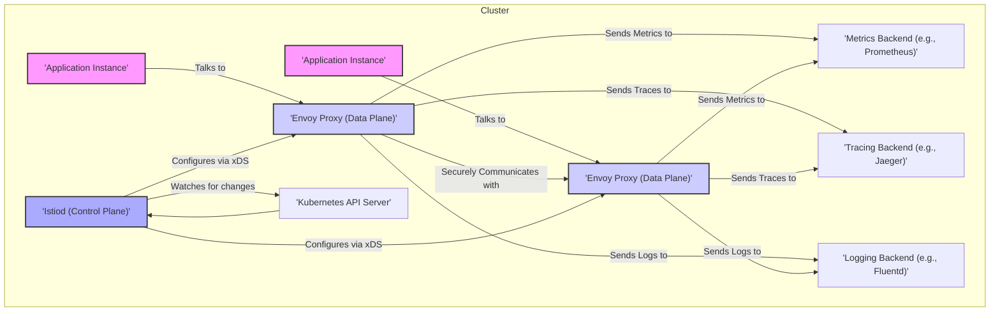
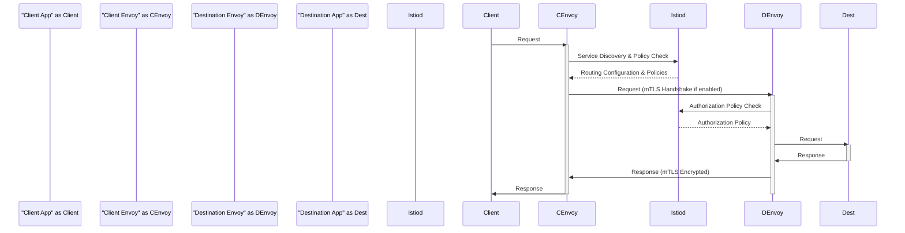

# Project Design Document: Istio Service Mesh

**Version:** 1.1
**Date:** October 26, 2023
**Author:** AI Software Architect

## 1. Introduction

This document provides an enhanced and detailed design overview of the Istio service mesh project. It elaborates on the key components, their interactions, and the overall architecture, providing a deeper understanding of the system. This document is intended to serve as a robust foundation for subsequent threat modeling activities.

## 2. Goals and Objectives

The primary goals of the Istio project are to:

*   Provide a transparent and language-agnostic way to connect, secure, control, and observe microservices within a distributed application.
*   Significantly simplify the operational complexities associated with managing large-scale microservice deployments.
*   Enable sophisticated traffic management capabilities, including intelligent routing based on various criteria, advanced load balancing strategies, and controlled fault injection for resilience testing.
*   Substantially enhance the security posture of microservices through features like automatic mutual TLS (mTLS) and granular, policy-driven access control.
*   Offer comprehensive and actionable observability into the behavior of the microservice mesh through detailed metrics, distributed tracing, and centralized logging.

## 3. High-Level Architecture

Istio functions as a comprehensive service mesh, acting as an infrastructure layer that transparently manages all service-to-service communication within a cluster or across multiple clusters. It is logically divided into two primary planes: the control plane and the data plane.

*   **Control Plane:**  The brain of the mesh, responsible for managing and configuring the data plane proxies based on user-defined configurations and observed system state.
*   **Data Plane:**  The workhorse of the mesh, composed of intelligent Envoy proxies deployed as sidecars alongside each application instance, intercepting and managing all network communication to and from those instances.

## 4. Component Details

### 4.1. Control Plane (Istiod)

Istiod is the central component of the Istio control plane, responsible for managing and distributing configuration to the Envoy proxies in the data plane. It encompasses several key sub-components:

*   **Pilot:**  Responsible for abstracting away the underlying infrastructure and providing a service discovery and traffic management capabilities. It translates high-level routing rules into Envoy-specific configurations.
*   **Citadel (now integrated into Istiod):**  Provides security capabilities, including certificate management and the provisioning of identities for workloads, enabling mTLS. It acts as the Certificate Authority (CA) for the mesh.
*   **Galley (now integrated into Istiod):**  Acts as the configuration ingestion, processing, and distribution component. It validates and distributes Istio API configurations to other control plane components.
*   **Policy and Telemetry:** While the core functionalities are within Pilot, Citadel, and Galley, Istiod orchestrates the distribution of authorization policies and the configuration required for telemetry collection.

### 4.2. Data Plane (Envoy Proxy)

Envoy is a high-performance, programmable proxy that is deployed as a sidecar container alongside each application instance within the service mesh. Its core responsibilities include:

*   **Dynamic Service Discovery:**  Discovers available service instances through the control plane.
*   **Load Balancing:**  Distributes traffic across healthy service instances based on configured load balancing policies.
*   **Traffic Routing:**  Routes requests based on various criteria, including headers, paths, and weights.
*   **Security Enforcement:**  Enforces authentication (mTLS), authorization policies, and other security rules.
*   **Protocol Support:** Supports various protocols, including HTTP/1.1, HTTP/2, gRPC, and TCP.
*   **Observability:**  Generates detailed metrics, distributed traces, and access logs for all traffic it handles.
*   **Fault Injection:**  Allows injecting faults (delays, errors) for resilience testing.

### 4.3. Istio Client (istioctl)

A command-line interface (CLI) tool used to interact with the Istio control plane. It allows users to:

*   Deploy and manage Istio within a cluster.
*   Configure Istio resources (e.g., VirtualServices, DestinationRules, Gateways).
*   Inspect the state of the service mesh.
*   Troubleshoot issues within the mesh.

### 4.4. Add-ons (Optional Components)

These are valuable, but optional, components that extend Istio's capabilities:

*   **Prometheus:** A widely-used time-series database used for collecting and storing metrics emitted by Envoy proxies and Istio control plane components.
*   **Grafana:** A powerful data visualization and dashboarding tool commonly used to create insightful dashboards based on Prometheus metrics.
*   **Jaeger/Zipkin:** Distributed tracing systems that allow developers to track requests as they propagate through the microservice mesh, aiding in performance analysis and debugging.
*   **Kiali:** A service mesh observability console providing a visual representation of the mesh topology, service health, and traffic flows.
*   **Fluentd/Elasticsearch/Kibana (EFK Stack):** A popular logging stack used for collecting, aggregating, indexing, and visualizing logs from applications and Istio components.

## 5. Data Flow

A typical request flow within the Istio service mesh involves a series of orchestrated steps, ensuring security, routing, and observability:

1. A client application initiates a request intended for a destination service.
2. The request is transparently intercepted by the Envoy proxy running as a sidecar alongside the client application. This interception is typically achieved through `iptables` rules.
3. The client-side Envoy proxy consults with the Istio control plane (Pilot) for service discovery information and applicable routing rules.
4. Based on the routing configuration, the client-side Envoy selects an appropriate destination service instance.
5. If mutual TLS (mTLS) is enabled, the client-side Envoy initiates an mTLS handshake with the Envoy proxy on the destination service, using identities provided by Istiod's certificate authority. This ensures mutual authentication and encrypted communication.
6. The request is forwarded to the Envoy proxy running alongside the destination service instance.
7. The destination-side Envoy proxy enforces configured authorization policies, verifying if the requesting service has permission to access the destination service.
8. After successful authorization, the request is forwarded to the actual destination application instance.
9. The destination application processes the request and generates a response.
10. The response is intercepted by the destination-side Envoy proxy.
11. The destination-side Envoy proxy collects telemetry data, including metrics, traces, and logs related to the request and response.
12. If mTLS is enabled, the destination-side Envoy ensures the response is securely transmitted back to the client-side Envoy.
13. The response is forwarded back to the client-side Envoy proxy.
14. The client-side Envoy proxy also collects telemetry data.
15. Finally, the response is delivered back to the originating client application.

## 6. Security Considerations

Istio provides a comprehensive suite of security features to protect microservice communication and data:

*   **Mutual TLS (mTLS):** Automatically provisions and manages cryptographic identities for each service, enabling strong mutual authentication and encryption of all inter-service communication. This prevents eavesdropping and man-in-the-middle attacks.
*   **Fine-grained Authorization:** Allows defining granular access control policies based on service identities, namespaces, HTTP methods, paths, and other request attributes. This enables implementing a zero-trust security model.
*   **Authentication Policies:** Supports various authentication mechanisms for incoming requests from outside the mesh, including JWT validation, allowing integration with existing identity providers.
*   **Secure Control Plane Communication:** Communication channels between Istiod and the Envoy proxies are secured, preventing unauthorized configuration changes or data breaches.
*   **Secrets Management Integration:** Integrates with secret management systems (like Kubernetes Secrets, HashiCorp Vault) for the secure storage and distribution of sensitive credentials, such as TLS certificates and keys.
*   **Network Policies:** While Istio manages traffic at the application layer, it can work in conjunction with network policies to further restrict network access at the IP address and port level.
*   **Audit Logging:** Provides detailed logs of security-related events, such as authentication and authorization decisions, enabling security monitoring and incident response.
*   **Certificate Rotation:** Automatically rotates TLS certificates, reducing the risk associated with compromised keys.
*   **Supply Chain Security:** Istio project emphasizes secure software supply chain practices for its components.

## 7. Deployment Models

Istio offers flexibility in deployment, catering to various infrastructure setups:

*   **On Kubernetes:** The most prevalent deployment model, leveraging Kubernetes' orchestration capabilities for deploying and managing Istio components and sidecar proxies.
*   **On Virtual Machines (VMs):** Istio can also be deployed in environments with traditional virtual machines, providing service mesh capabilities to non-containerized applications.
*   **Multi-Cluster Deployments:** Supports connecting and managing services distributed across multiple Kubernetes clusters, enabling global service discovery and traffic management.
*   **Multi-Cloud Deployments:**  Extends its reach to manage services deployed across different cloud providers, offering a consistent service mesh layer.

## 8. Future Considerations

The Istio project is actively developed, with ongoing efforts focused on:

*   **Performance and Scalability Enhancements:** Continuously optimizing the performance and scalability of both the control and data planes to handle increasingly large and complex deployments.
*   **Advanced Observability Features:**  Further enriching tracing capabilities with features like root cause analysis, enhancing metrics with more granular data, and improving log aggregation and analysis.
*   **Simplified Configuration and Management:**  Striving to make Istio configuration more user-friendly and intuitive through improved APIs and tooling.
*   **Integration with Emerging Technologies:**  Adapting to and integrating with new cloud-native technologies and architectural patterns, such as WebAssembly for Envoy extensions.
*   **Strengthened Security Posture:**  Continuously identifying and addressing potential security vulnerabilities, enhancing existing security features, and exploring new security paradigms.
*   **Extensibility and Customization:** Providing more robust mechanisms for extending Istio's functionality through APIs and plugins.

This improved document provides a more in-depth and nuanced understanding of the Istio project's design. It offers a stronger foundation for conducting comprehensive threat modeling and security analysis.