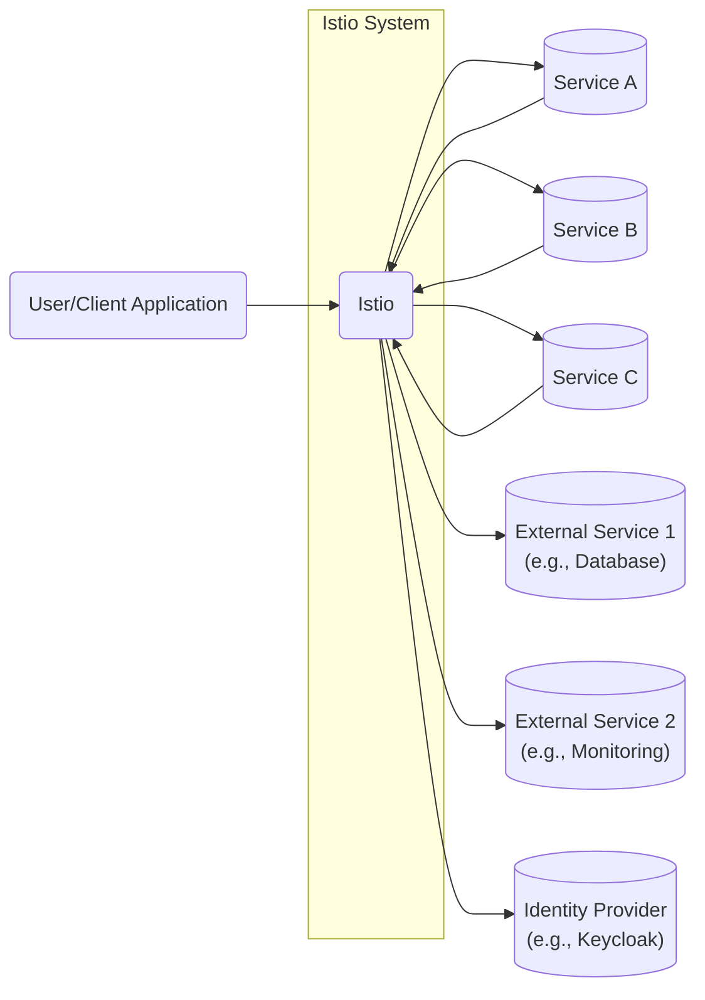
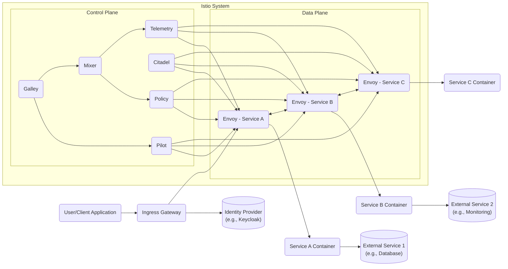
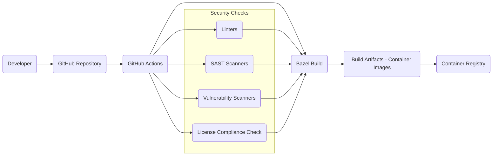

# BUSINESS POSTURE

Istio is a large, complex open-source project that aims to provide a uniform way to connect, manage, and secure microservices. It's widely adopted by organizations of all sizes, from startups to Fortune 500 companies. Given its nature, the business posture can be inferred as follows:

Priorities and Goals:

*   Enable organizations to successfully adopt and manage microservices architectures.
*   Provide a consistent and reliable platform for service-to-service communication.
*   Enhance the security posture of microservices deployments.
*   Improve observability and troubleshooting of distributed applications.
*   Reduce operational overhead associated with managing microservices.
*   Foster a vibrant open-source community and ecosystem.

Most Important Business Risks:

*   Security vulnerabilities in Istio itself could compromise the security of all connected microservices, leading to widespread data breaches or service disruptions.
*   Performance bottlenecks or instability in Istio could negatively impact the performance and availability of applications relying on it.
*   Complexity of Istio could hinder adoption and increase operational costs.
*   Lack of compatibility with other tools or platforms could limit its usefulness.
*   Failure to keep up with evolving industry standards and best practices could lead to obsolescence.
*   Insufficient community support or contribution could slow down development and issue resolution.

# SECURITY POSTURE

Istio incorporates a significant number of security features and addresses many security concerns inherent in microservices architectures.

Existing Security Controls:

*   security control: Mutual TLS (mTLS): Provides automatic encryption and authentication between services. Implemented via Envoy sidecars and Istio control plane components. Described throughout the Istio documentation and configuration examples.
*   security control: Authorization policies: Fine-grained access control for service-to-service communication. Implemented via Envoy sidecars and Istio control plane. Described in the Istio authorization documentation.
*   security control: Request Authentication (JWT validation): Verifies JSON Web Tokens (JWTs) for end-user authentication. Implemented via Envoy sidecars and Istio control plane. Described in the Istio authentication documentation.
*   security control: Peer Authentication: Enforces mutual TLS for service-to-service communication. Implemented via Envoy sidecars and Istio control plane.
*   security control: Certificate Authority (CA): Istio Citadel acts as a CA to manage certificates for mTLS. Described in the Istio security documentation.
*   security control: Secure Naming: Provides a secure way to identify services.
*   security control: Auditing: Istio provides auditing capabilities to track access and configuration changes.
*   security control: Rate Limiting: Can be configured to protect services from overload. Implemented via Envoy sidecars and Istio configuration.
*   security control: Regular security audits and penetration testing: Performed by the Istio community and third-party security firms. Reports and findings are often published on the Istio website.
*   security control: Secure software development practices: Including code reviews, static analysis, and vulnerability scanning. Described in the Istio development guidelines.

Accepted Risks:

*   accepted risk: Complexity of configuration: Istio's extensive configuration options can lead to misconfigurations and security vulnerabilities if not managed carefully.
*   accepted risk: Performance overhead: The addition of Envoy sidecars can introduce latency and resource consumption overhead.
*   accepted risk: Dependency on external components: Istio relies on Kubernetes and other components, inheriting their security risks.
*   accepted risk: Operational complexity: Managing Istio requires specialized knowledge and expertise.

Recommended Security Controls:

*   security control: Network policies: Implement Kubernetes network policies in addition to Istio authorization policies for defense-in-depth.
*   security control: Regular vulnerability scanning of container images: Integrate container image scanning into the CI/CD pipeline.
*   security control: Egress traffic control: Strictly control egress traffic from the mesh to prevent data exfiltration.
*   security control: Intrusion detection system (IDS): Deploy an IDS to monitor for malicious activity within the mesh.

Security Requirements:

*   Authentication:
    *   Strong mutual TLS (mTLS) should be enforced for all service-to-service communication within the mesh.
    *   Support for end-user authentication using JWT or other standard mechanisms.
    *   Integration with existing identity providers (IdPs).

*   Authorization:
    *   Fine-grained authorization policies based on service identity, request attributes, and other contextual information.
    *   Support for RBAC (Role-Based Access Control) and ABAC (Attribute-Based Access Control).
    *   Centralized policy management and enforcement.

*   Input Validation:
    *   While Istio primarily operates at the network layer, applications within the mesh should still perform thorough input validation to prevent application-level vulnerabilities.

*   Cryptography:
    *   Use of strong cryptographic algorithms and protocols (e.g., TLS 1.3).
    *   Secure key management and rotation.
    *   Protection of sensitive data in transit and at rest (where applicable).

# DESIGN

## C4 CONTEXT



Element List:

*   1.  Name: User/Client Application
    *   Type: External User/System
    *   Description: Represents an end-user or a client application interacting with services within the Istio service mesh.
    *   Responsibilities: Initiates requests to services within the mesh.
    *   Security controls: Authentication with JWT or other methods, TLS connection to the ingress gateway.

*   2.  Name: Service A
    *   Type: Internal Service
    *   Description: A microservice within the Istio service mesh.
    *   Responsibilities: Provides specific business functionality.
    *   Security controls: mTLS, authorization policies, request authentication.

*   3.  Name: Service B
    *   Type: Internal Service
    *   Description: A microservice within the Istio service mesh.
    *   Responsibilities: Provides specific business functionality.
    *   Security controls: mTLS, authorization policies, request authentication.

*   4.  Name: Service C
    *   Type: Internal Service
    *   Description: A microservice within the Istio service mesh.
    *   Responsibilities: Provides specific business functionality.
    *   Security controls: mTLS, authorization policies, request authentication.

*   5.  Name: Istio
    *   Type: System
    *   Description: The Istio service mesh itself.
    *   Responsibilities: Manages service-to-service communication, security, and observability.
    *   Security controls: mTLS, authorization policies, request authentication, certificate management, auditing.

*   6.  Name: External Service 1 (e.g., Database)
    *   Type: External System
    *   Description: An external service, such as a database, that services within the mesh interact with.
    *   Responsibilities: Provides data persistence or other external functionality.
    *   Security controls: Network policies, authentication, and authorization mechanisms specific to the external service.

*   7.  Name: External Service 2 (e.g., Monitoring)
    *   Type: External System
    *   Description: An external service, such as a monitoring system, that collects telemetry data from Istio.
    *   Responsibilities: Provides monitoring, logging, and tracing capabilities.
    *   Security controls: Secure communication channels, authentication, and authorization.

*   8.  Name: Identity Provider (e.g., Keycloak)
    *   Type: External System
    *   Description: An external identity provider used for end-user authentication.
    *   Responsibilities: Manages user identities and issues tokens.
    *   Security controls: Standard security practices for identity providers.

## C4 CONTAINER



Element List:

*   1.  Name: User/Client Application
    *   Type: External User/System
    *   Description: Represents an end-user or a client application.
    *   Responsibilities: Initiates requests to services.
    *   Security controls: Authentication with JWT, TLS connection.

*   2.  Name: Ingress Gateway
    *   Type: Container
    *   Description: Entry point for external traffic into the mesh.
    *   Responsibilities: Routing, TLS termination, load balancing.
    *   Security controls: TLS termination, request authentication, rate limiting.

*   3.  Name: Envoy - Service A
    *   Type: Container (Sidecar)
    *   Description: Envoy proxy sidecar for Service A.
    *   Responsibilities: Handles all network traffic for Service A, enforcing security policies.
    *   Security controls: mTLS, authorization policies, request authentication.

*   4.  Name: Service A Container
    *   Type: Container
    *   Description: Container running the Service A application code.
    *   Responsibilities: Provides specific business functionality.
    *   Security controls: Application-level security controls, input validation.

*   5.  Name: Envoy - Service B
    *   Type: Container (Sidecar)
    *   Description: Envoy proxy sidecar for Service B.
    *   Responsibilities: Handles all network traffic for Service B, enforcing security policies.
    *   Security controls: mTLS, authorization policies, request authentication.

*   6.  Name: Service B Container
    *   Type: Container
    *   Description: Container running the Service B application code.
    *   Responsibilities: Provides specific business functionality.
    *   Security controls: Application-level security controls, input validation.

*   7.  Name: Envoy - Service C
    *   Type: Container (Sidecar)
    *   Description: Envoy proxy sidecar for Service C.
    *   Responsibilities: Handles all network traffic for Service C, enforcing security policies.
    *   Security controls: mTLS, authorization policies, request authentication.

*   8.  Name: Service C Container
    *   Type: Container
    *   Description: Container running the Service C application code.
    *   Responsibilities: Provides specific business functionality.
    *   Security controls: Application-level security controls, input validation.

*   9.  Name: Pilot
    *   Type: Container
    *   Description: Manages and configures Envoy proxies.
    *   Responsibilities: Service discovery, traffic management configuration.
    *   Security controls: Access control to Pilot API, secure communication with Envoys.

*   10. Name: Citadel
    *   Type: Container
    *   Description: Certificate Authority, manages certificates for mTLS.
    *   Responsibilities: Issues and manages certificates, key management.
    *   Security controls: Secure key storage, access control to Citadel API.

*   11. Name: Galley
    *   Type: Container
    *   Description: Configuration validation and distribution.
    *   Responsibilities: Validates Istio configuration, distributes configuration to other control plane components.
    *   Security controls: Access control to Galley API.

*   12. Name: Mixer
    *   Type: Container
    *   Description: (Deprecated in newer Istio versions, replaced by in-proxy extensions) Enforces policies and collects telemetry.
    *   Responsibilities: Policy enforcement, telemetry collection.
    *   Security controls: Access control to Mixer API.

*   13. Name: Policy
    *   Type: Container/Component within Mixer
    *   Description: Policy enforcement component.
    *   Responsibilities: Enforces authorization policies.
    *   Security controls: Access control, secure communication with Envoys.

*   14. Name: Telemetry
    *   Type: Container/Component within Mixer
    *   Description: Telemetry collection component.
    *   Responsibilities: Collects metrics, traces, and logs.
    *   Security controls: Access control, secure communication with Envoys.

*   15. Name: External Service 1 (e.g., Database)
    *   Type: External System
    *   Description: An external service, such as a database.
    *   Responsibilities: Provides data persistence.
    *   Security controls: Network policies, authentication, and authorization mechanisms specific to the external service.

*   16. Name: External Service 2 (e.g., Monitoring)
    *   Type: External System
    *   Description: An external monitoring system.
    *   Responsibilities: Provides monitoring, logging, and tracing capabilities.
    *   Security controls: Secure communication channels, authentication, and authorization.

*   17. Name: Identity Provider (e.g., Keycloak)
    *   Type: External System
    *   Description: An external identity provider.
    *   Responsibilities: Manages user identities and issues tokens.
    *   Security controls: Standard security practices for identity providers.

## DEPLOYMENT

Istio is typically deployed into a Kubernetes cluster. Other deployment options exist (e.g., VMs, Nomad), but Kubernetes is the most common and recommended. We'll focus on the Kubernetes deployment.

Deployment Options:

1.  Kubernetes (most common and recommended)
2.  Virtual Machines (less common, more complex)
3.  HashiCorp Nomad (supported, but less mature)

Chosen Deployment: Kubernetes

```mermaid
graph LR
    subgraph Kubernetes Cluster
        subgraph Control Plane Namespace (istio-system)
            PilotPod(Pilot Pod)
            CitadelPod(Citadel Pod)
            GalleyPod(Galley Pod)
            MixerPod(Mixer Pod)
            IngressGatewayPod(Ingress Gateway Pod)
            K8sAPI[("Kubernetes API Server")]
        end
        subgraph Application Namespace (default)
            ServiceAPod(Service A Pod)
            ServiceBPod(Service B Pod)
            ServiceCPod(Service C Pod)
            EnvoyA(Envoy - Service A)
            EnvoyB(Envoy - Service B)
            EnvoyC(Envoy - Service C)
        end
    end

    PilotPod --> K8sAPI
    CitadelPod --> K8sAPI
    GalleyPod --> K8sAPI
    MixerPod --> K8sAPI
    IngressGatewayPod --> K8sAPI
    ServiceAPod -- contains --> EnvoyA
    ServiceBPod -- contains --> EnvoyB
    ServiceCPod -- contains --> EnvoyC
    K8sAPI --> ServiceAPod
    K8sAPI --> ServiceBPod
    K8sAPI --> ServiceCPod

```

Element List:

*   1.  Name: Pilot Pod
    *   Type: Kubernetes Pod
    *   Description: Pod running the Istio Pilot component.
    *   Responsibilities: Service discovery, traffic management configuration.
    *   Security controls: Kubernetes RBAC, network policies, secure communication with Kubernetes API server and Envoys.

*   2.  Name: Citadel Pod
    *   Type: Kubernetes Pod
    *   Description: Pod running the Istio Citadel component.
    *   Responsibilities: Certificate issuance and management.
    *   Security controls: Kubernetes RBAC, network policies, secure key storage, access control to Citadel API.

*   3.  Name: Galley Pod
    *   Type: Kubernetes Pod
    *   Description: Pod running the Istio Galley component.
    *   Responsibilities: Configuration validation and distribution.
    *   Security controls: Kubernetes RBAC, network policies, access control to Galley API.

*   4.  Name: Mixer Pod
    *   Type: Kubernetes Pod
    *   Description: Pod running the Istio Mixer component (deprecated in newer versions).
    *   Responsibilities: Policy enforcement and telemetry collection.
    *   Security controls: Kubernetes RBAC, network policies, access control to Mixer API.

*   5.  Name: Ingress Gateway Pod
    *   Type: Kubernetes Pod
    *   Description: Pod running the Istio Ingress Gateway.
    *   Responsibilities: Exposes services to external traffic.
    *   Security controls: Kubernetes RBAC, network policies, TLS termination, request authentication.

*   6.  Name: Kubernetes API Server
    *   Type: Kubernetes Component
    *   Description: The control plane for Kubernetes.
    *   Responsibilities: Manages the Kubernetes cluster.
    *   Security controls: Kubernetes RBAC, TLS, authentication, and authorization.

*   7.  Name: Service A Pod
    *   Type: Kubernetes Pod
    *   Description: Pod running the Service A application and its Envoy sidecar.
    *   Responsibilities: Runs Service A.
    *   Security controls: Kubernetes RBAC, network policies, mTLS, authorization policies.

*   8.  Name: Service B Pod
    *   Type: Kubernetes Pod
    *   Description: Pod running the Service B application and its Envoy sidecar.
    *   Responsibilities: Runs Service B.
    *   Security controls: Kubernetes RBAC, network policies, mTLS, authorization policies.

*   9.  Name: Service C Pod
    *   Type: Kubernetes Pod
    *   Description: Pod running the Service C application and its Envoy sidecar.
    *   Responsibilities: Runs Service C.
    *   Security controls: Kubernetes RBAC, network policies, mTLS, authorization policies.

*   10. Name: Envoy - Service A
    *   Type: Container
    *   Description: Envoy proxy sidecar for Service A.
    *   Responsibilities: Handles all network traffic for Service A.
    *   Security controls: mTLS, authorization policies.

*   11. Name: Envoy - Service B
    *   Type: Container
    *   Description: Envoy proxy sidecar for Service B.
    *   Responsibilities: Handles all network traffic for Service B.
    *   Security controls: mTLS, authorization policies.

*   12. Name: Envoy - Service C
    *   Type: Container
    *   Description: Envoy proxy sidecar for Service C.
    *   Responsibilities: Handles all network traffic for Service C.
    *   Security controls: mTLS, authorization policies.

## BUILD

Istio's build process is complex and involves multiple repositories and build systems. The primary build system is based on Bazel, and the build artifacts are container images published to a container registry. GitHub Actions are used for CI/CD.



Security Controls in Build Process:

*   security control: Code reviews: All code changes undergo mandatory code reviews before merging.
*   security control: Static analysis (SAST): Static analysis tools are used to identify potential security vulnerabilities in the code.
*   security control: Vulnerability scanning: Container images are scanned for known vulnerabilities.
*   security control: License compliance checks: Ensure compliance with open-source licenses.
*   security control: Build automation: The build process is fully automated using GitHub Actions.
*   security control: Reproducible builds: Bazel enables reproducible builds, ensuring consistency and integrity.
*   security control: Supply chain security: Efforts are made to secure the software supply chain, including signing releases and verifying dependencies.

# RISK ASSESSMENT

Critical Business Processes:

*   Service-to-service communication: Istio is critical for enabling secure and reliable communication between microservices.
*   Application deployment and management: Istio facilitates the deployment and management of microservices.
*   Security enforcement: Istio enforces security policies for microservices.
*   Observability and monitoring: Istio provides observability features for monitoring the health and performance of microservices.

Data Sensitivity:

*   The data handled by Istio itself is primarily configuration data and telemetry data. The sensitivity of this data is relatively low.
*   However, Istio manages the communication of microservices, which may handle highly sensitive data, such as:
    *   Personally Identifiable Information (PII)
    *   Financial data
    *   Protected Health Information (PHI)
    *   Authentication credentials
    *   Proprietary business data

The sensitivity of the data handled by the microservices protected by Istio is high. Istio's security features are crucial for protecting this data.

# QUESTIONS & ASSUMPTIONS

Questions:

*   What specific compliance requirements (e.g., PCI DSS, HIPAA) apply to the applications that will be using Istio?
*   What are the specific performance requirements and SLAs for the applications?
*   What is the existing infrastructure and tooling landscape?
*   What is the level of expertise with Kubernetes and service meshes within the organization?
*   What are the specific threat models for the applications?
*   Are there any specific external services or systems that require special consideration?
*   What is the process for managing and rotating secrets (e.g., API keys, certificates)?
*   What is the incident response plan in case of a security breach?

Assumptions:

*   BUSINESS POSTURE: The organization has a moderate to high-risk appetite, typical of organizations adopting microservices and cloud-native technologies.
*   BUSINESS POSTURE: The organization prioritizes security but also needs to balance it with agility and innovation.
*   SECURITY POSTURE: The organization has a basic understanding of security best practices for Kubernetes and microservices.
*   SECURITY POSTURE: There is an existing Kubernetes cluster in place.
*   DESIGN: The default Kubernetes deployment model is sufficient.
*   DESIGN: The Istio project's own build and release processes are followed.
*   DESIGN: The organization will leverage Istio's built-in security features (mTLS, authorization policies) as the primary means of securing service-to-service communication.