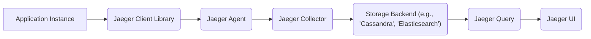

# Project Design Document: Jaeger Distributed Tracing System

**Version:** 1.1
**Date:** October 26, 2023
**Author:** AI Software Architect

## 1. Introduction

This document provides an enhanced design overview of the Jaeger distributed tracing system. Jaeger is a mature, open-source distributed tracing system designed for monitoring and troubleshooting transaction latency and performance issues within complex, microservices-based distributed systems. This document aims to provide a comprehensive and detailed understanding of Jaeger's architecture, individual components, and the flow of tracing data. This detailed design will serve as a robust foundation for subsequent threat modeling exercises. This document is based on the information available at the official Jaeger GitHub repository: [https://github.com/jaegertracing/jaeger](https://github.com/jaegertracing/jaeger).

## 2. Goals and Objectives

The primary goals and objectives of the Jaeger project are to:

*   Enable comprehensive monitoring and efficient troubleshooting of transaction latency and performance bottlenecks in complex distributed systems.
*   Facilitate rapid root cause analysis in microservice architectures by visualizing the complete request path.
*   Provide clear insights into service dependencies and the nature of interactions between services within a distributed environment.
*   Support performance optimization efforts and efficient resource utilization by identifying areas of inefficiency.
*   Offer a platform for understanding the overall health and behavior of distributed applications.

## 3. High-Level Architecture

Jaeger's architecture is modular and comprises several distinct components that collaborate to collect, process, store, and enable the visualization of tracing data. The following diagram illustrates the high-level architecture and the relationships between the core components:

## 4. Component Details

This section provides an in-depth description of each component within the Jaeger architecture, outlining their specific functionalities, responsibilities, and key features.

### 4.1. Jaeger Client Libraries

*   **Functionality:**  These language-specific libraries are used to instrument application code, enabling the generation of tracing data in the form of spans.
*   **Responsibilities:**
    *   Creation and management of spans, where each span represents a logical unit of work within a distributed transaction (e.g., a function call, a database query, an HTTP request).
    *   Automatic propagation of trace context across service boundaries. This ensures that spans belonging to the same logical transaction are correctly linked together, forming a complete trace. This propagation typically involves injecting headers into outgoing requests.
    *   Transmission of generated spans to the designated Jaeger Agent.
*   **Key Features:**
    *   Support for various context propagation formats, including widely adopted standards like B3 and W3C Trace Context, ensuring interoperability with other tracing systems.
    *   Configurable sampling strategies, allowing developers to control the volume of tracing data generated based on factors like request rate or specific conditions.
    *   Seamless integration with common logging frameworks, enabling correlation between logs and traces for enhanced debugging.
    *   Support for adding custom tags and baggage to spans, providing rich contextual information for analysis.

### 4.2. Jaeger Agent

*   **Functionality:**  A lightweight network daemon that operates as a sidecar or on the host, listening for spans emitted by application clients, typically over UDP for efficiency.
*   **Responsibilities:**
    *   Receiving spans from instrumented application instances.
    *   Batching received spans to optimize network transmission efficiency to the Jaeger Collector.
    *   Adding essential host and process-level metadata to the spans, enriching the tracing data.
*   **Key Features:**
    *   Designed to minimize overhead on application instances by offloading span processing and forwarding tasks.
    *   Offers configurable reporting intervals and maximum packet sizes to fine-tune performance and resource utilization.
    *   Commonly deployed as a sidecar container alongside application instances in containerized environments like Kubernetes, providing isolation and resource management.

### 4.3. Jaeger Collector

*   **Functionality:**  A central component responsible for receiving spans from Jaeger Agents, performing initial processing, and persisting them to the configured storage backend.
*   **Responsibilities:**
    *   Validation of incoming spans to ensure data integrity.
    *   Indexing spans based on key attributes to facilitate efficient querying later.
    *   Persisting the processed spans to the designated storage backend, such as Cassandra or Elasticsearch.
*   **Key Features:**
    *   Designed for scalability and fault tolerance to handle high volumes of tracing data in production environments.
    *   Supports a pluggable architecture for integrating with various storage backends, offering flexibility in deployment.
    *   Provides extension points for performing data transformations or enrichment before storage.

### 4.4. Storage Backend

*   **Functionality:**  Provides the persistent storage mechanism for the collected tracing data.
*   **Responsibilities:**
    *   Reliable and durable storage of spans and traces.
    *   Efficient querying capabilities to retrieve tracing data based on various criteria.
*   **Supported Backends (Examples):**
    *   **Cassandra:** A highly scalable, distributed NoSQL database suitable for large-scale tracing deployments.
    *   **Elasticsearch:** A powerful search and analytics engine that enables full-text search and aggregation of tracing data.
    *   **Kafka:** Can be used as a streaming backend for real-time analysis and integration with other systems.
    *   **Memory:**  An in-memory storage option primarily intended for development and testing purposes.
    *   **BadgerDB:** An embedded key-value database, suitable for smaller deployments or specific use cases.
*   **Key Considerations:**
    *   Scalability and performance characteristics are crucial for handling the expected volume of tracing data.
    *   Data retention policies need to be defined and implemented based on storage capacity and compliance requirements.

### 4.5. Jaeger Query

*   **Functionality:**  Exposes an API that allows users and the Jaeger UI to retrieve trace data from the storage backend.
*   **Responsibilities:**
    *   Handling user queries for traces based on a variety of criteria, including service name, operation name, tags, and time range.
    *   Aggregating and formatting the retrieved trace data for presentation in the Jaeger UI.
*   **Key Features:**
    *   Provides a RESTful API for programmatic access to tracing data.
    *   Supports advanced filtering and sorting of traces to narrow down results.

### 4.6. Jaeger UI

*   **Functionality:**  A user-friendly, web-based interface for visualizing and analyzing collected traces.
*   **Responsibilities:**
    *   Presenting traces in a clear and intuitive format, displaying the timeline of events and the relationships between individual spans within a trace.
    *   Enabling users to search for specific traces based on various criteria.
    *   Visualizing service dependencies derived from the tracing data, providing a graphical representation of service interactions.
    *   Displaying key performance metrics extracted from tracing data, such as latency distributions.
*   **Key Features:**
    *   Detailed trace visualization, allowing users to inspect individual spans and their associated metadata (tags, logs).
    *   Interactive service dependency graph, providing a high-level overview of the system architecture.
    *   Powerful filtering and searching capabilities to quickly locate relevant traces.

## 5. Data Flow

The journey of tracing data through the Jaeger system follows a well-defined path:

1. **Instrumentation and Span Creation:** Within an application instance, code instrumented with a Jaeger client library initiates the tracing process. When a request enters the application, a root span is typically created to represent the initial entry point. As the request traverses different services or components, child spans are generated to represent the work performed by each of these entities. These spans are linked together to form a cohesive trace.
2. **Span Emission to the Agent:** The Jaeger client library, configured within the application, transmits the generated spans to the designated Jaeger Agent. This communication often occurs over UDP for its efficiency and lower overhead.
3. **Agent Batching and Forwarding:** The Jaeger Agent receives the individual spans, groups them into batches, and then forwards these batches to the Jaeger Collector. This batching mechanism optimizes network utilization.
4. **Collection and Storage Persistence:** The Jaeger Collector receives the batched spans from the Agent. It performs validation checks on the incoming data and then proceeds to write the spans to the configured storage backend.
5. **Querying for Trace Data:** When a user interacts with the Jaeger UI to investigate application behavior, the UI sends requests to the Jaeger Query component.
6. **Retrieval from Storage:** The Jaeger Query component processes these requests and retrieves the relevant trace data from the underlying storage backend based on the specified query parameters.
7. **Visualization in the UI:** The Jaeger Query component returns the retrieved trace data to the Jaeger UI. The UI then renders this data in a user-friendly format, allowing users to visualize the flow of requests and analyze performance characteristics.

```mermaid
graph LR
    A["Application Instance"] --> B("Jaeger Client Library");
    B -- "Spans (typically UDP)" --> C("Jaeger Agent");
    C -- "Batched Spans" --> D("Jaeger Collector");
    D -- "Spans" --> E["Storage Backend ('Cassandra' / 'Elasticsearch')"];
    F["Jaeger UI"] -- "Query Request" --> G("Jaeger Query");
    G -- "Trace Data" --> E;
    E -- "Trace Data" --> G;
    G -- "Trace Data for Visualization" --> F;
    style A fill:#f9f,stroke:#333,stroke-width:2px
    style B fill:#ccf,stroke:#333,stroke-width:2px
    style C fill:#ccf,stroke:#333,stroke-width:2px
    style D fill:#ccf,stroke:#333,stroke-width:2px
    style E fill:#aaf,stroke:#333,stroke-width:2px
    style F fill:#ddf,stroke:#333,stroke-width:2px
    style G fill:#ddf,stroke:#333,stroke-width:2px
```

## 6. Deployment Model

The deployment of Jaeger components can be tailored to the specific needs and scale of the environment. Here are common deployment models:

*   **All-in-One (Development/Testing):**  All core Jaeger components (Agent, Collector, Query, UI) and an in-memory storage backend are run within a single process. This model is ideal for local development, experimentation, and testing due to its simplicity.
*   **Agent as a Sidecar (Kubernetes):** The Jaeger Agent is deployed as a sidecar container alongside each application instance within a Kubernetes pod. The Collector, Query, UI, and a persistent storage backend are deployed as separate, centralized services. This is a highly recommended model for Kubernetes environments, providing isolation and efficient resource utilization.
*   **Agent on the Host:** The Jaeger Agent runs directly on the same host (virtual machine or physical server) as the application instances it monitors. This model can be suitable for non-containerized environments.
*   **Centralized Agent (Less Common):** A single, centralized Jaeger Agent instance receives spans from multiple application instances. While simpler to manage initially, this model can introduce a single point of failure and potential performance bottlenecks in larger deployments.
*   **Distributed Collectors (Production):** Multiple Jaeger Collector instances are deployed behind a load balancer for high availability, fault tolerance, and increased processing capacity. This model is essential for production environments with significant tracing data volume.

## 7. Security Considerations (Preliminary)

Security is a crucial aspect of any production system. Here are some preliminary security considerations for Jaeger deployments:

*   **Secure Communication:**
    *   Employ TLS (Transport Layer Security) to encrypt communication channels between Jaeger components, such as between the Agent and Collector, and between the Query component and the storage backend. This protects sensitive tracing data in transit.
*   **Authentication and Authorization:**
    *   Implement robust authentication mechanisms to verify the identity of users accessing the Jaeger UI and API.
    *   Utilize authorization policies to control access to tracing data based on user roles and permissions. This prevents unauthorized access to sensitive information.
*   **Data Security at Rest:**
    *   Consider encryption at rest for the tracing data stored in the backend (e.g., using encryption features provided by Cassandra or Elasticsearch). This protects data if the storage system is compromised.
    *   Implement appropriate access control mechanisms at the storage layer to restrict access to tracing data.
*   **Input Validation and Sanitization:**
    *   Thoroughly validate incoming spans at the Jaeger Collector to prevent malicious data injection attacks. Sanitize any user-provided data within spans to mitigate potential risks.
*   **Agent Endpoint Security:**
    *   Secure the endpoint where the Jaeger Agent receives spans from applications. Consider using authentication or network segmentation to restrict access to authorized applications.
*   **Rate Limiting:**
    *   Implement rate limiting on the Jaeger Collector to prevent denial-of-service attacks from overwhelming the system with excessive tracing data.
*   **Regular Security Audits:**
    *   Conduct regular security audits of the Jaeger deployment and its configuration to identify and address potential vulnerabilities.

## 8. Assumptions and Constraints

*   It is assumed that the underlying network infrastructure provides reliable and low-latency communication between Jaeger components and application instances.
*   The selection of the storage backend will significantly impact the scalability, performance, and cost of the Jaeger deployment.
*   Effective instrumentation of applications using the Jaeger client libraries is paramount for generating meaningful tracing data.
*   The configuration of appropriate sampling strategies is crucial for managing the volume of tracing data generated and its impact on storage and processing resources.

## 9. Future Considerations

*   **Enhanced Integration with Observability Platforms:** Explore deeper integration with other observability tools and platforms, such as Prometheus for metrics and Grafana for unified dashboards.
*   **Advanced Analytics and Alerting:** Develop more sophisticated analytics capabilities based on tracing data to identify performance anomalies and trigger alerts automatically.
*   **Support for Additional Storage Backends:** Continuously evaluate and potentially add support for new and emerging storage technologies.
*   **Improved UI Features:** Enhance the Jaeger UI with more advanced features for trace analysis, such as flame graphs, span comparison tools, and more granular filtering options.
*   **Automated Instrumentation:** Investigate and implement techniques for automated instrumentation to reduce the manual effort required to integrate tracing into applications.

## 10. Glossary

*   **Span:** A fundamental unit of work in a distributed transaction. It encapsulates information about an operation, including its name, start and end timestamps, tags (key-value metadata), and logs.
*   **Trace:** A directed acyclic graph (DAG) of spans that represents the complete end-to-end journey of a request as it propagates through a distributed system.
*   **Context Propagation:** The mechanism by which trace-related information (such as the trace ID and span ID) is transmitted between services involved in a transaction, ensuring that spans are correctly linked together.
*   **Sampling:** The process of selectively choosing a subset of requests to be traced. This is essential for managing the volume of tracing data, especially in high-traffic environments.
*   **Instrumentation:** The act of modifying application code to generate tracing data using a tracing library (like a Jaeger client library).
*   **Baggage:** Key-value pairs that are propagated along with the trace context and can be used to carry application-specific information across service boundaries.
