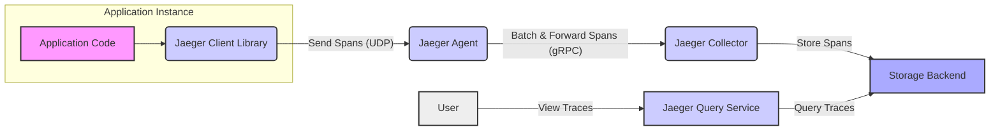
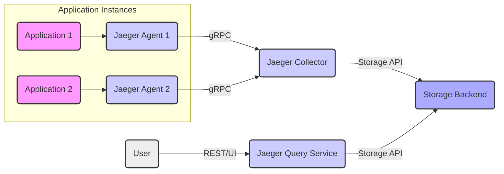
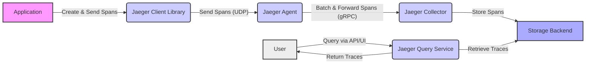

# Project Design Document: Jaeger Tracing System

**Version:** 1.1
**Date:** October 26, 2023
**Author:** AI Software Architect

## 1. Introduction

This document provides a detailed architectural design of the Jaeger distributed tracing system. It outlines the core components, their responsibilities, interactions, and data flow within the system. This document serves as a foundation for understanding the system's structure and will be used as input for subsequent threat modeling activities. The design is based on the publicly available information for the Jaeger project found at [https://github.com/jaegertracing/jaeger](https://github.com/jaegertracing/jaeger). This version includes more detail on component configurations and potential security considerations.

## 2. System Architecture

Jaeger employs a distributed microservices architecture to collect, process, and visualize tracing data. The primary components are:

*   **Jaeger Client Libraries:** Language-specific libraries integrated into applications to generate and send tracing data. These libraries are configured with the address of the Jaeger Agent.
*   **Jaeger Agent:** A network daemon, typically deployed as a sidecar, that listens for spans sent by application clients over UDP. It batches these spans before forwarding them to the collectors, improving efficiency. Agents are configured with the address(es) of the Jaeger Collector(s).
*   **Jaeger Collector:** Receives traces from the agents, processes them (including validation and enrichment), and persists them into the configured storage backend. Collectors are configured with the details of the storage backend.
*   **Jaeger Query Service:** Provides an API (typically RESTful) to retrieve and visualize traces stored in the backend. The Query Service is configured with the details of the storage backend.
*   **Storage Backend:** A persistent storage system used by the collectors to store trace data. Common options include Cassandra, Elasticsearch, and Kafka. The choice of backend impacts scalability and operational complexity.

## 3. Component Details

### 3.1. Jaeger Client Libraries

*   **Purpose:** To enable application instrumentation for tracing, requiring minimal application code changes.
*   **Key Functionalities:**
    *   Creating and managing spans, defining the start and end of operations and their attributes.
    *   Propagating trace context across service boundaries, ensuring a single trace can span multiple services. This often involves injecting trace IDs into HTTP headers or other communication mechanisms.
    *   Sending spans to the configured Jaeger Agent (typically over UDP). Configuration options include sampling strategies and agent address.
    *   Providing APIs for custom instrumentation, allowing developers to add specific information to spans.
*   **Key Considerations for Threat Modeling:**
    *   Potential vulnerabilities in the client library code itself (e.g., buffer overflows, insecure defaults).
    *   Misconfiguration of the client library leading to excessive data being sent, data leaks (if sensitive information is inadvertently included in spans), or denial of service (if the agent address is incorrect or malicious).
    *   Exposure of sensitive data within trace spans if developers are not careful about the data they include.
    *   Dependency vulnerabilities in the client library's dependencies.

### 3.2. Jaeger Agent

*   **Purpose:** To act as a local, lightweight process to receive spans from application instances, reducing the overhead on the application and providing a single point of configuration for sending spans.
*   **Key Functionalities:**
    *   Listening for spans on a specified port (typically UDP port 6831 for the Jaeger Thrift protocol).
    *   Buffering spans in memory to handle bursts of traffic and improve efficiency. Configuration options include buffer size and flush interval.
    *   Forwarding batches of spans to one or more collectors (typically over gRPC). Configuration includes the collector address(es) and connection parameters.
    *   Optionally providing basic authentication/authorization mechanisms, though this is less common at the agent level.
*   **Key Considerations for Threat Modeling:**
    *   Vulnerability of the UDP endpoint to denial-of-service attacks (UDP is connectionless and can be easily spoofed).
    *   Potential for eavesdropping on UDP traffic if not on a secure network. Consider using encryption or deploying agents on a private network.
    *   Security of the gRPC connection to the collector (should use TLS).
    *   Resource exhaustion on the agent due to excessive span volume or malicious actors sending large numbers of spans.
    *   Vulnerabilities in the agent process itself.

### 3.3. Jaeger Collector

*   **Purpose:** To receive, process, validate, and store trace data persistently.
*   **Key Functionalities:**
    *   Receiving spans from agents (typically over gRPC on port 14250 for the Jaeger gRPC protocol).
    *   Validating incoming spans to ensure they conform to the expected format.
    *   Processing and potentially enriching spans with additional metadata.
    *   Persisting spans to the configured storage backend. Configuration includes the type of storage and connection details.
    *   Indexing trace data to enable efficient querying by the Query Service.
*   **Key Considerations for Threat Modeling:**
    *   Vulnerability of the gRPC endpoint to attacks. Ensure mutual TLS (mTLS) is used for authentication and encryption.
    *   Potential for data injection or corruption if input validation is insufficient. Malicious agents could send crafted spans.
    *   Security of the connection to the storage backend (authentication, authorization, encryption).
    *   Resource exhaustion on the collector due to high throughput of spans.
    *   Vulnerabilities in the collector process itself.
    *   Denial of service by sending malformed or excessively large spans.

### 3.4. Jaeger Query Service

*   **Purpose:** To provide a user interface and API for querying and visualizing stored trace data, enabling users to understand the flow of requests through their distributed systems.
*   **Key Functionalities:**
    *   Providing a RESTful API (typically on port 16686) for querying traces based on various criteria (service name, operation name, tags, time range, trace ID, etc.).
    *   Retrieving trace data from the storage backend based on user queries.
    *   Formatting and presenting trace data in a user-friendly manner through a web UI.
    *   Providing API endpoints for retrieving service and operation names.
*   **Key Considerations for Threat Modeling:**
    *   Vulnerabilities in the REST API (e.g., injection attacks, authentication/authorization bypass). Implement proper authentication (e.g., API keys, OAuth 2.0) and authorization mechanisms.
    *   Exposure of sensitive data through the API responses if access control is not properly implemented.
    *   Security of the connection to the storage backend (authentication and authorization).
    *   Denial of service by overwhelming the query service with excessive or complex queries.
    *   Cross-site scripting (XSS) vulnerabilities in the web UI.
    *   Information disclosure through API endpoints if not properly secured.

### 3.5. Storage Backend

*   **Purpose:** To provide scalable and reliable persistent storage for trace data.
*   **Key Functionalities:**
    *   Storing large volumes of trace data efficiently.
    *   Providing efficient read access for querying by the Jaeger Query Service.
    *   Supporting data retention policies to manage storage costs. Configuration is highly dependent on the chosen backend.
*   **Common Options:**
    *   **Cassandra:** A distributed NoSQL database known for its scalability and fault tolerance. Requires careful schema design and management.
    *   **Elasticsearch:** A distributed search and analytics engine, well-suited for full-text search and aggregations on trace data. Requires careful resource management.
    *   **Kafka:** A distributed streaming platform, often used as a buffer before data is consumed and persisted elsewhere. Requires a separate consumer to store the data long-term.
*   **Key Considerations for Threat Modeling:**
    *   Security vulnerabilities specific to the chosen storage backend (refer to the security documentation of Cassandra, Elasticsearch, Kafka, etc.).
    *   Access control and authentication mechanisms for the storage backend. Ensure only authorized Jaeger components can access the data.
    *   Data encryption at rest and in transit.
    *   Data integrity and availability. Protect against data loss and corruption.
    *   Proper configuration of the storage backend to prevent unauthorized access or modification.

## 4. Data Flow

The typical data flow within the Jaeger system is as follows:

1. An application instrumented with a Jaeger Client Library executes an operation that needs to be traced.
2. The client library, based on its configuration and sampling rules, creates a span representing this operation.
3. The client library injects context information (trace ID, span ID, etc.) into outgoing requests to downstream services.
4. The client library sends the completed span to the configured Jaeger Agent (typically over UDP).
5. The Jaeger Agent receives the span, buffers it, and periodically sends batches of spans to a configured Jaeger Collector (typically over gRPC).
6. The Jaeger Collector receives the batch of spans, validates them, and processes them.
7. The Jaeger Collector persists the processed spans to the configured Storage Backend.
8. A user interacts with the Jaeger Query Service (through its API or UI) to search for and view traces.
9. The Jaeger Query Service authenticates and authorizes the user's request.
10. The Jaeger Query Service constructs a query based on the user's criteria and sends it to the Storage Backend.
11. The Storage Backend retrieves the matching trace data.
12. The Jaeger Query Service receives the trace data from the Storage Backend.
13. The Jaeger Query Service formats the trace data and returns it to the user.

## 5. Deployment Options

Jaeger offers flexible deployment options, each with different security implications:

*   **All-in-One (Development/Testing):** All Jaeger components (agent, collector, query service, and in-memory storage) run in a single process. This simplifies setup but is highly insecure and not recommended for production.
*   **Agent as a Sidecar (Recommended):** The Jaeger Agent runs as a sidecar container alongside the application instance in environments like Kubernetes. This isolates the agent and simplifies network configuration.
*   **Agent as a Host DaemonSet (Kubernetes):** The Jaeger Agent runs as a DaemonSet on each host in a Kubernetes cluster, collecting spans from applications running on that node. This reduces the number of agent instances.
*   **Collector and Query Service as Deployments (Kubernetes/Containers):** The Jaeger Collector and Query Service are typically deployed as stateless deployments in a container orchestration platform like Kubernetes, allowing for scaling and resilience.
*   **External Storage Backend (Managed Services):** Utilizing managed services for the storage backend (e.g., AWS Managed Cassandra Service, Elasticsearch Service) offloads operational burden but requires careful consideration of the security implications of using a third-party service.

## 6. Security Considerations (Detailed)

This section expands on the initial security considerations, providing more specific potential threats for each component.

*   **Network Security:**
    *   Ensure all communication between components (agent-collector, collector-storage, query-storage) uses TLS/HTTPS for encryption and authentication.
    *   Isolate Jaeger components within a private network or use network policies to restrict access.
    *   Consider using mutual TLS (mTLS) for enhanced authentication between components.
*   **Authentication and Authorization:**
    *   Implement strong authentication for the Jaeger Query Service API and UI. Consider API keys, OAuth 2.0, or SAML.
    *   Implement role-based access control (RBAC) to restrict access to sensitive trace data based on user roles.
    *   Secure access to the storage backend using appropriate authentication mechanisms provided by the storage system.
*   **Input Validation:**
    *   Thoroughly validate all inputs received by the Jaeger Collector to prevent data injection attacks.
    *   Sanitize user inputs to the Jaeger Query Service to prevent injection attacks and cross-site scripting (XSS).
*   **Data Security:**
    *   Implement encryption at rest for the storage backend.
    *   Consider data masking or redaction techniques to prevent the exposure of sensitive information within spans. Educate developers on best practices for avoiding inclusion of sensitive data.
*   **Access Control:**
    *   Restrict access to the storage backend to only authorized Jaeger components.
    *   Apply the principle of least privilege to all Jaeger components and their access to resources.
*   **Resource Limits:**
    *   Configure resource limits (CPU, memory) for each Jaeger component to prevent denial-of-service attacks.
    *   Implement rate limiting on the Jaeger Query Service API to prevent abuse.
*   **Monitoring and Logging:**
    *   Implement comprehensive monitoring and logging for all Jaeger components to detect and respond to security incidents.
    *   Regularly review logs for suspicious activity.
*   **Dependency Management:**
    *   Keep all dependencies (libraries, frameworks) up-to-date to patch known vulnerabilities.
    *   Use vulnerability scanning tools to identify and address potential risks.
*   **Secure Deployment Practices:**
    *   Follow secure deployment practices for the chosen environment (e.g., least privilege for container users, secure container images).
    *   Regularly scan container images for vulnerabilities.
*   **Specific Threats by Component:**
    *   **Client Libraries:** Vulnerable dependencies, insecure defaults leading to data leaks, man-in-the-middle attacks if communication with the agent is not secured.
    *   **Jaeger Agent:** UDP flood attacks, eavesdropping on UDP traffic, resource exhaustion.
    *   **Jaeger Collector:** Data injection attacks, denial of service through malformed spans, unauthorized access to the storage backend.
    *   **Jaeger Query Service:** Injection attacks (SQL, command), authentication bypass, authorization flaws, cross-site scripting (XSS), information disclosure.
    *   **Storage Backend:** Unauthorized access, data breaches, data corruption, denial of service.

## 7. Diagrams

### 7.1. High-Level Architecture

### 7.2. Data Flow Diagram

