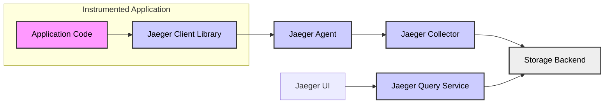
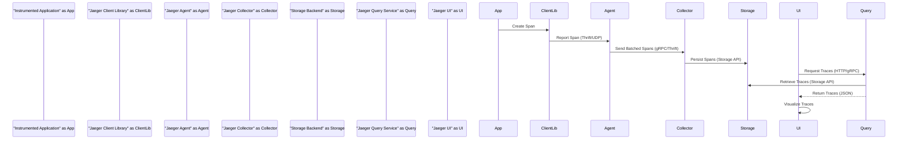

# Project Design Document: Jaeger Tracing System

**Project Name:** Jaeger Tracing System

**Project Repository:** [https://github.com/jaegertracing/jaeger](https://github.com/jaegertracing/jaeger)

**Document Version:** 1.1
**Date:** 2023-10-27
**Author:** AI Software Architect

## 1. Introduction

This document provides a comprehensive design overview of the Jaeger tracing system, an open-source distributed tracing platform. Jaeger is designed for monitoring and troubleshooting complex microservices-based distributed systems. By tracking requests as they traverse services, Jaeger offers invaluable insights into performance bottlenecks, service dependencies, and overall system behavior. This document serves as a detailed architectural blueprint for understanding Jaeger and is specifically crafted to facilitate subsequent threat modeling exercises.

## 2. System Overview

Jaeger's architecture prioritizes scalability, adaptability, and ease of deployment across diverse environments. It comprises several interconnected components that collaboratively handle the collection, processing, storage, and visualization of trace data. The key components are:

*   **Jaeger Client Libraries:** Instrumentation libraries embedded within applications to generate trace data in a standardized format.
*   **Jaeger Agent:** A network daemon acting as a local collector, efficiently batching and forwarding spans from client libraries to the central Collector.
*   **Jaeger Collector:** The central processing unit that receives, validates, enriches, and persists trace data to the chosen storage backend.
*   **Jaeger Query Service:** An API-driven service providing functionalities to query and retrieve trace data from the storage backend.
*   **Jaeger UI:** A user-friendly web interface for visualizing, analyzing, and exploring collected trace data.
*   **Storage Backend:** A pluggable persistent storage system for trace data, supporting options like Cassandra, Elasticsearch, and Kafka.

## 3. Architecture Diagram

This diagram illustrates the high-level architecture of the Jaeger system and the interactions between its components.

## 4. Component Description

### 4.1. Jaeger Client Libraries

*   **Purpose:** To instrument applications with tracing capabilities. These libraries are language-specific and provide APIs for creating and managing spans, adding contextual information, and propagating trace context.
*   **Functionality:**
    *   **Span Lifecycle Management:** APIs to initiate, annotate (with tags and logs), and finalize spans representing operations within an application.
    *   **Context Propagation:** Automatic injection and extraction of trace context (trace ID, span ID, baggage) into inter-service communication mechanisms (e.g., HTTP headers, message queues). This ensures trace continuity across service boundaries.
    *   **Sampling Configuration:** Mechanisms to configure sampling strategies (e.g., probabilistic, adaptive) to control the volume of traces generated and sent, especially crucial in high-throughput systems.
    *   **Agent Communication:**  Handles communication with the Jaeger Agent, typically via UDP or HTTP using the Thrift protocol.
    *   **Extensibility:**  Often offer extension points for custom samplers, reporters, and context propagation mechanisms.
*   **Technology:** Available in multiple languages: Go, Java, Python, Node.js, C++, C#, Ruby, and PHP, ensuring broad application support.

### 4.2. Jaeger Agent

*   **Purpose:** To act as a local span collector, decoupling client libraries from the central Collector and providing buffering and batching capabilities. This reduces the load on applications and the Collector.
*   **Functionality:**
    *   **Span Reception (Thrift/UDP & HTTP):** Listens for spans from client libraries over UDP (efficient for high throughput) or HTTP (for environments where UDP is restricted), using the Thrift protocol for serialization.
    *   **Span Batching:** Accumulates spans in batches before forwarding them to the Collector, optimizing network utilization and improving Collector efficiency.
    *   **Buffering and Retries:** Provides in-memory buffering to handle temporary network outages or Collector unavailability, with retry mechanisms to ensure span delivery.
    *   **Local Sampling (Optional):** Can perform local, agent-side sampling as a secondary sampling layer to further reduce the volume of spans sent to the Collector, based on configured strategies.
    *   **Collector Discovery:**  Supports configuration for static Collector endpoints or DNS-based service discovery to locate Collectors dynamically.
*   **Technology:** Implemented in Go, ensuring performance and efficiency. Designed to be lightweight and deployable as a sidecar or host-level daemon.

### 4.3. Jaeger Collector

*   **Purpose:** To receive, process, and store trace data. It is the central component responsible for data ingestion and persistence.
*   **Functionality:**
    *   **Span Ingestion (gRPC & Thrift/HTTP):** Receives batches of spans from Agents over gRPC (for high performance) or HTTP (Thrift protocol).
    *   **Span Validation:** Validates incoming spans to ensure data integrity and adherence to the expected data format.
    *   **Span Enrichment & Processing:**  Provides extension points for custom span processors to enrich spans with additional metadata or perform transformations before storage.
    *   **Indexing for Querying:** Indexes spans based on key attributes (service name, operation name, tags, trace ID) to enable efficient querying by the Query Service.
    *   **Storage Backend Interaction:**  Writes processed and indexed spans to the configured storage backend, abstracting away storage-specific details from other components.
    *   **Scalability & High Availability:** Designed to be horizontally scalable by deploying multiple Collector instances behind a load balancer.
*   **Technology:** Developed in Go for performance and scalability. Leverages gRPC for efficient inter-component communication.

### 4.4. Jaeger Query Service

*   **Purpose:** To provide a query API for retrieving trace data from the storage backend, serving requests from the Jaeger UI and potentially other consumers.
*   **Functionality:**
    *   **Trace Retrieval API:** Exposes RESTful and gRPC APIs to query and retrieve traces based on various criteria:
        *   Trace ID lookup for direct trace retrieval.
        *   Service and operation name filtering.
        *   Tag-based filtering for searching traces with specific attributes.
        *   Time range queries to retrieve traces within a specific timeframe.
        *   Duration-based filtering to find slow or fast operations.
    *   **Service & Operation Discovery API:** Provides endpoints to discover available services and operations names based on the data present in the storage backend, aiding in UI auto-completion and filtering.
    *   **Data Transformation for UI:**  Formats and transforms retrieved trace data into a structure suitable for visualization by the Jaeger UI.
    *   **Caching (Optional):** May implement caching mechanisms to improve query performance and reduce load on the storage backend for frequently accessed data.
*   **Technology:** Implemented in Go, optimized for query performance and efficient data retrieval from various storage backends.

### 4.5. Jaeger UI

*   **Purpose:** To provide a user-friendly web interface for visualizing, exploring, and analyzing trace data, enabling users to understand system behavior and diagnose issues.
*   **Functionality:**
    *   **Trace Visualization (Gantt Charts):** Presents traces as interactive Gantt-like charts, visually representing the timeline of spans, their relationships (parent-child, follows-from), and associated metadata (tags, logs).
    *   **Trace Filtering & Searching:** Offers powerful filtering and search capabilities to narrow down traces of interest based on:
        *   Service name, operation name.
        *   Tags and log messages.
        *   Time range and duration.
        *   Error status.
    *   **Service Dependency Graph Visualization:** Generates and displays a service dependency graph derived from trace data, illustrating the interactions and dependencies between services in the system.
    *   **Trace Comparison:**  Allows users to compare traces to identify performance differences or anomalies.
    *   **Configuration & Customization:** Provides options to configure UI settings, such as the Query Service endpoint, display preferences, and potentially user authentication integration.
*   **Technology:** Built using Javascript and React, providing a modern and responsive user experience.

### 4.6. Storage Backend

*   **Purpose:** To provide persistent, scalable, and reliable storage for trace data collected by Jaeger. The choice of storage backend significantly impacts performance, scalability, and operational complexity.
*   **Functionality:**
    *   **Data Persistence & Durability:** Ensures long-term storage and durability of trace data, allowing for historical analysis and trend identification.
    *   **Efficient Data Indexing:** Provides indexing mechanisms optimized for trace data querying patterns, enabling fast retrieval of traces by the Query Service.
    *   **Scalability & Performance:** Designed to handle large volumes of trace data generated by distributed systems and provide acceptable query latency.
    *   **Data Management (Retention, Archival):**  May offer features for data retention policies, archival, and data lifecycle management to control storage costs and comply with regulations.
*   **Technology:** Supports pluggable storage backends, offering flexibility in deployment:
    *   **Cassandra:** A distributed NoSQL database, ideal for high write throughput, scalability, and fault tolerance. Recommended for production environments with high trace volume.
    *   **Elasticsearch:** A distributed search and analytics engine, providing powerful full-text search capabilities and scalability. Suitable for environments requiring complex search queries and analytics.
    *   **Kafka + Consumer:**  Kafka acts as a message queue for ingestion, with a separate consumer application responsible for persisting data to a database (e.g., Cassandra or Elasticsearch). Useful for decoupling ingestion and storage.
    *   **Memory (In-Memory):**  For development and testing purposes only. Data is not persistent and is lost upon Jaeger Collector restart.
    *   **BadgerDB (Experimental):** An embedded key-value store, suitable for smaller deployments or evaluation.
    *   **ClickHouse (Experimental):** A column-oriented database, optimized for analytical queries.

## 5. Data Flow - Detailed

The data flow within Jaeger is crucial to understand for performance and security considerations.

1.  **Instrumentation & Span Creation:** Developers instrument application code using Jaeger Client Libraries. When an operation begins, the library creates a `Span` object, representing a unit of work.
2.  **Context Propagation:** If the operation involves calls to downstream services, the client library automatically propagates the trace context (Trace ID, Span ID, and Baggage) to these services. This is typically done by injecting context into HTTP headers, gRPC metadata, or message queue headers.
3.  **Span Reporting to Agent:** Upon completion of the operation (span), the client library reports the completed span to the configured Jaeger Agent. Communication usually happens over UDP using the Thrift protocol for efficiency.
4.  **Agent Batching & Forwarding:** The Jaeger Agent receives spans, batches them to improve network efficiency, and forwards these batches to the Jaeger Collector. Communication between Agent and Collector can be over gRPC or Thrift/HTTP.
5.  **Collector Processing & Storage:** The Jaeger Collector receives span batches, validates them, and potentially enriches them. It then indexes the spans for efficient querying and persists them to the configured Storage Backend.
6.  **Querying via Query Service:** When a user interacts with the Jaeger UI to view traces, the UI sends requests to the Jaeger Query Service.
7.  **Storage Retrieval by Query Service:** The Query Service queries the Storage Backend based on the UI's request, retrieving relevant trace data.
8.  **Visualization in UI:** The Query Service returns the trace data to the Jaeger UI, which visualizes it in a user-friendly format, allowing users to analyze and understand the distributed transaction flow.

**Data Flow Diagram:**

## 6. Technology Stack - Detailed

*   **Core Components (Agent, Collector, Query Service):**
    *   **Programming Language:** Go - chosen for performance, concurrency, and efficient network handling.
    *   **Communication Protocols:** gRPC (high-performance), Thrift (legacy, still supported), HTTP (REST API for Query Service), UDP (Agent to Client).
    *   **Data Serialization:** Thrift (primary for span data), Protocol Buffers (gRPC), JSON (Query Service API responses).
    *   **Configuration Management:**  YAML, command-line flags, environment variables.
    *   **Containerization & Orchestration:** Docker images provided, Kubernetes deployment manifests and Helm charts available for easy deployment and scaling.

*   **Client Libraries:**
    *   **Programming Languages:** Go, Java, Javascript, Python, C++, C#, Ruby, PHP - language-specific implementations to integrate with diverse application environments.
    *   **Communication Protocols:** Thrift/UDP, Thrift/HTTP - to communicate with Jaeger Agent.
    *   **Dependency Management:** Language-specific package managers (Go Modules, Maven, npm, pip, NuGet, RubyGems, Composer).

*   **Jaeger UI:**
    *   **Frontend Framework:** React - for building a dynamic and interactive user interface.
    *   **Javascript:** Core language for UI logic and interactions.
    *   **Build Tools:** npm, Webpack, or similar Javascript build tools.

*   **Storage Backends:**
    *   **Cassandra:** Java, CQL (Cassandra Query Language).
    *   **Elasticsearch:** Java, REST API, Lucene (search engine).
    *   **Kafka:** Java, Kafka Streams (for consumer application).
    *   **BadgerDB:** Go (embedded database).
    *   **ClickHouse:** C++, ClickHouse SQL.

## 7. Deployment Options - Expanded

Jaeger offers flexible deployment options catering to different scales and environments:

*   **All-in-One (Development & Testing):**
    *   Packages all Jaeger backend components (Collector, Query Service, UI) and an in-memory storage backend into a single executable.
    *   Simplest deployment for local development, demonstrations, and basic testing.
    *   Not suitable for production due to lack of scalability, persistence, and high availability.
    *   Easy to start with `docker run jaegertracing/all-in-one:latest`.

*   **Production Deployment (Microservices Architecture):**
    *   **Decoupled Components:** Each component (Agent, Collector, Query Service, UI, Storage) is deployed and scaled independently.
    *   **Jaeger Agents as Sidecars/Host Agents:** Agents are typically deployed as sidecars alongside application instances in containers (e.g., Kubernetes) or as host-level daemons on VMs. This ensures low latency span reporting.
    *   **Clustered Collectors:** Multiple Jaeger Collector instances are deployed behind a load balancer (e.g., Kubernetes Service, Nginx) for high availability and increased ingestion throughput.
    *   **Scalable Storage Backend Cluster:** A robust and scalable storage backend cluster (Cassandra or Elasticsearch) is essential for production workloads. Consider managed cloud services for easier operation.
    *   **Load-Balanced Query Services:** Multiple Query Service instances behind a load balancer to handle UI and API query load.
    *   **Separate Jaeger UI Deployment:** Jaeger UI is deployed as a standalone application, often behind a reverse proxy for security and access control.
    *   **Example Deployment Platforms:** Kubernetes, OpenShift, AWS ECS, Google Kubernetes Engine (GKE), Azure Kubernetes Service (AKS).

*   **Cloud-Managed Jaeger (Vendor Solutions):**
    *   Cloud providers offer managed Jaeger services (e.g., AWS X-Ray, Google Cloud Trace, Azure Monitor Application Insights - which can ingest Jaeger data).
    *   Simplifies operations by offloading infrastructure management, scaling, and maintenance to the cloud provider.
    *   May offer tighter integration with other cloud services and enhanced features.
    *   Consider vendor lock-in and cost implications when choosing managed solutions.

## 8. Security Considerations - In-Depth

Security is paramount for any monitoring system, including Jaeger, as it handles sensitive operational data. Here's a more detailed breakdown of security considerations:

*   **Data in Transit Encryption (TLS/SSL):**
    *   **Agent to Collector:**  Enable TLS/SSL encryption for communication between Jaeger Agents and Collectors, especially if communication traverses untrusted networks. Configure gRPC and HTTP connections to use TLS.
    *   **Collector to Storage:** Encrypt communication between Collectors and the Storage Backend if the storage backend supports it (e.g., Cassandra, Elasticsearch TLS configuration).
    *   **Query Service to UI:**  Use HTTPS for communication between the Jaeger UI and the Query Service to protect user credentials and trace data transmitted over the web.
    *   **Internal Component Communication:** Consider TLS for internal communication within the Jaeger backend components in highly sensitive environments.

*   **Data at Rest Encryption:**
    *   **Storage Backend Encryption:** Leverage encryption-at-rest capabilities provided by the chosen storage backend (Cassandra, Elasticsearch, cloud-managed storage services). This protects trace data if the storage media is compromised.
    *   **Configuration Secrets Encryption:** Securely manage and encrypt configuration secrets (e.g., storage backend credentials, TLS certificates) used by Jaeger components. Use secret management tools (HashiCorp Vault, Kubernetes Secrets).

*   **Authentication and Authorization:**
    *   **Collector API Authentication:** Implement authentication for the Jaeger Collector's span ingestion API to prevent unauthorized injection of spans. This can be achieved using API keys, mutual TLS, or integration with identity providers.
    *   **Query Service API Authentication & Authorization:** Secure the Query Service API with authentication (e.g., OAuth 2.0, OpenID Connect, API keys) to verify the identity of clients (Jaeger UI, other applications). Implement authorization policies to control access to trace data based on user roles or permissions.
    *   **Jaeger UI Authentication & Authorization:** Integrate Jaeger UI with an authentication provider (e.g., LDAP, Active Directory, OAuth 2.0) to control user access. Implement role-based access control (RBAC) to restrict access to sensitive features or data based on user roles.

*   **Input Validation & Sanitization:**
    *   **Collector Input Validation:** Implement robust input validation in the Jaeger Collector to sanitize and validate incoming spans from Agents. Prevent injection attacks (e.g., log injection, tag injection) by validating data types, lengths, and formats.
    *   **Query Service Input Validation:** Sanitize and validate user inputs to the Query Service API to prevent query injection attacks (e.g., NoSQL injection if using Elasticsearch).

*   **Access Control & Network Segmentation:**
    *   **Storage Backend Access Control:** Restrict access to the storage backend to only authorized Jaeger components (Collector, Query Service). Use network firewalls and database access control lists (ACLs).
    *   **Network Segmentation:** Segment the Jaeger deployment into different network zones based on security sensitivity. Isolate the storage backend in a more secure zone, and place Agents closer to application workloads.

*   **Security Auditing & Logging:**
    *   **Audit Logging:** Enable audit logging for Jaeger components to track security-related events (e.g., authentication attempts, authorization decisions, configuration changes).
    *   **Security Monitoring:** Integrate Jaeger logs and metrics with security monitoring systems (SIEM) to detect and respond to security incidents.

*   **Regular Security Updates & Vulnerability Management:**
    *   Keep Jaeger components and dependencies up-to-date with the latest security patches.
    *   Regularly scan Jaeger deployments for known vulnerabilities using vulnerability scanning tools.
    *   Follow security best practices for container images and base operating systems.

## 9. Assets, Threats, and Vulnerabilities - For Threat Modeling

To facilitate threat modeling, let's explicitly outline assets, potential threats, and vulnerabilities within the Jaeger system:

**Assets:**

*   **Trace Data:** The primary asset. Contains sensitive operational data about application performance, transactions, and dependencies. Confidentiality, integrity, and availability of trace data are crucial.
*   **Jaeger Components (Agent, Collector, Query Service, UI):** Infrastructure components that need to be protected from compromise to ensure system functionality and data security.
*   **Configuration Data:** Configuration files, secrets, and settings required for Jaeger components to operate. Compromise can lead to system malfunction or security breaches.
*   **Storage Backend:**  The persistent storage system holding trace data. Its security is critical for data confidentiality, integrity, and availability.

**Potential Threats:**

*   **Data Breach (Confidentiality):** Unauthorized access to trace data by malicious actors, leading to exposure of sensitive operational information.
*   **Data Tampering (Integrity):** Modification or deletion of trace data, leading to inaccurate monitoring and troubleshooting, or hiding malicious activities.
*   **Denial of Service (Availability):** Attacks targeting Jaeger components to disrupt trace collection, processing, querying, or visualization, hindering monitoring and incident response.
*   **Unauthorized Span Injection:** Malicious actors injecting fake or misleading spans to pollute trace data, disrupt analysis, or hide malicious activities.
*   **Component Compromise:**  Compromise of Jaeger components (Agent, Collector, Query Service, UI) allowing attackers to gain control of the system, access data, or pivot to other systems.
*   **Insider Threats:** Malicious or negligent actions by authorized users with access to Jaeger components or data.
*   **Supply Chain Attacks:** Vulnerabilities introduced through compromised dependencies or third-party components used by Jaeger.

**Potential Vulnerabilities:**

*   **Unsecured Communication Channels:** Lack of TLS/SSL encryption for communication between components, exposing data in transit.
*   **Weak Authentication & Authorization:** Insufficient or missing authentication and authorization mechanisms for Jaeger APIs and UI, allowing unauthorized access.
*   **Input Validation Flaws:** Lack of proper input validation in Collector and Query Service, leading to injection vulnerabilities.
*   **Software Vulnerabilities:** Known vulnerabilities in Jaeger components or dependencies that can be exploited by attackers.
*   **Misconfigurations:** Insecure configurations of Jaeger components or storage backend, weakening security posture.
*   **Insufficient Access Controls:** Overly permissive access controls to Jaeger components, storage backend, or configuration data.
*   **Lack of Security Monitoring:** Inadequate security monitoring and logging, hindering detection and response to security incidents.

This expanded design document, particularly with the added security considerations and the assets, threats, and vulnerabilities section, provides a robust foundation for conducting a thorough threat modeling exercise for the Jaeger tracing system. This will enable the identification of specific security risks and the development of appropriate mitigation strategies to ensure a secure and reliable tracing infrastructure.