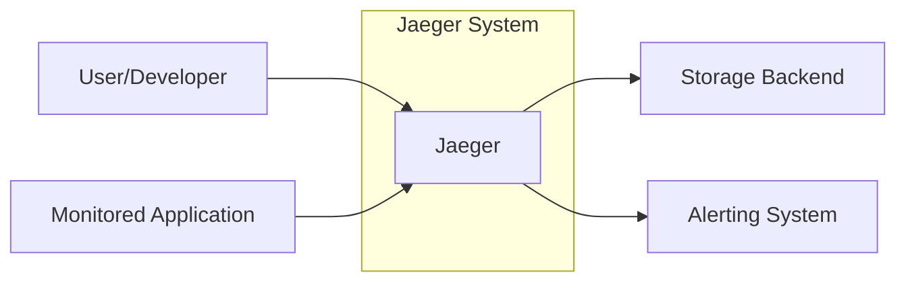
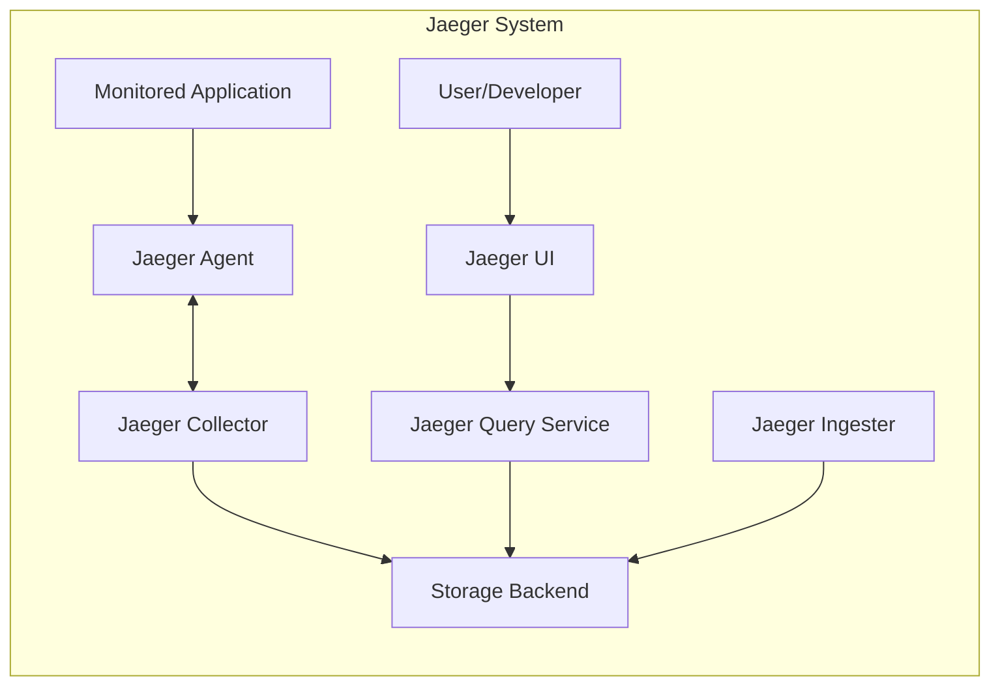
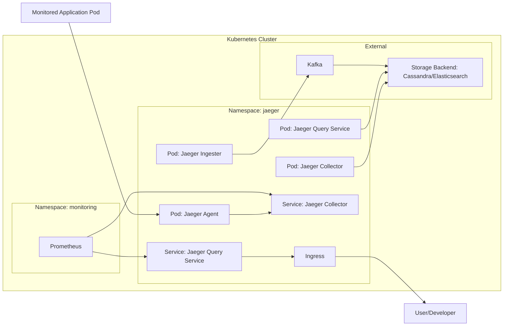
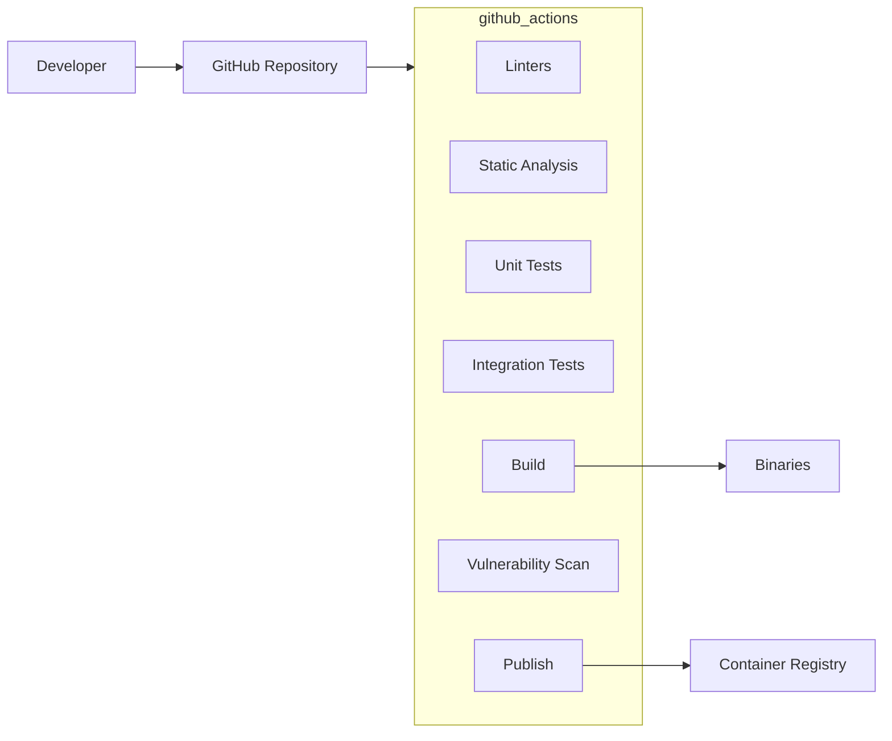

Okay, let's create a design document for the Jaeger project, focusing on aspects relevant for threat modeling.

# BUSINESS POSTURE

Jaeger is a distributed tracing system.  It's used to monitor and troubleshoot microservices-based distributed systems.  The business priorities and goals it addresses are:

*   Observability: Providing deep visibility into the performance and behavior of complex, distributed applications.  This allows organizations to quickly identify bottlenecks, errors, and performance issues.
*   Reduced MTTR (Mean Time To Recovery):  By pinpointing the root cause of problems faster, Jaeger helps reduce the time it takes to resolve incidents, minimizing downtime and impact on users.
*   Performance Optimization:  Jaeger enables developers and operations teams to identify performance bottlenecks and optimize application performance, leading to improved user experience and resource utilization.
*   Capacity Planning: Understanding request flows and resource consumption helps in making informed decisions about infrastructure scaling and capacity planning.
*   Root Cause Analysis: Facilitates understanding of complex interactions between services, enabling efficient root cause analysis of issues.
*   Service Dependency Mapping: Automatically discovers and visualizes the dependencies between services in a distributed system.

Business risks that need to be addressed, based on these priorities:

*   Data Loss/Corruption: Loss or corruption of trace data would severely impact the ability to diagnose issues, leading to longer outages and potential business disruption.
*   Unauthorized Access:  Unauthorized access to trace data could expose sensitive information about the application's internal workings, potentially revealing business logic, security vulnerabilities, or even user data (if improperly included in traces).
*   System Availability:  If the Jaeger system itself is unavailable, it hinders the ability to monitor and troubleshoot the applications it's meant to observe, increasing the risk of prolonged outages.
*   Performance Degradation:  If Jaeger introduces significant overhead, it could negatively impact the performance of the applications being monitored, counteracting its benefits.
*   Data Privacy: Depending on the configuration and the data included in traces, there's a risk of inadvertently capturing and storing Personally Identifiable Information (PII) or other sensitive data, leading to compliance issues.
*   Denial of Service: The Jaeger infrastructure itself could be a target of denial-of-service attacks, rendering it unable to collect and process trace data.

# SECURITY POSTURE

Existing security controls (based on the GitHub repository and common practices):

*   security control: Authentication: Jaeger supports various authentication mechanisms, including OAuth, JWT, and basic authentication, to control access to the UI and API. (Described in documentation and configuration options).
*   security control: Authorization: Jaeger provides role-based access control (RBAC) to restrict access to specific resources and operations based on user roles. (Described in documentation and configuration options).
*   security control: TLS/SSL: Communication between Jaeger components and with external systems can be secured using TLS/SSL encryption. (Described in documentation and configuration options).
*   security control: Input Validation: Jaeger components perform input validation to prevent common injection attacks. (Implemented in code).
*   security control: Secure Configuration Defaults: Jaeger provides secure default configurations to minimize the attack surface. (Implemented in code and configuration files).
*   security control: Dependency Management: Jaeger uses dependency management tools to track and update dependencies, reducing the risk of vulnerabilities in third-party libraries. (Implemented in build process).
*   security control: Regular Security Audits: The Jaeger project undergoes regular security audits and penetration testing to identify and address vulnerabilities. (Inferred from community practices and project maturity).
*   security control: Code Reviews: All code changes undergo code reviews to ensure code quality and security. (Inferred from community practices).

Accepted risks:

*   accepted risk: Limited Data Encryption at Rest: While communication is encrypted in transit, data encryption at rest in the storage backend depends on the chosen storage solution (e.g., Cassandra, Elasticsearch) and its configuration. This might be an accepted risk in some deployments, relying on the storage backend's security features.
*   accepted risk: Complexity of Deployment: Securing a distributed system like Jaeger can be complex, and misconfigurations could lead to security vulnerabilities. This is partially mitigated by documentation and community support, but remains a potential risk.
*   accepted risk: Overhead: While Jaeger aims to minimize overhead, there's always a performance impact associated with tracing. This is typically accepted as a trade-off for the benefits of observability.

Recommended security controls:

*   Implement Network Policies: Use network policies (e.g., Kubernetes Network Policies) to restrict network traffic between Jaeger components and other services, limiting the impact of potential breaches.
*   Enable Auditing: Configure detailed audit logging to track all actions performed within the Jaeger system, facilitating security investigations.
*   Integrate with Security Information and Event Management (SIEM): Forward Jaeger logs and metrics to a SIEM system for centralized security monitoring and analysis.
*   Implement Rate Limiting: Implement rate limiting on the Jaeger collector and query service to prevent denial-of-service attacks.

Security Requirements:

*   Authentication:
    *   All access to the Jaeger UI and API must be authenticated.
    *   Support for strong authentication mechanisms (e.g., multi-factor authentication) should be considered.
    *   Integration with existing identity providers (e.g., LDAP, OAuth) should be supported.

*   Authorization:
    *   Access to trace data and administrative functions must be controlled based on user roles and permissions.
    *   The principle of least privilege should be enforced.
    *   Granular access control should be provided to restrict access to specific services or spans.

*   Input Validation:
    *   All input received by Jaeger components must be validated to prevent injection attacks and other vulnerabilities.
    *   Data sanitization should be performed to remove potentially harmful characters or code.

*   Cryptography:
    *   All communication between Jaeger components and with external systems must be encrypted using TLS/SSL.
    *   Sensitive data stored at rest should be encrypted using strong encryption algorithms.
    *   Key management practices should be implemented to securely store and manage cryptographic keys.

# DESIGN

## C4 CONTEXT

Element Descriptions:

*   Element:
    *   Name: User/Developer
    *   Type: Person
    *   Description: A user or developer interacting with the Jaeger UI to view traces, analyze performance, and configure the system.
    *   Responsibilities: Viewing traces, analyzing performance, configuring Jaeger, troubleshooting issues.
    *   Security controls: Authentication, Authorization.

*   Element:
    *   Name: Monitored Application
    *   Type: Software System
    *   Description: The application(s) being monitored by Jaeger, instrumented with Jaeger client libraries.
    *   Responsibilities: Generating trace data (spans), sending data to Jaeger collector.
    *   Security controls: Secure coding practices, input validation (within the application itself).

*   Element:
    *   Name: Jaeger
    *   Type: Software System
    *   Description: The Jaeger distributed tracing system itself.
    *   Responsibilities: Collecting, processing, storing, and querying trace data.
    *   Security controls: Authentication, Authorization, Input Validation, TLS/SSL, Secure Configuration.

*   Element:
    *   Name: Storage Backend
    *   Type: Software System
    *   Description: The persistent storage used by Jaeger to store trace data (e.g., Cassandra, Elasticsearch, Kafka).
    *   Responsibilities: Storing and retrieving trace data.
    *   Security controls: Data encryption at rest (depending on configuration), access controls (managed by the storage system itself).

*   Element:
    *   Name: Alerting System
    *   Type: Software System
    *   Description: An external system used for alerting based on trace data or Jaeger's internal metrics (e.g., Prometheus, Grafana).
    *   Responsibilities: Monitoring Jaeger metrics, triggering alerts based on predefined rules.
    *   Security controls: Secure communication with Jaeger, access controls (managed by the alerting system itself).

## C4 CONTAINER

Element Descriptions:

*   Element:
    *   Name: Jaeger Agent
    *   Type: Container
    *   Description: A daemon process that runs alongside the monitored application, receiving spans over UDP and forwarding them to the collector.
    *   Responsibilities: Receiving spans from the application, batching spans, sending spans to the collector.
    *   Security controls: Input validation, secure communication with the collector (TLS/SSL).

*   Element:
    *   Name: Jaeger Collector
    *   Type: Container
    *   Description: A service that receives spans from agents, validates them, and stores them in the storage backend.
    *   Responsibilities: Receiving spans from agents, validating spans, storing spans in the storage backend.
    *   Security controls: Input validation, authentication (optional), TLS/SSL, rate limiting.

*   Element:
    *   Name: Jaeger Query Service
    *   Type: Container
    *   Description: A service that retrieves traces from the storage backend and provides an API for querying them.
    *   Responsibilities: Retrieving traces from storage, providing a query API.
    *   Security controls: Authentication, authorization, TLS/SSL, input validation.

*   Element:
    *   Name: Jaeger Ingester
    *   Type: Container
    *   Description: A service that reads trace data from a Kafka topic and writes it to the storage backend. (Optional, used with Kafka as a buffer).
    *   Responsibilities: Consuming data from Kafka, writing data to storage.
    *   Security controls: Authentication (with Kafka), TLS/SSL, input validation.

*   Element:
    *   Name: Jaeger UI
    *   Type: Container
    *   Description: A web-based user interface for visualizing and analyzing traces.
    *   Responsibilities: Displaying traces, providing search and filtering capabilities.
    *   Security controls: Authentication, authorization, TLS/SSL, XSS protection.

*   Element:
    *   Name: Monitored Application
    *   Type: Software System
    *   Description: The application being monitored.
    *   Responsibilities: Generating trace data.
    *   Security controls: Secure coding practices.

*   Element:
    *   Name: User/Developer
    *   Type: Person
    *   Description: User interacting with the UI.
    *   Responsibilities: Viewing and analyzing traces.
    *   Security controls: Authentication, authorization.

*   Element:
    *   Name: Storage Backend
    *   Type: Software System
    *   Description: Database for storing traces.
    *   Responsibilities: Storing and retrieving trace data.
    *   Security controls: Data encryption, access controls.

## DEPLOYMENT

Possible deployment solutions:

1.  Kubernetes: Jaeger provides Helm charts and Kubernetes operators for easy deployment and management in Kubernetes clusters.
2.  Docker Compose: Jaeger can be deployed using Docker Compose for development and testing purposes.
3.  Bare Metal/VMs: Jaeger components can be deployed directly on bare metal servers or virtual machines.

Chosen solution (for detailed description): Kubernetes

Element Descriptions:

*   Element:
    *   Name: Pod: Jaeger Agent
    *   Type: Kubernetes Pod
    *   Description: A Kubernetes pod running the Jaeger Agent container.  Typically deployed as a sidecar alongside application pods or as a DaemonSet.
    *   Responsibilities: Receiving spans from the application, forwarding them to the collector.
    *   Security controls: Network policies, resource limits.

*   Element:
    *   Name: Pod: Jaeger Collector
    *   Type: Kubernetes Pod
    *   Description: A Kubernetes pod running the Jaeger Collector container.
    *   Responsibilities: Receiving, validating, and storing spans.
    *   Security controls: Network policies, resource limits, TLS/SSL.

*   Element:
    *   Name: Pod: Jaeger Query Service
    *   Type: Kubernetes Pod
    *   Description: A Kubernetes pod running the Jaeger Query Service container.
    *   Responsibilities: Retrieving traces from storage, providing a query API.
    *   Security controls: Network policies, resource limits, authentication, authorization, TLS/SSL.

*   Element:
    *   Name: Pod: Jaeger Ingester
    *   Type: Kubernetes Pod
    *   Description: A Kubernetes pod running the Jaeger Ingester container (optional).
    *   Responsibilities: Consuming data from Kafka, writing to storage.
    *   Security controls: Network policies, resource limits, TLS/SSL.

*   Element:
    *   Name: Service: Jaeger Collector
    *   Type: Kubernetes Service
    *   Description: A Kubernetes service that provides a stable endpoint for accessing the Jaeger Collector pods.
    *   Responsibilities: Load balancing traffic to Collector pods.
    *   Security controls: Network policies.

*   Element:
    *   Name: Service: Jaeger Query Service
    *   Type: Kubernetes Service
    *   Description: A Kubernetes service that provides a stable endpoint for accessing the Jaeger Query Service pods.
    *   Responsibilities: Load balancing traffic to Query Service pods.
    *   Security controls: Network policies.

*   Element:
    *   Name: Ingress
    *   Type: Kubernetes Ingress
    *   Description: A Kubernetes Ingress resource that exposes the Jaeger UI to external users.
    *   Responsibilities: Routing external traffic to the Query Service.
    *   Security controls: TLS/SSL termination, authentication (optional, can be handled by an Ingress controller).

*   Element:
    *   Name: Prometheus
    *   Type: Software System
    *   Description: Monitoring system collecting metrics from Jaeger components.
    *   Responsibilities: Collecting and storing metrics.
    *   Security controls: Network policies, authentication.

*   Element:
    *   Name: Storage Backend: Cassandra/Elasticsearch
    *   Type: External System
    *   Description: The external storage system used by Jaeger (e.g., Cassandra, Elasticsearch).
    *   Responsibilities: Storing and retrieving trace data.
    *   Security controls: Managed by the storage system itself (e.g., authentication, authorization, encryption at rest).

*   Element:
    *   Name: Kafka
    *   Type: External System
    *   Description: Optional message queue used as a buffer between Collector and Ingester.
    *   Responsibilities: Buffering trace data.
    *   Security controls: Managed by the Kafka deployment (e.g., authentication, authorization, TLS/SSL).

*   Element:
      * Name: Monitored Application Pod
      * Type: Kubernetes Pod
      * Description: Pods of monitored application.
      * Responsibilities: Generating trace data.
      * Security controls: Secure coding practices.

*   Element:
    *   Name: User/Developer
    *   Type: Person
    *   Description: User accessing Jaeger UI.
    *   Responsibilities: Viewing and analyzing traces.
    *   Security controls: Authentication, authorization.

## BUILD

The Jaeger build process involves multiple repositories and build systems, primarily using Makefiles and CI environments like GitHub Actions.

1.  **Source Code:** Developers commit code changes to the Jaeger GitHub repository.
2.  **Code Review:** Pull requests are created, triggering code reviews and automated checks.
3.  **CI/CD Pipeline (GitHub Actions):**
    *   **Linters:** Code linters (e.g., `golangci-lint`) are run to enforce code style and identify potential issues.
    *   **Static Analysis:** Static analysis tools (e.g., Go staticcheck) are used to detect potential bugs and vulnerabilities.
    *   **Unit Tests:** Unit tests are executed to verify the correctness of individual components.
    *   **Integration Tests:** Integration tests are run to ensure that different components work together correctly.
    *   **Build:** The Jaeger binaries and Docker images are built.
    *   **Vulnerability Scanning:** Container images are scanned for known vulnerabilities using tools like Trivy or Clair.
    *   **Publish:** Docker images are published to a container registry (e.g., Docker Hub, Quay.io).
4.  **Artifacts:** The build process produces executable binaries, Docker images, and documentation.

Security Controls in Build Process:

*   security control: Code Reviews: Mandatory code reviews help ensure code quality and security.
*   security control: Linters: Enforce coding standards and identify potential issues.
*   security control: Static Analysis: Detect potential bugs and vulnerabilities.
*   security control: Unit and Integration Tests: Verify code correctness and prevent regressions.
*   security control: Vulnerability Scanning: Identify known vulnerabilities in dependencies and container images.
*   security control: Signed Commits: (Recommended) Enforce signed commits to ensure the integrity of code changes.
*   security control: Software Bill of Materials (SBOM) Generation: (Recommended) Generate an SBOM to track all components and dependencies used in the build.
*   security control: Build Provenance: (Recommended) Generate build provenance information to verify the origin and integrity of the build artifacts.

# RISK ASSESSMENT

*   Critical Business Processes:
    *   Application Monitoring and Troubleshooting: Jaeger is crucial for monitoring the health and performance of applications, enabling quick identification and resolution of issues.
    *   Performance Optimization: Jaeger helps identify performance bottlenecks, allowing for optimization and improved user experience.
    *   Root Cause Analysis: Jaeger facilitates understanding complex service interactions, enabling efficient root cause analysis.

*   Data We Are Trying to Protect:
    *   Trace Data: This includes information about requests flowing through the system, including service names, operation names, timestamps, durations, and potentially custom tags and logs.
    *   Jaeger Configuration Data: This includes settings related to storage, sampling, and security.

*   Data Sensitivity:
    *   Trace data can range from low to high sensitivity, depending on the information included in spans. If custom tags or logs contain PII, sensitive business data, or authentication tokens, the sensitivity is high. If only generic information is included, the sensitivity is lower.
    *   Jaeger configuration data can be considered medium to high sensitivity, as it may contain credentials for accessing the storage backend or other sensitive settings.

# QUESTIONS & ASSUMPTIONS

*   Questions:
    *   What specific storage backend(s) are being used or considered (Cassandra, Elasticsearch, Kafka, other)? This impacts the security configuration and data protection requirements.
    *   What is the expected volume of trace data? This affects scaling and resource requirements, as well as the potential impact of data loss.
    *   Are there any specific compliance requirements (e.g., GDPR, HIPAA) that need to be considered?
    *   What is the threat model for the applications being monitored? Understanding the threats to the monitored applications helps prioritize security controls for Jaeger.
    *   What level of access will different users/teams have to Jaeger data? This informs the authorization requirements.
    *   What is the deployment environment (Kubernetes, Docker Compose, bare metal)? This affects the deployment and security configuration.
    *   Are there any existing security tools or systems (e.g., SIEM, vulnerability scanners) that Jaeger should integrate with?

*   Assumptions:
    *   BUSINESS POSTURE: The organization prioritizes application availability and performance. They are willing to invest in observability tools like Jaeger to achieve these goals. They have a moderate risk appetite, accepting some risks (like limited data encryption at rest) in favor of performance and ease of deployment.
    *   SECURITY POSTURE: The organization has a basic understanding of security best practices and is willing to implement reasonable security controls. They have existing infrastructure for authentication and authorization (e.g., an identity provider). They are using a secure deployment environment (e.g., Kubernetes with network policies).
    *   DESIGN: Jaeger will be deployed in a Kubernetes cluster. The storage backend will be either Cassandra or Elasticsearch. The organization will use the Jaeger Operator or Helm charts for deployment. They will leverage existing monitoring tools (e.g., Prometheus) for monitoring Jaeger itself.