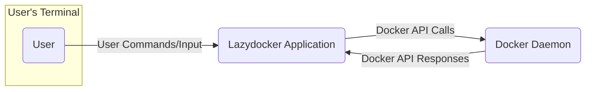

# Project Design Document: Lazydocker

**Version:** 1.1
**Date:** October 26, 2023
**Author:** AI Software Architect

## 1. Introduction

This document provides an enhanced and detailed design overview of Lazydocker, a terminal UI for Docker and Docker Compose. This document aims to clearly articulate the system's architecture, components, and data flow to facilitate future threat modeling activities. It outlines the key functionalities and interactions within the application, providing a comprehensive understanding of its internal workings. This revision includes more granular details and clarifies certain aspects of the system.

## 2. Goals

The primary goals of this design document are:

* To provide a clear and comprehensive description of Lazydocker's architecture and components, with added detail.
* To illustrate the interactions between different parts of the system with improved clarity in the data flow.
* To identify key data flows and potential areas of interest for security analysis, providing more specific examples.
* To serve as a robust foundation for subsequent threat modeling exercises.
* To document the design in a format suitable for technical stakeholders, ensuring readability and accuracy.

## 3. Scope

This document covers the following aspects of Lazydocker:

* High-level architecture and a more granular component breakdown.
* Detailed description of key components and their responsibilities, including internal interactions.
* Data flow within the application, with a focus on data transformation and handling.
* Interactions with external systems (Docker Daemon), detailing the types of API calls.
* User interface and user interactions, including the event handling mechanism.

This document does not cover:

* Specific implementation details of individual functions or modules beyond their core responsibilities.
* Detailed code-level analysis or specific algorithms used.
* Deployment strategies or infrastructure considerations for running Lazydocker itself.
* The threat model itself (which will be a separate deliverable).

## 4. High-Level Architecture

Lazydocker is a terminal-based application written in Go that interacts with the Docker Daemon to provide a user-friendly interface for managing Docker containers, images, volumes, networks, and Docker Compose projects. It acts as a client to the Docker Daemon, abstracting away the complexities of the command-line interface.

* **User:** Interacts with the Lazydocker application through the terminal, providing commands and navigating the UI.
* **Lazydocker Application:** The core application logic, responsible for UI rendering, event handling, command execution, data processing, and interaction with the Docker Daemon.
* **Docker Daemon:** The background service responsible for building, running, and managing Docker containers and related resources.

## 5. Detailed Design

### 5.1. Components

* **User Interface (UI) Layer:**
    * Responsible for rendering the terminal-based UI using the `gocui` library, managing layout and display of information.
    * Handles user input (keyboard events, mouse clicks if supported by the terminal).
    * Displays information retrieved from the Docker Daemon in a structured and user-friendly manner.
    * Provides visual feedback to the user based on actions and events.
    * Manages different views or panels for various Docker resources.

* **Input Handling and Event Management:**
    * Captures and processes user input events from the terminal.
    * Maps user actions (key presses, etc.) to specific commands or UI interactions.
    * Manages the application's state based on user events.
    * Implements logic for navigating between UI elements and triggering actions.

* **Docker Client Interface:**
    * Utilizes the official Docker SDK for Go (`docker/docker/client`) to establish and manage communication with the Docker Daemon.
    * Encapsulates the complexities of interacting with the Docker API, providing a higher-level abstraction.
    * Provides functions for making various API calls to retrieve information about containers, images, volumes, networks, etc.
    * Provides functions for executing Docker commands (start, stop, restart, prune, etc.) on behalf of the user.
    * Handles authentication and authorization with the Docker Daemon based on the environment configuration.

* **Command Execution and Orchestration:**
    * Interprets user commands and maps them to specific sequences of Docker API calls.
    * Manages the execution of Docker commands, including handling asynchronous operations.
    * Implements logic for complex operations that might involve multiple API calls.
    * Handles error conditions returned by the Docker Daemon and provides informative feedback to the user.

* **Data Model and State Management:**
    * Maintains an internal representation of Docker objects (containers, images, etc.) and their current state.
    * Caches data retrieved from the Docker Daemon to improve performance and reduce API calls.
    * Implements mechanisms for updating the data model based on events and API responses.
    * Provides a consistent view of the Docker environment to the UI layer.

* **Configuration Management:**
    * Handles the loading, parsing, and validation of Lazydocker's configuration file (`.lazydocker.yml`).
    * Allows users to customize the application's behavior, appearance (themes), and keybindings.
    * Stores settings such as custom commands, ignored resources, and polling intervals.
    * Provides mechanisms for applying and reloading configuration changes.

* **Logging and Error Handling:**
    * Implements logging functionality for debugging, auditing, and troubleshooting.
    * Records application events, errors, and interactions with the Docker Daemon.
    * Typically logs to a file, standard output, or a system log.
    * Implements robust error handling to prevent crashes and provide informative error messages to the user.

### 5.2. Data Flow

The data flow within Lazydocker involves the user initiating an action, Lazydocker interacting with the Docker Daemon, and then updating the UI based on the response.

1. **User Interaction:** The user interacts with the Lazydocker UI by pressing keys or triggering events.
2. **Input Handling:** The UI layer captures the user input event.
3. **Event Processing:** The input handling and event management component interprets the event and determines the intended action.
4. **Command Mapping:** The command execution and orchestration component maps the user action to a specific Docker command or API call.
5. **Docker API Request:** The Docker client interface constructs and sends a request to the Docker Daemon via the Docker API (e.g., using HTTP over a Unix socket or TCP).
6. **Docker Daemon Processing:** The Docker Daemon receives and processes the API request, performing the requested operation (e.g., starting a container, retrieving container information).
7. **Docker API Response:** The Docker Daemon sends a response back to Lazydocker, containing the requested data or status information.
8. **Data Processing and Update:** Lazydocker receives the response, and the data model and state management component processes and updates its internal representation of the Docker environment.
9. **UI Update:** The UI layer is notified of the data change and updates the display to reflect the new state.

```mermaid
graph LR
    subgraph "User's Terminal"
        A("User Input")
    end
    B("Lazydocker UI Layer")
    C("Input Handling & Event Mgmt")
    D("Command Execution & Orchestration")
    E("Docker Client Interface")
    F("Docker Daemon API")
    G("Docker Daemon")
    H("Docker API Response")
    I("Data Model & State Mgmt")
    J("UI Update")

    A -- "User Action" --> B
    B -- "Input Event" --> C
    C -- "Mapped Command" --> D
    D -- "API Call" --> E
    E -- "Docker API Request" --> F
    F -- "Process Request" --> G
    G -- "API Response" --> H
    H -- "Data Update" --> I
    I -- "State Change Notification" --> J
    J -- "Updated UI" --> B
```

### 5.3. Interactions with External Systems

The primary external system Lazydocker interacts with is the **Docker Daemon**. This interaction is crucial for its functionality.

* **Communication Protocol:** Lazydocker communicates with the Docker Daemon via the Docker Engine API, typically using HTTP over a Unix socket (`/var/run/docker.sock`) or a TCP connection (if the daemon is configured to listen on a network interface).
* **Authentication and Authorization:** Lazydocker relies on the Docker client configuration for authentication with the Docker Daemon. It typically uses the same credentials and context as the standard `docker` CLI, respecting Docker's access control mechanisms.
* **Types of API Calls:** Lazydocker makes a wide range of API calls, including:
    * **Container Management:** Listing, inspecting, starting, stopping, restarting, pausing, unpausing, removing containers, retrieving logs, executing commands inside containers.
    * **Image Management:** Listing, inspecting, pulling, pushing, removing images.
    * **Volume Management:** Listing, inspecting, creating, removing volumes.
    * **Network Management:** Listing, inspecting, creating, removing networks.
    * **Docker Compose:**  Interacting with Docker Compose projects (if a `docker-compose.yml` file is present in the current directory), such as listing services, starting/stopping services, viewing service logs.
    * **System Information:** Retrieving information about the Docker Daemon itself (version, system info).

### 5.4. User Interface

The Lazydocker UI is a dynamic text-based interface rendered in the terminal, providing a real-time view of the Docker environment.

* **Panel-Based Layout:** The UI is typically divided into multiple panels, each displaying a specific type of Docker resource or information.
    * **Containers Panel:** Displays a list of containers with details like ID, name, state, ports, and resource usage.
    * **Images Panel:** Shows available Docker images, including tags and sizes.
    * **Volumes Panel:** Lists Docker volumes and their mount points.
    * **Networks Panel:** Displays Docker networks and their configurations.
    * **Services Panel (Docker Compose):** Shows services defined in a `docker-compose.yml` file, their status, and associated containers.
    * **Logs Panel:** Displays real-time logs for selected containers or services.
    * **Stats Panel:** Presents resource usage statistics (CPU, memory, network I/O) for containers.
* **Navigation and Interaction:** Users navigate between panels using keyboard shortcuts (e.g., Tab, arrow keys). Actions are triggered by pressing specific keys (e.g., `s` for start, `r` for restart).
* **Contextual Actions:** The available actions depend on the currently selected item and panel.
* **Visual Feedback:** The UI provides visual feedback to the user, such as highlighting selected items, displaying status messages, and indicating loading states.

## 6. Security Considerations (Pre-Threat Modeling)

Building upon the initial considerations, here are more specific potential security concerns:

* **Privilege Escalation:**
    * If Lazydocker has vulnerabilities, an attacker could potentially leverage its interaction with the Docker Daemon to execute arbitrary commands with the privileges of the Docker Daemon (typically root).
    * Improper handling of user-provided commands or configuration could lead to unintended execution of privileged operations.
* **Command Injection:**
    * If Lazydocker doesn't properly sanitize user input that is used in Docker commands (e.g., when executing commands inside a container), it could be vulnerable to command injection attacks.
    * Custom commands defined in the configuration file could also introduce vulnerabilities if not handled carefully.
* **Dependency Vulnerabilities:**
    * Vulnerabilities in the Docker SDK for Go or the `gocui` library could be exploited to compromise Lazydocker. Regular updates and security audits of dependencies are crucial.
* **Configuration Security:**
    * If the `.lazydocker.yml` file is not properly protected, an attacker could modify it to execute malicious commands or alter the application's behavior.
    * Storing sensitive information (though unlikely in the default configuration) in the configuration file could pose a risk.
* **Information Disclosure:**
    * If Lazydocker exposes sensitive information retrieved from the Docker Daemon (e.g., environment variables, secrets) in an insecure way (e.g., through verbose logging), it could lead to information disclosure.
* **Man-in-the-Middle Attacks:**
    * While communication with the local Docker Daemon via a Unix socket is generally secure, if Lazydocker were to interact with a remote Docker Daemon over a network, the communication channel would need to be secured (e.g., using TLS) to prevent man-in-the-middle attacks.
* **Denial of Service:**
    * Maliciously crafted input or actions could potentially cause Lazydocker to consume excessive resources or crash, leading to a denial of service.

## 7. Assumptions and Constraints

* **Docker Daemon Availability and Functionality:** Lazydocker assumes that the Docker Daemon is running, accessible, and functioning correctly according to the Docker API specification.
* **Docker API Compatibility:** Lazydocker relies on the stability and backward compatibility of the Docker API. Changes in the API could potentially break Lazydocker's functionality.
* **User Permissions:** It is assumed that the user running Lazydocker has the necessary permissions to interact with the Docker Daemon as if they were using the `docker` CLI directly.
* **Terminal Environment:** Lazydocker is designed to run in a standard terminal environment that supports ANSI escape codes for rendering the UI.
* **Configuration File Integrity:** If a `.lazydocker.yml` configuration file is used, it is assumed to be a valid YAML file.
* **Local Execution:** This design primarily focuses on Lazydocker running locally on the same machine as the Docker Daemon.

## 8. Future Considerations

* **Enhanced Security Features:**
    * Implementing features like secure storage of sensitive configuration data (if needed).
    * Adding more robust input validation and sanitization mechanisms.
    * Integrating with security scanning tools for Docker images.
* **Plugin System for Extensibility:** Allowing users to extend Lazydocker's functionality with custom commands, integrations, or UI elements.
* **Improved Error Handling and Reporting:** Providing more detailed and user-friendly error messages.
* **GUI Version or Web Interface:** Exploring the possibility of a graphical user interface or a web-based interface for broader accessibility.
* **Integration with other Container Orchestration Tools:** Potentially supporting other container orchestration platforms beyond Docker Compose, such as Kubernetes (though this would be a significant undertaking).
* **Advanced Filtering and Searching:** Implementing more sophisticated ways to filter and search through Docker resources.

This enhanced design document provides a more detailed and comprehensive understanding of Lazydocker's architecture and functionality. It serves as a more robust foundation for conducting thorough threat modeling and identifying potential security vulnerabilities.