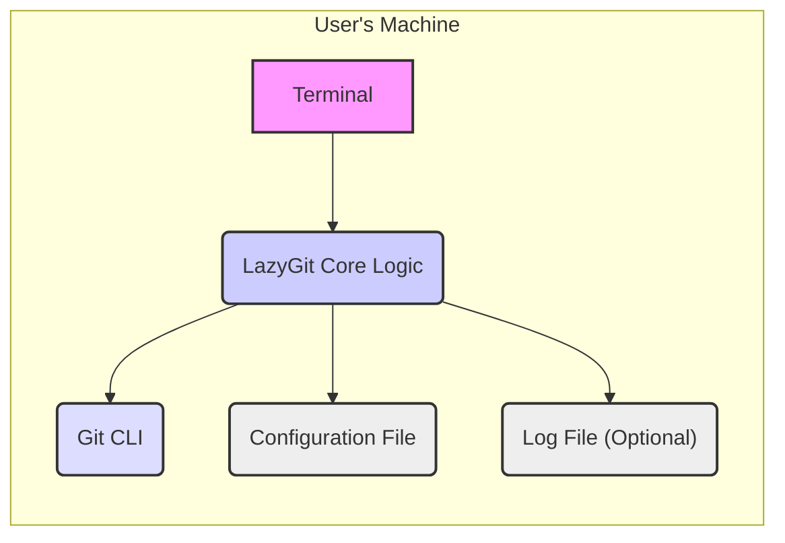
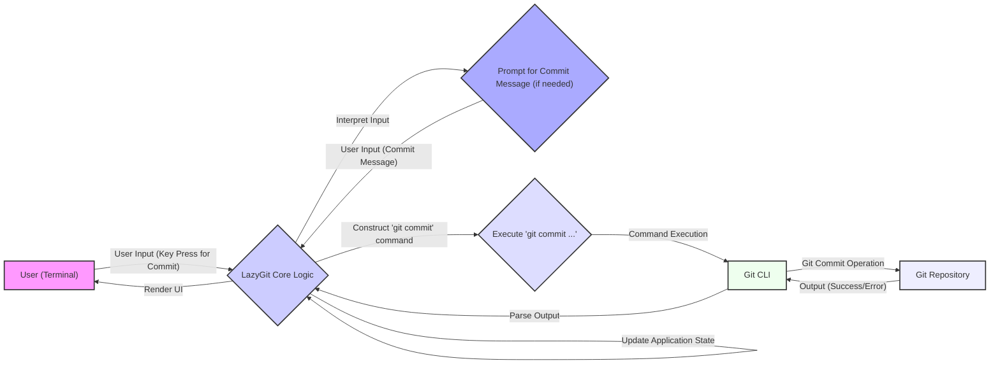

# Project Design Document: LazyGit

**Version:** 1.1
**Date:** October 26, 2023
**Author:** Gemini (AI Language Model)

## 1. Introduction

This document provides an enhanced and more detailed design overview of the LazyGit project, an open-source terminal UI for git commands. This document aims to clearly articulate the system's architecture, components, data flow, and key considerations relevant for subsequent threat modeling activities. This revision includes more specific examples and elaborates on potential security implications.

## 2. Project Overview

LazyGit is a terminal-based user interface built on top of the Git command-line tool. It provides a more intuitive and efficient way to interact with Git repositories by presenting information in a structured and interactive manner. Users can perform common Git operations like staging, committing, branching, merging, rebasing, and resolving merge conflicts directly within the LazyGit interface, often with fewer keystrokes than using the raw Git CLI.

## 3. Goals

* Provide a clear and comprehensive understanding of LazyGit's architecture, with more specific details on component responsibilities.
* Identify key components and their interactions, including examples of common workflows.
* Describe the data flow within the application for various user actions.
* Highlight areas of potential security concern with more concrete examples for future threat modeling.

## 4. Target Audience

This document is intended for:

* Security engineers and analysts performing threat modeling on LazyGit.
* Developers contributing to the LazyGit project, especially those working on security-sensitive areas.
* Anyone seeking a deeper and more technical understanding of LazyGit's internal workings.

## 5. System Architecture

LazyGit's architecture can be broadly categorized into the following components, with more detail on their responsibilities:

* **User Interface (Terminal):** This is the primary interface through which users interact with LazyGit. It's built using a terminal UI library (likely gocui or a similar library like tcell). It is responsible for:
    * Displaying information about the Git repository state (e.g., status, commits, branches, logs).
    * Capturing user input (keyboard events).
    * Rendering the UI elements (panels, lines, text).
    * Handling user navigation and action selection.
* **Core Logic (Go Application):** This is the heart of LazyGit, written in Go. It handles:
    * **Input Processing:** Receiving and interpreting user input from the terminal UI.
    * **Git Command Orchestration:**  Constructing and executing `git` commands based on user actions. This involves careful handling of arguments and potential shell injection risks.
    * **Git Output Parsing:**  Receiving the raw output from the `git` CLI and parsing it into structured data. This often involves regular expressions and string manipulation, which can be error-prone.
    * **State Management:** Maintaining the application's internal state, reflecting the current Git repository status and user selections.
    * **UI Rendering Logic:**  Determining what information to display in the UI based on the current state.
    * **Configuration Management:** Loading, storing, and applying user-defined configurations.
    * **Logging (Optional):** Writing diagnostic information to log files.
* **Git Command-Line Interface (CLI):** LazyGit relies heavily on the underlying `git` command-line tool to perform Git operations. It executes `git` commands in the background as separate processes and parses their output. The specific `git` commands executed depend on the user's actions within LazyGit.
* **Configuration:** LazyGit stores user-specific configurations, such as custom commands, keybindings, UI themes, and behavior preferences. This is typically stored in a local configuration file (e.g., `$HOME/.config/lazygit/config.yml` or similar). This file is parsed by the core logic.
* **Logging (Optional):** LazyGit may include logging functionality for debugging and error tracking. Logs are typically written to a local file (e.g., `$HOME/.local/share/lazygit/development.log`). The content and verbosity of logs can vary.

### 5.1. Component Diagram

## 6. Data Flow

The following describes the typical data flow within LazyGit for common operations, with more detailed examples:

* **Initialization:**
    * The user executes the `lazygit` command in the terminal.
    * The core logic reads and parses the configuration file.
    * LazyGit executes initial `git` commands (e.g., `git status --porcelain=v2`, `git log --oneline --graph --decorate --all -100`) to gather initial repository information.
    * The output from these `git` commands is parsed and used to populate the initial UI state.
    * The terminal UI is rendered with the initial repository view.
* **User Interaction (e.g., Committing Staged Changes):**
    * The user navigates to the staging area in the terminal UI and presses the key for "commit".
    * The terminal UI sends an event to the core logic indicating the "commit" action.
    * The core logic might prompt the user for a commit message (either in the LazyGit UI or by opening an external editor configured in Git).
    * The core logic constructs the `git commit` command, including the commit message.
    * The core logic executes the `git commit` command using the Git CLI.
    * The Git CLI performs the commit operation and returns the output (success or error messages).
    * The core logic parses the output from the Git CLI.
    * The core logic updates the application state (e.g., clears the staging area, updates the commit log).
    * The terminal UI is re-rendered to reflect the successful commit.
* **Fetching Remote Changes:**
    * The user triggers a fetch operation (e.g., by pressing a specific key).
    * The core logic executes `git fetch --all --prune` (or similar) using the Git CLI.
    * The Git CLI communicates with the remote repositories and downloads new commits and branch information.
    * The Git CLI returns the output, including information about updated branches.
    * The core logic parses the output to identify new commits and branches.
    * The application state is updated with the new remote branch information.
    * The terminal UI is updated to show the new remote branches and any changes.
* **Configuration Changes:**
    * The user may manually edit the configuration file.
    * LazyGit typically reloads the configuration file on startup or when it detects changes to the file (though this might not be immediate).
    * The core logic parses the updated configuration and applies the new settings, affecting UI behavior, keybindings, and custom commands.

### 6.1. Data Flow Diagram (Committing Staged Changes)

## 7. Security Considerations

Based on the architecture and data flow, potential security considerations include:

* **Command Injection:**
    * **Risk:** Since LazyGit constructs and executes arbitrary Git commands based on user input (e.g., custom commands, arguments passed to Git operations) and internal logic, vulnerabilities in how these commands are constructed can lead to command injection.
    * **Example:** If a custom command allows users to inject arbitrary arguments that are not properly sanitized before being passed to the `git` CLI, an attacker could execute arbitrary shell commands.
* **Information Disclosure:**
    * **Risk:** LazyGit displays sensitive information from the Git repository, such as commit messages (potentially containing secrets), file contents (in diff views), branch names, and remote URLs. Bugs in the UI rendering, data handling, or logging could unintentionally expose this information.
    * **Example:**  A vulnerability in how diff output is rendered could inadvertently display the contents of a sensitive file that should not be shown. Overly verbose logging could also expose sensitive data.
* **Local File Access:**
    * **Risk:** LazyGit reads and writes to local files, including the configuration file and potentially log files. Vulnerabilities could allow an attacker to read sensitive configuration data (which might contain API keys or other secrets if users misconfigure Git or custom commands) or inject malicious content into these files.
    * **Example:** An attacker could potentially overwrite the configuration file with malicious settings, such as custom commands that execute harmful code when triggered by the user.
* **Dependency Vulnerabilities:**
    * **Risk:** LazyGit relies on external libraries (Go modules) and the Git CLI. Vulnerabilities in these dependencies could indirectly affect LazyGit's security.
    * **Example:** A vulnerability in the YAML parsing library used for the configuration file could be exploited to achieve arbitrary code execution when LazyGit loads a crafted configuration file.
* **Privilege Escalation:**
    * **Risk:** While LazyGit itself doesn't typically require elevated privileges, if it's used in conjunction with scripts or Git hooks that do, there might be opportunities for privilege escalation if not handled carefully.
    * **Example:** If a Git hook executed by LazyGit runs with elevated privileges, a command injection vulnerability in LazyGit could be used to execute commands with those elevated privileges.
* **Denial of Service:**
    * **Risk:** Resource exhaustion or unexpected behavior triggered by specific Git repository states (e.g., a very large repository, a repository with a huge number of branches) or maliciously crafted user actions could potentially lead to a denial of service, making LazyGit unresponsive.
    * **Example:**  Parsing an extremely large Git log output could consume excessive memory and CPU, causing LazyGit to crash.
* **Insecure Handling of External Editors:**
    * **Risk:** When LazyGit opens an external editor for commit messages or conflict resolution, vulnerabilities in how the editor is invoked or how the temporary files are handled could be exploited.
    * **Example:** If the path to the external editor is not properly sanitized, an attacker could potentially inject a malicious executable.

## 8. Dependencies

LazyGit depends on the following key components:

* **Go Programming Language (version X.Y.Z or later):** The core logic is written in Go, requiring a specific version or range of versions for compilation and execution.
* **Git Command-Line Interface (version A.B.C or later):** The fundamental tool for Git operations. The expected version might influence the parsing of Git output.
* **Terminal UI Library (e.g., `github.com/jesseduffield/gocui`, `github.com/rivo/tview`):** Used for building the terminal user interface. Specific versions might have their own vulnerabilities.
* **Go Modules:**
    * **Configuration Parsing (e.g., `gopkg.in/yaml.v2`):** For reading and parsing the YAML configuration file.
    * **Logging (e.g., `github.com/sirupsen/logrus`):** If logging is implemented.
    * **String Manipulation and Regular Expressions (standard Go libraries):** Used extensively for parsing Git output.
    * **Process Execution (standard Go libraries):** For running the `git` CLI.

## 9. Deployment

LazyGit is typically deployed as a standalone, statically linked executable binary. Users download pre-built binaries for their operating system or build the binary from source using the Go toolchain. The executable is then placed in a directory included in the user's PATH environment variable. No server-side components are involved.

## 10. Future Considerations

* **Plugin System:** If LazyGit were to implement a plugin system, this would introduce significant new security considerations related to plugin security, isolation, and the potential for malicious plugins to compromise the user's system or Git repositories.
* **Remote Repository Management Enhancements:** Expanding functionality to directly manage remote repositories (beyond `fetch` and `push`), such as creating or deleting remote branches, could introduce new attack vectors related to authentication, authorization, and the security of remote Git hosting providers.
* **Integration with External Tools:**  If LazyGit integrates more deeply with other external tools, the security of those integrations would need to be carefully considered.

## 11. Conclusion

This enhanced document provides a more detailed and nuanced understanding of LazyGit's architecture and data flow, specifically focusing on aspects relevant to security. The expanded security considerations section offers more concrete examples of potential vulnerabilities, which will be valuable for subsequent threat modeling activities. This information is crucial for identifying and mitigating potential security risks in the LazyGit project.
