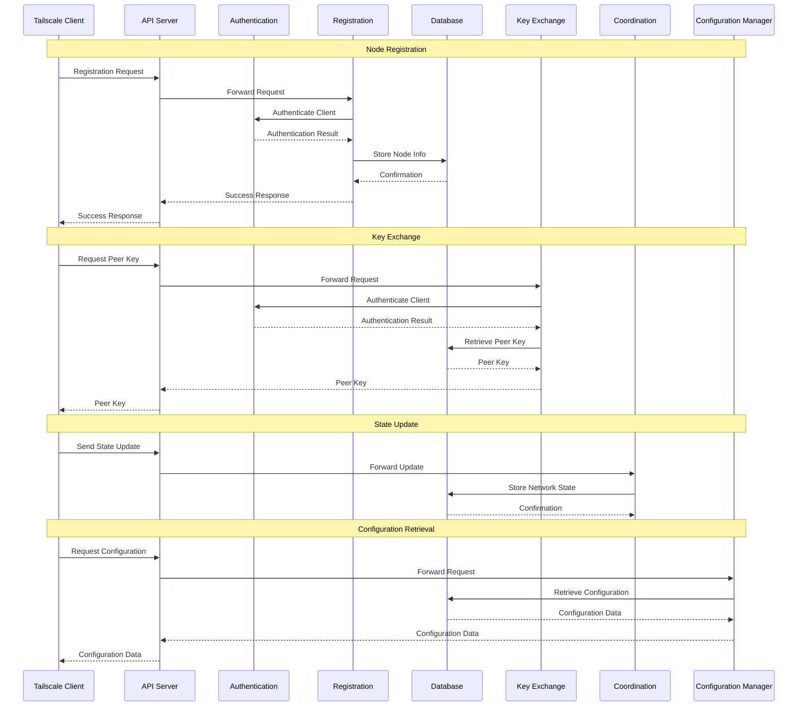

# Project Design Document: Headscale

**Version:** 1.1
**Date:** October 26, 2023
**Author:** AI Software Architect

## 1. Introduction

This document provides a detailed design overview of the Headscale project. Headscale is an open-source, self-hosted implementation of the Tailscale control server. This document aims to provide a comprehensive understanding of its architecture, components, and data flow, which will serve as the foundation for subsequent threat modeling activities.

### 1.1. Purpose

The primary purpose of this document is to:

* Clearly articulate the architecture and design of the Headscale project.
* Identify key components and their interactions with greater precision.
* Describe the data flow within the system with more detail.
* Provide a robust basis for identifying potential security vulnerabilities and threats.

### 1.2. Scope

This document covers the core components and functionalities of the Headscale server, focusing on the server-side architecture and its interactions with clients (Tailscale agents) and the underlying data store. It provides a more granular view of the server's internal workings. It does not delve into the intricacies of the Tailscale client itself or the underlying WireGuard protocol, except where their interactions with the Headscale server are pertinent to understanding the system's design.

### 1.3. Goals

The goals of the Headscale project are to:

* Provide a reliable and feature-rich self-hosted alternative to the proprietary Tailscale control server.
* Enable users to manage their own private WireGuard mesh networks with greater control and transparency.
* Offer a scalable and robust control plane for Tailscale clients, suitable for various deployment sizes.
* Maintain a high degree of compatibility with the Tailscale client protocol to ensure seamless integration.

## 2. High-Level Architecture

The following diagram illustrates the high-level architecture of Headscale, emphasizing the key interactions between components:

```mermaid
graph LR
    subgraph "Headscale Server"
        direction LR
        API(["API Server"])
        Auth(["Authentication & Authorization"])
        Reg(["Registration Handler"])
        Coord(["Coordination Engine"])
        KeyExch(["Key Exchange Handler"])
        ConfigM(["Configuration Manager"])
        NodeM(["Node Manager"])
        UserM(["User Manager"])
    end
    DB(["Database"])
    Client(["Tailscale Client"])

    Client -- "Registration Request" --> Reg
    Reg -- "Authenticate User/Node" --> Auth
    Auth -- "Verify Credentials" --> DB
    Reg -- "Store Node Details" --> DB
    Client -- "Key Request" --> KeyExch
    KeyExch -- "Retrieve Node Keys" --> DB
    KeyExch -- "Coordinate Key Exchange" --> Coord
    Client -- "Report State" --> Coord
    Coord -- "Update Network State" --> DB
    Client -- "Request Configuration" --> ConfigM
    ConfigM -- "Fetch Configuration" --> DB
    Client -- "API Interaction" --> API
    API -- "Authenticate Request" --> Auth
    API -- "Delegate Operation" --> Headscale Server
    Headscale Server -- "Persist Data" --> DB
    Reg -- "Manage Nodes" --> NodeM
    NodeM -- "Store/Retrieve Node Data" --> DB
    API -- "Manage Users" --> UserM
    UserM -- "Store/Retrieve User Data" --> DB
```

### 2.1. Components

The main components of the Headscale system are:

* **Tailscale Client:** The software running on each node participating in the mesh network. It communicates with the Headscale server for essential functions like registration, key exchange, state reporting, and configuration retrieval.
* **Headscale Server:** The central control plane responsible for orchestrating and managing the mesh network. It is composed of several specialized sub-components:
    * **API Server:** Provides a well-defined interface (likely RESTful) for clients and administrators to interact with the Headscale server. This includes endpoints for node lifecycle management, key operations, and status inquiries.
    * **Authentication & Authorization:**  A critical component responsible for verifying the identities of clients and administrators and enforcing access control policies to protect sensitive resources and operations.
    * **Registration Handler:**  Specifically handles requests from clients attempting to join the network. This involves a multi-step process of identity verification, node information storage, and initial configuration.
    * **Coordination Engine:**  Manages the dynamic state of the network, including the online/offline status of nodes, their network addresses, and facilitating direct peer-to-peer connections between clients.
    * **Key Exchange Handler:**  Orchestrates the secure exchange of WireGuard public keys between clients, ensuring that only authorized peers can establish secure connections.
    * **Configuration Manager:**  Responsible for managing and distributing network-wide configuration settings to clients, including IP address assignments, DNS configurations, and potentially access control lists.
    * **Node Manager:**  Handles the lifecycle management of nodes within the network, including operations like node deletion, renaming, and potentially tagging or grouping.
    * **User Manager:**  Manages user accounts and their association with nodes, enabling features like shared ownership or access control based on user identity.
* **Database:**  Provides persistent storage for the Headscale server's operational data, ensuring data durability and consistency. This includes:
    * Detailed information about registered nodes (e.g., IP addresses, public keys, last seen).
    * Network configuration parameters and policies.
    * User accounts and their associated node ownership or permissions.
    * Potentially, audit logs and event history for security and operational monitoring.

## 3. Detailed Component Description

### 3.1. Tailscale Client

* **Functionality:**
    * Initiates the registration process with the Headscale server to join the managed network.
    * Authenticates its identity to the Headscale server to gain access to network resources.
    * Requests the necessary WireGuard keys for establishing secure connections with other nodes in the network.
    * Periodically reports its current network state (e.g., online status, IP address) to the Headscale server.
    * Establishes direct, encrypted peer-to-peer connections with other clients based on information provided by the Headscale server.
    * Retrieves and applies network configuration settings provided by the Headscale server.
* **Key Interactions:**
    * Sends registration requests, including authentication credentials, to the Registration Handler.
    * Communicates with the Key Exchange Handler to securely obtain the public keys of intended peer nodes.
    * Sends periodic state updates to the Coordination Engine to keep the server informed of its status.
    * Requests and receives network configuration details from the Configuration Manager.
    * Interacts with the API Server for various control plane operations, such as initiating key rotations or retrieving network information.

### 3.2. Headscale Server Components

#### 3.2.1. API Server

* **Functionality:**
    * Exposes a well-defined API (likely a RESTful interface using JSON) for communication with Tailscale clients and potentially administrative tools.
    * Handles incoming requests for various operations, including node registration, key retrieval, status updates, and administrative actions.
    * Enforces authentication and authorization policies for all API endpoints to ensure secure access and operation.
    * May provide endpoints for administrative tasks such as user management, node management, and network configuration.
* **Key Interactions:**
    * Receives all client-initiated requests and routes them to the appropriate internal components.
    * Interacts with the Authentication & Authorization component to verify the identity and permissions of the requester.
    * Delegates specific operations to other Headscale server components (e.g., Registration Handler, Key Exchange Handler, User Manager).
    * Interacts with the Database to retrieve or persist data as required by the requested operation.

#### 3.2.2. Authentication & Authorization

* **Functionality:**
    * Verifies the identity of clients and administrators attempting to interact with the Headscale server.
    * Manages user accounts, API keys, and other authentication credentials.
    * Implements and enforces authorization policies to control access to specific resources and functionalities based on user roles or permissions.
    * May support various authentication methods, such as pre-shared keys, OAuth 2.0, or integration with external identity providers.
* **Key Interactions:**
    * Receives authentication requests from the API Server and other internal components requiring identity verification.
    * Interacts with the Database to retrieve and validate user credentials, API keys, and associated permissions.
    * Provides authentication and authorization decisions (e.g., allow or deny access) to the requesting component.

#### 3.2.3. Registration Handler

* **Functionality:**
    * Manages the process of new clients joining the Headscale-managed network.
    * Verifies the client's identity using the Authentication & Authorization component, potentially requiring pre-shared keys or other credentials.
    * Assigns a unique identifier and an internal IP address to the newly registered node.
    * Stores comprehensive information about the registered node in the Database, including its hostname, public key, and assigned IP address.
* **Key Interactions:**
    * Receives initial registration requests from Tailscale clients, typically via the API Server.
    * Interacts with the Authentication & Authorization component to authenticate the client.
    * Interacts with the Database to store the newly registered node's information.
    * May interact with the Node Manager to perform additional node-related operations.

#### 3.2.4. Coordination Engine

* **Functionality:**
    * Maintains a real-time view of the network's topology and the status of connected nodes.
    * Facilitates the establishment of direct peer-to-peer connections between clients by providing them with the necessary connection information (e.g., IP addresses, ports).
    * May implement logic for NAT traversal assistance and connection optimization to improve network performance.
* **Key Interactions:**
    * Receives periodic state updates from connected Tailscale clients, reporting their online status and network details.
    * Interacts with the Database to store and retrieve the current network state and node connectivity information.
    * Provides connection details to clients during the key exchange process, enabling them to establish direct links.

#### 3.2.5. Key Exchange Handler

* **Functionality:**
    * Manages the secure exchange of WireGuard public keys between clients, a fundamental process for establishing secure communication channels.
    * Ensures that only authorized clients can obtain the public keys of other nodes within the network, preventing unauthorized connections.
    * May implement mechanisms for key rotation and revocation to enhance security.
* **Key Interactions:**
    * Receives requests for peer node public keys from Tailscale clients, typically via the API Server.
    * Interacts with the Authentication & Authorization component to verify the requesting client's identity and permissions.
    * Interacts with the Database to retrieve the requested peer node's public key.
    * Communicates with the Coordination Engine to ensure that clients have the necessary connection information to utilize the exchanged keys.

#### 3.2.6. Configuration Manager

* **Functionality:**
    * Manages network-wide configuration settings that are applied to all or specific groups of clients.
    * Handles the assignment of IP addresses to nodes, potentially using a defined IP address range.
    * May manage DNS settings for the network, allowing clients to resolve hostnames within the mesh.
    * Could implement access control policies or routing rules to govern traffic flow within the network.
* **Key Interactions:**
    * Receives requests for configuration updates from Tailscale clients, typically during initialization or when changes occur.
    * Interacts with the Database to retrieve the current network configuration settings.
    * May allow administrators to modify network configuration settings, which are then stored in the Database.

#### 3.2.7. Node Manager

* **Functionality:**
    * Provides functionalities for managing the lifecycle of individual nodes within the network.
    * Allows administrators to delete or remove nodes from the network.
    * May support renaming nodes for better organization and identification.
    * Could include features for tagging or grouping nodes for easier management and policy application.
* **Key Interactions:**
    * Interacts with the API Server to receive administrative requests for node management operations.
    * Interacts with the Database to update or delete node information.
    * May interact with other components, such as the Coordination Engine, to reflect changes in network state.

#### 3.2.8. User Manager

* **Functionality:**
    * Manages user accounts and their association with nodes within the Headscale network.
    * Allows administrators to create, modify, and delete user accounts.
    * Enables the definition of ownership or access permissions for nodes based on user identity.
    * Facilitates features like shared node access or user-based access control policies.
* **Key Interactions:**
    * Interacts with the API Server to receive administrative requests for user management operations.
    * Interacts with the Database to store and retrieve user account information and their relationships with nodes.
    * May interact with the Authentication & Authorization component to manage user credentials.

### 3.3. Database

* **Functionality:**
    * Provides reliable and persistent storage for all of Headscale's critical data.
    * Stores detailed information about registered nodes, including their identities, keys, and network addresses.
    * Stores network configuration settings, user accounts, and their associated permissions.
    * Ensures data integrity, consistency, and availability.
* **Key Interactions:**
    * Serves as the central data repository for all other Headscale server components, providing read and write access as needed.
* **Potential Technologies:**
    * SQLite (suitable for smaller deployments)
    * PostgreSQL (recommended for production environments due to its robustness and features)
    * MySQL/MariaDB (another viable option for production deployments)

## 4. Data Flow

The following list describes the typical data flow for key operations within Headscale, providing more detail on the steps involved:

* **Node Registration:**
    * The Tailscale Client initiates a registration request to the Headscale API Server, including necessary authentication credentials.
    * The API Server forwards the registration request to the Registration Handler.
    * The Registration Handler interacts with the Authentication & Authorization component to authenticate the client's credentials.
    * Upon successful authentication, the Registration Handler assigns a unique node ID and potentially an IP address.
    * The Registration Handler stores the node's detailed information (hostname, public key, assigned IP, etc.) in the Database.
    * The Database confirms the successful storage of the node's information.
    * The Registration Handler sends a success response back to the client via the API Server, potentially including initial configuration details.
    * The API Server relays the success response to the Tailscale Client.
* **Key Exchange:**
    * Tailscale Client A requests the WireGuard public key of Tailscale Client B from the Headscale API Server.
    * The API Server forwards the key request to the Key Exchange Handler.
    * The Key Exchange Handler interacts with the Authentication & Authorization component to verify the identity and authorization of Client A to access Client B's key.
    * Upon successful authorization, the Key Exchange Handler retrieves the public key of Client B from the Database.
    * The Key Exchange Handler returns the public key of Client B to Client A via the API Server.
    * The API Server relays the public key to Tailscale Client A, enabling it to establish a direct WireGuard connection with Client B.
* **State Update:**
    * A Tailscale Client periodically sends its current network state (e.g., online status, current IP address) to the Headscale API Server.
    * The API Server forwards the state update to the Coordination Engine.
    * The Coordination Engine updates the network state information for that specific client in the Database.
    * The Database confirms the successful update of the network state.
* **Configuration Retrieval:**
    * A Tailscale Client requests the current network configuration from the Headscale API Server.
    * The API Server forwards the configuration request to the Configuration Manager.
    * The Configuration Manager retrieves the relevant configuration settings from the Database.
    * The Configuration Manager returns the configuration data to the client via the API Server.
    * The API Server relays the configuration data to the Tailscale Client.



## 5. Security Considerations

This section outlines key security considerations for the Headscale project, providing more specific areas to focus on during threat modeling.

* **Authentication and Authorization:**
    * **Client Authentication:** Ensuring strong and reliable methods for authenticating Tailscale clients to prevent unauthorized nodes from joining the network.
    * **Admin Authentication:** Securing administrative access to the Headscale server to prevent unauthorized configuration changes or data breaches.
    * **API Authorization:** Implementing granular authorization controls for API endpoints to restrict access based on user roles or permissions.
    * **Node Authorization:** Mechanisms to authorize specific nodes to access certain resources or communicate with other nodes.
* **Data Confidentiality and Integrity:**
    * **Database Encryption:** Encrypting sensitive data at rest within the database, such as WireGuard private keys and user credentials.
    * **Transport Layer Security (TLS):** Enforcing TLS/SSL for all communication between clients and the Headscale server to protect data in transit.
    * **Data Validation:** Rigorous input validation to prevent injection attacks (e.g., SQL injection) and ensure data integrity.
    * **Secure Key Storage:** Securely storing and managing WireGuard private keys and other sensitive secrets.
* **Input Validation:**
    * **API Input Validation:** Thoroughly validating all data received through the API to prevent injection attacks and other malicious inputs.
    * **Configuration Validation:** Validating configuration settings provided by administrators to prevent errors or security misconfigurations.
* **Secure Communication:**
    * **Mutual TLS (mTLS):** Considering the use of mTLS for enhanced authentication and security between clients and the server.
    * **Regular Security Audits:** Conducting regular security audits of the codebase and infrastructure to identify potential vulnerabilities.
* **Secrets Management:**
    * **Secure Secret Storage:** Utilizing secure methods for storing database credentials, API keys, and other sensitive information.
    * **Secret Rotation:** Implementing mechanisms for rotating secrets regularly to limit the impact of potential compromises.
* **Availability:**
    * **Resilience and Redundancy:** Designing the architecture for resilience and implementing redundancy to minimize downtime.
    * **Regular Backups:** Implementing a robust backup and recovery strategy for the database and server configuration.
    * **DoS Protection:** Implementing measures to protect the Headscale server from denial-of-service attacks.
* **Logging and Auditing:**
    * **Comprehensive Logging:** Logging all significant events, including authentication attempts, configuration changes, and API requests.
    * **Secure Log Storage:** Storing logs securely and ensuring their integrity to prevent tampering.
    * **Auditing Capabilities:** Implementing auditing capabilities to track user actions and identify potential security breaches.
* **Denial of Service (DoS) Protection:**
    * **Rate Limiting:** Implementing rate limiting on API endpoints to prevent abuse.
    * **Resource Management:** Properly managing server resources to prevent resource exhaustion attacks.

## 6. Deployment Considerations

* **Infrastructure Choices:** Selecting appropriate infrastructure based on scalability and availability requirements (e.g., cloud providers, on-premises servers).
* **Scalability Planning:** Designing the deployment to handle a growing number of clients and network traffic, potentially involving horizontal scaling of server components.
* **High Availability Setup:** Implementing high availability for the Headscale server using techniques like load balancing and database replication to ensure continuous operation.
* **Database Selection and Configuration:** Choosing a suitable database system and configuring it for optimal performance and security.
* **Monitoring and Alerting:** Implementing monitoring and alerting systems to track the health and performance of the Headscale server and detect potential issues.

## 7. Future Considerations

* **Enhanced Administrative Interface:** Developing a more comprehensive web-based or CLI administrative interface for managing users, nodes, and network configurations.
* **Advanced Access Control Mechanisms:** Implementing more granular and flexible access control policies based on user roles, node attributes, or other criteria.
* **Integration with External Authentication Providers:** Supporting seamless integration with existing identity providers (e.g., LDAP, Active Directory, OAuth 2.0) for simplified user management.
* **Detailed Metrics and Monitoring:** Implementing comprehensive metrics collection and monitoring capabilities to provide deeper insights into the server's performance and health.
* **Plugin or Extension Architecture:** Designing an architecture that allows for the development of plugins or extensions to add new features and functionalities.

This document provides a significantly enhanced and more detailed overview of the Headscale project's design. It offers a more granular understanding of the system's architecture, components, and data flow, making it a more effective foundation for subsequent threat modeling activities.