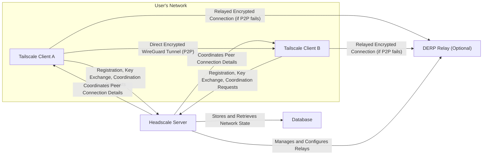

# Project Design Document: Headscale - Self-Hosted Tailscale Control Server

**Version:** 1.1
**Date:** October 26, 2023
**Author:** Gemini (AI Language Model)

## 1. Introduction

This document provides a refined architectural design for the Headscale project, a self-hosted, open-source implementation of the Tailscale control server. This detailed design serves as a critical foundation for understanding the system's components, interactions, and data flows, which is essential for subsequent threat modeling activities. This version builds upon the initial design by providing more specific details and clarifying certain aspects.

## 2. Goals and Scope

*   **Goal:** To provide a comprehensive and improved architectural overview of Headscale, specifically tailored for security analysis and threat modeling.
*   **Scope:** This document comprehensively covers the core components of the Headscale server and its interactions with Tailscale clients. It provides detailed information on authentication, authorization, key management, network coordination, and data storage. The internal workings of the Tailscale client itself remain outside the scope of this document.

## 3. Target Audience

This document is intended for:

*   Security engineers and architects responsible for performing threat modeling and security assessments of Headscale deployments.
*   Software developers actively contributing to the development and maintenance of the Headscale project.
*   System administrators involved in the deployment, configuration, and management of Headscale instances.

## 4. System Overview

Headscale functions as the central control plane for a private WireGuard mesh network managed by Tailscale clients. It serves as a self-hosted alternative to the proprietary Tailscale control servers, granting users greater control over their network infrastructure.

**Key Components:**

*   **Tailscale Clients:** Software agents running on user devices (laptops, servers, etc.) responsible for establishing and managing secure WireGuard tunnels.
*   **Headscale Server:** The core application responsible for the control plane functionalities:
    *   Authenticating and authorizing Tailscale clients.
    *   Managing network namespaces (organizations or users) to isolate networks.
    *   Orchestrating the secure key exchange process between clients.
    *   Persistently storing the network's state, including node information, assigned IP addresses, and routing configurations.
    *   Enforcing network access control policies defined through Access Control Lists (ACLs).
    *   Optionally managing and configuring DERP relays for NAT traversal.
*   **Database:** A persistent storage system used by the Headscale server to store critical data.
*   **DERP Relay (Optional):** A STUN/TURN-like server that facilitates connections between clients when direct peer-to-peer connections are hindered by Network Address Translation (NAT) or restrictive firewalls.

## 5. Component Details

### 5.1. API Server

*   **Functionality:** Exposes a RESTful API that serves as the primary communication interface with Tailscale clients and potentially administrative interfaces.
*   **Responsibilities:**
    *   Receiving and processing registration requests from new Tailscale clients.
    *   Authenticating client requests using API keys, OIDC tokens, or other configured mechanisms.
    *   Providing clients with necessary configuration details, such as the server URL and API keys.
    *   Handling client requests for peer discovery and key exchange initiation.
    *   Receiving and processing status updates from connected clients regarding their network connectivity.
    *   Exposing endpoints for administrative tasks, including user management, namespace configuration, and ACL management.
*   **Security Considerations:** This component is a primary attack surface. Input validation, authentication strength, authorization enforcement, and protection against common web vulnerabilities are crucial.
*   **Technology:** Typically implemented using a web framework in Go, such as Gin or Echo.

### 5.2. Control Plane Logic

*   **Functionality:**  The core of Headscale's operation, responsible for managing the network's state and coordinating various operations.
*   **Responsibilities:**
    *   Validating client registration requests and ensuring the legitimacy of joining nodes.
    *   Generating and securely managing cryptographic keys associated with each node.
    *   Maintaining and updating the network topology information, including the online/offline status of nodes.
    *   Implementing and enforcing Access Control Lists (ACLs) to regulate network traffic flow.
    *   Orchestrating the secure exchange of WireGuard public keys between peers to enable direct connections.
    *   Assigning unique IP addresses to nodes within the private Tailscale network.
    *   Managing the lifecycle of nodes, tracking their connection status and last seen times.
    *   Interacting with the database for persistent storage and retrieval of network data.
    *   Potentially handling the selection and assignment of DERP relays for clients needing relayed connections.
*   **Security Considerations:**  Logic flaws in this component could lead to unauthorized access, privilege escalation, or network disruptions. Secure key generation and management are paramount.

### 5.3. Database

*   **Functionality:** Provides persistent storage for Headscale's operational data, ensuring data durability across restarts.
*   **Responsibilities:**
    *   Storing user accounts, associated credentials (hashed passwords or links to identity providers), and roles.
    *   Storing node registration details, including node names, associated user/namespace, and public keys.
    *   Storing network configuration settings, such as defined ACL rules and permitted network routes.
    *   Storing information about available and configured DERP relay servers (if managed by Headscale).
    *   Ensuring the integrity, confidentiality, and availability of stored data.
*   **Security Considerations:**  Protecting the database from unauthorized access is critical. Encryption at rest and in transit, strong access controls, and regular backups are necessary.
*   **Technology:** Commonly utilizes SQLite for smaller deployments or more robust database systems like PostgreSQL or MySQL for larger, more demanding environments.

### 5.4. Authentication and Authorization Module

*   **Functionality:** Responsible for verifying the identity of clients and administrators and enforcing their access privileges within the Headscale system.
*   **Responsibilities:**
    *   Handling client authentication during the registration process and for subsequent API requests. This may involve verifying API keys, validating OIDC tokens, or other configured authentication methods.
    *   Managing administrative user accounts and their associated credentials for accessing administrative functionalities.
    *   Enforcing authorization policies based on user roles, permissions, and configured ACLs.
    *   Potentially integrating with external Identity Providers (IdPs) using protocols like OAuth 2.0 or OIDC for federated authentication.
*   **Security Considerations:**  A robust and secure authentication and authorization mechanism is fundamental to preventing unauthorized access and maintaining network security.

### 5.5. Key Management Module

*   **Functionality:** Manages the generation, secure storage, and controlled distribution of cryptographic keys used within the Tailscale network.
*   **Responsibilities:**
    *   Generating unique WireGuard private/public key pairs for each registered node.
    *   Securely storing node private keys, typically encrypted at rest to protect their confidentiality.
    *   Facilitating the secure exchange of public keys between peer nodes during the connection establishment process.
    *   Potentially managing pre-shared keys or other secrets used for initial client registration and authentication.
*   **Security Considerations:**  This module handles highly sensitive cryptographic material. Secure key generation practices, secure storage mechanisms, and controlled access are paramount.

### 5.6. DERP Relay Integration (Optional)

*   **Functionality:** If Headscale is configured to manage DERP relays, this component handles their registration, health monitoring, and assignment to clients.
*   **Responsibilities:**
    *   Discovering and registering available DERP relay servers, either automatically or through manual configuration.
    *   Monitoring the health, latency, and availability of registered DERP relay servers.
    *   Assigning the most appropriate DERP relays to clients when direct peer-to-peer connections are not feasible.
*   **Security Considerations:**  Compromised DERP relays could be used to eavesdrop on relayed traffic. Secure communication between Headscale and DERP relays is important.

### 5.7. Web UI (Optional)

*   **Functionality:** Provides a graphical user interface for administrators to interact with and manage the Headscale server.
*   **Responsibilities:**
    *   Managing user accounts, including creation, deletion, and modification.
    *   Managing nodes, including viewing their status, disabling them, or removing them from the network.
    *   Configuring and managing Access Control Lists (ACLs) to define network access policies.
    *   Monitoring the overall network status and activity.
    *   Configuring various Headscale server settings and parameters.
*   **Security Considerations:**  The Web UI should be protected against common web application vulnerabilities (e.g., XSS, CSRF, SQL Injection). Strong authentication and authorization are essential.

## 6. Data Flow

### 6.1. Node Registration

1. A new Tailscale client initiates a registration request to the Headscale API server.
2. The API server authenticates the client using configured methods (e.g., pre-shared key, OIDC token).
3. The control plane logic validates the registration request and assigns the node to a specific namespace (user or organization).
4. The control plane logic generates a unique WireGuard private/public key pair for the registering node.
5. The public key and other relevant node information are securely stored in the database.
6. The Headscale server responds to the client with its assigned IP address within the Tailscale network, server connection details, and potentially other configuration parameters.

### 6.2. Peer-to-Peer Connection Establishment

1. Tailscale Client A intends to establish a connection with Tailscale Client B.
2. Client A queries the Headscale API server for the necessary connection information for Client B.
3. The API server authenticates Client A's request.
4. The control plane logic retrieves Client B's current network information, including its public key and potentially its current IP address or relay candidates, from the database.
5. The Headscale server provides Client A with Client B's connection details.
6. Client A utilizes Client B's public key to establish a direct, encrypted WireGuard tunnel. If a direct connection is not possible, DERP relay information might be exchanged.

### 6.3. Policy Enforcement (ACLs)

1. When Tailscale Client A attempts to initiate a connection to Tailscale Client B, or when network traffic flows between them.
2. The Tailscale client on the initiating node consults its local configuration and may query the Headscale server for the relevant Access Control List (ACL) rules.
3. The Headscale server's control plane logic retrieves the applicable ACLs from the database based on the source and destination nodes or namespaces.
4. The ACL rules are evaluated to determine whether the connection or the specific type of traffic is permitted according to the defined policies.
5. The connection is either allowed to proceed or blocked based on the outcome of the ACL evaluation.

## 7. Security Considerations (Detailed)

This section provides a more detailed overview of potential security considerations, categorized for clarity.

**7.1. API Server Security:**

*   **Authentication Flaws:** Weak or missing authentication on API endpoints could allow unauthorized access to sensitive information or functionalities.
*   **Authorization Bypass:** Improper authorization checks could allow clients to perform actions beyond their intended permissions.
*   **Input Validation Vulnerabilities:** Lack of proper input validation could lead to injection attacks (e.g., SQL injection, command injection).
*   **Exposure of Sensitive Information:** API responses might inadvertently expose sensitive data, such as internal server details or cryptographic keys.
*   **Rate Limiting and DoS Protection:** Absence of rate limiting could make the API susceptible to denial-of-service attacks.

**7.2. Control Plane Logic Security:**

*   **Logic Flaws:** Errors in the control plane logic could lead to unintended network configurations or security vulnerabilities.
*   **Key Management Vulnerabilities:** Weak key generation, storage, or distribution mechanisms could compromise the security of the entire network.
*   **ACL Enforcement Bypass:** Flaws in the ACL enforcement logic could allow unauthorized traffic to flow within the network.
*   **State Manipulation:**  Vulnerabilities allowing manipulation of the network's state could lead to disruptions or unauthorized access.

**7.3. Database Security:**

*   **Unauthorized Access:** Lack of strong access controls could allow unauthorized individuals or services to access the database.
*   **Data Breaches:**  Compromise of the database could expose sensitive information, including user credentials and node keys.
*   **Insufficient Encryption:** Lack of encryption at rest or in transit could expose data if the database is compromised.
*   **Backup Security:**  Improperly secured database backups could also be a point of compromise.

**7.4. Authentication and Authorization Security:**

*   **Weak Password Policies:**  Permissive password policies could lead to easily guessable passwords.
*   **Insecure Credential Storage:**  Storing passwords in plaintext or using weak hashing algorithms could lead to credential compromise.
*   **Session Management Issues:**  Vulnerabilities in session management could allow session hijacking or replay attacks.
*   **Lack of Multi-Factor Authentication (MFA):**  Absence of MFA weakens the security of administrative accounts.

**7.5. Key Management Security:**

*   **Weak Key Generation:**  Using predictable or weak random number generators for key generation could make keys susceptible to attacks.
*   **Insecure Key Storage:**  Storing private keys in an unencrypted or easily accessible manner could lead to their compromise.
*   **Insecure Key Exchange:**  Vulnerabilities in the key exchange process could allow attackers to intercept or manipulate keys.

**7.6. DERP Relay Security:**

*   **Eavesdropping:**  Compromised DERP relays could be used to eavesdrop on relayed network traffic.
*   **Man-in-the-Middle Attacks:**  Attackers could potentially intercept and manipulate traffic passing through compromised relays.
*   **Abuse as Open Relays:**  Misconfigured relays could be abused as open proxies for malicious activities.

**7.7. Web UI Security:**

*   **Cross-Site Scripting (XSS):**  Vulnerabilities allowing the injection of malicious scripts into the UI.
*   **Cross-Site Request Forgery (CSRF):**  Vulnerabilities allowing attackers to perform actions on behalf of authenticated users.
*   **Insecure Authentication and Authorization:** Weaknesses in the UI's authentication and authorization mechanisms.
*   **Clickjacking:**  Vulnerabilities allowing attackers to trick users into performing unintended actions.

## 8. Deployment Considerations

*   Headscale can be deployed on various platforms, including cloud providers (AWS, Azure, GCP), on-premises servers, and within containerized environments (Docker, Kubernetes).
*   Proper network segmentation and firewall rules are essential to restrict access to the Headscale server and its associated database.
*   Regular backups of the database are crucial for disaster recovery and business continuity. Implement secure backup storage and procedures.
*   Comprehensive monitoring and logging of Headscale server activity are essential for detecting and responding to potential security incidents.
*   Consider using HTTPS with valid TLS certificates for all communication with the Headscale server, including API interactions and the Web UI.

## 9. Future Considerations

*   Enhanced integration with external Identity Providers (e.g., LDAP, SAML) for more flexible authentication options.
*   Implementation of more granular and attribute-based access control policies for finer-grained control over network access.
*   Advanced monitoring and logging capabilities, including integration with security information and event management (SIEM) systems.
*   Support for more advanced Tailscale features as they become available.
*   Detailed planning and implementation of high availability and scalability solutions for larger and more critical deployments.

This improved design document provides a more detailed and structured understanding of the Headscale architecture, specifically focusing on aspects relevant to security. The information presented here will be invaluable for conducting a comprehensive threat model to identify potential vulnerabilities and design effective security controls.