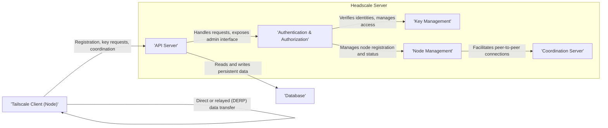
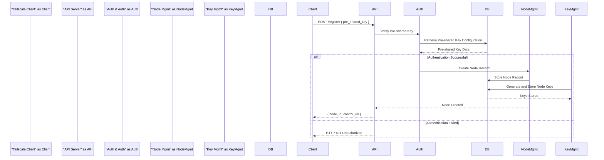

# Project Design Document: Headscale

**Version:** 1.1
**Date:** October 26, 2023
**Author:** Gemini (AI Language Model)

## 1. Introduction

This document provides a detailed design overview of the Headscale project, an open-source, self-hosted implementation of the Tailscale control server. The primary purpose of this document is to clearly articulate the system's architecture, components, and data flows. This detailed understanding is crucial for conducting thorough threat modeling to identify potential security vulnerabilities and design appropriate mitigations.

## 2. Goals and Non-Goals

**Goals:**

*   Provide a clear and comprehensive description of the Headscale system architecture, focusing on elements relevant to security.
*   Identify key components and their interactions, highlighting trust boundaries and data exchange points.
*   Describe the data flow within the system for critical operations, such as node registration, key exchange, and connection coordination.
*   Explicitly highlight security-relevant aspects of the design to facilitate threat identification and analysis.
*   Serve as a foundational document for subsequent threat modeling activities, enabling a structured approach to security assessment.

**Non-Goals:**

*   Provide a detailed, line-by-line implementation guide.
*   Cover every single configuration option or administrative feature.
*   Include performance benchmarks, scalability analysis, or detailed operational procedures.
*   Discuss the internal workings or specific implementation details of the Tailscale client.

## 3. High-Level Architecture

Headscale acts as the central control plane for a private WireGuard network, managing the lifecycle of nodes, facilitating secure key exchange, and coordinating connections. By replacing the proprietary Tailscale control servers, Headscale empowers users with greater control and privacy over their network infrastructure.

The core components and their relationships are illustrated below:

*   **Headscale Server:** The central application responsible for managing the network's state, authentication, authorization, and coordination.
*   **Database:**  A persistent storage mechanism for maintaining the network's state, including user accounts, registered nodes, cryptographic keys, and network configurations.
*   **Tailscale Clients (Nodes):** The individual devices running the Tailscale client software that connect to and participate in the Headscale-managed network.

## 4. Detailed Design

### 4.1. Headscale Server Components

The Headscale server is logically divided into several key components, each with specific responsibilities:

*   **API Server:**
    *   Provides a RESTful API (typically over HTTPS) for clients and administrators to interact with the Headscale server.
    *   Handles requests for critical operations such as node registration (`/register`), key retrieval (`/machine/register`), and coordination information (`/machine/{node_key}/routes`).
    *   Exposes administrative endpoints for user management (`/users`), node listing (`/nodes`), and configuration settings.
    *   Acts as the primary entry point for external interactions.

*   **Authentication & Authorization:**
    *   Responsible for verifying the identity of connecting clients and administrators.
    *   Supports various authentication mechanisms, including pre-shared keys (node authentication tokens), OAuth 2.0/OIDC for user authentication, and potentially local user databases.
    *   Enforces authorization policies to control access to resources and actions based on user roles or node affiliations.
    *   Manages API key generation and validation for programmatic access.

*   **Key Management:**
    *   Generates and securely stores cryptographic keys essential for establishing secure connections between nodes.
    *   Manages the distribution of public keys to authorized nodes during the key exchange process.
    *   Handles key rotation and revocation when necessary.
    *   Protects private keys at rest, typically through encryption.

*   **Node Management:**
    *   Maintains the state of all registered nodes, including their online/offline status, assigned IP addresses within the private network, and associated metadata (e.g., hostname, last seen).
    *   Assigns unique IP addresses to nodes upon successful registration, ensuring network connectivity.
    *   Handles node disconnections, re-registrations, and deregistration processes.
    *   May enforce node-specific configurations or policies.

*   **Coordination Server:**
    *   Facilitates the establishment of direct, peer-to-peer connections between nodes whenever possible.
    *   Exchanges connection information (e.g., public IP addresses, ports, relay candidates) between nodes that intend to communicate.
    *   Plays a crucial role in the STUN/TURN-like functionality, helping nodes behind NAT to establish connections.
    *   May utilize DERP (Designated Encrypted Relay for P2P) servers as fallback relays when direct connections are not feasible due to network constraints.

### 4.2. Database

The database serves as the persistent store for the Headscale server's state. Its integrity and confidentiality are paramount. It typically stores:

*   **User Accounts:** Usernames, hashed passwords (or links to external identity providers), and associated roles/permissions.
*   **Nodes:**  Records for each registered node, including its unique identifier (machine key), hostname, IP address, associated user, and current state.
*   **Node Keys:**  Public and private keys for each node, with private keys encrypted at rest.
*   **Network Configuration:**  Settings such as the IP address range for the private network, DNS configuration, and access control lists (acls).
*   **Authentication Tokens/Keys:**  Pre-shared keys for node registration, API keys for programmatic access, and potentially OAuth 2.0 client credentials.
*   **DERP Map:**  Information about available DERP relays and their locations.

### 4.3. Tailscale Client (Node)

The Tailscale client, running on end-user devices or servers, interacts with the Headscale server to join and participate in the private network. Key interactions include:

*   **Registration:** Authenticates with the Headscale server using a pre-shared key or other configured method to join the network.
*   **Key Exchange:** Requests and receives its cryptographic identity and exchanges public keys with other authorized nodes through the Headscale server.
*   **Coordination Requests:**  Queries the Headscale server for connection information about other nodes it wishes to communicate with.
*   **State Updates:** Periodically communicates with the Headscale server to report its status (online/offline, current IP address) and retrieve configuration updates.
*   **Peer-to-Peer Connection Establishment:** Utilizes the information provided by the Headscale server to establish direct WireGuard tunnels with other nodes. If direct connections fail, it may attempt to connect via DERP relays.

## 5. Data Flow

Understanding the flow of data through the system is critical for identifying potential vulnerabilities. Here are key data flows:

### 5.1. Node Registration

1. A **Tailscale Client** initiates a registration request to the **Headscale API Server** (`/register`). This request typically includes a pre-shared key.
2. The **API Server** forwards the request to the **Authentication & Authorization** component.
3. **Authentication & Authorization** verifies the provided pre-shared key against the stored configuration in the **Database**.
4. If authentication is successful, **Node Management** creates a new node record in the **Database**, assigning it a unique identifier and initial state.
5. **Key Management** generates a new pair of cryptographic keys for the node and securely stores the private key (encrypted) and the public key in the **Database**, associating them with the newly registered node.
6. The **API Server** returns the node's initial configuration, including its assigned IP address and the server's control URL, to the **Tailscale Client**.

### 5.2. Key Exchange and Peer Connection Setup

1. When **Tailscale Client A** wants to connect to **Tailscale Client B**, it sends a request to the **Headscale API Server** (`/machine/{client_a_key}/routes`) to learn about available routes and peers.
2. The **API Server**, after authenticating **Client A**, forwards the request to the **Coordination Server**.
3. The **Coordination Server** retrieves the public keys and network information for both **Client A** and **Client B** from the **Database**.
4. The **Coordination Server** provides connection hints, including the public keys and potential relay candidates (DERP servers), to both **Client A** and **Client B**.
5. **Client A** and **Client B** use this information to attempt to establish a direct WireGuard tunnel. This involves exchanging further cryptographic handshakes directly between the clients.
6. If a direct connection cannot be established (e.g., due to NAT), the clients may attempt to connect via a mutually reachable DERP relay server.

### 5.3. Configuration Updates

1. An administrator makes changes to the network configuration (e.g., access control lists) through the **API Server** (e.g., via a PUT request to `/acls`).
2. The **API Server** authenticates the administrator and updates the relevant data in the **Database**.
3. Registered **Tailscale Clients** periodically poll the **API Server** (e.g., via `/machine/{node_key}/policy`) for configuration updates.
4. The **API Server** retrieves the latest configuration from the **Database** and sends it to the requesting client.
5. Clients apply the new configuration, potentially adjusting their routing rules or allowed connections.

## 6. Security Considerations

This section outlines key security considerations that are crucial for threat modeling:

*   **Authentication and Authorization Weaknesses:**
    *   **Threat:** Brute-force attacks against pre-shared keys or user credentials.
    *   **Threat:**  Circumvention of authorization policies due to misconfiguration or vulnerabilities.
    *   **Threat:**  Compromise of API keys leading to unauthorized access.

*   **Key Management Vulnerabilities:**
    *   **Threat:**  Exposure or theft of private keys from the database if encryption is weak or compromised.
    *   **Threat:**  Man-in-the-middle attacks during key exchange if not properly secured by TLS.
    *   **Threat:**  Key leakage due to insecure storage or handling practices.

*   **API Security Flaws:**
    *   **Threat:**  Injection attacks (e.g., SQL injection) if input validation is insufficient.
    *   **Threat:**  Cross-site scripting (XSS) or cross-site request forgery (CSRF) vulnerabilities in the administrative interface.
    *   **Threat:**  Denial-of-service (DoS) attacks exploiting API endpoints if rate limiting is not implemented or insufficient.

*   **Database Security Deficiencies:**
    *   **Threat:**  Unauthorized access to the database if access controls are weak or default credentials are used.
    *   **Threat:**  Data breaches due to unencrypted sensitive data at rest.
    *   **Threat:**  Data loss or corruption due to inadequate backup and recovery mechanisms.

*   **Coordination Server Manipulation:**
    *   **Threat:**  Malicious actors intercepting or manipulating coordination messages to facilitate man-in-the-middle attacks or disrupt connections.
    *   **Threat:**  Information leakage through coordination data, potentially revealing network topology or node identities.

*   **DERP Relay Security Risks (if self-hosted):**
    *   **Threat:**  Compromise of DERP servers leading to the ability to eavesdrop on or manipulate relayed traffic.
    *   **Threat:**  DERP servers becoming open relays, potentially being abused for malicious purposes.

*   **Node Security Dependence:**
    *   **Threat:**  Compromised client devices could potentially leak private keys or be used to attack other nodes on the network.
    *   **Note:** Headscale relies on the security of the Tailscale client implementation for the integrity of the WireGuard tunnels.

*   **Logging and Auditing Gaps:**
    *   **Threat:**  Insufficient logging making it difficult to detect and respond to security incidents.
    *   **Threat:**  Insecure storage or access control for logs, allowing attackers to cover their tracks.

## 7. Deployment Considerations

*   Headscale can be deployed as a standalone binary or within containerized environments like Docker or Kubernetes.
*   The choice of database (e.g., SQLite for simple setups, PostgreSQL or MySQL for more robust deployments) impacts security and scalability. Ensure proper database hardening.
*   Secure network configuration is crucial, including using HTTPS with valid TLS certificates for the API server and restricting access to the database.
*   Consider implementing robust backup and restore procedures for the database.
*   For production environments, consider high-availability setups and redundancy for critical components.
*   Regular security audits and penetration testing are recommended.

## 8. Future Considerations

*   Integration with hardware security modules (HSMs) for enhanced key protection.
*   More fine-grained access control mechanisms and policy enforcement.
*   Advanced monitoring and alerting capabilities for security events.
*   Support for certificate-based authentication for nodes.
*   Enhancements to the administrative interface for improved security management.

This improved design document provides a more detailed and security-focused overview of the Headscale project. It serves as a valuable resource for conducting thorough threat modeling and implementing appropriate security measures.