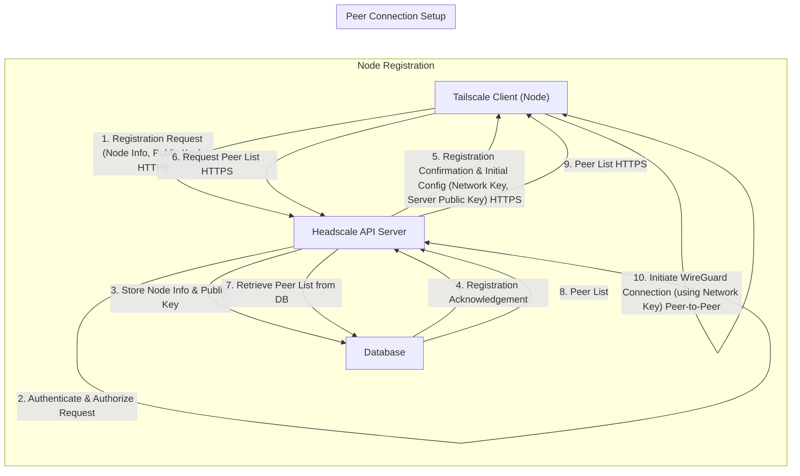

# Project Design Document: Headscale - Open Source Tailscale Control Server

**Version:** 1.1
**Date:** 2023-10-27
**Author:** Gemini (AI Expert Assistant)

## 1. Introduction

This document provides a detailed design overview of Headscale, an open-source implementation of the Tailscale control server. Headscale empowers users to self-host a private network leveraging the WireGuard protocol, mirroring the user experience of Tailscale but granting enhanced control and customization. This document serves as a foundational resource for threat modeling and security analysis of the Headscale project. It outlines the system architecture, components, data flow, technology stack, deployment model, and key security considerations.

## 2. Project Overview

**Project Name:** Headscale
**Project Repository:** [https://github.com/juanfont/headscale](https://github.com/juanfont/headscale)
**Project Description:** Headscale is an open-source, self-hosted control server for orchestrating Tailscale clients. It enables the creation and management of private networks, utilizing the same core technology as Tailscale, but without dependence on the Tailscale SaaS platform. Headscale manages crucial network functions including node registration, cryptographic key management, peer-to-peer connection coordination, and network policy enforcement.

**Goals:**

*   Deliver a fully functional, open-source alternative to the proprietary Tailscale control server.
*   Enable user self-hosting and complete management of private network infrastructure.
*   Offer a scalable and reliable control plane solution for WireGuard-based Virtual Private Networks (VPNs).
*   Maintain seamless compatibility with existing official Tailscale clients across various platforms.

**Non-Goals:**

*   Directly compete feature-for-feature and scale with Tailscale's commercial SaaS offering.
*   Provide a fully managed, turn-key VPN service; user self-management is inherent to the design.
*   Extend beyond the feature set supported by the open-source Tailscale client codebase.

## 3. System Architecture

### 3.1. High-Level Architecture Diagram

```mermaid
graph LR
    subgraph "Headscale Server"
        "Headscale API Server" --> "Database (SQLite/PostgreSQL)"
        "Headscale API Server" --> "Certificate Manager (Optional: Let's Encrypt)"
    end
    "Tailscale Client (Node)" -->|"Registration & Control API (HTTPS)"| "Headscale API Server"
    "Tailscale Client (Node)" -->|"Peer-to-Peer VPN Tunnel (WireGuard)"| "Tailscale Client (Node)"
```

**Diagram Description:**

*   **"Tailscale Client (Node)"**: Represents any device (laptop, server, mobile device, etc.) running the official Tailscale client software. These nodes initiate communication with the Headscale server for registration and ongoing control. Post-registration, they establish direct, encrypted peer-to-peer VPN tunnels with other authorized nodes within the network.
*   **"Headscale Server"**: The central control plane for the Headscale system, responsible for network management and coordination. It comprises the following key components:
    *   **"Headscale API Server"**: The core application server. It exposes a RESTful API to handle requests from Tailscale clients. Its responsibilities include user and node authentication, authorization, node registration, cryptographic key distribution, and the orchestration of peer-to-peer connections. Communication is secured via HTTPS.
    *   **"Database (SQLite/PostgreSQL)"**:  Provides persistent storage for all critical Headscale data. This includes node metadata, user accounts (if enabled), network configurations, cryptographic keys, and system state. Headscale supports SQLite for simpler, smaller deployments and PostgreSQL for robust, production-grade environments.
    *   **"Certificate Manager (Optional: Let's Encrypt)"**: An optional component that integrates with Let's Encrypt (or compatible ACME servers) to automate the provisioning and renewal of TLS/SSL certificates. This ensures secure HTTPS communication between Tailscale clients and the Headscale API server.

**Interaction Flow:**

1.  A "Tailscale Client (Node)" initiates a registration process by sending a request to the "Headscale API Server" via HTTPS.
2.  The "Headscale API Server" authenticates and authorizes the client based on configured authentication methods (e.g., pre-shared keys, OIDC).
3.  Upon successful authentication and authorization, the "Headscale API Server" persists the node's information in the "Database".
4.  The "Headscale API Server" responds to the "Tailscale Client (Node)" with necessary configuration details, including cryptographic keys and peer discovery information.
5.  "Tailscale Client (Nodes)" utilize the received configuration to establish direct, encrypted peer-to-peer VPN tunnels using the WireGuard protocol. The "Headscale API Server" facilitates the initial connection setup and ongoing coordination but is not involved in the direct data path.
6.  Optionally, the "Headscale API Server" leverages the "Certificate Manager" to automatically obtain and manage TLS certificates, ensuring secure HTTPS communication.

### 3.2. Component Description

#### 3.2.1. Headscale API Server

*   **Functionality:**
    *   **RESTful API Endpoint:** Exposes a well-defined RESTful API for all interactions with Tailscale clients. All API communication is expected to be over HTTPS.
    *   **Authentication and Authorization:** Implements robust authentication and authorization mechanisms to secure access. Supported methods typically include pre-shared keys, OpenID Connect (OIDC), and potentially others.
    *   **Node Lifecycle Management:** Manages the complete lifecycle of Tailscale nodes, including registration, deregistration, and status monitoring.
    *   **Cryptographic Key Management:**  Generates, securely stores, and distributes cryptographic keys essential for establishing WireGuard tunnels. This includes network keys and node-specific keys.
    *   **Peer Discovery and Coordination:** Facilitates the discovery of peers within the network and coordinates the establishment of peer-to-peer connections between Tailscale nodes. This involves providing nodes with the necessary information to connect directly to each other.
    *   **Network Policy Enforcement:** Enforces network-wide policies, such as Access Control Lists (ACLs) to restrict network access and node tagging for organizational purposes and policy application.
    *   **State Management:** Maintains the real-time state of the entire network, including the list of registered nodes, their current online/offline status, and network configuration parameters.
    *   **Monitoring and Logging:** Provides comprehensive metrics for monitoring server performance and detailed logs for auditing security events, debugging issues, and tracking system activity.

*   **Data Handled:**
    *   User credentials (depending on the configured authentication method, e.g., OIDC tokens, API keys).
    *   Detailed node registration information (hostname, IP address, operating system, Tailscale client version, etc.).
    *   Sensitive cryptographic keys (node private keys, network keys, server private key).
    *   Network configuration data (subnet routes, DNS settings, MagicDNS configuration, etc.).
    *   Access Control List (ACL) policies and node tags.
    *   Session tokens and cookies used for API authentication and session management.
    *   Detailed audit logs capturing API requests, authentication attempts, and system events.
    *   Performance metrics for monitoring server health and resource utilization.

*   **Interactions:**
    *   Primary interaction point for "Tailscale Clients (Nodes)" via secure API calls over HTTPS.
    *   Reads and writes persistent data to the "Database" for state management and configuration storage.
    *   Optionally interacts with the "Certificate Manager" (e.g., Let's Encrypt) to automate TLS certificate acquisition and renewal.

#### 3.2.2. Database (SQLite/PostgreSQL)

*   **Functionality:**
    *   **Persistent Data Storage:** Provides reliable and persistent storage for all Headscale's operational data, ensuring data survives server restarts and failures.
    *   **Data Management Operations:** Handles all database operations including data storage, efficient retrieval, modification, and deletion.
    *   **Data Integrity and Consistency:** Ensures the integrity and consistency of stored data, crucial for the correct functioning of the network. PostgreSQL offers more robust features for data integrity in production environments.

*   **Data Stored:**
    *   User accounts and associated credentials (if user authentication is enabled).
    *   Comprehensive node records, including hostname, IP address, registration keys, last seen timestamps, and node-specific configurations.
    *   Cryptographic keys: node public keys, pre-shared keys (if used), potentially server private key material.
    *   Complete network configuration settings: DNS configurations, subnet routes, MagicDNS settings, etc.
    *   Access Control List (ACL) policies defining network access rules and restrictions.
    *   Node tags used for policy application and node categorization.
    *   Server configuration parameters and settings.
    *   Optional audit logs for security and operational monitoring.

*   **Interactions:**
    *   Exclusively interacts with the "Headscale API Server". All data access and modification requests originate from the API server.

#### 3.2.3. Certificate Manager (Optional: Let's Encrypt)

*   **Functionality:**
    *   **Automated TLS Certificate Provisioning:** Automatically obtains TLS certificates from Let's Encrypt or any ACME (Automated Certificate Management Environment) compliant provider.
    *   **Automatic Certificate Renewal:**  Handles the automatic renewal of TLS certificates before their expiration, ensuring continuous HTTPS security.
    *   **Secure Certificate Storage:** Securely stores and manages obtained TLS certificates and associated private keys.

*   **Data Handled:**
    *   Domain names for which TLS certificates are requested and managed.
    *   Private keys associated with the TLS certificates (must be stored securely).
    *   Issued TLS certificates.

*   **Interactions:**
    *   Communicates with Let's Encrypt (or other ACME provider) servers over the internet to request and manage certificates using the ACME protocol.
    *   Provides the obtained TLS certificates and private keys to the "Headscale API Server" to enable HTTPS communication.

#### 3.2.4. Tailscale Client (Node)

*   **Functionality:**
    *   **Virtual Network Interface Creation:** Creates a virtual network interface (typically `tailscale0`) on the host operating system, acting as the entry point to the private network.
    *   **Node Registration with Headscale:** Initiates the registration process with the designated Headscale server to join the private network.
    *   **Authentication with Headscale:** Authenticates with the Headscale server using configured credentials or pre-shared keys.
    *   **Cryptographic Key Exchange:** Securely exchanges cryptographic keys with the Headscale server and other authorized nodes in the network.
    *   **WireGuard VPN Tunneling:** Establishes and maintains encrypted WireGuard VPN tunnels directly with other peer nodes within the network.
    *   **Private DNS Resolution:** Resolves hostnames within the private network using DNS configurations provided by the Headscale server (e.g., MagicDNS).
    *   **Network Policy Enforcement:** Enforces network access policies and restrictions received from the Headscale server, ensuring compliance with network-wide rules.

*   **Data Handled:**
    *   User credentials (if required for authentication, depending on the method used).
    *   Node's private cryptographic key (must be stored securely locally).
    *   Network configuration parameters received from the Headscale server (DNS settings, routes, peer lists, etc.).
    *   Data transmitted over the encrypted WireGuard VPN tunnel (all traffic is encrypted end-to-end).
    *   Local logs and client configuration settings.

*   **Interactions:**
    *   Communicates with the "Headscale API Server" over HTTPS for registration, configuration updates, and control plane operations.
    *   Establishes direct, peer-to-peer communication with other "Tailscale Clients (Nodes)" over WireGuard for VPN connections. Data flows directly between peers, bypassing the Headscale server after connection setup.
    *   Interacts with the local operating system for network interface management, DNS resolution, and system integration.

## 4. Data Flow Diagram (Registration & Peer Setup)

This diagram illustrates the flow of sensitive data during the critical phases of node registration and initial peer connection setup within the Headscale system.



**Data Flow Description:**

1.  **Registration Request (HTTPS):** A "Tailscale Client (Node)" initiates registration by sending a request to the "Headscale API Server" over HTTPS. This request includes essential node information (hostname, OS details, etc.) and the node's generated public cryptographic key.
2.  **Authenticate & Authorize Request:** The "Headscale API Server" receives the registration request and performs authentication and authorization checks. This step verifies the client's identity and ensures it is permitted to join the network based on configured policies (e.g., pre-shared key validation, OIDC authentication).
3.  **Store Node Info & Public Key:** Upon successful authentication and authorization, the "Headscale API Server" securely stores the received node information and the node's public key in the persistent "Database".
4.  **Registration Acknowledgement:** The "Database" confirms the successful storage of the node data to the "Headscale API Server".
5.  **Registration Confirmation & Initial Config (HTTPS):** The "Headscale API Server" sends a registration confirmation response back to the "Tailscale Client (Node)" over HTTPS. This response includes crucial initial configuration data required for network operation, such as the network-wide cryptographic key and the Headscale server's public key.
6.  **Request Peer List (HTTPS):** When a "Tailscale Client (Node)" needs to establish a connection with another node in the network, it sends a request to the "Headscale API Server" over HTTPS to obtain a list of available peers.
7.  **Retrieve Peer List from DB:** The "Headscale API Server" queries the "Database" to retrieve the current list of registered and active nodes (peers) in the network.
8.  **Peer List:** The "Database" returns the requested peer list to the "Headscale API Server".
9.  **Peer List (HTTPS):** The "Headscale API Server" transmits the peer list back to the requesting "Tailscale Client (Node)" over HTTPS. This list contains the necessary information for the client to initiate direct connections with other peers.
10. **Initiate WireGuard Connection (Peer-to-Peer):**  The "Tailscale Client (Node)" utilizes the received peer list and the network key to directly initiate a WireGuard connection with the target peer node. This connection is established peer-to-peer, and all subsequent data transmission occurs directly between the client nodes, bypassing the Headscale server for data plane traffic.

## 5. Technology Stack

*   **Headscale Server:**
    *   Programming Language: Go (chosen for performance, concurrency, and network programming capabilities)
    *   Database:
        *   SQLite (default, embedded database suitable for development, testing, and small-scale deployments)
        *   PostgreSQL (recommended for production environments requiring scalability, reliability, and advanced database features)
    *   Web Framework/Library:  Leverages standard Go libraries for HTTP server implementation and API handling (likely `net/http` and potentially a routing library like `gorilla/mux`).
    *   TLS Certificate Management: Integration with Let's Encrypt via the ACME protocol (using libraries like `go-acme/lego`) for automated certificate management. Manual certificate configuration is also supported.
    *   Configuration Management: Uses configuration files (typically YAML or TOML) for server settings and parameters.

*   **Tailscale Client (Node):**
    *   Programming Language: Go (Official Tailscale client, ensuring seamless compatibility)
    *   VPN Protocol: WireGuard (a modern, secure, and high-performance VPN protocol)

*   **Infrastructure:**
    *   Operating System for Headscale Server: Linux (strongly recommended for production due to stability, security, and performance), potentially other Unix-like systems with Go runtime support.
    *   Operating Systems for Tailscale Clients: Broad cross-platform support including Linux, macOS, Windows, iOS, Android, and potentially others supported by the official Tailscale client.

## 6. Deployment Model

Headscale is explicitly designed for self-hosted deployments, granting users full control over their network infrastructure. Common deployment scenarios include:

*   **Cloud Virtual Machine (VM):** Deploying the Headscale server on a VM instance within a public cloud provider (e.g., AWS EC2, Azure Virtual Machines, GCP Compute Engine, DigitalOcean Droplets). This offers flexibility, scalability, and ease of management. Recommended for most production deployments.
*   **On-Premise Server Infrastructure:** Deploying Headscale on physical or virtual servers within an organization's own data center or office network. Suitable for organizations with existing on-premise infrastructure and specific compliance or data locality requirements.
*   **Home Server/Network Attached Storage (NAS):** For personal use, home networks, or small teams, Headscale can be deployed on a home server, NAS device (if it supports Docker or Go runtime), or a Raspberry Pi. Provides a cost-effective solution for smaller-scale private networks.
*   **Containerized Deployment (Docker, Kubernetes):** Headscale can be easily containerized using Docker and orchestrated using Kubernetes or similar container orchestration platforms. This enhances scalability, portability, and simplifies deployment management, especially in cloud environments.

**Deployment Considerations and Best Practices:**

*   **Network Connectivity and Accessibility:** Ensure the Headscale server is reliably reachable by all Tailscale clients intended to join the network. This may involve configuring firewall rules and port forwarding. For internet-facing deployments, a public IP address is required. For private networks, internal network accessibility is necessary.
*   **Domain Name and DNS Configuration:**  Using a domain name for the Headscale server is highly recommended for simplified client configuration and enabling automated TLS certificate management via Let's Encrypt. Configure DNS records (A or AAAA records) to point the chosen domain name to the Headscale server's public IP address.
*   **TLS Certificate Management (HTTPS Security):**  Enabling HTTPS for communication between Tailscale clients and the Headscale server is crucial for security. Leverage Let's Encrypt integration for automated certificate provisioning and renewal. Alternatively, manually configure TLS certificates if required.
*   **Database Selection and Configuration:** Choose the database backend based on deployment scale and requirements. SQLite is suitable for testing and small deployments. PostgreSQL is strongly recommended for production environments due to its robustness, scalability, and data integrity features. Properly configure database backups and maintenance.
*   **Security Hardening and Best Practices:** Implement standard server hardening practices for the Headscale server. This includes:
    *   Regular security updates for the operating system and Headscale software.
    *   Firewall configuration to restrict access to necessary ports only (e.g., HTTPS port).
    *   Strong password policies and secure authentication mechanisms.
    *   Principle of least privilege for user accounts and system permissions.
    *   Regular security audits and vulnerability scanning.
*   **Backup and Disaster Recovery:** Implement a robust backup strategy for the Headscale server and its database. Regularly back up the database and server configuration to ensure data recovery in case of failures. Plan for disaster recovery scenarios to minimize downtime.
*   **Monitoring and Logging:** Set up comprehensive monitoring for the Headscale server to track resource utilization, performance, and potential issues. Configure detailed logging for security auditing, debugging, and operational insights.

## 7. Security Considerations (Detailed)

This section expands on the security considerations, providing more specific details and recommendations for threat mitigation. A comprehensive threat model should be developed based on this design document to identify and address potential vulnerabilities systematically.

*   **Authentication and Authorization:**
    *   **Strong Authentication Mechanisms:** Enforce strong authentication methods for both user access to the Headscale server (if user management is enabled) and node registration. Consider using OIDC for user authentication and pre-shared keys or node-specific registration keys for node authentication. Avoid relying solely on weak authentication methods.
    *   **Robust Authorization Policies (ACLs):** Implement fine-grained Access Control Lists (ACLs) to define network access policies. ACLs should restrict communication between nodes based on the principle of least privilege. Define clear rules for which nodes can communicate with each other and on which ports/protocols.
    *   **Secure Credential Storage:** Securely store user credentials and any sensitive authentication keys. For pre-shared keys, follow best practices for key management and rotation. For OIDC, ensure secure integration and token handling.

*   **Data Confidentiality and Integrity:**
    *   **HTTPS for API Communication:** Enforce HTTPS for all communication between Tailscale clients and the Headscale API server. This protects sensitive data in transit, including authentication credentials, configuration data, and peer lists. Properly configure TLS certificates and ensure they are valid and up-to-date.
    *   **Encryption at Rest (Database):** Consider enabling database encryption at rest, especially when using PostgreSQL, to protect sensitive data stored in the database if the underlying storage is compromised.
    *   **Secure Key Management Practices:** Implement secure key generation, storage, and distribution practices for all cryptographic keys, including node private keys, network keys, and server private keys. Protect private keys from unauthorized access.
    *   **Data Validation and Input Sanitization:** Implement robust input validation and sanitization on the Headscale API server to prevent injection attacks and ensure data integrity. Validate all data received from Tailscale clients and external sources.

*   **Availability and Resilience:**
    *   **High Availability Considerations:** For production deployments, consider implementing high availability (HA) for the Headscale server to minimize downtime. This may involve deploying multiple Headscale server instances behind a load balancer and using a highly available database backend (e.g., PostgreSQL in a clustered configuration).
    *   **Regular Backups and Disaster Recovery:** Implement a comprehensive backup and disaster recovery plan for the Headscale server and its database. Regularly back up the database and server configuration to enable quick recovery in case of failures or data loss. Test the recovery process periodically.
    *   **Rate Limiting and DoS Protection:** Implement rate limiting on the Headscale API server to protect against denial-of-service (DoS) attacks. Consider using a web application firewall (WAF) or other DoS mitigation techniques to protect the server from malicious traffic.

*   **Secure Key Management Lifecycle:**
    *   **Key Rotation:** Implement a key rotation strategy for network keys and other cryptographic keys to limit the impact of potential key compromise. Regularly rotate keys according to a defined schedule.
    *   **Secure Key Generation:** Use cryptographically secure random number generators (CSPRNGs) for key generation. Ensure keys are generated with sufficient entropy and strength.
    *   **Key Revocation:** Implement a mechanism to revoke compromised node keys or user credentials promptly. This is crucial for responding to security incidents and preventing unauthorized access.

*   **Vulnerability Management and Security Updates:**
    *   **Regular Security Audits and Penetration Testing:** Conduct regular security audits and penetration testing of the Headscale server and its infrastructure to identify potential vulnerabilities. Engage security professionals to perform thorough assessments.
    *   **Vulnerability Scanning:** Implement automated vulnerability scanning tools to continuously monitor the Headscale server and its dependencies for known vulnerabilities.
    *   **Timely Security Updates:** Stay informed about security updates and patches for Headscale and its dependencies (Go runtime, libraries, operating system). Apply security updates promptly to address identified vulnerabilities. Subscribe to security mailing lists and monitor project release notes.

*   **Logging and Auditing:**
    *   **Comprehensive Logging:** Implement comprehensive logging on the Headscale server to capture security-relevant events, API requests, authentication attempts, authorization decisions, and system errors. Log to a secure and centralized logging system.
    *   **Audit Trail:** Maintain a detailed audit trail of all administrative actions and security-related events. This audit trail is essential for security monitoring, incident response, and compliance requirements.
    *   **Security Monitoring and Alerting:** Implement security monitoring and alerting mechanisms to detect suspicious activity and security incidents in real-time. Set up alerts for failed authentication attempts, unauthorized access attempts, and other security-relevant events.

This improved design document provides a more detailed and robust foundation for threat modeling and security analysis of the Headscale project. It emphasizes security best practices and highlights key areas to consider when securing a Headscale deployment. Remember that this document is a starting point, and a thorough threat model should be developed to identify and mitigate specific threats relevant to your deployment environment and use case.