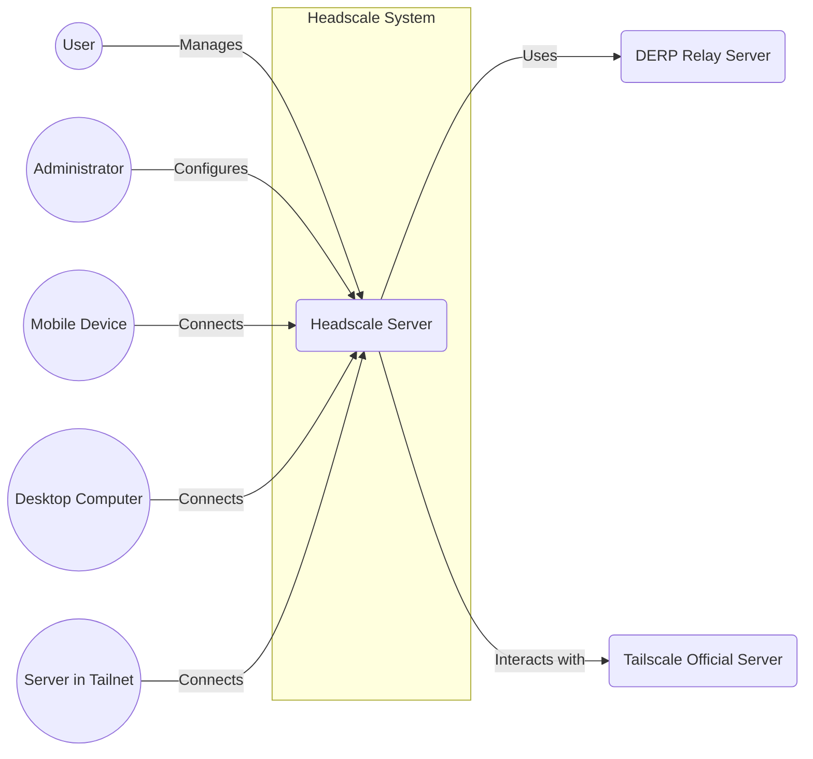
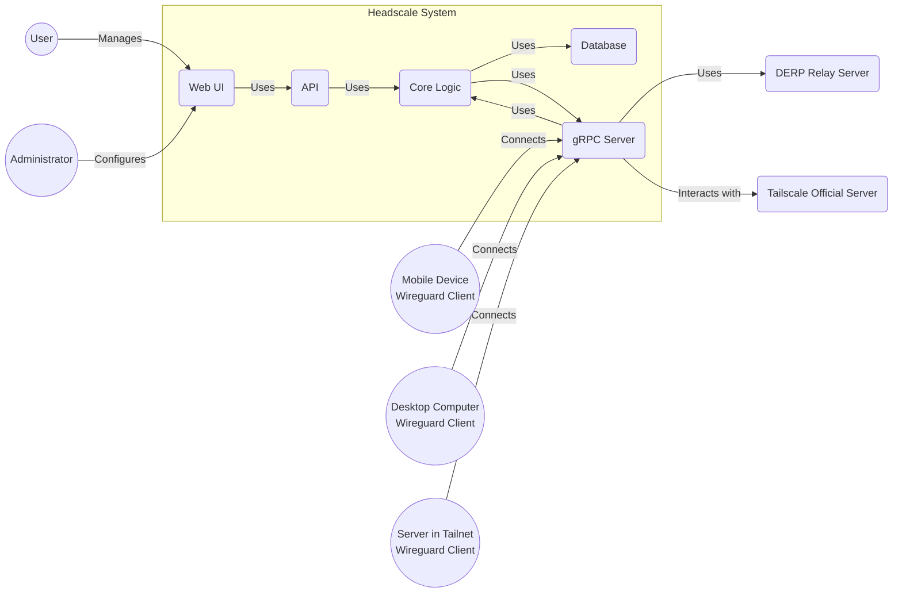
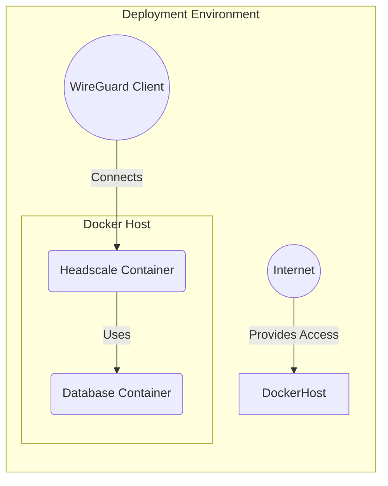
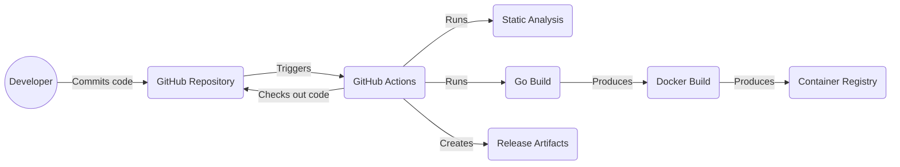

Okay, let's create a design document for the Headscale project.

# BUSINESS POSTURE

Headscale is an open-source implementation of the Tailscale control server. Tailscale is a commercial VPN service that emphasizes ease of use and secure connectivity using WireGuard. Headscale aims to provide a self-hostable, privacy-respecting alternative for users who want full control over their network coordination.

Business Priorities:

- Provide a stable and reliable alternative to the commercial Tailscale control server.
- Maintain feature parity with the essential functionalities of Tailscale's control server.
- Ensure the security and privacy of user networks.
- Foster a community-driven development model.
- Enable self-hosting for individuals and organizations.
- Minimize operational overhead for users.

Business Goals:

- Attract users who are looking for self-hosted VPN solutions.
- Grow a community of contributors to enhance and maintain the project.
- Establish Headscale as a trusted and respected project in the networking and security space.
- Provide a viable option for organizations that require strict data control and compliance.

Most Important Business Risks:

- Security vulnerabilities in Headscale could compromise the privacy and security of user networks, leading to data breaches and reputational damage.
- Lack of scalability could limit the adoption of Headscale by larger organizations.
- Inability to keep up with Tailscale's feature development could make Headscale less attractive to users.
- Insufficient community engagement could lead to project stagnation and abandonment.
- Legal challenges related to intellectual property or licensing could hinder the project's development and distribution.

# SECURITY POSTURE

Existing Security Controls:

- security control: Uses WireGuard, a modern and secure VPN protocol, for data transport. (Described in WireGuard documentation and Headscale's code)
- security control: Implements mutual TLS (mTLS) for authentication between clients and the server. (Described in Headscale's code and configuration)
- security control: Go language, memory safe. (Described in Go language specification)
- security control: Uses gRPC for internal communication, which can be secured with TLS. (Described in Headscale's code and gRPC documentation)
- security control: Access control mechanisms to manage user and device permissions. (Described in Headscale's code and documentation)
- security control: Regular updates and security patches are released to address vulnerabilities. (Described in Headscale's GitHub repository and release notes)
- security control: Containerized deployment using Docker, which provides some level of isolation. (Described in Headscale's documentation and Dockerfile)
- security control: Support for HTTPS for the web UI and API. (Described in Headscale's configuration)

Accepted Risks:

- accepted risk: Relies on the security of the underlying operating system and infrastructure.
- accepted risk: The security of the WireGuard protocol itself is an assumption (though it is generally considered secure).
- accepted risk: User misconfiguration could lead to security vulnerabilities.
- accepted risk: Dependent on third-party libraries, which could introduce vulnerabilities.
- accepted risk: Single point of failure. Headscale is a central point of coordination, and its compromise would affect the entire network.

Recommended Security Controls:

- security control: Implement a robust auditing and logging system to track all administrative actions and network events.
- security control: Integrate with a secrets management solution (e.g., HashiCorp Vault) to securely store and manage sensitive information like API keys and certificates.
- security control: Conduct regular security assessments and penetration testing to identify and address vulnerabilities.
- security control: Implement a Web Application Firewall (WAF) to protect the web UI and API from common web attacks.
- security control: Provide detailed security documentation and best practices for users to follow.
- security control: Implement network segmentation to limit the impact of a potential breach.
- security control: Consider implementing a multi-factor authentication (MFA) mechanism for administrative access.

Security Requirements:

- Authentication:
    - All clients and the server must mutually authenticate using strong cryptographic methods (mTLS with WireGuard keys).
    - Administrative access to the Headscale server should require strong authentication, potentially including MFA.
    - API access should be authenticated using API keys or other secure tokens.

- Authorization:
    - A robust access control system must be in place to manage which users and devices can connect to the network.
    - Granular permissions should be available to control access to specific resources and functionalities.
    - The principle of least privilege should be enforced.

- Input Validation:
    - All user-supplied input, including configuration parameters and API requests, must be strictly validated to prevent injection attacks and other vulnerabilities.
    - Data received from clients should be treated as untrusted and validated before processing.

- Cryptography:
    - WireGuard's built-in cryptography should be used for all data in transit.
    - TLS should be used to secure all communication between clients, the server, and any external services.
    - Strong cryptographic algorithms and key lengths should be used throughout the system.
    - Cryptographic keys should be managed securely, following best practices for key generation, storage, and rotation.

# DESIGN

## C4 CONTEXT

Element Descriptions:

-   Name: User
    -   Type: Person
    -   Description: A user of the Tailscale network.
    -   Responsibilities: Connects devices to the Tailscale network, manages their devices.
    -   Security controls: Uses WireGuard client with mTLS.

-   Name: Administrator
    -   Type: Person
    -   Description: An administrator of the Headscale server.
    -   Responsibilities: Configures and manages the Headscale server, manages users and access control.
    -   Security controls: Uses strong authentication (potentially MFA), access control restrictions.

-   Name: Mobile Device
    -   Type: Device
    -   Description: A mobile device (e.g., phone, tablet) connected to the Tailscale network.
    -   Responsibilities: Connects to the Tailscale network, communicates with other devices on the network.
    -   Security controls: Uses WireGuard client with mTLS.

-   Name: Desktop Computer
    -   Type: Device
    -   Description: A desktop computer connected to the Tailscale network.
    -   Responsibilities: Connects to the Tailscale network, communicates with other devices on the network.
    -   Security controls: Uses WireGuard client with mTLS.

-   Name: Server in Tailnet
    -   Type: Device
    -   Description: A server connected to the Tailscale network.
    -   Responsibilities: Connects to the Tailscale network, communicates with other devices on the network, provides services to other devices.
    -   Security controls: Uses WireGuard client with mTLS.

-   Name: Headscale Server
    -   Type: Software System
    -   Description: The self-hosted Tailscale control server.
    -   Responsibilities: Coordinates the Tailscale network, manages key exchange, provides network configuration to clients.
    -   Security controls: mTLS, access control, input validation, regular security updates.

-   Name: Tailscale Official Server
    -   Type: External System
    -   Description: The official Tailscale control server (used for fallback or specific features).
    -   Responsibilities: Provides services to Tailscale clients, interacts with Headscale for specific functionalities.
    -   Security controls: Assumed to be secured by Tailscale.

-   Name: DERP Relay Server
    -   Type: External System
    -   Description: A DERP (Designated Encrypted Relay for Packets) server used for relaying traffic when direct connections are not possible.
    -   Responsibilities: Relays encrypted traffic between Tailscale clients.
    -   Security controls: Uses TLS for communication with Headscale and clients.

## C4 CONTAINER

Element Descriptions:

-   Name: API
    -   Type: API
    -   Description: Provides a RESTful API for managing Headscale.
    -   Responsibilities: Handles API requests, interacts with the core logic.
    -   Security controls: Authentication (API keys), input validation, rate limiting.

-   Name: Web UI
    -   Type: Web Application
    -   Description: Provides a web-based user interface for managing Headscale.
    -   Responsibilities: Provides a user-friendly interface for interacting with the API.
    -   Security controls: Authentication, HTTPS, input validation, XSS protection, CSRF protection.

-   Name: Database
    -   Type: Database
    -   Description: Stores Headscale's data, including user information, device keys, and network configuration.
    -   Responsibilities: Persists data, provides data access to the core logic.
    -   Security controls: Access control, encryption at rest (if supported by the database), regular backups.

-   Name: Core Logic
    -   Type: Application Component
    -   Description: Contains the core business logic of Headscale.
    -   Responsibilities: Implements the Tailscale control server functionality, manages key exchange, coordinates the network.
    -   Security controls: Input validation, access control, secure coding practices.

-   Name: gRPC Server
    -   Type: API
    -   Description: gRPC server for communication with WireGuard clients.
    -   Responsibilities: Handles client connections, manages key exchange, provides network configuration.
    -   Security controls: mTLS, input validation.

-   Name: User
    -   Type: Person
    -   Description: A user of the Tailscale network.
    -   Responsibilities: Connects devices to the Tailscale network, manages their devices.
    -   Security controls: Uses WireGuard client with mTLS.

-   Name: Administrator
    -   Type: Person
    -   Description: An administrator of the Headscale server.
    -   Responsibilities: Configures and manages the Headscale server, manages users and access control.
    -   Security controls: Uses strong authentication (potentially MFA), access control restrictions.

-   Name: Mobile Device
    -   Type: Device
    -   Description: A mobile device (e.g., phone, tablet) connected to the Tailscale network.
    -   Responsibilities: Connects to the Tailscale network, communicates with other devices on the network.
    -   Security controls: Uses WireGuard client with mTLS.

-   Name: Desktop Computer
    -   Type: Device
    -   Description: A desktop computer connected to the Tailscale network.
    -   Responsibilities: Connects to the Tailscale network, communicates with other devices on the network.
    -   Security controls: Uses WireGuard client with mTLS.

-   Name: Server in Tailnet
    -   Type: Device
    -   Description: A server connected to the Tailscale network.
    -   Responsibilities: Connects to the Tailscale network, communicates with other devices on the network, provides services to other devices.
    -   Security controls: Uses WireGuard client with mTLS.

-   Name: Tailscale Official Server
    -   Type: External System
    -   Description: The official Tailscale control server (used for fallback or specific features).
    -   Responsibilities: Provides services to Tailscale clients, interacts with Headscale for specific functionalities.
    -   Security controls: Assumed to be secured by Tailscale.

-   Name: DERP Relay Server
    -   Type: External System
    -   Description: A DERP (Designated Encrypted Relay for Packets) server used for relaying traffic when direct connections are not possible.
    -   Responsibilities: Relays encrypted traffic between Tailscale clients.
    -   Security controls: Uses TLS for communication with Headscale and clients.

## DEPLOYMENT

Possible Deployment Solutions:

1.  Bare Metal/Virtual Machine: Deploy Headscale directly on a server (physical or virtual).
2.  Docker Container: Deploy Headscale as a Docker container.
3.  Kubernetes: Deploy Headscale on a Kubernetes cluster.

Chosen Solution (for detailed description): Docker Container

Deployment Diagram:

Element Descriptions:

- Name: Docker Host
  - Type: Server
  - Description: Physical or virtual machine that hosts Docker containers.
  - Responsibilities: Runs Docker Engine, manages containers.
  - Security controls: OS hardening, firewall, regular security updates.

- Name: Headscale Container
  - Type: Docker Container
  - Description: Container running the Headscale application.
  - Responsibilities: Runs the Headscale server, handles client connections.
  - Security controls: Container isolation, minimal base image, regular image updates.

- Name: Database Container
  - Type: Docker Container
  - Description: Container running the database (e.g., PostgreSQL, SQLite).
  - Responsibilities: Stores Headscale's data.
  - Security controls: Container isolation, database access control, data encryption (if supported).

- Name: Internet
  - Type: Network
  - Description: The public internet.
  - Responsibilities: Provides network connectivity.
  - Security controls: N/A (external)

- Name: WireGuard Client
  - Type: Software
  - Description: WireGuard client application running on a device.
  - Responsibilities: Connects to the Headscale server, establishes a VPN tunnel.
  - Security controls: WireGuard's built-in security features.

## BUILD

Build Process:

1.  Developer commits code changes to the GitHub repository.
2.  GitHub Actions workflow is triggered.
3.  The workflow checks out the code.
4.  Go build is used to compile the Headscale binary.
5.  Static analysis tools (e.g., linters, security scanners) are run on the code.
6.  A Docker image is built using the Dockerfile.
7.  The Docker image is pushed to a container registry (e.g., Docker Hub, GitHub Container Registry).
8.  Release artifacts (e.g., binaries, source code) are created and published on GitHub.

Build Diagram:

Security Controls in Build Process:

-   security control: GitHub Actions provides a secure and automated build environment.
-   security control: Static analysis tools (linters, security scanners) help identify potential vulnerabilities in the code.
-   security control: Docker builds use a minimal base image to reduce the attack surface.
-   security control: Container images are pushed to a trusted container registry.
-   security control: Release artifacts are digitally signed to ensure their integrity.
-   security control: Dependency management tools are used to track and update dependencies, mitigating supply chain risks.

# RISK ASSESSMENT

Critical Business Processes:

-   Network coordination and key exchange: Ensuring secure and reliable communication between Tailscale clients.
-   User and device management: Managing access control and permissions for users and devices.
-   Data storage: Securely storing Headscale's configuration and user data.
-   Software updates: Providing timely security patches and updates to address vulnerabilities.

Data Sensitivity:

-   Usernames and email addresses: Personally Identifiable Information (PII), medium sensitivity.
-   Device public keys: Cryptographic keys, high sensitivity.
-   Network configuration: Information about the network topology and connected devices, high sensitivity.
-   Access logs: Information about user activity, medium sensitivity.
-   IP addresses: Network information, medium sensitivity.

# QUESTIONS & ASSUMPTIONS

Questions:

-   What specific database is used by Headscale (e.g., PostgreSQL, SQLite)? This affects the security controls for data storage.
-   What are the specific requirements for logging and auditing? This will determine the level of detail and retention period for logs.
-   Are there any specific compliance requirements (e.g., GDPR, HIPAA) that Headscale needs to meet?
-   What is the expected scale of deployment (number of users and devices)? This will influence the scalability requirements.
-   What is the process for handling security vulnerabilities reported by external researchers?
-   Is there a mechanism for users to report abuse or misuse of the Headscale server?
-   What is the expected level of support and maintenance for the project?

Assumptions:

-   BUSINESS POSTURE: The primary goal is to provide a secure and reliable self-hosted alternative to Tailscale's control server.
-   BUSINESS POSTURE: The project prioritizes security and privacy over adding new features rapidly.
-   SECURITY POSTURE: The underlying operating system and infrastructure are secured by the user.
-   SECURITY POSTURE: Users will follow best practices for securing their Headscale deployment.
-   SECURITY POSTURE: The WireGuard protocol is secure.
-   DESIGN: Headscale is deployed as a Docker container.
-   DESIGN: The database is secured and managed separately from the Headscale application.
-   DESIGN: GitHub Actions is used for the build process.
-   DESIGN: Users are responsible for configuring their firewalls and network security.
-   DESIGN: DERP servers are trusted relays.