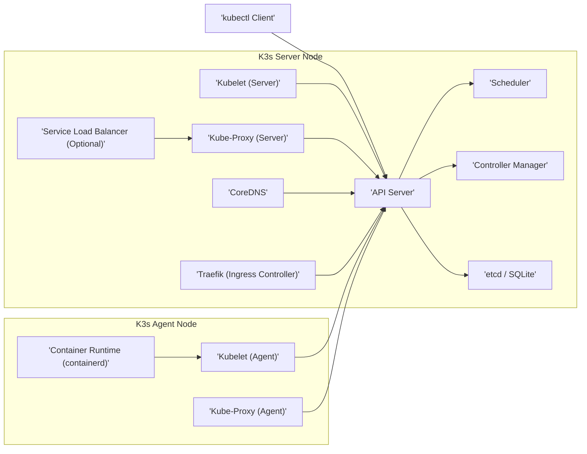

# Project Design Document: K3s - Lightweight Kubernetes

**Version:** 1.1
**Date:** October 26, 2023
**Author:** AI Cloud & Security Architect

## 1. Introduction

This document provides an enhanced architectural design of K3s, a lightweight, certified Kubernetes distribution optimized for resource-constrained environments. The purpose of this document is to offer a detailed understanding of K3s's architecture, its constituent components, and the flow of data within the system. This detailed design will serve as a robust foundation for subsequent threat modeling exercises.

## 2. Goals and Objectives

The primary objectives of this design document are to:

*   Provide a clear and comprehensive description of the K3s architecture.
*   Identify and detail the key components of K3s and their interactions.
*   Illustrate the data flow pathways within the K3s system.
*   Emphasize security-relevant aspects of the K3s design to facilitate threat identification.
*   Establish a solid basis for identifying potential security threats and vulnerabilities within K3s.

## 3. High-Level Architecture

K3s is packaged as a single binary, incorporating all the necessary components for a functioning Kubernetes cluster. It operates in two primary modes, defining the role of a node within the cluster:

*   **Server Mode:**  This mode designates a node as a control plane, responsible for managing the Kubernetes cluster.
*   **Agent Mode:** This mode designates a node as a worker, responsible for executing containerized workloads.

The following diagram visually represents the high-level architecture of a K3s cluster:

## 4. Component Details

This section provides a detailed description of the core components within the K3s architecture, outlining their functions and responsibilities:

*   **API Server:**  Serves as the central management interface for the Kubernetes cluster. It exposes the Kubernetes API, enabling interaction with the cluster for users, controllers, and other components. It handles authentication, authorization, and admission control for all API requests.
*   **Scheduler:**  Responsible for the optimal placement of Pods (workloads) onto available worker nodes. It considers resource requirements, constraints, and other factors to ensure efficient workload distribution.
*   **Controller Manager:**  A collection of essential control loops that monitor and regulate the state of the Kubernetes system. Key controllers include:
    *   **Node Controller:** Manages the lifecycle of worker nodes, handling node registration and monitoring their health.
    *   **Replication Controller/Deployment Controller/StatefulSet Controller:** Ensures the desired number of Pod replicas are running and healthy.
    *   **Endpoint Controller:** Populates the endpoints object (which represents the backend Pods for a Service).
    *   **Service Account Controller:** Manages service accounts and their associated credentials.
*   **etcd / SQLite:**  The persistent storage backend for the Kubernetes cluster's state. K3s utilizes either:
    *   **etcd:** A distributed key-value store, recommended for high-availability (HA) setups with multiple server nodes.
    *   **SQLite:** A lightweight, file-based database, suitable for single-server deployments.
*   **Kubelet:** An agent that runs on every node (both server and agent). Its primary responsibilities include:
    *   Registering the node with the Kubernetes cluster.
    *   Receiving Pod specifications from the API Server.
    *   Instructing the container runtime to launch and manage containers.
    *   Monitoring the health of containers and reporting their status back to the API Server.
*   **Kube-Proxy:** A network proxy that runs on each node. It maintains network rules (typically using iptables or nftables) to facilitate network communication to Pods. Its key functions include:
    *   **Forwarding traffic to the correct Pods** based on Service definitions.
    *   **Load balancing traffic** across multiple Pods backing a Service.
*   **Service Load Balancer (Optional):**  Provides a mechanism for exposing Kubernetes Services of type `LoadBalancer` to the external network. This is often implemented using:
    *   **MetalLB:** A bare-metal load balancer.
    *   **Cloud Provider Integrations:** Utilizing load balancing services provided by cloud platforms.
*   **CoreDNS:** The default DNS server for the Kubernetes cluster. It resolves service names to cluster-internal IP addresses, enabling service discovery within the cluster.
*   **Traefik (Ingress Controller):**  A dynamic, cloud-native Ingress controller that manages external access to services within the cluster. It acts as a reverse proxy and load balancer, routing external requests to the appropriate Services based on configured Ingress resources.
*   **Container Runtime (containerd):** The underlying runtime responsible for managing containers on the worker nodes. K3s defaults to using containerd, which handles image pulling, container lifecycle management, and resource isolation.
*   **kubectl Client:** The command-line interface (CLI) tool used by users and administrators to interact with the Kubernetes API Server, allowing for the management and monitoring of the cluster.

## 5. Data Flow

This section illustrates the typical data flow for common operations within a K3s cluster, highlighting the interactions between components:

*   **Workload Deployment Process:**
    *   A user initiates workload deployment by submitting a deployment manifest via the `kubectl` client.
    *   The `kubectl` client transmits the deployment request to the API Server.
    *   The API Server performs authentication and authorization checks on the request.
    *   Upon successful authorization, the API Server persists the deployment object in the etcd/SQLite datastore.
    *   The Scheduler continuously monitors for new deployments and, upon detecting the new deployment, assigns the constituent Pods to suitable agent nodes based on resource availability and constraints.
    *   The API Server updates the Pod assignments in the etcd/SQLite datastore.
    *   The Kubelets running on the designated agent nodes receive the Pod specifications from the API Server.
    *   Each Kubelet instructs the Container Runtime (containerd) to pull the necessary container images from a container registry and initiate the containers.
    *   The Kubelets monitor the status of the Pods and report their status back to the API Server.

*   **Internal Service Discovery:**
    *   A Pod within the cluster needs to communicate with another service.
    *   The Pod initiates a DNS query for the target service's name.
    *   CoreDNS resolves the service name to the corresponding Service IP address.
    *   The originating Pod sends network traffic to the resolved Service IP address.
    *   The Kube-Proxy running on the node where the traffic originates intercepts the traffic.
    *   Kube-Proxy utilizes its configured network rules (iptables/nftables) to forward the traffic to one of the active Pods backing the target service.

*   **External Access via Ingress:**
    *   An external user sends an HTTP/HTTPS request to the cluster.
    *   The request is received by the Traefik Ingress Controller.
    *   Traefik examines the request headers and matches them against configured Ingress resources.
    *   Based on the matching Ingress rule, Traefik routes the request to the appropriate Kubernetes Service within the cluster.
    *   Kube-Proxy then intercepts the traffic destined for the Service and forwards it to one of the healthy Pods backing that Service.

## 6. Security Considerations

This section details critical security considerations within the K3s architecture, highlighting potential areas of risk and security mechanisms:

*   **Authentication and Authorization Mechanisms:**
    *   K3s supports various methods for authenticating users and services accessing the API Server, including:
        *   **TLS Client Certificates:**  Certificates issued to clients for mutual TLS authentication.
        *   **Bearer Tokens:**  Tokens (e.g., JWTs) used to authenticate requests.
        *   **Webhook Token Authentication:**  Delegating authentication to an external service.
    *   Authorization within the cluster is managed through Kubernetes Role-Based Access Control (RBAC), allowing granular control over who can perform what actions on which resources.
    *   Access to the API Server should be strictly controlled and limited to authorized entities.

*   **Network Security within the Cluster:**
    *   Communication between core components (e.g., Kubelet to API Server) is secured using Transport Layer Security (TLS).
    *   Kubernetes Network Policies provide a mechanism to define rules that govern network traffic flow between Pods and Namespaces, enabling micro-segmentation.
    *   Careful consideration must be given to exposed ports and services, particularly on server nodes, to minimize the attack surface.

*   **Data Security and Encryption:**
    *   Sensitive data stored in etcd/SQLite, such as Secrets, should be encrypted at rest. K3s supports encryption at rest for Kubernetes Secrets.
    *   Secrets management practices should be robust, limiting access and utilizing features like secret rotation.
    *   Consider encrypting etcd communication in HA setups.

*   **Node Security Hardening:**
    *   Both server and agent nodes should be hardened following security best practices, including:
        *   Regular patching of the operating system and kernel.
        *   Minimizing installed software.
        *   Implementing strong access controls.
    *   Direct access to agent nodes should be restricted to authorized personnel and processes.

*   **Supply Chain Security Considerations:**
    *   The integrity of the K3s binary should be verified upon download and installation.
    *   Container images used within the cluster should be sourced from trusted registries and regularly scanned for vulnerabilities using tools like Trivy or Clair.
    *   Consider implementing image signing and verification mechanisms.

*   **API Server Security Best Practices:**
    *   The API Server is a critical component and requires robust security measures:
        *   Enable audit logging to track API requests and identify suspicious activity.
        *   Implement rate limiting to prevent denial-of-service attacks.
        *   Consider network segmentation to isolate the control plane network.
        *   Regularly review and update API Server configurations.

*   **Ingress Controller (Traefik) Security:**
    *   As the entry point for external traffic, the Ingress Controller requires careful configuration:
        *   Enforce TLS termination to ensure secure communication with external clients.
        *   Implement appropriate authentication and authorization mechanisms for externally exposed services.
        *   Consider deploying a Web Application Firewall (WAF) in front of the Ingress Controller to protect against common web attacks.
        *   Regularly update Traefik to the latest version to patch vulnerabilities.

## 7. Deployment Considerations

*   **Single Server Deployment:**  All control plane components and agent functionalities are consolidated onto a single node. This deployment model is suitable for development, testing, and edge computing scenarios with limited resource requirements.
*   **Multi-Server Deployment (High Availability):**  Multiple server nodes host the control plane components, leveraging etcd as the distributed consensus store for data replication and fault tolerance. Agent nodes connect to a load-balanced set of API Servers, ensuring control plane availability.
*   **Agent Node Joining:** Agent nodes are added to the cluster by executing the `k3s agent` command, providing the server's join token for secure registration.

## 8. Future Considerations

*   Enhanced integration with security scanning and runtime protection tools for proactive threat detection and mitigation.
*   Expanded support for diverse container runtimes beyond the default containerd.
*   Further development of observability and monitoring features to improve cluster health and security posture visibility.

This enhanced design document provides a comprehensive and detailed view of the K3s architecture, emphasizing security considerations. This information is essential for conducting thorough threat modeling exercises, enabling the identification of potential vulnerabilities and the development of effective mitigation strategies to secure K3s deployments.