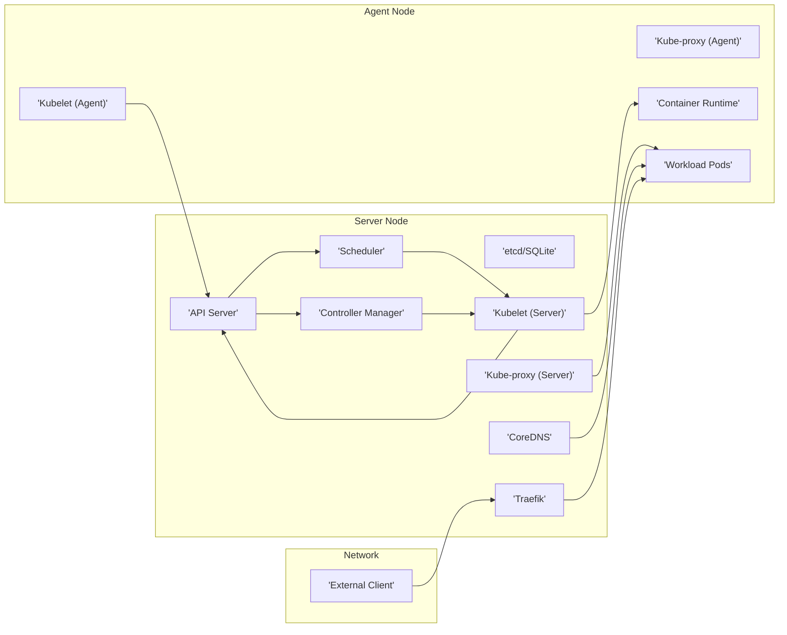

## Project Design Document: K3s - Lightweight Kubernetes Distribution

**Version:** 1.1

**Date:** October 26, 2023

**Author:** AI Software Architect

**1. Introduction**

This document provides a detailed architectural overview of K3s, a lightweight Kubernetes distribution. This design document is intended to serve as a foundation for subsequent threat modeling activities. It outlines the key components, their interactions, and the overall architecture of the system.

**2. Goals**

*   Provide a comprehensive description of the K3s architecture.
*   Identify key components and their responsibilities.
*   Illustrate the interactions between different components.
*   Highlight potential attack surfaces for threat modeling.
*   Serve as a reference point for security analysis and design improvements.

**3. Target Audience**

*   Security engineers and architects
*   Development teams working with K3s
*   Operations teams deploying and managing K3s
*   Anyone interested in understanding the internal workings of K3s

**4. System Overview**

K3s is a certified Kubernetes distribution designed for resource-constrained environments. It packages and optimizes Kubernetes to be smaller and easier to operate. Key features include:

*   Single binary installation
*   Reduced memory footprint
*   Optimized for edge, IoT, and CI/CD scenarios
*   Support for various storage backends
*   Integrated components like Traefik (ingress controller) and CoreDNS (DNS provider)

**5. Architectural Components**

K3s architecture can be broadly categorized into server and agent nodes.

*   **Server Node(s):**  Responsible for running the Kubernetes control plane components.
    *   **`k3s` Process:** The main process encompassing all server components.
        *   **API Server (`kube-apiserver`):**  The front-end for the Kubernetes control plane, exposing the Kubernetes API.
        *   **Scheduler (`kube-scheduler`):**  Decides which node new pods should be placed on.
        *   **Controller Manager (`kube-controller-manager`):**  Runs core control loops that regulate the state of the cluster.
        *   **etcd:**  A distributed key-value store that serves as Kubernetes' backing store for cluster data. K3s uses either an embedded SQLite database (default) or an external datastore (like etcd, MySQL, or PostgreSQL).
        *   **Kubelet:**  The primary "node agent" that runs on each server node, responsible for managing containers.
        *   **Kube-proxy:**  Maintains network rules on nodes, allowing network communication to Pods.
        *   **Service LB (Service Load Balancer):**  Provides load balancing for Kubernetes Services of type `LoadBalancer`.
        *   **CoreDNS:**  Provides DNS resolution for services within the cluster.
        *   **Traefik:**  An ingress controller that manages external access to services.
        *   **Metrics Server:**  Collects resource usage data from nodes and pods.
        *   **Helm Controller:**  Manages Helm chart deployments.
        *   **Local Path Provisioner:**  Provides a simple way to provision local storage for PersistentVolumes.
*   **Agent Node(s):**  Responsible for running the workloads (containers).
    *   **`k3s-agent` Process:** The main process running on agent nodes.
        *   **Kubelet:**  Registers the node with the control plane and manages containers based on instructions from the API server.
        *   **Kube-proxy:**  Maintains network rules on the node.
        *   **Flannel (Default Network):**  Provides a simple overlay network for pod networking. K3s supports other CNI (Container Network Interface) plugins as well.
        *   **Container Runtime (containerd):**  Responsible for running containers.

**6. Component Interactions**

The following diagram illustrates the high-level interactions between key components:

**Detailed Interaction Flows:**

*   **Pod Deployment:**
    1. A user submits a pod deployment request to the **API Server**.
    2. The **Scheduler** determines the optimal node for the pod based on resource availability and constraints.
    3. The **API Server** updates the pod's node assignment.
    4. The **Kubelet (Agent)** on the assigned node receives the pod specification from the **API Server**.
    5. The **Kubelet (Agent)** instructs the **Container Runtime** to pull the container image and run the container.
    6. The **Kubelet (Agent)** reports the pod's status back to the **API Server**.
*   **Service Discovery:**
    1. When a pod needs to access a service, it queries **CoreDNS**.
    2. **CoreDNS** resolves the service name to the IP address(es) of the backing pods.
    3. Network traffic is routed to the appropriate pod by **Kube-proxy**.
*   **External Access (Ingress):**
    1. External traffic arrives at the **Traefik** ingress controller.
    2. **Traefik** uses ingress rules defined in Kubernetes to route the traffic to the appropriate service.
    3. **Kube-proxy** on the target node routes the traffic to the backend pods.

**7. Data Flow**

Key data flows within K3s include:

*   **Control Plane Data:**  State information about the cluster (nodes, pods, deployments, etc.) is stored in **etcd/SQLite**. The **API Server** is the primary interface for accessing and modifying this data.
*   **Workload Data:**  Data generated and processed by applications running in pods. This data flow is dependent on the specific application and its network configuration.
*   **Monitoring Data:**  Metrics about resource usage are collected by the **Metrics Server** and can be accessed through the Kubernetes API.
*   **Logging Data:**  Logs from containers are typically collected by a logging agent running on each node and sent to a centralized logging system.

**8. Security Considerations and Potential Attack Surfaces**

This section highlights potential areas of vulnerability that should be considered during threat modeling.

*   **API Server:**
    *   Authentication and authorization vulnerabilities.
    *   Exposure of sensitive cluster information.
    *   Denial-of-service attacks.
*   **etcd/SQLite:**
    *   Unauthorized access to the backing store.
    *   Data corruption or loss.
*   **Kubelet:**
    *   Node compromise leading to container escape.
    *   Unauthorized access to node resources.
*   **Container Runtime:**
    *   Container escape vulnerabilities.
    *   Image vulnerabilities.
*   **Network:**
    *   Man-in-the-middle attacks.
    *   Unauthorized network access between pods.
    *   Exposure of internal services to the internet.
*   **Ingress Controller (Traefik):**
    *   Misconfiguration leading to security vulnerabilities.
    *   Exposure of backend services.
*   **Supply Chain:**
    *   Compromised container images.
    *   Vulnerabilities in K3s binaries or dependencies.
*   **Node Security:**
    *   Compromised operating system on server or agent nodes.
    *   Insufficient security hardening.
*   **RBAC (Role-Based Access Control):**
    *   Incorrectly configured permissions leading to privilege escalation.

**9. Deployment Considerations**

*   **Single Server vs. Multi-Server:** K3s can be deployed with a single server node or multiple server nodes for high availability.
*   **Embedded vs. External Datastore:**  The choice between the embedded SQLite database and an external datastore impacts scalability and resilience.
*   **Network Configuration:**  Selecting the appropriate CNI plugin and configuring network policies is crucial for security and connectivity.
*   **Security Hardening:**  Implementing security best practices for the underlying operating system and K3s configuration is essential.

**10. Future Considerations**

*   Integration with other security tools and platforms.
*   Enhanced auditing and logging capabilities.
*   Further optimization for resource-constrained environments.

This document provides a foundational understanding of the K3s architecture for threat modeling. Further analysis and investigation will be required to identify specific vulnerabilities and develop appropriate mitigation strategies.
