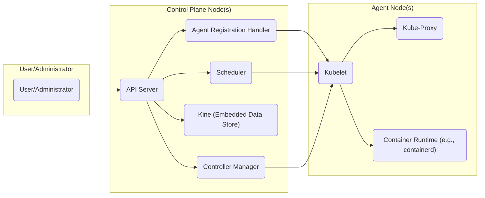
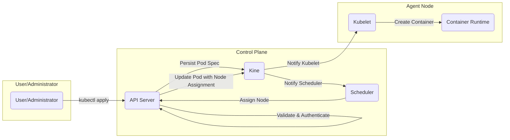
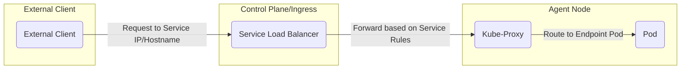

# Project Design Document: K3s - Lightweight Kubernetes

**Version:** 1.1
**Date:** October 26, 2023
**Author:** AI Cloud & Security Architect

## 1. Introduction

This document provides an enhanced design overview of the K3s project, a lightweight, certified Kubernetes distribution engineered for resource-constrained environments. This detailed design serves as a foundational artifact for subsequent threat modeling exercises, offering a comprehensive understanding of K3s's architecture, component interactions, data flows, and inherent security considerations.

## 2. Goals and Objectives

The core design objectives of K3s are:

- **Resource Efficiency:** Minimize CPU and memory footprint compared to standard Kubernetes distributions.
- **Kubernetes Conformance:** Maintain full compatibility with the Kubernetes API and workload specifications.
- **Simplified Installation and Operation:** Streamline the deployment and management processes.
- **Edge Computing Optimization:**  Tailored for deployment in edge locations, IoT devices, and CI/CD pipelines.
- **Secure by Default Configuration:** Implement robust security defaults and adhere to security best practices from the outset.

## 3. High-Level Architecture

K3s employs a streamlined architecture, consolidating several control plane components into a single process and optimizing for resource utilization.

## 4. Detailed Component Description

### 4.1 Control Plane Components

- **API Server ("API"):** The central point of interaction for the Kubernetes control plane, exposing the Kubernetes API for management and control. It handles authentication, authorization, and admission control for all API requests.
- **Scheduler ("Sched"):** Responsible for intelligently placing newly created Pods onto available worker nodes based on resource requirements, constraints, and policies.
- **Controller Manager ("CtrlMgr"):**  A collection of control loops that monitor the state of the cluster and work to bring the current state closer to the desired state. Key controllers include the Node Controller, Replication Controller, and Endpoint Controller.
- **Kine (Embedded Data Store) ("KineDB"):** A lightweight, purpose-built data store for persisting Kubernetes API objects. By default, K3s utilizes SQLite for simplicity, but it can be configured to use other backends like MySQL, PostgreSQL, or etcd for higher availability in multi-server setups.
- **Agent Registration Handler ("AgentRegHandler"):** Manages the secure registration and initial authentication of agent nodes joining the cluster, typically using a shared secret (join token).

### 4.2 Agent Node Components

- **Kubelet ("KLT"):** The primary agent running on each worker node. It registers the node with the control plane, receives Pod specifications, and manages the lifecycle of containers within those Pods by interacting with the Container Runtime. It also reports node status and resource utilization back to the control plane.
- **Kube-Proxy ("KProxy"):** A network proxy that runs on each node and implements the Kubernetes Service abstraction. It maintains network rules and performs connection forwarding to the backend Pods of a Service.
- **Container Runtime ("CRuntime"):** The underlying software responsible for running containers. K3s defaults to containerd, a CNCF graduated project known for its efficiency and security.

### 4.3 Networking Components

- **Service Load Balancer:** K3s includes an integrated service load balancer (often based on Traefik or similar) to expose Kubernetes Services externally. This component handles ingress traffic and distributes it across the backend Pods.
- **CoreDNS:** Provides DNS resolution for services within the cluster, allowing Pods to discover each other by their service names.
- **Network Policy Controller:** Enforces Kubernetes Network Policies, allowing fine-grained control over network traffic between Pods and namespaces, enhancing security by isolating workloads.

### 4.4 Storage Components

- **Local Persistent Volumes:** Support for utilizing local storage directly on worker nodes for persistent data.
- **StorageClass Integration:**  Enables dynamic provisioning of persistent volumes from various storage providers through the Kubernetes StorageClass abstraction and CSI (Container Storage Interface) drivers.

## 5. Data Flow

### 5.1 User Initiated Workload Deployment

- A user deploys a workload (e.g., using `kubectl apply`) which sends a request to the **API Server**.
- The **API Server** authenticates and authorizes the request.
- The **API Server** persists the desired state (e.g., Pod specification) in **Kine**.
- The **Scheduler** observes the new pending Pod in **Kine**.
- The **Scheduler** selects an appropriate node and updates the Pod's node assignment via the **API Server**.
- The **Kubelet** on the assigned node observes the updated Pod specification in **Kine**.
- The **Kubelet** instructs the **Container Runtime** to pull the necessary image and create the container.

### 5.2 Service Access from Outside the Cluster

- An external client sends a request to a service exposed by K3s.
- The **Service Load Balancer** receives the incoming request.
- Based on the configured Service rules (e.g., Ingress rules), the **Service Load Balancer** forwards the request to a **Kube-Proxy** instance running on a node hosting a backend Pod for the service.
- **Kube-Proxy**, using its internal routing tables, directs the traffic to the appropriate **Pod**.

## 6. Security Considerations

K3s incorporates several key security design principles and features:

- **Reduced Attack Surface:** By consolidating control plane components and removing extraneous features, K3s minimizes the potential attack vectors.
- **Secure Defaults:** K3s is configured with sensible security defaults, such as requiring authentication and authorization for API access and disabling anonymous access.
- **TLS for Internal Communication:** All internal communication between K3s components is secured using TLS certificates, ensuring confidentiality and integrity.
- **Node Authentication and Authorization (Join Tokens):** Agent nodes must authenticate with the control plane using a pre-shared secret (join token) during the registration process, preventing unauthorized nodes from joining the cluster.
- **Role-Based Access Control (RBAC):** K3s leverages Kubernetes RBAC to manage permissions and access to cluster resources, allowing administrators to define granular roles and bind them to users or service accounts.
- **Network Policies for Workload Isolation:** Kubernetes Network Policies enable the creation of firewall-like rules to control network traffic between Pods and namespaces, limiting the blast radius of potential security breaches.
- **Secrets Management:** Kubernetes Secrets provide a secure way to store and manage sensitive information like passwords and API keys, preventing them from being directly embedded in application configurations.
- **Auditing:** K3s supports auditing of API server requests, providing a log of actions performed within the cluster for security monitoring and forensics.
- **CIS Benchmark Alignment:** K3s aims to align with the recommendations of the CIS Kubernetes Benchmark, a widely recognized set of security best practices for Kubernetes.
- **Container Runtime Security (containerd):** The underlying container runtime, containerd, incorporates security features like namespace isolation and seccomp profiles to isolate containers and restrict their system calls.
- **Image Security:** While K3s itself doesn't enforce image security, it's a critical consideration for deployments. Practices like using trusted registries and scanning images for vulnerabilities are essential.

## 7. Deployment Considerations

- **Single Server Deployment:** K3s can be easily deployed on a single server, making it ideal for development, testing, and edge scenarios with limited resources.
- **Multi-Server High Availability:** For production environments, K3s supports multi-server setups with either an embedded, distributed datastore (using an embedded etcd setup) or by connecting to an external datastore like etcd, MySQL, or PostgreSQL for increased resilience.
- **Air-Gapped Environments:** K3s is designed to be deployable in air-gapped environments with limited or no internet connectivity, by providing mechanisms to pre-load necessary images and binaries.
- **Simplified Installation Methods:** K3s offers straightforward installation methods, often using a single binary and simple shell scripts, reducing the complexity of deployment.

## 8. Future Considerations

- **Enhanced Security Posture:** Continuous evaluation and implementation of new security features and best practices to address emerging threats.
- **Improved Integration with Security Tools:**  Deeper integration with security scanning tools, vulnerability management platforms, and security information and event management (SIEM) systems.
- **Further Resource Optimization:** Ongoing efforts to reduce resource consumption and improve performance, particularly in highly constrained environments.
- **Adoption of Emerging Kubernetes Features:**  Keeping pace with and integrating relevant new features and security enhancements from the upstream Kubernetes project.

This enhanced design document provides a more detailed and nuanced understanding of the K3s project, specifically focusing on aspects relevant to threat modeling. The information presented here should be a valuable resource for security professionals to identify potential vulnerabilities, assess risks, and develop appropriate mitigation strategies for K3s deployments.