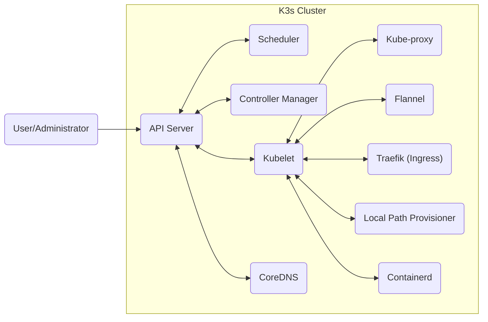
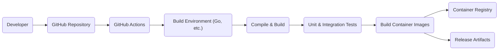

# BUSINESS POSTURE

K3s is a lightweight Kubernetes distribution. It's designed for resource-constrained environments, edge computing, IoT, and CI/CD. The business priorities likely revolve around:

*   Providing a simplified, easy-to-install, and easy-to-maintain Kubernetes distribution.
*   Minimizing resource consumption (CPU, memory, disk space).
*   Enabling Kubernetes deployments in edge locations, IoT devices, and development/testing environments where a full-fledged Kubernetes distribution would be impractical.
*   Maintaining compatibility with upstream Kubernetes APIs and functionality.
*   Fast boot times.
*   Single binary deployment.

Based on these priorities, the most important business risks are:

*   Security vulnerabilities that could compromise the cluster or the workloads running on it, especially given the potential deployment in edge/IoT scenarios which may have limited physical security.
*   Instability or bugs that could disrupt the operation of the cluster, particularly in production edge deployments.
*   Incompatibility with standard Kubernetes tools or APIs, hindering adoption and usability.
*   Performance bottlenecks that negate the benefits of its lightweight design.
*   Supply chain attacks that could compromise the integrity of the K3s binary.

# SECURITY POSTURE

*   security control: K3s inherits many security features from Kubernetes, including RBAC (Role-Based Access Control), network policies, and support for Pod Security Policies (deprecated) or Pod Security Admission (PSA). Described in Kubernetes documentation.
*   security control: K3s uses packaged versions of containerd, Flannel, CoreDNS, and other components, which are regularly updated to address security vulnerabilities. Described in K3s documentation and release notes.
*   security control: K3s supports SELinux and AppArmor for enhanced security on supported operating systems. Described in K3s documentation.
*   security control: K3s can be configured to use TLS certificates for secure communication between components. Described in K3s documentation.
*   security control: K3s provides options for hardening the installation, such as disabling the local storage provider and service load balancer. Described in K3s documentation.
*   security control: K3s uses a minimal attack surface by design, reducing the number of exposed components and services.
*   accepted risk: K3s, by default, bundles components like Traefik as an ingress controller and a local path provisioner. While convenient, these may not be suitable for all production environments and should be reviewed/replaced based on specific security requirements.
*   accepted risk: K3s is often used in single-node deployments, which eliminates some of the complexities of multi-node Kubernetes clusters but also introduces a single point of failure.
*   accepted risk: K3s is designed for edge and resource-constrained environments, which may have limited physical security and network isolation.

Recommended Security Controls:

*   Implement regular vulnerability scanning of K3s clusters and the underlying host operating system.
*   Enforce strong authentication and authorization policies, including the use of external identity providers.
*   Implement network segmentation and isolation using network policies.
*   Monitor K3s cluster logs and audit events for suspicious activity.
*   Regularly review and update K3s to the latest stable version to benefit from security patches.
*   Implement a robust secrets management solution.
*   Implement image signing and verification to prevent the use of tampered container images.

Security Requirements:

*   Authentication:
    *   Support for strong authentication mechanisms, including mutual TLS and integration with external identity providers (e.g., OIDC).
    *   Secure storage of credentials and secrets.
*   Authorization:
    *   Fine-grained access control using RBAC to restrict access to cluster resources based on roles and responsibilities.
    *   Regular auditing of RBAC policies to ensure least privilege.
*   Input Validation:
    *   Validation of all inputs to the Kubernetes API and K3s components to prevent injection attacks.
    *   Use of admission controllers to enforce security policies on resource creation and modification.
*   Cryptography:
    *   Use of TLS for all communication between cluster components and with external clients.
    *   Secure generation and management of cryptographic keys.
    *   Support for encryption at rest for sensitive data stored in etcd.

# DESIGN

## C4 CONTEXT

```mermaid
graph LR
    subgraph "K3s System"
        k3s("K3s Cluster")
    end

    user("User/Administrator") --> k3s
    containerd("Containerd") <-- k3s
    flannel("Flannel (CNI)") <-- k3s
    coredns("CoreDNS") <-- k3s
    external_storage("External Storage (Optional)") <-- k3s
    external_lb("External Load Balancer (Optional)") <-- k3s
    metrics_server("Metrics Server") <-- k3s
    internet("Internet") <-- k3s
```

*   Elements:
    *   Name: User/Administrator
        *   Type: Person
        *   Description: Individuals interacting with the K3s cluster, deploying applications, managing configurations, and monitoring the system.
        *   Responsibilities: Deploying applications, managing the cluster, configuring resources, monitoring performance.
        *   Security controls: Authentication (kubectl, kubeconfig), RBAC, audit logging.
    *   Name: K3s Cluster
        *   Type: System
        *   Description: The lightweight Kubernetes cluster managed by K3s.
        *   Responsibilities: Running containerized workloads, managing resources, providing Kubernetes API access.
        *   Security controls: RBAC, network policies, Pod Security Admission, TLS encryption, secrets management.
    *   Name: Containerd
        *   Type: System
        *   Description: Container runtime used by K3s.
        *   Responsibilities: Managing container lifecycle (creation, execution, deletion).
        *   Security controls: Container image signing, runtime security profiles (AppArmor, SELinux), regular updates.
    *   Name: Flannel (CNI)
        *   Type: System
        *   Description: Provides networking for the Kubernetes cluster.
        *   Responsibilities: Creating and managing the overlay network, assigning IP addresses to pods.
        *   Security controls: Network policies, encryption (if configured).
    *   Name: CoreDNS
        *   Type: System
        *   Description: Provides DNS service discovery within the cluster.
        *   Responsibilities: Resolving service names to IP addresses.
        *   Security controls: DNSSEC (if configured), regular updates.
    *   Name: External Storage (Optional)
        *   Type: System
        *   Description: Persistent storage solutions used by applications running in the cluster.
        *   Responsibilities: Providing persistent volumes for stateful applications.
        *   Security controls: Encryption at rest, access controls, regular backups.
    *   Name: External Load Balancer (Optional)
        *   Type: System
        *   Description: Load balancer used to expose services externally.
        *   Responsibilities: Distributing traffic to services running in the cluster.
        *   Security controls: TLS termination, access controls, DDoS protection.
    *   Name: Metrics Server
        *   Type: System
        *   Description: Provides basic resource usage metrics for the cluster.
        *   Responsibilities: Collecting and exposing CPU and memory usage data.
        *   Security controls: RBAC, TLS encryption.
    *   Name: Internet
        *   Type: External
        *   Description: External network access for pulling container images, accessing external services, etc.
        *   Responsibilities: N/A
        *   Security controls: Firewall, network policies, egress traffic control.

## C4 CONTAINER



*   Elements:
    *   Name: API Server
        *   Type: Container
        *   Description: The primary management component of Kubernetes, exposing the Kubernetes API.
        *   Responsibilities: Handling API requests, validating resources, coordinating cluster state.
        *   Security controls: TLS encryption, authentication, authorization (RBAC), audit logging, admission controllers.
    *   Name: Scheduler
        *   Type: Container
        *   Description: Assigns Pods to Nodes.
        *   Responsibilities: Determining the optimal node for each pod based on resource availability and constraints.
        *   Security controls: RBAC.
    *   Name: Controller Manager
        *   Type: Container
        *   Description: Runs controller processes that regulate the state of the cluster.
        *   Responsibilities: Managing deployments, replica sets, nodes, and other cluster resources.
        *   Security controls: RBAC.
    *   Name: Kubelet
        *   Type: Container
        *   Description: An agent that runs on each node and ensures that containers are running in a Pod.
        *   Responsibilities: Managing pods and containers on the node, communicating with the API server.
        *   Security controls: TLS encryption, node authorization, regular updates.
    *   Name: Kube-proxy
        *   Type: Container
        *   Description: Maintains network rules on nodes.  Enables network communication to your Pods.
        *   Responsibilities:  Forwarding traffic to the correct pods, implementing service discovery and load balancing.
        *   Security controls: Network policies.
    *   Name: CoreDNS
        *   Type: Container
        *   Description: DNS server for the cluster.
        *   Responsibilities: Resolving service names to IP addresses.
        *   Security controls: DNSSEC (if configured), regular updates.
    *   Name: Flannel
        *   Type: Container
        *   Description:  Networking plugin (CNI) that provides an overlay network for the cluster.
        *   Responsibilities: Creating and managing the overlay network, assigning IP addresses to pods.
        *   Security controls: Network policies, encryption (if configured).
    *   Name: Traefik (Ingress)
        *   Type: Container
        *   Description:  Default ingress controller for K3s.
        *   Responsibilities:  Managing external access to services running in the cluster.
        *   Security controls: TLS termination, access controls, regular updates.
    *   Name: Local Path Provisioner
        *   Type: Container
        *   Description:  Provides local persistent volumes for testing and development.
        *   Responsibilities:  Creating and managing persistent volumes on the local node.
        *   Security controls:  Limited access controls (should not be used in production).
    *   Name: Containerd
        *   Type: Container
        *   Description: Container runtime.
        *   Responsibilities: Managing container lifecycle.
        *   Security controls: Container image signing, runtime security profiles (AppArmor, SELinux), regular updates.

## DEPLOYMENT

K3s can be deployed in several ways:

1.  Single-node cluster: All Kubernetes components (master and worker) run on a single machine.
2.  High-availability (HA) cluster: Multiple server nodes run the control plane components (API server, scheduler, controller manager) for redundancy, typically using an embedded etcd, external database (e.g., MySQL, PostgreSQL, etcd) or embedded SQLite (experimental). Agent nodes connect to the server nodes.
3.  Air-gapped installation: K3s can be installed in environments without direct internet access by downloading the necessary images and binaries beforehand.

We will describe the single-node deployment in detail:

```mermaid
graph LR
    subgraph "Deployment Environment (Single Node)"
        subgraph "Operating System (Linux)"
            k3s_process("K3s Process")
            containerd_d("Containerd")
            flannel_d("Flannel")
            coredns_d("CoreDNS")
            traefik_d("Traefik")
            local_path_provisioner_d("Local Path Provisioner")

            k3s_process --> containerd_d
            k3s_process --> flannel_d
            k3s_process --> coredns_d
            k3s_process --> traefik_d
            k3s_process --> local_path_provisioner_d
        end
    end
    internet_d("Internet (Optional)") -.-> k3s_process : Download Images
    user_d("User/Administrator") --> k3s_process : Install/Manage
```

*   Elements:
    *   Name: Deployment Environment (Single Node)
        *   Type: Environment
        *   Description: The physical or virtual machine where K3s is deployed.
        *   Responsibilities: Providing the compute, storage, and network resources for the cluster.
        *   Security controls: Host-level security (firewall, SELinux/AppArmor), regular OS updates, physical security (if applicable).
    *   Name: Operating System (Linux)
        *   Type: Software
        *   Description: The underlying operating system (typically a Linux distribution).
        *   Responsibilities: Providing the kernel and system libraries.
        *   Security controls: Host-level security (firewall, SELinux/AppArmor), regular OS updates.
    *   Name: K3s Process
        *   Type: Process
        *   Description: The main K3s process, which includes the Kubernetes API server, scheduler, controller manager, and kubelet.
        *   Responsibilities: Managing the entire Kubernetes cluster.
        *   Security controls: All Kubernetes security controls (RBAC, network policies, etc.).
    *   Name: Containerd
        *   Type: Process
        *   Description: Container runtime.
        *   Responsibilities: Managing container lifecycle.
        *   Security controls: Container image signing, runtime security profiles (AppArmor, SELinux), regular updates.
    *   Name: Flannel
        *   Type: Process
        *   Description: Networking plugin (CNI).
        *   Responsibilities: Providing network connectivity for pods.
        *   Security controls: Network policies.
    *   Name: CoreDNS
        *   Type: Process
        *   Description: DNS server.
        *   Responsibilities: Providing service discovery.
        *   Security controls: Regular updates.
    *   Name: Traefik
        *   Type: Process
        *   Description: Ingress controller.
        *   Responsibilities: Managing external access to services.
        *   Security controls: TLS termination, access controls.
    *   Name: Local Path Provisioner
        *   Type: Process
        *   Description: Local storage provisioner.
        *   Responsibilities: Providing local persistent volumes.
        *   Security controls: Limited access controls (should not be used in production).
    *   Name: Internet (Optional)
        *   Type: External
        *   Description: Used for downloading container images during initial setup or updates.
        *   Responsibilities: N/A
        *   Security controls: Firewall, network policies.
    *   Name: User/Administrator
        *   Type: Person
        *   Description: The person installing and managing the K3s cluster.
        *   Responsibilities: Installing K3s, configuring the cluster, managing deployments.
        *   Security controls: SSH access, sudo privileges.

## BUILD

K3s build process is automated using GitHub Actions. The process can be summarized as follows:

1.  Developer commits code to the K3s GitHub repository.
2.  GitHub Actions triggers a workflow based on the commit or pull request.
3.  The workflow sets up the build environment (Go, build tools, etc.).
4.  The code is compiled and built into a single binary.
5.  Unit tests and integration tests are executed.
6.  Container images are built for K3s and its components (containerd, Flannel, etc.).
7.  Images are pushed to a container registry (Docker Hub, GitHub Container Registry).
8.  Release artifacts (binary, checksums, images) are created and published.



Security Controls in Build Process:

*   security control: Code review: All changes to the K3s codebase are reviewed by other developers before being merged.
*   security control: Automated testing: Unit tests and integration tests are run automatically to catch bugs and regressions.
*   security control: Static analysis: Code is analyzed for potential security vulnerabilities using static analysis tools (e.g., linters, SAST scanners). Not explicitly mentioned, but highly recommended.
*   security control: Dependency management: Dependencies are managed using Go modules, and their versions are tracked.
*   security control: Signed releases: K3s releases are signed to ensure their integrity.
*   security control: Container image scanning: Container images are scanned for vulnerabilities before being pushed to the registry. Not explicitly mentioned, but highly recommended.
*   security control: Build provenance: Build process should generate and sign build provenance information to ensure supply chain security. Not explicitly mentioned, but highly recommended.

# RISK ASSESSMENT

*   Critical Business Processes:
    *   Deployment and management of containerized workloads in edge, IoT, and resource-constrained environments.
    *   Providing a lightweight and easy-to-use Kubernetes distribution.
    *   Enabling rapid development and testing of Kubernetes applications.

*   Data Sensitivity:
    *   K3s itself doesn't store user data directly. However, it manages the infrastructure that runs applications, which may process sensitive data. The sensitivity of the data depends on the applications running on the K3s cluster.
    *   Configuration data (kubeconfig, secrets) stored within the cluster are highly sensitive and must be protected.
    *   Container images may contain proprietary code or sensitive information.
    *   Data stored in persistent volumes managed by K3s may have varying levels of sensitivity depending on the application.

# QUESTIONS & ASSUMPTIONS

*   Questions:
    *   What specific compliance requirements (if any) apply to deployments using K3s (e.g., PCI DSS, HIPAA)?
    *   What is the expected threat model for typical K3s deployments (e.g., are they exposed to the public internet, internal networks only, or completely isolated)?
    *   What are the specific security requirements for container image signing and verification?
    *   What are the specific requirements for secrets management?
    *   What are the specific requirements for logging and monitoring?
    *   What are the specific requirements for network segmentation and isolation?
    *   What are the specific requirements for vulnerability scanning and management?

*   Assumptions:
    *   BUSINESS POSTURE: The primary goal is to provide a lightweight, easy-to-use Kubernetes distribution for resource-constrained environments. Security is a high priority, but usability and performance should not be significantly impacted.
    *   SECURITY POSTURE: A baseline level of security is provided by default, but users are responsible for configuring and maintaining the security of their K3s clusters and applications.
    *   DESIGN: The single-node deployment model is the most common and simplest deployment scenario. Users may choose other deployment models (HA) based on their needs. The build process is automated and includes basic security checks.
    *   The underlying operating system is properly secured and maintained.
    *   Users have basic knowledge of Kubernetes security concepts.
    *   Network connectivity is available for downloading container images (unless using an air-gapped installation).