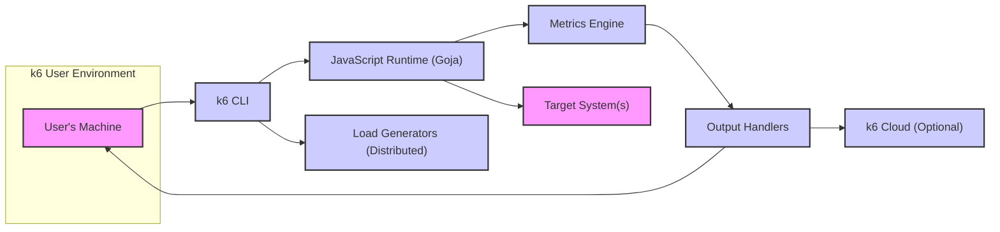

# Project Design Document: k6 Load Testing Tool

**Version:** 1.1
**Date:** October 26, 2023
**Author:** Gemini (AI Language Model)

## 1. Introduction

This document provides an enhanced design overview of the k6 load testing tool. It details the system's architecture, key components with more specific functionalities, and data flow with greater clarity. This document serves as a robust foundation for subsequent threat modeling activities, offering a deeper understanding of the system's inner workings.

## 2. Goals

*   Provide a more detailed and nuanced understanding of k6's architecture and components, including their specific responsibilities.
*   Elucidate key data flows and interactions within the system with improved clarity and precision.
*   Serve as a more comprehensive basis for identifying potential security vulnerabilities and threats by providing richer context.
*   Document the system in a clear, concise, and well-structured manner using appropriate formatting.

## 3. Non-Goals

*   Highly granular code-level implementation specifics or algorithms used within components.
*   Precise performance benchmarking data or scalability metrics.
*   Specific deployment configurations for various environments.
*   Exhaustive API specifications for internal components or external integrations.

## 4. System Architecture

k6 is a modern, developer-centric load testing tool primarily operated through a command-line interface (CLI). It empowers users to author test scripts in JavaScript to simulate realistic user traffic directed at target systems. The architecture emphasizes modularity and extensibility.

## 5. Key Components

*   **k6 CLI:**
    *   The primary command-line interface for user interaction.
    *   Functionality includes: parsing user commands and flags, loading and validating test scripts, initiating test execution, managing local resources, and coordinating with external services like k6 Cloud.
    *   Responsible for bootstrapping the test environment and managing the overall test lifecycle.
*   **JavaScript Runtime (Goja):**
    *   A lightweight ECMAScript 5.1 compatible runtime environment implemented in Go.
    *   Executes user-defined test scripts written in JavaScript, providing core testing APIs.
    *   Manages the lifecycle of Virtual Users (VUs) and their concurrent execution.
    *   Provides built-in modules for HTTP requests, WebSocket communication, and other protocols.
    *   Offers extensibility through JavaScript modules for custom logic and integrations.
*   **Metrics Engine:**
    *   The central component for collecting, aggregating, and processing performance metrics during test execution.
    *   Tracks a wide range of built-in metrics (e.g., request duration, latency, error rates, data received/sent).
    *   Allows users to define and track custom metrics based on their specific needs.
    *   Provides mechanisms for threshold configuration to define pass/fail criteria for tests.
*   **Output Handlers:**
    *   Responsible for exporting the collected metrics data to various destinations in different formats.
    *   Supports a variety of built-in output types, including:
        *   Console output for real-time feedback.
        *   JSON and CSV file output for local storage and analysis.
        *   Integrations with time-series databases (e.g., InfluxDB, Prometheus) for long-term storage and visualization.
        *   Integration with k6 Cloud for centralized management and analysis.
        *   Support for custom output handlers via extensions.
*   **Virtual Users (VUs):**
    *   Simulated users that concurrently execute the test script logic.
    *   Each VU operates independently, simulating individual user behavior.
    *   The number of VUs is configurable, allowing users to simulate different load levels.
    *   Managed by the JavaScript Runtime, which schedules and controls their execution.
*   **k6 Cloud (Optional):**
    *   A Software-as-a-Service (SaaS) platform offering enhanced capabilities for k6 testing.
    *   Provides features for:
        *   Distributed test execution across multiple geographic locations.
        *   Centralized test management and scheduling.
        *   Advanced analytics and visualization of test results.
        *   Collaboration features for teams.
    *   Interaction with k6 Cloud is primarily through API calls initiated by the k6 CLI.
*   **Load Generators (Distributed Execution):**
    *   In scenarios requiring high load, k6 can be run in a distributed manner across multiple machines (load generators).
    *   Each load generator runs a k6 instance and contributes to the overall load.
    *   Coordination between load generators is typically managed by k6 Cloud or through other orchestration mechanisms.

## 6. Data Flow

The following details the typical data flow during a k6 test execution, providing a more granular view of the process:

1. **Test Script Creation:** A user authors a JavaScript test script defining the load test scenario, including requests, assertions, and VU behavior.
2. **Test Initiation:** The user executes the `k6 run <script.js>` command in the CLI, initiating the test.
3. **CLI Processing:** The k6 CLI parses the command and loads the specified test script. It validates the script's syntax and configuration.
4. **Runtime Initialization:** The JavaScript Runtime (Goja) is initialized, and the test script is loaded into the runtime environment.
5. **VU Spawning:** Based on the script's configuration (e.g., `vus` option), the runtime spawns the specified number of Virtual Users.
6. **Script Execution by VUs:** Each VU begins executing the test script logic concurrently. This typically involves:
    *   Making requests to the target system using the provided APIs (e.g., `http.get()`, `ws.connect()`).
    *   Processing responses from the target system.
    *   Performing assertions to validate the responses.
    *   Potentially interacting with other k6 APIs for custom logic or metrics.
7. **Request Transmission:** When a VU makes a request, the JavaScript Runtime utilizes underlying network libraries to transmit the request to the Target System.
8. **Response Reception:** The Target System processes the request and sends a response back to the k6 instance.
9. **Metrics Collection:** The Metrics Engine intercepts request and response data, collecting performance metrics such as request duration, status codes, latency, and data transfer sizes. Custom metrics defined in the script are also collected.
10. **Metrics Aggregation:** The Metrics Engine aggregates the collected metrics data over time and across all VUs.
11. **Output Handling:** Based on the configured output handlers, the aggregated metrics data is formatted and sent to the specified destinations (console, files, external systems, k6 Cloud).
12. **Optional Cloud Synchronization:** If k6 Cloud integration is enabled, metrics data is transmitted to the k6 Cloud platform via secure API calls.
13. **Test Completion:** Once the test duration or iteration count is reached, the VUs complete their execution, and the k6 CLI reports the final metrics and any threshold violations.

```mermaid
flowchart LR
    A["User: Write Test Script"] --> B("k6 CLI: Parse & Validate Script");
    B --> C("JavaScript Runtime: Initialize");
    C --> D("Runtime: Spawn Virtual Users (VUs)");
    D -- "Execute Script" --> E("VU: Send Request to Target");
    E --> F("Target System: Process Request");
    F --> G("VU: Receive Response");
    G --> H("Metrics Engine: Collect Metrics");
    H --> I("Metrics Engine: Aggregate Metrics");
    I --> J{"Output Handlers: Export Metrics"};
    J -- "Console" --> K["User: View Console Output"];
    J -- "File (JSON/CSV)" --> L["Store Metrics Locally"];
    J -- "k6 Cloud" --> M["k6 Cloud: Store & Analyze"];
    J -- "Other Systems (e.g., Prometheus)" --> N["External Monitoring"];
    style A fill:#ccf,stroke:#333,stroke-width:2px
    style B fill:#ccf,stroke:#333,stroke-width:2px
    style C fill:#ccf,stroke:#333,stroke-width:2px
    style D fill:#ccf,stroke:#333,stroke-width:2px
    style E fill:#ccf,stroke:#333,stroke-width:2px
    style F fill:#f9f,stroke:#333,stroke-width:2px
    style G fill:#ccf,stroke:#333,stroke-width:2px
    style H fill:#ccf,stroke:#333,stroke-width:2px
    style I fill:#ccf,stroke:#333,stroke-width:2px
    style J fill:#ccf,stroke:#333,stroke-width:2px
    style K fill:#ccf,stroke:#333,stroke-width:2px
    style L fill:#ccf,stroke:#333,stroke-width:2px
    style M fill:#ccf,stroke:#333,stroke-width:2px
    style N fill:#ccf,stroke:#333,stroke-width:2px
```

## 7. Security Considerations (For Threat Modeling)

This section expands on potential security concerns, providing more specific examples relevant for threat modeling:

*   **Malicious Test Script Injection:**
    *   **Threat:** An attacker could inject malicious JavaScript code into a test script, potentially leading to:
        *   **Data Exfiltration:** Stealing sensitive data from the target system or the k6 environment.
        *   **Resource Abuse:** Launching denial-of-service attacks against other systems from the k6 infrastructure.
        *   **Privilege Escalation:** Exploiting vulnerabilities in k6 or its dependencies to gain unauthorized access.
    *   **Mitigation:** Implement strict input validation for test scripts, enforce code review processes, and consider sandboxing or isolation techniques for script execution.
*   **Sensitive Data Exposure in Metrics:**
    *   **Threat:** Metrics data might inadvertently contain sensitive information like API keys, authentication tokens, or personally identifiable information (PII) from the target system's responses.
    *   **Mitigation:** Implement mechanisms to sanitize or mask sensitive data in metrics before export, enforce secure transmission protocols (HTTPS), and control access to metrics storage.
*   **Command Injection via CLI:**
    *   **Threat:** If k6 CLI improperly handles user-provided input (e.g., filenames, URLs), an attacker could inject arbitrary commands that are executed on the host system.
    *   **Mitigation:** Thoroughly sanitize and validate all user inputs to the k6 CLI, avoid direct execution of shell commands based on user input.
*   **Vulnerabilities in Dependencies:**
    *   **Threat:** k6 relies on third-party libraries and dependencies, which may contain known security vulnerabilities.
    *   **Mitigation:** Maintain an up-to-date inventory of dependencies, regularly scan for vulnerabilities using security tools, and promptly update to patched versions.
*   **Insecure Communication Channels:**
    *   **Threat:** Communication between k6 and target systems (especially if not using HTTPS) or between k6 and k6 Cloud could be intercepted by attackers, leading to data breaches or man-in-the-middle attacks.
    *   **Mitigation:** Enforce the use of HTTPS for all communication with external systems, implement certificate validation, and consider using VPNs or other secure network configurations.
*   **Authentication and Authorization Weaknesses (k6 Cloud):**
    *   **Threat:** Weak authentication mechanisms or insufficient authorization controls in k6 Cloud could allow unauthorized access to user accounts, test data, or the ability to launch malicious tests.
    *   **Mitigation:** Implement strong password policies, multi-factor authentication, role-based access control, and regularly audit access logs.
*   **Resource Exhaustion Attacks:**
    *   **Threat:** A malicious user could craft test scripts designed to overwhelm the target system or the k6 infrastructure itself, leading to denial of service.
    *   **Mitigation:** Implement rate limiting, resource quotas, and monitoring mechanisms to detect and mitigate resource exhaustion attempts.
*   **Insecure Secrets Management:**
    *   **Threat:** Storing sensitive credentials (API keys, passwords) directly in test scripts or configuration files exposes them to potential compromise.
    *   **Mitigation:** Utilize secure secrets management solutions (e.g., environment variables, dedicated secrets vaults) and avoid hardcoding credentials.
*   **Output Handler Security Flaws:**
    *   **Threat:** Vulnerabilities in output handler integrations could allow attackers to gain unauthorized access to systems where metrics are being sent or to manipulate the metrics data itself.
    *   **Mitigation:** Ensure that output handler integrations are properly secured, use authentication and authorization where necessary, and validate the integrity of metrics data.
*   **Compromised Load Generators (Distributed Testing):**
    *   **Threat:** If load generator instances in a distributed testing setup are compromised, attackers could inject malicious traffic or gain access to sensitive data.
    *   **Mitigation:** Secure the communication channels between load generators and the control plane, implement strong authentication and authorization for load generator access, and regularly monitor the security of load generator instances.

## 8. Future Considerations

*   Enhanced support for additional testing protocols beyond HTTP and WebSockets.
*   Deeper integration with CI/CD pipelines for automated performance testing.
*   Advanced scripting capabilities and more expressive APIs for complex test scenarios.
*   Further improvements to security features, including enhanced sandboxing and vulnerability scanning.
*   Expansion of the k6 Cloud platform with more advanced analytics and reporting features.

This document provides a more detailed and comprehensive design overview of the k6 project, intended to facilitate a more thorough and effective threat modeling process. It will be updated as the project evolves and new features are introduced.