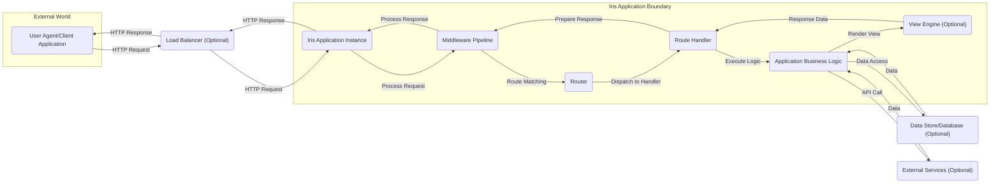
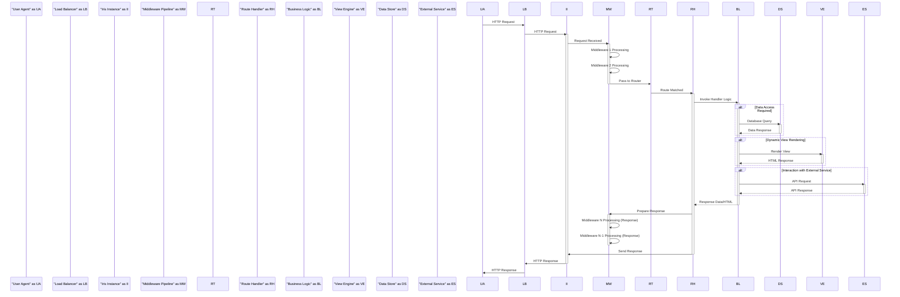

# Project Design Document: Iris Web Framework

**Version:** 1.1
**Date:** October 26, 2023
**Author:** AI Software Architect

## 1. Introduction

This document provides an enhanced and more detailed architectural design of the Iris web framework (https://github.com/kataras/iris). This design serves as a robust foundation for subsequent threat modeling activities, offering a comprehensive understanding of the system's components, data flow, interactions, and potential security implications.

## 2. Project Goals

The primary goals of the Iris web framework are to empower developers to build:

* **High-Performance Web Applications:** Emphasizing efficient resource utilization and low latency in handling HTTP requests and responses.
* **Scalable and Resilient Systems:**  Architected for handling increasing traffic loads and maintaining availability through various deployment strategies.
* **Developer-Friendly Experiences:** Providing an intuitive and expressive API that simplifies the development of web applications and RESTful APIs.
* **Flexible and Adaptable Architectures:** Supporting diverse architectural patterns and seamless integration with other libraries and services.
* **Robust and Reliable Applications:** Ensuring stable operation and predictable behavior under varying conditions and workloads.
* **Secure Web Applications:**  Offering built-in mechanisms, security best practices, and clear guidance for developing secure and resilient applications.

## 3. System Architecture

Iris employs a layered architecture, a common and effective approach for structuring web frameworks. This modular design promotes separation of concerns and facilitates maintainability and security analysis.

### 3.1. High-Level Architecture

* **User Agent/Client Application:** Represents any entity (web browser, mobile app, other service) initiating an HTTP request to the Iris application.
* **Load Balancer (Optional):** Distributes incoming traffic across multiple Iris application instances to enhance scalability, availability, and fault tolerance.
* **Iris Application Instance:** A single running instance of the Iris framework, responsible for receiving, processing, and responding to HTTP requests.
* **Middleware Pipeline:** An ordered chain of interceptors that process incoming requests before they reach the route handler and outgoing responses before they are sent to the client. Middleware handles cross-cutting concerns like logging, authentication, authorization, and request modification.
* **Router:** The component responsible for mapping incoming HTTP request paths and methods to specific route handlers based on defined routes. Iris utilizes an efficient routing mechanism for fast request dispatch.
* **Route Handler:** A function or method associated with a specific route that contains the application-specific logic for handling requests to that route.
* **Application Business Logic:** The core of the application, encompassing the domain-specific logic and operations performed within the route handlers.
* **View Engine (Optional):** A templating system used to generate dynamic HTML or other textual content for the response, separating presentation logic from business logic.
* **Data Store/Database (Optional):** A persistent storage mechanism (e.g., relational database, NoSQL database) used by the application to store and retrieve data.
* **External Services (Optional):** Third-party APIs or services that the Iris application interacts with to perform specific tasks or access external resources.

### 3.2. Component Breakdown

A more granular view of the key internal components within the Iris application instance:

* **`net/http` Handler:**  The foundational layer, leveraging Go's standard library for low-level HTTP handling, including request parsing and response writing.
* **Context Object (`iris.Context`):** A request-scoped object that provides a unified interface for accessing request information (headers, parameters, body), managing the response (headers, status, body), and sharing data across middleware and handlers. It also includes utility methods for common tasks.
* **Router (Radix Tree Implementation):**  Iris utilizes a highly efficient radix tree (or similar trie-based structure) for route matching, enabling fast lookup of handlers based on the incoming request path. This is crucial for performance.
* **Middleware System (`iris.Handler`):** A powerful mechanism for implementing interceptors that operate on the request and response lifecycle. Middleware functions are executed in a defined order, allowing for layered processing. Examples include authentication middleware, logging middleware, and CORS middleware.
* **Handler Registration and Management:**  Mechanisms for defining routes and associating them with specific handler functions. Iris provides a fluent API for route registration, supporting various HTTP methods and route patterns.
* **Response Writers and Renderers:** Components responsible for constructing and sending HTTP responses in various formats (JSON, XML, HTML, plain text). Iris offers built-in methods for rendering data and views.
* **Request Body Parsers:**  Utilities for automatically parsing request bodies in different formats (JSON, form data, XML) and making the data readily available to handlers. This helps prevent common input handling vulnerabilities.
* **Session Management (`sessions` package):** Provides functionalities for creating, managing, and persisting user sessions, typically using cookies or other storage mechanisms. Secure session management is critical for authentication and authorization.
* **WebSockets Implementation (`websocket` package):** Enables real-time, bidirectional communication between the client and the server over a single TCP connection. Security considerations for WebSockets differ from traditional HTTP.
* **Template Engine Abstraction:**  Iris supports integration with various template engines (e.g., HTML/template, Pug, Handlebars) through a consistent interface, allowing developers to choose the engine that best suits their needs.
* **Error Handling and Customization:**  Mechanisms for handling application errors and generating custom error responses. Proper error handling is essential for security and user experience.
* **Logging Framework Integration:**  Iris integrates with standard Go logging or allows for custom logging implementations, enabling developers to track application behavior and debug issues. Secure logging practices are crucial.
* **Testing Utilities and Helpers:**  Provides tools and utilities to facilitate unit and integration testing of Iris applications, promoting code quality and security.

## 4. Data Flow

A detailed breakdown of a typical HTTP request lifecycle within an Iris application:

1. **User Agent Initiates Request:** The user's browser or application sends an HTTP request targeting the Iris application.
2. **Load Balancer Distribution (Optional):** If a load balancer is present, it receives the request and forwards it to one of the available Iris application instances based on its configured algorithm.
3. **Iris Instance Receives Request:** An Iris application instance accepts the incoming HTTP request.
4. **Middleware Pipeline Processing:** The request enters the middleware pipeline. Each middleware in the pipeline executes its logic sequentially. This can involve tasks like logging the request, authenticating the user, authorizing access, modifying request headers, etc.
5. **Routing:** After passing through the middleware pipeline, the request is passed to the Router component. The Router analyzes the request path and method and attempts to find a matching route definition.
6. **Route Matching:** The Router uses its efficient routing algorithm (e.g., radix tree lookup) to identify the appropriate Route Handler associated with the requested path.
7. **Route Handler Invocation:** Once a matching route is found, the corresponding Route Handler function is invoked.
8. **Business Logic Execution:** The Route Handler executes the application's core business logic. This may involve data processing, calculations, or interactions with other services.
9. **Data Access (Conditional):** If the business logic requires data persistence or retrieval, it interacts with the configured Data Store (database).
10. **Dynamic View Rendering (Conditional):** If the response involves dynamically generated content, the business logic may utilize the View Engine to render a template with data.
11. **Interaction with External Services (Conditional):** The business logic might need to communicate with external APIs or services to fulfill the request.
12. **Response Preparation:** The Business Logic or Route Handler prepares the response data or HTML content.
13. **Response Middleware Processing:** The generated response is sent back through the middleware pipeline in reverse order. Middleware can perform actions on the response, such as adding security headers, compressing the content, or logging the response.
14. **Iris Instance Sends Response:** The Iris application instance sends the prepared HTTP response back to the load balancer (or directly to the user agent).
15. **Load Balancer Forwards Response (Optional):** The load balancer forwards the HTTP response back to the originating user agent.
16. **User Agent Receives Response:** The user's browser or application receives the final HTTP response.

## 5. Key Components and Their Responsibilities (Detailed)

* **`iris.Context`:**
    * **Request Handling:** Provides methods to access all aspects of the incoming HTTP request, including headers, URL parameters, query parameters, request body (parsed or raw), cookies, and uploaded files.
    * **Response Building:** Offers a fluent interface for constructing the HTTP response, including setting status codes, headers (including security-related headers), and writing the response body in various formats (JSON, XML, HTML, plain text, streams).
    * **Data Sharing:**  Acts as a request-scoped data store, allowing middleware and handlers to share information.
    * **Error Handling:** Provides methods for handling errors and sending appropriate error responses.
    * **Session Management:** Offers access to the session management functionalities.
    * **WebSockets:** Provides methods for handling WebSocket connections.
* **Router:**
    * **Route Definition:** Provides a clear and expressive API for defining routes, including support for different HTTP methods (GET, POST, PUT, DELETE, etc.), route parameters, wildcards, and regular expressions.
    * **Route Grouping:** Enables grouping related routes under a common prefix or applying middleware to a group of routes.
    * **Route Parameter Extraction:**  Efficiently extracts route parameters from the request path and makes them available to handlers.
    * **Reverse Routing:**  Allows generating URLs for defined routes based on their names or parameters.
* **Middleware System:**
    * **Request Interception:**  Allows middleware functions to intercept and process incoming requests before they reach the route handler.
    * **Response Interception:** Enables middleware to process outgoing responses before they are sent to the client.
    * **Chaining and Ordering:** Middleware functions are executed in the order they are registered, allowing for a pipeline of processing steps.
    * **Short-circuiting:** Middleware can choose to terminate the request processing and send a response directly, preventing subsequent middleware or the handler from being executed.
* **Route Handlers:**
    * **Request Processing Logic:** Contains the application-specific logic for handling requests to a particular route.
    * **Access to Context:** Receives the `iris.Context` object as an argument, providing access to request and response functionalities.
    * **Response Generation:** Responsible for generating the HTTP response based on the request and application logic.
* **Session Manager:**
    * **Session Creation and Destruction:**  Provides methods for creating new user sessions and destroying existing ones.
    * **Session ID Generation and Management:**  Generates and manages unique session identifiers, typically stored in cookies.
    * **Session Data Storage:**  Allows storing and retrieving session-specific data. Iris supports various session storage backends (e.g., memory, file system, Redis, database).
    * **Security Features:**  Includes features to enhance session security, such as HTTPOnly and Secure flags for cookies, and mechanisms for preventing session fixation.
* **Request Body Parsers:**
    * **Automatic Parsing:**  Automatically parses request bodies based on the `Content-Type` header.
    * **Support for Multiple Formats:**  Handles common formats like JSON, URL-encoded form data, and XML.
    * **Custom Parsers:**  Allows developers to register custom body parsers for specific content types.
* **Response Writers and Renderers:**
    * **JSON Rendering:**  Provides methods for efficiently serializing Go data structures to JSON and sending them in the response.
    * **XML Rendering:**  Supports rendering XML responses.
    * **HTML Rendering:**  Integrates with template engines to render dynamic HTML content.
    * **File Serving:**  Offers utilities for serving static files.
    * **Streaming Responses:**  Allows sending large responses in chunks to improve performance and reduce memory usage.

## 6. Security Considerations (Enhanced)

This section expands on potential security considerations, providing more specific examples and potential mitigation strategies.

* **Input Validation:**
    * **Threat:** Injection attacks (SQL injection, command injection, cross-site scripting), data corruption, application errors.
    * **Considerations:**  Iris relies on developers to implement robust input validation. Failure to sanitize and validate user inputs can lead to severe vulnerabilities.
    * **Mitigation:**  Utilize input validation libraries, implement whitelisting of allowed characters and formats, escape output data appropriately for the context (HTML escaping, URL encoding, etc.). Iris provides mechanisms to access and inspect request data, enabling validation.
* **Authentication and Authorization:**
    * **Threat:** Unauthorized access to resources, data breaches, privilege escalation.
    * **Considerations:** Iris provides the building blocks (middleware, session management) for implementing authentication and authorization, but the specific implementation is the developer's responsibility. Weak or flawed implementations are common attack vectors.
    * **Mitigation:** Implement strong authentication mechanisms (e.g., multi-factor authentication), use secure password hashing algorithms, follow the principle of least privilege for authorization, utilize established authorization frameworks (e.g., RBAC, ABAC). Leverage Iris middleware to enforce authentication and authorization checks.
* **Session Management:**
    * **Threat:** Session fixation, session hijacking, replay attacks, unauthorized access.
    * **Considerations:** Insecure session management can allow attackers to impersonate legitimate users.
    * **Mitigation:** Use secure session ID generation, protect session IDs from disclosure (HTTPS, HTTPOnly flag), implement session timeouts and renewals, invalidate sessions on logout, consider using secure session storage mechanisms. Iris's `sessions` package offers options for secure session management.
* **Cross-Site Scripting (XSS):**
    * **Threat:**  Execution of malicious scripts in the user's browser, leading to data theft, session hijacking, and defacement.
    * **Considerations:** Occurs when user-supplied data is displayed in the application without proper sanitization or escaping.
    * **Mitigation:**  Sanitize user input before rendering it in HTML, use context-aware output encoding, implement a Content Security Policy (CSP) to restrict the sources from which the browser can load resources. Iris's template engines often provide mechanisms for automatic escaping.
* **Cross-Site Request Forgery (CSRF):**
    * **Threat:**  Malicious websites or emails can trick authenticated users into performing unintended actions on the application.
    * **Considerations:** Exploits the browser's automatic inclusion of cookies in requests.
    * **Mitigation:** Implement CSRF protection mechanisms, such as synchronizer tokens (CSRF tokens) or the SameSite cookie attribute. Iris provides middleware that can be used to implement CSRF protection.
* **Data Protection:**
    * **Threat:**  Exposure of sensitive data through unauthorized access or interception.
    * **Considerations:**  Sensitive data needs to be protected both in transit and at rest.
    * **Mitigation:**  Enforce HTTPS for all communication to encrypt data in transit, encrypt sensitive data at rest in the database, avoid storing sensitive information unnecessarily, and follow secure data handling practices.
* **Dependency Management:**
    * **Threat:**  Vulnerabilities in third-party libraries can be exploited to compromise the application.
    * **Considerations:**  Applications often rely on external libraries, which can contain security flaws.
    * **Mitigation:**  Keep dependencies up-to-date with the latest security patches, use dependency scanning tools to identify known vulnerabilities, and carefully evaluate the security posture of any third-party libraries before including them in the project.
* **Error Handling and Logging:**
    * **Threat:**  Information disclosure through verbose error messages, insufficient logging for security incident analysis.
    * **Considerations:**  Detailed error messages can reveal sensitive information about the application's internal workings. Insufficient logging hinders the ability to detect and respond to security incidents.
    * **Mitigation:**  Implement generic error messages for production environments, log errors securely and comprehensively, include relevant context in logs, and protect log files from unauthorized access.
* **Rate Limiting and DoS Prevention:**
    * **Threat:**  Denial-of-service attacks can overwhelm the application and make it unavailable to legitimate users.
    * **Considerations:**  Without proper rate limiting, attackers can flood the application with requests.
    * **Mitigation:**  Implement rate limiting middleware to restrict the number of requests from a single IP address or user within a given time period. Iris provides middleware that can be used for rate limiting.
* **Security Headers:**
    * **Threat:**  Vulnerabilities related to browser security policies not being enforced.
    * **Considerations:**  HTTP security headers can instruct the browser to enforce security policies.
    * **Mitigation:**  Configure appropriate security headers such as Content-Security-Policy (CSP), Strict-Transport-Security (HSTS), X-Frame-Options, and X-Content-Type-Options. Iris provides mechanisms to easily set these headers in middleware.
* **File Uploads:**
    * **Threat:**  Malicious file uploads can lead to code execution, data breaches, or denial of service.
    * **Considerations:**  Improperly handled file uploads can introduce significant security risks.
    * **Mitigation:**  Validate file types and sizes, sanitize file names, store uploaded files outside the webroot, and implement virus scanning.

## 7. Future Enhancements (Security Implications)

Future developments in Iris should prioritize security enhancements:

* **Built-in Security Middleware:**  Expanding the set of built-in security middleware for common tasks like CSRF protection, input sanitization, and rate limiting would simplify secure development.
* **Security Audits and Best Practices Documentation:**  Regular security audits and comprehensive documentation on security best practices for Iris applications would be beneficial.
* **Integration with Security Scanning Tools:**  Providing better integration points with static and dynamic analysis security scanning tools would help developers identify vulnerabilities early in the development lifecycle.
* **Secure Defaults:**  Adopting more secure default configurations for various features would reduce the likelihood of misconfigurations leading to vulnerabilities.

## 8. Conclusion

This enhanced design document provides a more detailed and comprehensive understanding of the Iris web framework's architecture and security considerations. It serves as a valuable resource for conducting thorough threat modeling and for developers building secure and resilient applications with Iris. By understanding the framework's components, data flow, and potential vulnerabilities, developers can proactively implement security measures and mitigate risks.
