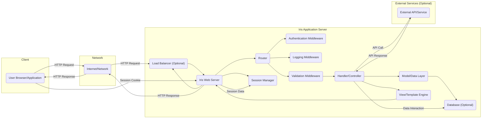
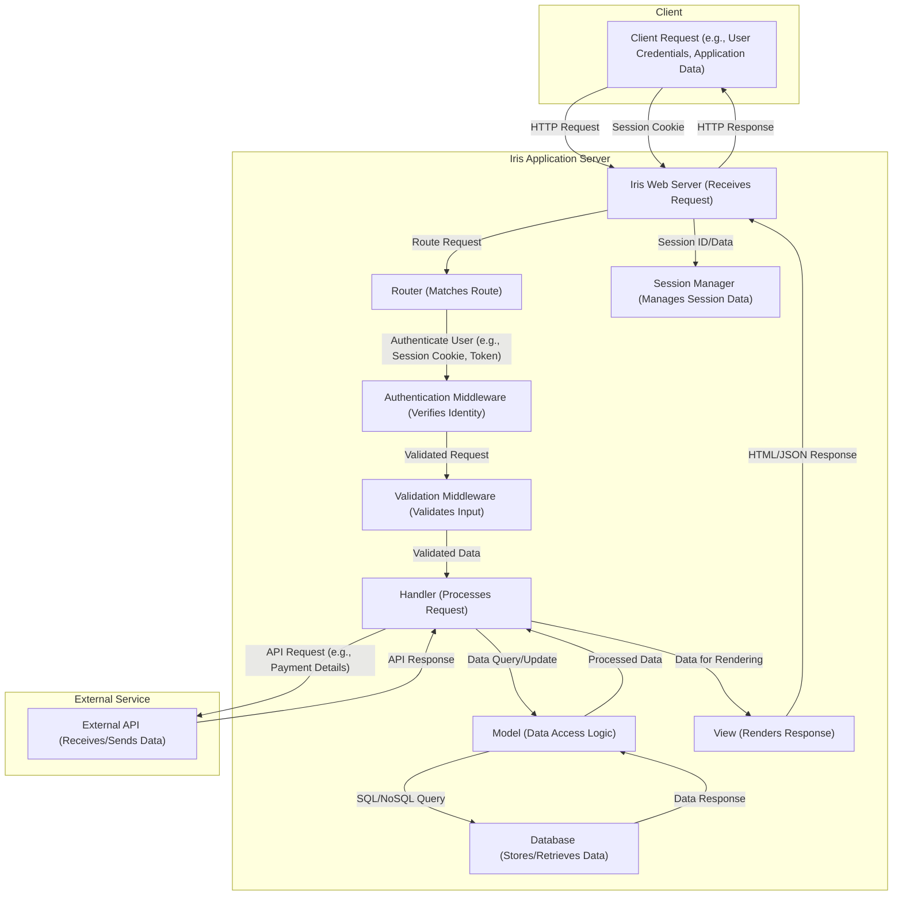

# Project Design Document: Iris Web Framework Application (Improved)

**Version:** 1.1
**Date:** October 26, 2023
**Author:** AI Software Architect

## 1. Introduction

This document provides an enhanced architectural design for a typical application built using the Iris web framework (https://github.com/kataras/iris). This detailed design is specifically intended to be used as the foundation for thorough threat modeling activities. It clearly outlines the key components, data flow, interactions, and underlying technologies within a representative Iris-based application to facilitate the identification of potential security vulnerabilities.

## 2. Goals and Objectives

*   Deliver a more granular and comprehensive architectural overview of a typical Iris application, focusing on aspects relevant to security.
*   Provide detailed descriptions of key components and their specific responsibilities, including security implications.
*   Illustrate the flow of various types of data within the application, highlighting potential data exposure points.
*   Proactively identify potential areas of security concern with concrete examples to guide future threat modeling exercises.
*   Serve as a clear and unambiguous reference point for development, security, and operations teams.

## 3. High-Level Architecture

A standard Iris application generally adheres to a Model-View-Controller (MVC) or a similar architectural pattern. The diagram below illustrates the primary components and their interactions:

## 4. Component Details

This section provides a more detailed description of each component, emphasizing security-relevant aspects.

*   **Client ("User Browser/Application"):**
    *   Represents the end-user interacting with the application via a web browser or a dedicated application.
    *   Initiates various types of HTTP requests (e.g., GET for data retrieval, POST for data submission, PUT/PATCH for updates, DELETE for removal).
    *   Receives diverse HTTP responses, including HTML for rendering, JSON/XML for API interactions, and potentially binary data.
    *   Security considerations include protection against malicious scripts (XSS) and secure storage of sensitive data on the client-side (if any).

*   **Network ("Internet/Network"):**
    *   The underlying network infrastructure facilitating communication.
    *   Security concerns involve eavesdropping (requiring encryption like TLS), denial-of-service attacks, and network segmentation.

*   **Load Balancer ("Load Balancer (Optional)"):**
    *   Distributes incoming traffic across multiple Iris application instances for scalability and high availability.
    *   Can perform TLS termination, offloading encryption processing from the application servers.
    *   Security features may include protection against DDoS attacks and request filtering.

*   **Iris Web Server ("Iris Web Server"):**
    *   The core of the Iris application, responsible for:
        *   Listening for and accepting incoming HTTP connections on configured ports.
        *   Handling TLS/SSL handshake and encryption/decryption if not offloaded.
        *   Managing request lifecycle and passing requests to the Router.
        *   Serving static files (if configured).
        *   Handling error responses and logging.
        *   Security considerations include proper TLS configuration, protection against common web server vulnerabilities, and secure handling of HTTP headers.

*   **Router ("Router"):**
    *   Maps incoming HTTP requests to specific Handlers based on defined routes (URL paths, HTTP methods).
    *   May implement route-level middleware for specific functionalities or security checks.
    *   Security concerns include ensuring proper authorization checks are in place for different routes and preventing route hijacking.

*   **Authentication Middleware ("Authentication Middleware"):**
    *   Verifies the identity of the user making the request.
    *   Common mechanisms include session-based authentication, token-based authentication (e.g., JWT), or API keys.
    *   Security considerations involve secure storage of credentials or tokens, protection against brute-force attacks, and proper handling of authentication failures.

*   **Logging Middleware ("Logging Middleware"):**
    *   Records details about incoming requests, application events, and errors.
    *   Crucial for auditing, debugging, and security monitoring.
    *   Security considerations include preventing the logging of sensitive data and ensuring log integrity.

*   **Validation Middleware ("Validation Middleware"):**
    *   Validates the incoming request data against predefined rules to ensure data integrity and prevent injection attacks.
    *   Can check data types, formats, and ranges.
    *   Security considerations involve comprehensive validation rules and proper handling of invalid input.

*   **Handler/Controller ("Handler/Controller"):**
    *   Contains the application's core business logic for processing specific requests.
    *   Receives validated data from the middleware, interacts with the Model, and prepares data for the View.
    *   May perform authorization checks to ensure the authenticated user has permission to perform the requested action.
    *   Security considerations include preventing business logic flaws, ensuring proper authorization, and securely handling sensitive data.

*   **Model/Data Layer ("Model/Data Layer"):**
    *   Responsible for interacting with data sources, abstracting the underlying data storage mechanism.
    *   Encapsulates data access logic and enforces data integrity rules.
    *   Security considerations include preventing SQL injection (if using SQL databases), NoSQL injection, and ensuring secure data access patterns.

*   **Database ("Database (Optional)"):**
    *   A persistent storage system for application data.
    *   Security considerations include access control, encryption at rest and in transit, and regular security patching.

*   **View/Template Engine ("View/Template Engine"):**
    *   Renders dynamic web pages by combining data from the Handler with HTML templates.
    *   Security considerations include preventing Cross-Site Scripting (XSS) vulnerabilities through proper output encoding and avoiding Server-Side Template Injection (SSTI).

*   **Session Manager ("Session Manager"):**
    *   Manages user sessions, storing session data (e.g., user ID, login status) typically in memory, a database, or a distributed cache.
    *   Security considerations include secure generation and storage of session IDs, protection against session fixation and hijacking attacks, and proper session timeout mechanisms.

*   **External Services ("External API/Service"):**
    *   Third-party APIs or services the Iris application interacts with (e.g., payment gateways, social media platforms).
    *   Security considerations include secure authentication and authorization with external services, protecting API keys or credentials, and validating data received from external sources.

## 5. Data Flow

The following outlines the typical flow of different types of data within an Iris application:

**Detailed Data Flow Examples:**

*   **User Authentication:** User credentials (username/password) flow from the Client to the Iris Web Server, are processed by Authentication Middleware, potentially verified against data in the Database via the Model, and a session identifier is managed by the Session Manager.
*   **Data Submission:** Application data (e.g., form input) flows from the Client, is validated by Validation Middleware, processed by the Handler, and stored in the Database via the Model.
*   **Data Retrieval:** A request for data flows from the Client, is routed to the appropriate Handler, which retrieves data from the Database via the Model, and the data is then rendered by the View and sent back to the Client.
*   **External API Interaction:** Sensitive data (e.g., payment details) might flow from the Handler to an External API, requiring secure transmission and handling of API keys.

## 6. Security Considerations

This section provides more specific examples of potential security vulnerabilities based on the architecture.

*   **Client-Side Vulnerabilities:**
    *   **Cross-Site Scripting (XSS):** Malicious scripts injected into the View templates could be executed in other users' browsers. Example: Unsanitized user input displayed on a profile page.
    *   **Insecure Client-Side Storage:** Storing sensitive information like API keys or personal data in browser local storage without proper encryption.

*   **Network Security:**
    *   **Man-in-the-Middle (MITM) Attacks:** If TLS is not correctly configured or uses weak ciphers, attackers could intercept and decrypt communication.
    *   **Lack of HTTPS Enforcement:** Allowing unencrypted HTTP connections exposes data transmitted over the network.

*   **Load Balancer Security:**
    *   **Load Balancer Misconfiguration:** Incorrectly configured load balancer rules could expose internal network details or create routing vulnerabilities.
    *   **Vulnerabilities in Load Balancer Software:** Exploiting known vulnerabilities in the load balancer software itself.

*   **Iris Web Server Security:**
    *   **Exposure of Sensitive Information:** Error pages revealing internal paths or stack traces.
    *   **HTTP Response Header Injection:** Manipulating HTTP response headers to inject malicious content or control browser behavior.

*   **Routing Security:**
    *   **Insecure Direct Object References (IDOR):** Allowing users to access resources by directly manipulating IDs without proper authorization checks. Example: Changing a user ID in a URL to access another user's profile.
    *   **Missing Authorization:** Endpoints that should require authentication are accessible to unauthenticated users.

*   **Middleware Security:**
    *   **Authentication Bypass:** Vulnerabilities in the Authentication Middleware allowing unauthorized access.
    *   **Logging Sensitive Data:** The Logging Middleware inadvertently recording sensitive information like passwords or API keys in logs.
    *   **Insufficient Input Validation:** The Validation Middleware failing to catch malicious input, leading to injection attacks. Example: Not validating the length of a username field, leading to a buffer overflow.

*   **Handler/Controller Security:**
    *   **Business Logic Flaws:** Vulnerabilities arising from incorrect implementation of business rules. Example: Allowing negative values for order quantities.
    *   **Mass Assignment Vulnerabilities:** Allowing users to modify unintended data fields by including extra parameters in requests.

*   **Model/Data Layer Security:**
    *   **SQL Injection:** Constructing malicious SQL queries through user input to access or modify database data. Example: User input in a search field not being sanitized, allowing an attacker to inject SQL commands.
    *   **NoSQL Injection:** Similar to SQL injection but targeting NoSQL databases.

*   **Database Security:**
    *   **Weak Credentials:** Using default or easily guessable passwords for database access.
    *   **Lack of Access Control:** Allowing unnecessary access to the database from the application server or other systems.

*   **View/Template Engine Security:**
    *   **Server-Side Template Injection (SSTI):** Attackers injecting malicious code into templates that is then executed on the server.
    *   **Cross-Site Scripting (XSS) via Template Engine:** Failing to properly encode output in templates, allowing for the injection of client-side scripts.

*   **Session Manager Security:**
    *   **Session Fixation:** An attacker forcing a user to use a specific session ID known to the attacker.
    *   **Session Hijacking:** An attacker obtaining a valid session ID and impersonating the user.
    *   **Insecure Session Storage:** Storing session data in a way that is easily accessible or not properly encrypted.

*   **External Service Security:**
    *   **Exposure of API Keys:** Storing API keys directly in code or configuration files without proper protection.
    *   **Insecure Communication:** Communicating with external services over unencrypted channels.
    *   **Data Breaches at External Providers:** Reliance on the security of third-party services, which could be compromised.

## 7. Deployment Considerations

The security of the Iris application is also influenced by its deployment environment.

*   **Containerization (e.g., Docker):** While offering isolation, containers require careful configuration to avoid vulnerabilities like container escape or insecure image usage.
*   **Cloud Platforms (e.g., AWS, Azure, GCP):** Leveraging cloud security features like firewalls, IAM roles, and managed services is crucial. Misconfigurations in cloud deployments can lead to significant security risks.
*   **Virtual Machines (VMs):** Proper hardening of the underlying operating system and network configuration is essential.
*   **Bare Metal Servers:** Requires manual configuration and management of all security aspects, including OS hardening, firewall rules, and intrusion detection systems.

## 8. Technology Stack (Example)

Understanding the underlying technologies provides further context for threat modeling. A typical Iris application might use:

*   **Programming Language:** Go
*   **Web Framework:** Iris
*   **Database:** PostgreSQL, MySQL, MongoDB, Redis
*   **Template Engine:** Django Templates, Pug/Jade, Handlebars
*   **Frontend Framework/Library:** React, Vue.js, Angular (often interacting via API)
*   **Operating System:** Linux (various distributions), Windows
*   **Cloud Provider (Optional):** AWS, Azure, GCP

## 9. Future Considerations

*   Detailed design specifications for specific application features and their security implications.
*   Implementation details for specific security controls, including authentication mechanisms, authorization policies, and input validation routines.
*   Selection and configuration of specific security tools and technologies (e.g., Web Application Firewalls, Intrusion Detection Systems).
*   Scalability and performance considerations with a focus on security impact.
*   Detailed logging and monitoring strategies for security event detection and incident response.

This improved design document provides a more comprehensive and security-focused overview of a typical Iris web framework application, making it a more effective foundation for subsequent threat modeling activities.