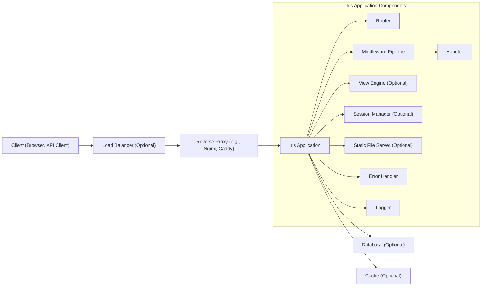
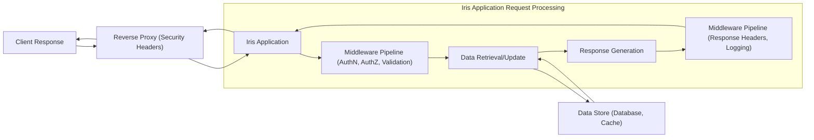

# Project Design Document: Iris Web Framework for Threat Modeling (Improved)

**Project:** Iris Web Framework
**Project URL:** [https://github.com/kataras/iris](https://github.com/kataras/iris)
**Document Version:** 1.1
**Date:** October 26, 2023
**Author:** AI Software Architecture Expert

## 1. Introduction

This document provides an enhanced design overview of the Iris web framework, an open-source project written in Go, specifically tailored for threat modeling activities. It details the key architectural components, data flow, technology stack, and security considerations with a stronger focus on potential vulnerabilities. This document serves as a robust foundation for conducting comprehensive threat modeling to identify and mitigate security risks within applications built using the Iris framework.

## 2. Project Overview

Iris is a high-performance, expressive, and user-friendly web framework for Go. It is designed to facilitate the development of fast and scalable web applications and APIs.  Key features relevant to security and threat modeling include:

*   **Robust Routing:**  A sophisticated routing system that, if misconfigured, could lead to security vulnerabilities.
*   **Extensible Middleware:** Middleware provides interception points for requests and responses, crucial for implementing security measures but also potential points of failure if not properly developed or configured.
*   **Template Engine Integration:**  Support for various template engines introduces potential template injection risks if user input is not handled carefully.
*   **Session Management:**  Built-in session management requires careful consideration to prevent session-related attacks.
*   **WebSocket Support:** WebSocket functionality adds another communication channel that needs to be secured.
*   **Customizable Error Handling:** While beneficial for user experience, custom error handlers must be designed to avoid information disclosure.

## 3. Architectural Design

### 3.1. High-Level Architecture Diagram

The following diagram illustrates the high-level architecture of an Iris application in a typical deployment environment, emphasizing security-relevant components.

### 3.2. Component Description

*   **"Client (Browser, API Client)"**: Represents any external entity initiating requests. Malicious clients are a primary threat source.
    *   **Security Relevance:** Untrusted source of input. Potential for malicious requests, injection attacks, and exploitation of vulnerabilities. Threat modeling should consider various client types and their potential attack vectors.

*   **"Load Balancer (Optional)"**: Distributes traffic, enhancing availability and potentially offering basic DDoS mitigation.
    *   **Security Relevance:** Primarily for availability, but can offer some protection against basic volumetric DDoS attacks.  SSL termination at the load balancer shifts TLS management responsibility. Misconfiguration can lead to bypasses or performance issues affecting security.

*   **"Reverse Proxy (e.g., Nginx, Caddy)"**:  A critical security gateway, handling TLS, request filtering, and security headers.
    *   **Security Relevance:** First line of defense. Handles TLS termination, potentially rate limiting, WAF capabilities, and security header enforcement. Misconfiguration or vulnerabilities here are high impact.  Threat modeling must include reverse proxy configuration and potential bypasses.

*   **"Iris Application"**: The core application built with Iris, containing the following security-sensitive sub-components:

    *   **"Router"**: Maps requests to handlers. Complex routing rules can introduce vulnerabilities if not carefully designed.
        *   **Security Relevance:** Incorrect route definitions can lead to unauthorized access, information disclosure, or denial of service.  Route parameter handling and regex usage should be scrutinized for injection vulnerabilities and unexpected behavior.

    *   **"Middleware Pipeline"**: Intercepts and processes requests/responses.  A powerful mechanism for security, but also a potential vulnerability point if middleware is flawed.
        *   **Security Relevance:**  Crucial for implementing security controls (authentication, authorization, input validation, CSRF protection, etc.). Vulnerabilities in custom or third-party middleware can have widespread impact.  Order of middleware execution is critical.

    *   **"Handler"**:  Executes application logic.  Handlers are where most application-level vulnerabilities are introduced.
        *   **Security Relevance:** Contains core application logic and data interactions. Prone to vulnerabilities like injection flaws (SQL, command, NoSQL), business logic errors, insecure direct object references, and improper error handling.  Requires thorough input validation and output encoding within handlers.

    *   **"View Engine (Optional)"**: Renders dynamic content. Template injection is a significant risk if user input is used in templates without proper sanitization.
        *   **Security Relevance:**  Susceptible to template injection vulnerabilities if user-controlled data is embedded without proper escaping.  The choice of template engine and its security features are important. Server-side rendering vulnerabilities can lead to XSS or server-side code execution.

    *   **"Session Manager (Optional)"**: Manages user sessions. Insecure session management is a common source of vulnerabilities.
        *   **Security Relevance:**  Critical for authentication and authorization. Vulnerabilities include session fixation, session hijacking, insecure session storage, predictable session IDs, and lack of proper session invalidation. Secure cookie attributes (HttpOnly, Secure, SameSite) are essential.

    *   **"Static File Server (Optional)"**: Serves static content. Directory traversal vulnerabilities can expose sensitive files.
        *   **Security Relevance:**  Potential for directory traversal vulnerabilities if not configured correctly.  Ensure proper access controls and restrict access to sensitive files.  Serving static files directly from the reverse proxy is often more secure and performant.

    *   **"Error Handler"**: Manages application errors. Verbose error messages can leak sensitive information.
        *   **Security Relevance:**  Custom error handlers should be designed to prevent information disclosure through error messages.  Detailed error information should only be logged securely and not exposed to users.

    *   **"Logger"**: Records application events. Logs can contain sensitive data and are targets for manipulation.
        *   **Security Relevance:** Logs can contain sensitive information (PII, secrets). Secure logging practices are crucial to prevent information leakage and log injection attacks.  Logs are vital for security monitoring and incident response.

*   **"Database (Optional)"**: Persistent data storage.  A primary target for attackers seeking to compromise data confidentiality, integrity, and availability.
    *   **Security Relevance:**  Stores sensitive application data. SQL injection, NoSQL injection, insecure database configurations, weak access controls, and data breaches are major threats.  Data encryption at rest and in transit is crucial.

*   **"Cache (Optional)"**: Improves performance by storing frequently accessed data. Caches can also store sensitive information and become targets.
    *   **Security Relevance:**  May store sensitive data in memory or persistent storage. Cache poisoning, insecure cache configurations, and data leakage from caches are potential risks.  Ensure proper cache invalidation and secure access controls.

## 4. Data Flow Diagram

This diagram illustrates the data flow for a typical HTTP request, highlighting security checkpoints and data interactions.

**Data Flow Description (Security Focused):**

1.  **"Client Request"**:  Untrusted input from the client.
2.  **"Reverse Proxy (TLS Termination, WAF)"**:  TLS decryption, potential Web Application Firewall (WAF) inspection to filter malicious requests.
3.  **"Iris Application (Router)"**:  Request routing based on URL and method. Potential for routing bypasses if rules are flawed.
4.  **"Middleware Pipeline (AuthN, AuthZ, Validation)"**:  Authentication middleware verifies user identity. Authorization middleware checks permissions. Input validation middleware sanitizes and validates data.  Critical security checks are performed here.
5.  **"Handler (Business Logic)"**:  Core application logic execution.  Vulnerable if not coded securely (injection flaws, business logic errors).
6.  **"Data Store (Database, Cache)"**: Interaction with databases or caches.  Potential for data breaches if access is not secured.
7.  **"Data Retrieval/Update"**: Data exchange with storage. Secure data handling is essential.
8.  **"Response Generation"**:  Response creation. Output encoding is needed to prevent XSS.
9.  **"Middleware Pipeline (Response Headers, Logging)"**:  Adding security headers (HSTS, CSP, etc.). Logging request and response details for auditing.
10. **"Iris Application"**: Internal framework processing.
11. **"Reverse Proxy (Security Headers)"**: Adding final security headers before sending to the client.
12. **"Client Response"**: Response delivered to the client.

## 5. Technology Stack

*   **Programming Language:** Go (ensure using a supported and secure version)
*   **Core Framework:** Iris Web Framework (verify version for known vulnerabilities)
*   **HTTP Server:** Go's `net/http` (or potentially a custom server within Iris - investigate for security implications)
*   **Routing:** Iris's built-in router (analyze for routing vulnerabilities)
*   **Middleware:** Iris's middleware system (scrutinize built-in and third-party middleware for security flaws)
*   **Templating Engines (Optional):** (e.g., `html/template`, Pug, Handlebars) - Choose engines with good security practices and auto-escaping features.
*   **Session Management (Optional):** Iris's session management (analyze session ID generation, storage, and security features).
*   **Database Drivers (Optional):** (e.g., `database/sql` with specific drivers) - Select drivers that support parameterized queries and secure connections.
*   **Cache Libraries (Optional):** (e.g., `go-cache`, Redis, Memcached) - Ensure secure configuration and access controls for caching systems.
*   **Logging Libraries:** (e.g., `log`, `logrus`, `zap`) - Choose logging libraries that support secure logging practices and prevent log injection.
*   **Reverse Proxy (Deployment):** (e.g., Nginx, Caddy) -  Critical security component; ensure hardened configuration and regular updates.
*   **Operating System (Deployment):** (Linux recommended for production due to security hardening options)
*   **Containerization (Deployment - Optional):** (Docker) -  Can improve security through isolation and controlled environments.
*   **Orchestration (Deployment - Optional):** (Kubernetes) -  Requires careful security configuration of the orchestration platform itself.

## 6. Security Considerations (Enhanced)

This section expands on security considerations, categorized for clarity and threat modeling focus.

**6.1. Input and Output Handling:**

*   **Input Validation:**
    *   **Comprehensive Validation:** Validate all inputs (request parameters, headers, body, cookies) against expected formats, types, and ranges.
    *   **Server-Side Validation:** Always perform validation server-side, even if client-side validation is present.
    *   **Sanitization:** Sanitize inputs to remove or escape potentially harmful characters before processing.
    *   **Context-Aware Validation:** Validate based on the context of use (e.g., validate email addresses differently than usernames).
*   **Output Encoding:**
    *   **Context-Aware Encoding:** Encode output data based on the output context (HTML, JavaScript, URL, JSON, XML) to prevent XSS.
    *   **Templating Engine Escaping:** Utilize templating engines with automatic escaping features and ensure they are enabled correctly.
    *   **Security Headers (X-XSS-Protection, CSP):**  Use security headers to provide browser-side XSS protection (though CSP is the more robust approach).

**6.2. Authentication and Authorization:**

*   **Strong Authentication:**
    *   **Multi-Factor Authentication (MFA):** Implement MFA for sensitive accounts and operations.
    *   **Secure Password Storage:** Use strong hashing algorithms (e.g., bcrypt, Argon2) with salts to store passwords. Never store passwords in plain text.
    *   **Password Policies:** Enforce strong password policies (complexity, length, expiration).
    *   **OAuth 2.0/OpenID Connect:** Consider using standard authentication protocols like OAuth 2.0 and OpenID Connect for API authentication and delegated authorization.
*   **Robust Authorization:**
    *   **Principle of Least Privilege:** Grant users only the minimum necessary permissions.
    *   **Role-Based Access Control (RBAC) or Attribute-Based Access Control (ABAC):** Implement a well-defined authorization model.
    *   **Authorization Checks at Every Access Point:** Enforce authorization checks before granting access to resources or functionalities.
    *   **Secure API Keys/Tokens:** If using API keys or tokens, ensure secure generation, storage, and transmission.

**6.3. Session Management:**

*   **Secure Session IDs:**
    *   **Cryptographically Secure Random Number Generators (CSRNG):** Generate session IDs using CSRNGs.
    *   **Sufficient Session ID Length:** Use session IDs of sufficient length to prevent brute-force attacks.
*   **Session Cookie Security:**
    *   **HttpOnly Flag:** Set the HttpOnly flag on session cookies to prevent client-side JavaScript access.
    *   **Secure Flag:** Set the Secure flag to ensure cookies are only transmitted over HTTPS.
    *   **SameSite Attribute:** Use the SameSite attribute to mitigate CSRF attacks.
*   **Session Timeout:** Implement appropriate session timeouts to limit the window of opportunity for session hijacking.
*   **Session Invalidation:** Provide mechanisms for users to explicitly log out and invalidate sessions. Invalidate sessions on password changes or security events.
*   **Session Storage:** Securely store session data (e.g., using encrypted cookies, database-backed sessions with encryption).

**6.4. API Security (If Applicable):**

*   **API Authentication and Authorization:** Implement robust authentication and authorization mechanisms specifically for APIs (e.g., API keys, OAuth 2.0, JWT).
*   **Rate Limiting:** Implement rate limiting to prevent brute-force attacks and DoS attacks on API endpoints.
*   **Input Validation and Output Encoding for APIs:** Apply input validation and output encoding appropriate for API data formats (JSON, XML).
*   **API Documentation and Security Considerations:** Document API endpoints, parameters, and security requirements clearly.

**6.5. File Upload Security (If Applicable):**

*   **File Type Validation:** Validate file types based on content, not just file extensions.
*   **File Size Limits:** Enforce file size limits to prevent DoS attacks and resource exhaustion.
*   **File Storage Security:** Store uploaded files securely, outside the web root if possible. Implement access controls to prevent unauthorized access.
*   **Anti-Virus Scanning:** Consider integrating anti-virus scanning for uploaded files.

**6.6. Error Handling and Logging:**

*   **Secure Error Handling:**
    *   **Generic Error Messages for Users:** Display generic error messages to users to avoid information disclosure.
    *   **Detailed Error Logging:** Log detailed error information securely for debugging and monitoring.
*   **Secure Logging:**
    *   **Log Security-Relevant Events:** Log authentication attempts, authorization failures, input validation errors, and other security-relevant events.
    *   **Avoid Logging Sensitive Data:** Do not log sensitive data (passwords, API keys, PII) in plain text.
    *   **Log Rotation and Management:** Implement log rotation and secure log management practices.
    *   **Log Injection Prevention:** Sanitize data before logging to prevent log injection attacks.

**6.7. General Security Practices:**

*   **HTTPS/TLS Enforcement:** Enforce HTTPS for all communication. Use strong TLS configurations.
*   **Security Headers:** Implement all relevant security headers (HSTS, CSP, X-Frame-Options, X-Content-Type-Options, Referrer-Policy, Permissions-Policy).
*   **Dependency Management:** Regularly update Iris framework and all third-party dependencies to patch vulnerabilities. Use dependency scanning tools.
*   **Secrets Management:** Securely manage secrets (API keys, database credentials, encryption keys). Avoid hardcoding secrets in code. Use environment variables or dedicated secrets management solutions.
*   **Regular Security Audits and Penetration Testing:** Conduct regular security assessments to identify and address vulnerabilities.
*   **Monitoring and Alerting:** Implement security monitoring and alerting to detect and respond to security incidents.
*   **Incident Response Plan:** Have a documented incident response plan in place to handle security breaches effectively.

## 7. Deployment Scenarios

(No significant changes from previous version, still relevant)

Iris applications can be deployed in various scenarios, including:

*   **Single Server Deployment**
*   **Load-Balanced Deployment**
*   **Containerized Deployment (Docker, Kubernetes)**
*   **Cloud Deployments (AWS, GCP, Azure)**

## 8. Threat Modeling Focus Areas (Refined)

This section outlines key areas for threat modeling, categorized using a STRIDE-like approach (though not explicitly labeled for simplicity), focusing on the Iris framework context.

*   **Routing and Request Handling (Spoofing, Tampering, Information Disclosure, Denial of Service):**
    *   **Route Definition Vulnerabilities:** Analyze route patterns for potential overlaps, bypasses, or unintended access.
    *   **Parameter Handling:** Examine how route parameters and request data are processed for injection vulnerabilities (SQL, command, XSS).
    *   **HTTP Method Handling:** Ensure proper handling of HTTP methods and prevent unintended actions based on method manipulation.
    *   **Request Smuggling/Splitting:** Investigate potential vulnerabilities related to HTTP request smuggling or splitting.

*   **Middleware Pipeline (Tampering, Information Disclosure, Denial of Service, Elevation of Privilege):**
    *   **Middleware Vulnerabilities:** Analyze custom and third-party middleware for security flaws.
    *   **Middleware Order and Configuration:**  Assess the order of middleware execution and configuration for potential security gaps.
    *   **Bypassable Middleware:** Identify if middleware can be bypassed due to misconfiguration or vulnerabilities.
    *   **Resource Exhaustion in Middleware:**  Check for middleware that could lead to resource exhaustion and DoS.

*   **Handlers and Business Logic (Information Disclosure, Denial of Service, Elevation of Privilege, Tampering, Repudiation):**
    *   **Injection Vulnerabilities in Handlers:** Focus on SQL injection, NoSQL injection, command injection, and other injection flaws within handler code.
    *   **Business Logic Flaws:** Analyze business logic for vulnerabilities like insecure direct object references, privilege escalation, and data manipulation flaws.
    *   **Error Handling in Handlers:**  Assess error handling for information disclosure and potential DoS through excessive error generation.
    *   **Data Validation and Sanitization in Handlers:**  Thoroughly examine input validation and output encoding within handlers.

*   **Session Management (Spoofing, Tampering, Repudiation, Information Disclosure, Elevation of Privilege):**
    *   **Session Fixation and Hijacking:** Analyze session management for vulnerabilities related to session fixation and hijacking.
    *   **Session ID Predictability:** Assess the randomness and unpredictability of session IDs.
    *   **Session Storage Security:** Examine the security of session data storage.
    *   **Session Timeout and Invalidation:** Evaluate the effectiveness of session timeout and invalidation mechanisms.

*   **Template Engine Integration (Information Disclosure, Elevation of Privilege, Denial of Service):**
    *   **Template Injection Vulnerabilities:**  Thoroughly analyze template usage for potential template injection flaws, especially when handling user input.
    *   **Server-Side Rendering Vulnerabilities:**  Assess risks associated with server-side rendering and potential code execution.

*   **Static File Serving (Information Disclosure, Denial of Service):**
    *   **Directory Traversal:**  Focus on directory traversal vulnerabilities in static file serving.
    *   **Exposure of Sensitive Files:**  Ensure sensitive files are not accidentally exposed through static file serving misconfiguration.
    *   **DoS through Static File Requests:**  Consider potential DoS attacks targeting static file serving.

*   **API Endpoints (All STRIDE categories):**
    *   **API Authentication and Authorization Bypass:**  Analyze API authentication and authorization mechanisms for bypass vulnerabilities.
    *   **API Input Validation and Output Encoding:**  Focus on input validation and output encoding specific to API data formats.
    *   **API Rate Limiting and DoS:**  Assess rate limiting and DoS protection for API endpoints.
    *   **API Data Exposure:**  Examine API responses for potential information disclosure.

*   **File Uploads (Tampering, Denial of Service, Information Disclosure, Elevation of Privilege):**
    *   **Malicious File Uploads:**  Analyze risks associated with uploading malicious files (malware, scripts).
    *   **File Storage Vulnerabilities:**  Assess the security of file storage and access controls for uploaded files.
    *   **DoS through File Uploads:**  Consider DoS attacks through large file uploads or excessive upload requests.

*   **Configuration Management (All STRIDE categories):**
    *   **Insecure Configuration:**  Analyze application and server configurations for security misconfigurations.
    *   **Exposure of Configuration Files:**  Ensure configuration files are not publicly accessible.
    *   **Default Credentials:**  Check for default credentials in configuration and dependencies.

*   **Logging and Monitoring (Information Disclosure, Denial of Service):**
    *   **Information Leakage in Logs:**  Analyze logs for potential leakage of sensitive information.
    *   **Log Injection Vulnerabilities:**  Assess risks of log injection attacks.
    *   **Insufficient Logging:**  Identify areas where logging is insufficient for security monitoring and incident response.
    *   **Log Storage Security:**  Ensure secure storage and access controls for log files.

By focusing threat modeling efforts on these areas, security risks within Iris-based applications can be effectively identified and mitigated. Remember to utilize threat modeling methodologies like STRIDE or PASTA in conjunction with this design document for a comprehensive security assessment.