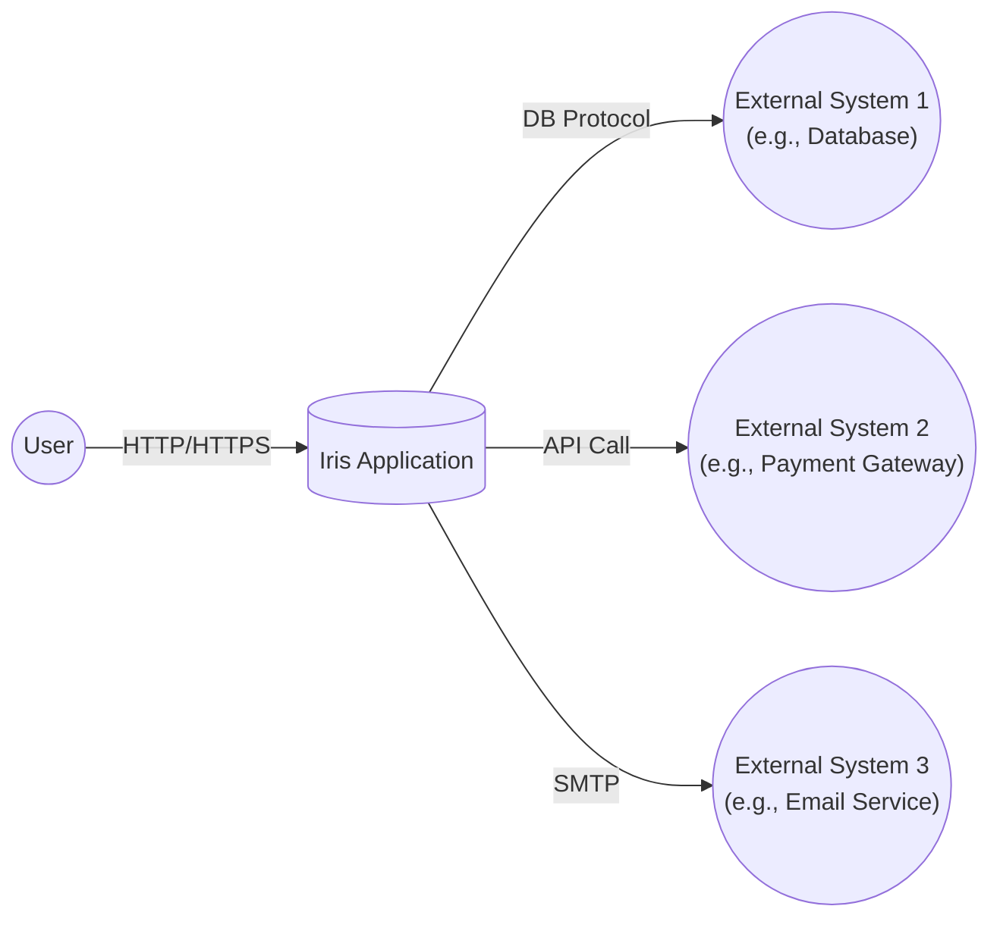
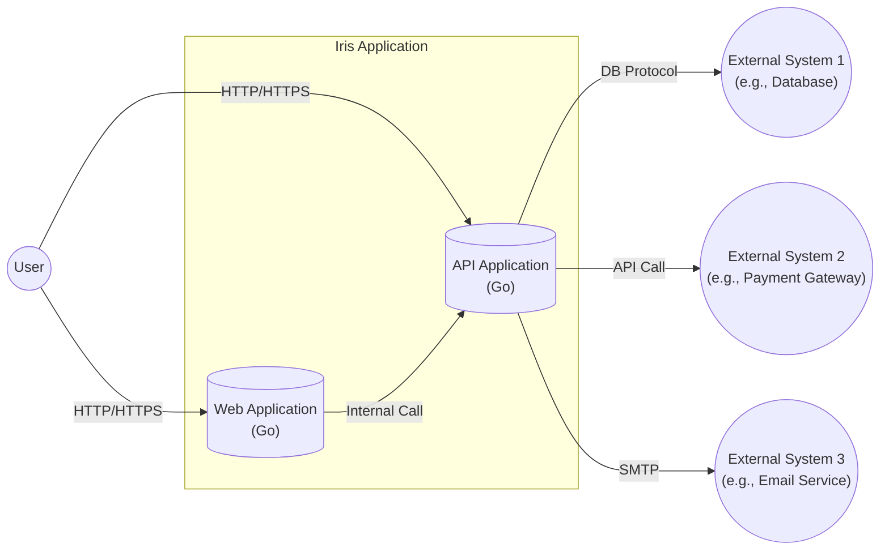
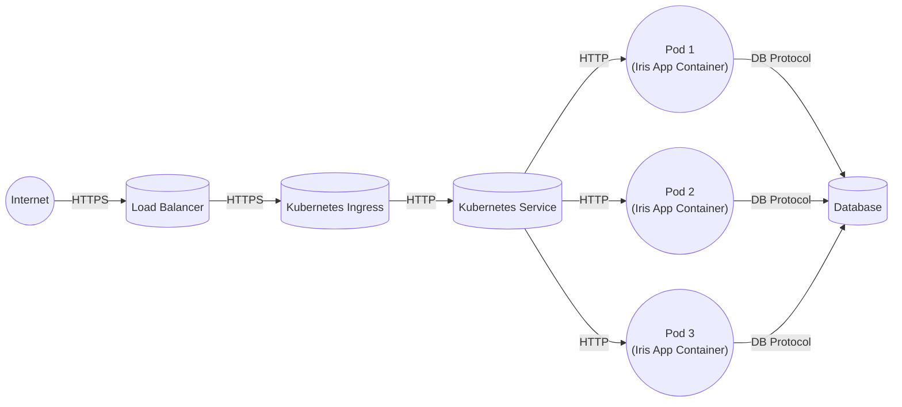
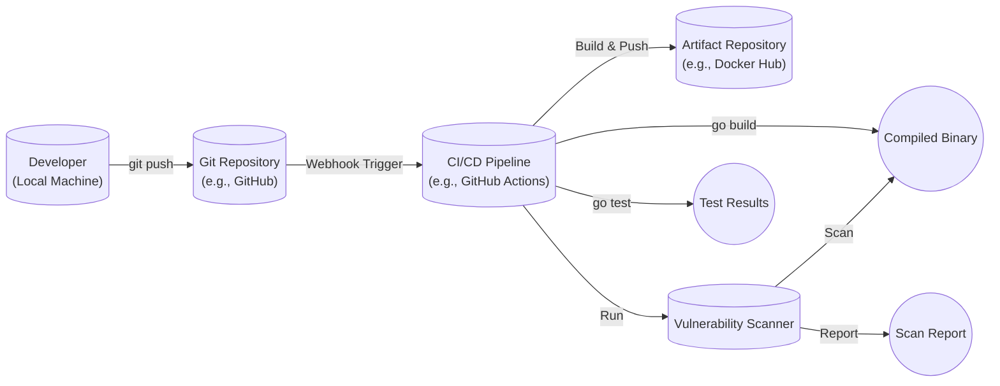

Okay, let's create a design document for the Iris web framework, focusing on aspects relevant for threat modeling.

# BUSINESS POSTURE

Iris is a fast, simple, and efficient micro web framework for Go. It's designed to be a robust foundation for building high-performance web applications and APIs.  The business priorities likely revolve around:

*   Developer Productivity:  Enabling rapid development of web applications.  This means ease of use, clear documentation, and a rich feature set are paramount.
*   Performance:  Providing a high-throughput, low-latency framework.  This is crucial for handling large volumes of requests and maintaining responsiveness.
*   Scalability:  Allowing applications built with Iris to scale horizontally to meet increasing demand.
*   Maintainability:  Ensuring the framework itself is well-maintained, with regular updates and bug fixes.  This builds trust and ensures long-term viability.
*   Community: Fostering a strong community around the framework to provide support, contribute to its development, and promote its adoption.

Based on these priorities, the most important business risks are:

*   Security Vulnerabilities:  Vulnerabilities in the framework could be exploited to compromise applications built upon it, leading to data breaches, service disruptions, and reputational damage.  This is the *most critical* risk.
*   Performance Bottlenecks:  If the framework itself has performance issues, it will limit the performance of applications built with it, impacting user experience and potentially leading to lost business.
*   Lack of Adoption:  If the framework is difficult to use, poorly documented, or lacks essential features, it will not gain widespread adoption, limiting its impact and potentially leading to its abandonment.
*   Breaking Changes: Frequent or poorly managed breaking changes in the framework can disrupt existing applications and deter developers from using it.
*   Dependency Issues: Vulnerabilities or instability in Iris's dependencies can impact the security and reliability of applications built with it.

# SECURITY POSTURE

The following security controls and accepted risks are inferred from the repository and general knowledge of web framework security:

*   security control: Input Validation: Iris likely provides mechanisms for validating user input, such as request parameter validation and data binding. (Needs verification in documentation/code).
*   security control: Output Encoding: Iris likely provides mechanisms for encoding output to prevent Cross-Site Scripting (XSS) vulnerabilities. (Needs verification in documentation/code).
*   security control: Session Management: Iris likely provides secure session management features, including secure cookie handling and protection against session fixation. (Needs verification in documentation/code).
*   security control: Routing Security: Iris's routing mechanism should be designed to prevent common routing-related vulnerabilities, such as parameter tampering and forced browsing. (Needs verification in documentation/code).
*   security control: Middleware Support: Iris's middleware architecture allows developers to implement custom security controls, such as authentication, authorization, and rate limiting.
*   security control: Dependency Management: Go's module system helps manage dependencies and track vulnerabilities.
*   security control: Regular Updates: The Iris project appears to be actively maintained, with regular releases and bug fixes, which is crucial for addressing security vulnerabilities.
*   accepted risk: Third-Party Middleware: While middleware provides flexibility, using third-party middleware introduces a risk if that middleware has vulnerabilities. Developers are responsible for vetting the security of any middleware they use.
*   accepted risk: Developer Error:  The framework itself can be secure, but developers can still introduce vulnerabilities in their applications *using* the framework.  This is a fundamental risk in software development.
*   accepted risk: Configuration Errors: Misconfiguration of the framework or its deployment environment can lead to security vulnerabilities.

Recommended Security Controls (High Priority):

*   security control: Security Audits: Regular security audits (both manual and automated) of the Iris codebase are highly recommended to identify and address potential vulnerabilities.
*   security control: Fuzz Testing: Implementing fuzz testing can help uncover unexpected vulnerabilities by providing malformed input to the framework.
*   security control: Security Headers:  Provide easy configuration options for setting standard security headers (e.g., HSTS, Content Security Policy, X-Frame-Options) to enhance application security.
*   security control: Documentation: Explicitly document security best practices for using the framework, including common pitfalls and how to avoid them.

Security Requirements:

*   Authentication:
    *   The framework should provide flexible mechanisms for integrating with various authentication schemes (e.g., OAuth 2.0, JWT, Basic Auth).
    *   Support for multi-factor authentication (MFA) should be considered.
*   Authorization:
    *   The framework should provide mechanisms for implementing role-based access control (RBAC) or other authorization models.
    *   Fine-grained access control to specific resources and actions should be possible.
*   Input Validation:
    *   All user-supplied input (including request parameters, headers, and body) must be validated against a strict whitelist of allowed characters and formats.
    *   Validation should occur as early as possible in the request processing pipeline.
    *   Clear error messages should be provided to the user when validation fails (without revealing sensitive information).
*   Cryptography:
    *   The framework should use strong, industry-standard cryptographic algorithms for all security-sensitive operations (e.g., password hashing, session management).
    *   Secure random number generation should be used where appropriate.
    *   Key management should be carefully considered.
*   Output Encoding:
    *   Context-aware output encoding should be used to prevent XSS vulnerabilities.
    *   Encoding should be applied automatically where possible, with options for manual control when needed.

# DESIGN

## C4 CONTEXT

Context Diagram Element List:

*   Element:
    *   Name: User
    *   Type: Person
    *   Description: A user interacting with the Iris Application through a web browser or other client.
    *   Responsibilities: Initiates requests, views responses, provides input.
    *   Security controls: Browser security features, user-implemented security practices.

*   Element:
    *   Name: Iris Application
    *   Type: Software System
    *   Description: The web application built using the Iris framework.
    *   Responsibilities: Handles user requests, processes data, interacts with external systems, generates responses.
    *   Security controls: Input validation, output encoding, authentication, authorization, session management, secure configuration.

*   Element:
    *   Name: External System 1 (e.g., Database)
    *   Type: Software System
    *   Description: An external system, such as a database, that the Iris Application interacts with.
    *   Responsibilities: Stores and retrieves data.
    *   Security controls: Database security features (access control, encryption), network security.

*   Element:
    *   Name: External System 2 (e.g., Payment Gateway)
    *   Type: Software System
    *   Description: An external system, such as a payment gateway, that the Iris Application interacts with.
    *   Responsibilities: Processes payments.
    *   Security controls: PCI DSS compliance, secure communication protocols, fraud detection.

*   Element:
    *   Name: External System 3 (e.g., Email Service)
    *   Type: Software System
    *   Description: An external system, such as an email service, that the Iris Application interacts with.
    *   Responsibilities: Sends emails.
    *   Security controls: Secure communication protocols, spam filtering, sender authentication.

## C4 CONTAINER

Container Diagram Element List:

*   Element:
    *   Name: User
    *   Type: Person
    *   Description: A user interacting with the Iris Application through a web browser or other client.
    *   Responsibilities: Initiates requests, views responses, provides input.
    *   Security controls: Browser security features, user-implemented security practices.

*   Element:
    *   Name: Web Application (Go)
    *   Type: Container
    *   Description: The front-end web application, potentially serving HTML, CSS, and JavaScript.
    *   Responsibilities: Renders user interfaces, handles user interactions, communicates with the API Application.
    *   Security controls: Output encoding, XSS prevention, CSRF protection, secure configuration.

*   Element:
    *   Name: API Application (Go)
    *   Type: Container
    *   Description: The back-end API application, handling business logic and data access.
    *   Responsibilities: Processes API requests, interacts with external systems, manages data.
    *   Security controls: Input validation, authentication, authorization, session management, secure communication, rate limiting.

*   Element:
    *   Name: External System 1 (e.g., Database)
    *   Type: Software System
    *   Description: An external system, such as a database, that the API Application interacts with.
    *   Responsibilities: Stores and retrieves data.
    *   Security controls: Database security features (access control, encryption), network security.

*   Element:
    *   Name: External System 2 (e.g., Payment Gateway)
    *   Type: Software System
    *   Description: An external system, such as a payment gateway, that the API Application interacts with.
    *   Responsibilities: Processes payments.
    *   Security controls: PCI DSS compliance, secure communication protocols, fraud detection.

*   Element:
    *   Name: External System 3 (e.g., Email Service)
    *   Type: Software System
    *   Description: An external system, such as an email service, that the API Application interacts with.
    *   Responsibilities: Sends emails.
    *   Security controls: Secure communication protocols, spam filtering, sender authentication.

## DEPLOYMENT

Possible deployment solutions:

1.  Traditional Server Deployment: Deploying the compiled Go application to a virtual machine or physical server running an operating system (e.g., Linux) and a web server (e.g., Nginx, Apache) as a reverse proxy.
2.  Containerized Deployment (Docker): Packaging the Go application and its dependencies into a Docker container and deploying it to a container orchestration platform (e.g., Kubernetes, Docker Swarm).
3.  Serverless Deployment (AWS Lambda, Google Cloud Functions, Azure Functions): Deploying the Go application as a serverless function, triggered by HTTP requests.
4.  PaaS Deployment (Heroku, Google App Engine): Deploying the Go application to a Platform as a Service (PaaS) provider.

Chosen solution for detailed description: Containerized Deployment (Docker with Kubernetes).

Deployment Diagram Element List:

*   Element:
    *   Name: Internet
    *   Type: Network
    *   Description: The public internet.
    *   Responsibilities: Routes traffic to the load balancer.
    *   Security controls: Network firewalls, DDoS protection.

*   Element:
    *   Name: Load Balancer
    *   Type: Infrastructure
    *   Description: Distributes incoming traffic across multiple instances of the application.
    *   Responsibilities: Health checks, traffic routing.
    *   Security controls: SSL/TLS termination, DDoS protection.

*   Element:
    *   Name: Kubernetes Ingress
    *   Type: Infrastructure
    *   Description: Manages external access to the services within the Kubernetes cluster.
    *   Responsibilities: Routing rules, TLS termination.
    *   Security controls: TLS configuration, access control.

*   Element:
    *   Name: Kubernetes Service
    *   Type: Infrastructure
    *   Description: Provides a stable endpoint for accessing the application pods.
    *   Responsibilities: Service discovery, load balancing within the cluster.
    *   Security controls: Network policies.

*   Element:
    *   Name: Pod 1 (Iris App Container)
    *   Type: Container Instance
    *   Description: A running instance of the Iris application container.
    *   Responsibilities: Handles user requests, processes data.
    *   Security controls: Container security best practices (minimal base image, non-root user), resource limits.

*   Element:
    *   Name: Pod 2 (Iris App Container)
    *   Type: Container Instance
    *   Description: A running instance of the Iris application container.
    *   Responsibilities: Handles user requests, processes data.
    *   Security controls: Container security best practices (minimal base image, non-root user), resource limits.

*   Element:
    *   Name: Pod 3 (Iris App Container)
    *   Type: Container Instance
    *   Description: A running instance of the Iris application container.
    *   Responsibilities: Handles user requests, processes data.
    *   Security controls: Container security best practices (minimal base image, non-root user), resource limits.

*   Element:
    *   Name: Database
    *   Type: Database Instance
    *   Description: The database used by the application.
    *   Responsibilities: Stores and retrieves data.
    *   Security controls: Database security features (access control, encryption), network security.

## BUILD

The Iris framework itself, and applications built upon it, are typically built using the Go build system.

Build Process Description:

1.  Developer: The developer writes code and commits it to a Git repository (e.g., GitHub, GitLab).
2.  Git Repository: The repository stores the source code and triggers the CI/CD pipeline upon changes (e.g., a push to the main branch).
3.  CI/CD Pipeline (e.g., GitHub Actions):
    *   Checks out the code from the repository.
    *   Runs `go build` to compile the Go code into an executable binary.
    *   Runs `go test` to execute unit and integration tests.
    *   Runs a vulnerability scanner (e.g., Trivy, Snyk) against the compiled binary or the source code (SAST).
    *   If all checks pass, builds a Docker image containing the compiled binary and its dependencies.
    *   Pushes the Docker image to an artifact repository (e.g., Docker Hub, Amazon ECR).
4.  Artifact Repository: Stores the built Docker image, making it available for deployment.
5.  Vulnerability Scanner: Analyzes the code or binary for known vulnerabilities.

Security Controls in Build Process:

*   security control: Code Review:  Pull requests and code reviews are essential for identifying security flaws before they are merged into the main codebase.
*   security control: Static Application Security Testing (SAST):  Integrating SAST tools into the CI/CD pipeline helps detect vulnerabilities in the source code.
*   security control: Software Composition Analysis (SCA): SCA tools identify and track dependencies, alerting developers to known vulnerabilities in third-party libraries.
*   security control: Container Scanning:  Scanning Docker images for vulnerabilities before deployment is crucial.
*   security control: Build Automation:  Automating the build process ensures consistency and reduces the risk of manual errors.
*   security control: Least Privilege:  The CI/CD pipeline should run with the least privileges necessary to perform its tasks.
*   security control: Secret Management: Sensitive information (e.g., API keys, database credentials) should be securely managed and not hardcoded in the repository.

# RISK ASSESSMENT

*   Critical Business Processes:
    *   User authentication and authorization.
    *   Data processing and storage.
    *   Interactions with external systems (e.g., payment gateways, email services).
    *   Serving web content and API responses.

*   Data to Protect and Sensitivity:
    *   User Data (Personally Identifiable Information - PII):  This includes names, email addresses, passwords (hashed), addresses, phone numbers, etc.  Sensitivity: High.
    *   Financial Data (if applicable):  Credit card numbers, bank account details, transaction history.  Sensitivity: Very High.
    *   Session Data:  Session identifiers and associated data.  Sensitivity: Medium.
    *   Application Data:  Data specific to the application's functionality.  Sensitivity: Varies depending on the application.
    *   Configuration Data:  API keys, database credentials, other secrets.  Sensitivity: Very High.

# QUESTIONS & ASSUMPTIONS

*   Questions:
    *   What specific security features are built into Iris (e.g., detailed documentation on input validation, output encoding, session management)?
    *   Are there any known security vulnerabilities in Iris or its dependencies?
    *   What is the recommended deployment configuration for Iris applications?
    *   What are the specific security responsibilities of developers using Iris?
    *   What is the process for reporting security vulnerabilities in Iris?
    *   Does Iris provide built-in support for security headers?
    *   Does Iris have any built-in protection against common web attacks like CSRF or clickjacking?

*   Assumptions:
    *   BUSINESS POSTURE: The primary goal is to build high-performance web applications, and security is a critical requirement.
    *   SECURITY POSTURE: Developers using Iris are responsible for implementing application-level security controls. The framework provides building blocks, but secure coding practices are still essential.
    *   DESIGN: The application architecture will likely involve a front-end web application and a back-end API, potentially interacting with external systems. The deployment will likely use containers. The build process will use Go's build system and likely involve a CI/CD pipeline.
    *   The Iris framework is actively maintained, and security vulnerabilities are addressed promptly.
    *   Developers using Iris are aware of common web security vulnerabilities and best practices.
    *   External systems (databases, payment gateways, etc.) have their own security measures in place.
    *   Go's built-in security features (e.g., memory safety) provide a baseline level of protection.