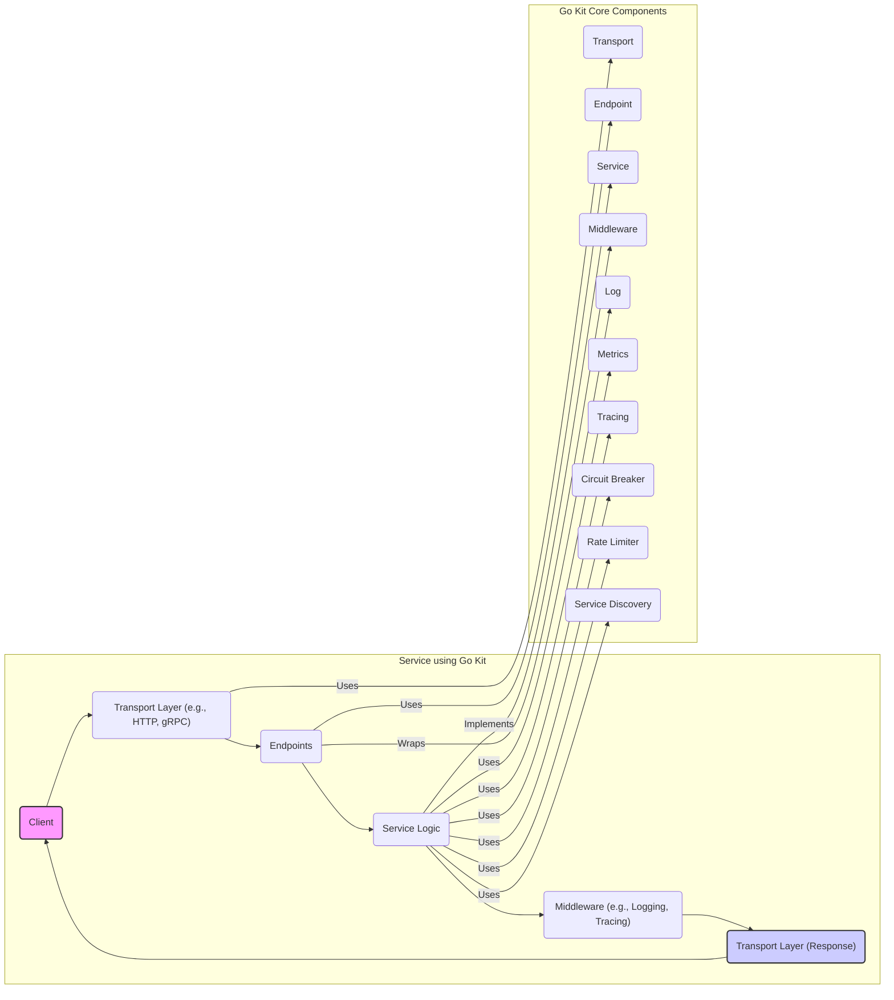
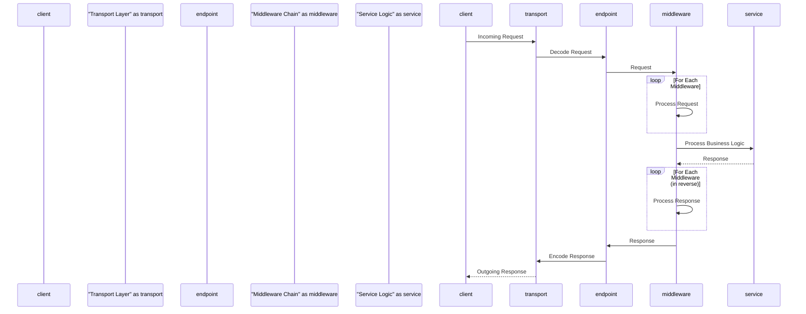

# Project Design Document: Go Kit

**Version:** 1.1
**Date:** October 26, 2023
**Author:** AI Architecture Expert

## 1. Introduction

This document provides a detailed architectural design of the Go Kit project, a popular toolkit for building microservices in Go. This document aims to provide a comprehensive overview of the project's structure, components, and interactions, serving as a foundation for subsequent threat modeling activities.

Go Kit provides a curated set of packages and promotes best practices for addressing common challenges in microservice architectures. These challenges include service discovery, load balancing, observability (logging, metrics, tracing), and resilience patterns. This document will explore the key abstractions and components that constitute Go Kit's design philosophy.

## 2. Goals and Objectives

The primary goals of Go Kit are to:

*   Empower developers with a focused and well-integrated collection of tools for building robust and scalable microservices in Go.
*   Offer clear, consistent, and well-defined abstractions for implementing common microservice patterns, reducing boilerplate and promoting code reusability.
*   Guide developers towards best practices for building maintainable, observable, and resilient services.
*   Maintain a flexible and unopinionated stance regarding specific technology choices, allowing developers to integrate Go Kit with their preferred tools and infrastructure.

This design document aims to:

*   Clearly articulate the architectural components of Go Kit and their respective responsibilities.
*   Describe the interactions and data flow between these components within a typical Go Kit service.
*   Identify key interfaces, extension points, and architectural boundaries within the framework.
*   Provide a solid foundation for understanding the security boundaries, potential attack surfaces, and inherent vulnerabilities within systems built using Go Kit.

## 3. High-Level Architecture

Go Kit is designed as a set of independent, composable packages rather than a monolithic framework. Developers selectively integrate these packages into their services based on their specific needs.

**Key Concepts:**

*   **Transport:**  The mechanism for communication, handling protocol-specific details like request parsing and response formatting (e.g., HTTP, gRPC).
*   **Endpoint:** Represents a single, well-defined operation exposed by the service. It acts as a decoupling point between the transport layer and the core service logic.
*   **Service:** Encapsulates the core business logic and functionality of the application, independent of transport concerns.
*   **Middleware:** Functions that intercept requests and responses, enabling the implementation of cross-cutting concerns in a modular and reusable way.

## 4. Detailed Design

This section provides a more in-depth look at the key components and their functionalities within Go Kit.

### 4.1. Transport Layer

*   **Purpose:**  Manages the specifics of network communication protocols. Go Kit offers packages for various transport options.
*   **Examples:**
    *   `transport/http`: Facilitates building HTTP-based services, handling request routing, header manipulation, and response generation according to HTTP standards.
    *   `transport/grpc`: Enables the creation of gRPC-based services, managing gRPC server and client interactions, including request/response serialization and handling of gRPC features.
*   **Key Functionalities:**
    *   **Request Decoding:**  Transforms incoming requests from the network format into a structured data format usable by the endpoint.
    *   **Response Encoding:** Converts the endpoint's response data into a format suitable for transmission over the network protocol.
    *   **Error Handling:**  Maps errors originating from the service logic to appropriate transport-level error codes and formats.
    *   **Middleware Integration:** Provides mechanisms for applying transport-specific middleware to intercept and process requests and responses at the transport level.

### 4.2. Endpoints

*   **Purpose:**  Represent individual, atomic operations or functions exposed by the service. They serve as the primary interface between the transport layer and the underlying service logic.
*   **Key Functionalities:**
    *   **Request Reception:** Receives the decoded request from the transport layer.
    *   **Service Logic Invocation:**  Calls the corresponding function within the service layer to execute the business logic.
    *   **Response Handling:** Receives the response from the service logic.
    *   **Response Forwarding:** Returns the response to the transport layer for encoding and transmission.
*   **Structure:**  Typically implemented as functions that accept a context and a request object as input and return a response object and an error.

### 4.3. Service Layer

*   **Purpose:**  Contains the core business logic and domain-specific functionality of the application. It is intentionally decoupled from transport-specific details.
*   **Key Functionalities:**
    *   **Business Logic Implementation:**  Implements the specific operations and workflows of the service.
    *   **Data Access and Manipulation:** Interacts with data stores, external APIs, and other necessary resources.
    *   **Domain Error Handling:**  Defines and raises domain-specific errors to be handled by the endpoint or middleware.
*   **Structure:**  Often defined by interfaces that specify the available operations, allowing for different implementations and promoting testability. Concrete implementations contain the actual business logic.

### 4.4. Middleware

*   **Purpose:**  Provides a powerful mechanism for implementing cross-cutting concerns in a modular and reusable manner. Middleware functions can intercept and process requests and responses at various stages.
*   **Types:**
    *   **Endpoint Middleware:** Applied to individual endpoints, allowing for fine-grained control over specific operations.
    *   **Transport Middleware:** Applied at the transport layer, affecting all endpoints served by that particular transport.
*   **Key Functionalities:**
    *   **Request Logging:** Records details about incoming requests for auditing and debugging.
    *   **Response Logging:** Records details about outgoing responses.
    *   **Tracing:**  Adds tracing information to requests, enabling distributed tracing and performance analysis across multiple services.
    *   **Authentication:** Verifies the identity of the requester.
    *   **Authorization:** Determines if the authenticated requester has the necessary permissions to perform the requested operation.
    *   **Metrics Collection:**  Collects and records metrics about request processing time, error rates, and other relevant performance indicators.

### 4.5. Observability Components

*   **Logging (`log` package):** Provides interfaces and utilities for structured logging, allowing for consistent and machine-readable log output. Supports integration with various logging backends.
*   **Metrics (`metrics` package):** Offers interfaces for defining and collecting various types of metrics (counters, gauges, histograms). Facilitates integration with monitoring systems like Prometheus for real-time monitoring and alerting.
*   **Tracing (`tracing` package):** Enables distributed tracing by providing interfaces for instrumenting code and propagating trace context across service boundaries. Supports integration with popular tracing systems like Jaeger and Zipkin, allowing for request flow visualization and performance bottleneck identification.

### 4.6. Resilience Components

*   **Circuit Breaker (`circuitbreaker` package):** Implements the circuit breaker pattern to prevent cascading failures in distributed systems. Monitors the health of downstream services and temporarily halts requests to failing services to allow them to recover.
*   **Rate Limiter (`ratelimit` package):** Controls the rate at which requests are processed, protecting services from being overwhelmed by excessive traffic and ensuring fair resource allocation.

### 4.7. Service Discovery (`sd` package)

*   **Purpose:**  Provides mechanisms for services to dynamically discover the network locations of other services they need to communicate with.
*   **Strategies:**
    *   **Static:**  Service addresses are manually configured.
    *   **Consul:** Integrates with HashiCorp Consul for service registration and discovery, leveraging Consul's health checks and key-value store.
    *   **Etcd:** Integrates with Etcd, a distributed key-value store, for service registration and discovery.
    *   **Kubernetes:** Integrates with Kubernetes' built-in service discovery mechanisms.
*   **Key Functionalities:**
    *   **Service Registration:**  Allows services to register their availability and network location.
    *   **Service Lookup:** Enables services to query for the network locations of other registered services.
    *   **Load Balancing:** Often integrated with service discovery to distribute requests across multiple instances of a service.

## 5. Data Flow

A typical request flow within a service built using Go Kit follows these steps:

**Detailed Steps:**

1. **Client sends a request:** The client initiates a request to the service using the agreed-upon transport protocol (e.g., HTTP, gRPC).
2. **Transport Layer receives the request:** The transport layer implementation receives the incoming request from the network.
3. **Request Decoding:** The transport layer decodes the raw request data into a structured format that the endpoint can understand.
4. **Endpoint Invocation:** The appropriate endpoint is identified based on the request (e.g., based on the HTTP path or gRPC method) and is invoked.
5. **Middleware Chain Processing (Request Phase):** The request is passed through a chain of middleware functions. Each middleware in the chain has the opportunity to process or modify the request before it reaches the service logic (e.g., for authentication, logging).
6. **Service Logic Execution:** The endpoint calls the relevant function within the service layer to execute the core business logic associated with the request.
7. **Middleware Chain Processing (Response Phase):** The response generated by the service logic is passed back through the middleware chain in reverse order. Middleware can process or modify the response before it's sent back to the client (e.g., for adding headers, logging).
8. **Response Encoding:** The endpoint returns the processed response to the transport layer. The transport layer encodes the response data into the appropriate format for the client based on the transport protocol.
9. **Client receives the response:** The transport layer sends the encoded response back to the requesting client.

## 6. Deployment Architecture

Go Kit services are typically deployed as independent, self-contained microservices. Common deployment patterns include:

*   **Containerization (Docker):** Packaging the service and its dependencies into Docker containers ensures consistent execution across different environments and simplifies deployment.
*   **Orchestration (Kubernetes):** Utilizing Kubernetes to manage the deployment, scaling, and orchestration of Go Kit services. Kubernetes provides features like automated deployments, service discovery, load balancing, and health checks.
*   **Cloud Platforms (AWS, GCP, Azure):** Deploying services on cloud platforms leverages their managed services for infrastructure, networking, security, and scalability. This often involves using container orchestration services like Amazon ECS/EKS, Google Kubernetes Engine (GKE), or Azure Kubernetes Service (AKS).

## 7. Security Considerations (Initial)

This section provides an initial overview of security considerations relevant to services built with Go Kit. A more detailed threat model will be developed based on this foundation.

*   **Transport Security:**
    *   **HTTPS/TLS:** Enforcing secure communication over HTTP by utilizing TLS certificates to encrypt traffic between clients and the service.
    *   **gRPC Security:**  Utilizing TLS for gRPC connections to ensure confidentiality and integrity. Consider implementing mutual TLS for stronger authentication.
*   **Authentication and Authorization:**
    *   **JWT (JSON Web Tokens):** A common approach for authenticating and authorizing requests. Middleware can be used to validate JWTs present in request headers.
    *   **OAuth 2.0:** Implementing OAuth 2.0 flows for more complex authorization scenarios, especially when dealing with delegated authorization.
    *   **API Keys:**  Using API keys for simpler authentication needs, ensuring proper management and rotation of keys.
*   **Input Validation:**  Implementing robust input validation and sanitization to prevent injection attacks (e.g., SQL injection, cross-site scripting, command injection). Validate data at the transport layer and within the service logic.
*   **Output Encoding:**  Encoding output data appropriately to prevent vulnerabilities like cross-site scripting (XSS) when rendering data in web applications.
*   **Rate Limiting:**  Implementing rate limiting middleware to protect against denial-of-service (DoS) attacks by limiting the number of requests from a single source within a given time period.
*   **Circuit Breakers:**  While primarily for resilience, circuit breakers can indirectly improve security by preventing cascading failures that could expose vulnerabilities or lead to data breaches.
*   **Logging and Monitoring:**  Implementing comprehensive logging and monitoring to detect and respond to security incidents. Ensure logs are securely stored and access is restricted.
*   **Dependency Management:**  Regularly updating dependencies to patch known security vulnerabilities in third-party libraries. Utilize tools for dependency scanning.
*   **Secrets Management:**  Securely storing and managing sensitive information like API keys, database credentials, and encryption keys. Avoid hardcoding secrets in the codebase. Consider using dedicated secrets management solutions (e.g., HashiCorp Vault, AWS Secrets Manager).
*   **Service Mesh Integration:**  If deploying within a service mesh (e.g., Istio, Linkerd), leverage its security features such as mutual TLS, authorization policies, and traffic encryption.

## 8. Assumptions and Constraints

*   This document assumes a foundational understanding of microservice architecture principles and common patterns.
*   The design focuses on the core concepts and commonly used packages within Go Kit. Specific implementations and integrations may vary depending on project requirements.
*   The security considerations outlined are initial and will be further detailed and refined during a dedicated threat modeling exercise.
*   The deployment architecture examples are illustrative and can be adapted based on specific project needs and infrastructure choices.

This improved design document provides a more detailed and refined architectural overview of the Go Kit project, offering a stronger foundation for subsequent threat modeling activities. The enhanced descriptions of components, data flow, and security considerations aim to facilitate a more thorough identification of potential vulnerabilities and the design of effective mitigation strategies.
