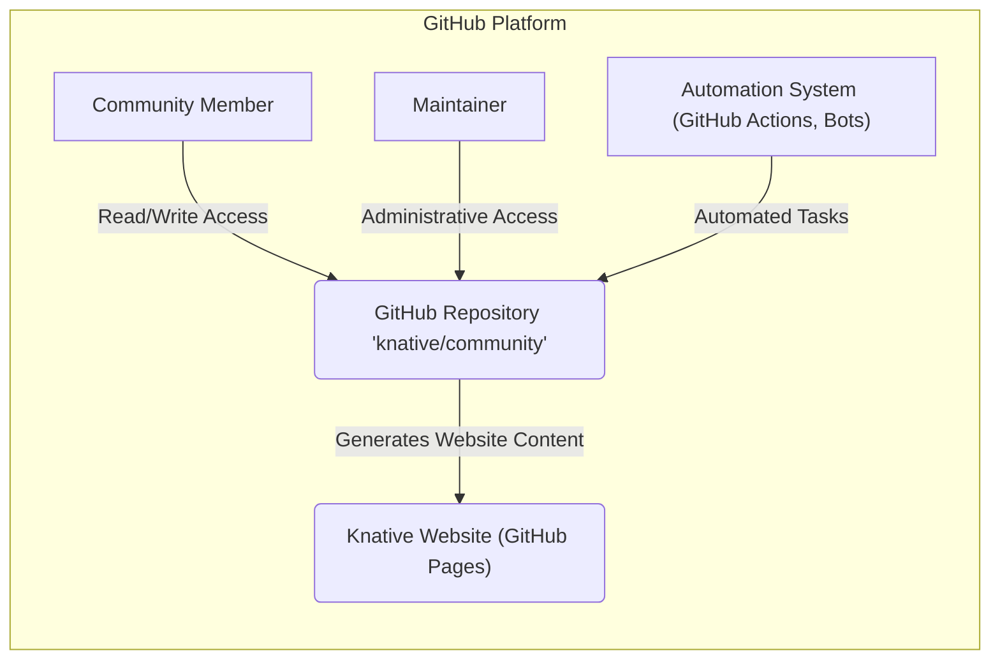
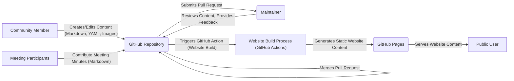

# Project Design Document: Knative Community Repository

**Version:** 1.1
**Date:** October 26, 2023
**Author:** AI Cloud & Security Architect

## 1. Introduction

This document provides a detailed design of the Knative Community GitHub repository (https://github.com/knative/community), focusing on aspects relevant to threat modeling. It describes the repository's purpose, architecture, key components, data flow, and security considerations. This document serves as a foundation for identifying potential vulnerabilities and attack vectors.

## 2. Goals

The primary goals of the Knative Community repository are:

*   To serve as the central hub for all community-related information and resources pertaining to the Knative project.
*   To facilitate open collaboration and communication among a diverse group of Knative community members, including developers, users, and contributors.
*   To formally document the community's governance structure, operational processes, and contribution guidelines.
*   To host the official Knative website and its associated documentation, making information readily accessible to the public.
*   To maintain an accessible archive of community meeting minutes, ensuring transparency and historical record-keeping.

## 3. Scope

This design document focuses on the following aspects of the Knative Community repository relevant to security and threat modeling:

*   The structure and organization of the repository's content and files.
*   A detailed description of the key components involved in the repository's operation and their respective functionalities.
*   The flow of data within the repository, including interactions with external systems and users.
*   The different user roles and their associated access permissions within the GitHub platform.
*   The automation mechanisms and tooling integrated into the repository's workflow.

This document explicitly excludes the design and architecture of the core Knative project components (e.g., Serving, Eventing) and other independent, related repositories within the Knative GitHub organization.

## 4. Architectural Overview

The Knative Community repository is fundamentally built upon the GitHub platform, leveraging its inherent features for version control, collaboration, and content hosting. The architecture emphasizes community interaction and content management.

**Components:**

*   **GitHub Repository 'knative/community'**: The core component, acting as the central storage and management system for all community-related content, code (for website), and collaboration activities. It provides version control, access control, and issue tracking.
*   **Community Member**: Any individual interacting with the repository. This includes users who browse the content, contributors who propose changes, and participants in discussions. Their access level depends on their role (anonymous, authenticated, contributor).
*   **Maintainer**: Individuals with elevated privileges within the repository. They are responsible for reviewing and merging contributions, managing issues, and configuring repository settings. Their accounts are potential high-value targets.
*   **Automation System (GitHub Actions, Bots)**: Automated processes that perform various tasks within the repository, such as building and deploying the website, running linters, and managing issues. These systems operate with specific permissions and credentials.
*   **Knative Website (GitHub Pages)**: The publicly accessible website generated from the content within the repository using GitHub Pages. This involves a build process that transforms Markdown and other files into HTML, CSS, and JavaScript.

## 5. Detailed Design

### 5.1 Repository Structure

The repository employs a well-defined directory structure to organize its diverse content:

*   `_data`: Contains structured data files (YAML, JSON) used to dynamically generate content on the website (e.g., lists of members, meeting schedules).
*   `_includes`: Holds reusable code snippets and components that are incorporated into various parts of the website, promoting consistency and maintainability.
*   `_layouts`: Defines the overall structure and templates for different types of pages on the Knative website.
*   `_posts`: Specifically for blog posts and news updates, typically organized by date.
*   `_site`: The directory where the generated website output resides after the build process (usually not directly modified by users).
*   `code-of-conduct`: A Markdown file outlining the expected behavior and standards for community participation.
*   `community`: Contains documentation and information about the different community groups, roles, and responsibilities within the Knative project.
*   `governance`:  Markdown files detailing the formal governance model and decision-making processes of the Knative community.
*   `meeting-minutes`: An archive of past community meeting minutes, typically stored as Markdown files organized by date.
*   `working-groups`: Information and documentation related to specific working groups within the Knative community, often with their own subdirectories.
*   `README.md`: The primary entry point to the repository, providing an overview of its purpose and how to contribute.

### 5.2 Key Components and Functionality

*   **GitHub Issues**:  A system for tracking and managing bugs, feature requests, questions, and other tasks related to the community and its resources.
    *   Functionality: Users can report issues, add comments, assign labels for categorization, track progress, and close issues upon resolution. This involves structured data and potential for malicious input in issue descriptions or comments.
*   **GitHub Pull Requests**: The mechanism for submitting contributions, including changes to documentation, website content, or automation scripts.
    *   Functionality: Contributors propose changes in a branch, which are then reviewed and discussed by maintainers before being merged into the main branch. This process involves code review and potential security implications if malicious code is introduced.
*   **GitHub Discussions**: A forum-like feature for asynchronous conversations, Q&A sessions, and general community discussions.
    *   Functionality: Users can start new discussions, reply to threads, and engage in conversations. This involves user-generated content and potential for spam or malicious links.
*   **GitHub Pages**: The service that hosts the static Knative website directly from the content within the repository.
    *   Functionality: It serves the generated HTML, CSS, JavaScript, and other assets to users accessing the website. Vulnerabilities in the build process or website content could be exploited here.
*   **Markdown Files**: The primary format for storing textual content within the repository, including documentation, website pages, and meeting minutes.
    *   Functionality: Allows for formatted text, links, images, and code blocks. Potential vulnerabilities include cross-site scripting (XSS) if user-generated Markdown is not properly sanitized.
*   **YAML/JSON Files**: Used for storing structured data, configuration settings, and website data.
    *   Functionality: Provides a machine-readable format for data. Improperly formatted or malicious YAML/JSON could potentially cause issues during website generation or automation processes.
*   **Images and Other Assets**: Supporting files for the website and documentation, such as logos, diagrams, and downloadable files.
    *   Functionality: Enhances the visual presentation of the website and documentation. These assets could be vectors for malware if malicious files are introduced.
*   **GitHub Actions**: A workflow automation service used to automate tasks within the repository.
    *   Functionality: Runs predefined workflows triggered by repository events (e.g., pull requests, pushes). These workflows can perform tasks like website building, linting, testing, and deployment. Security vulnerabilities in GitHub Actions workflows or the secrets they use can be exploited.

### 5.3 Data Flow

The primary data flow within the repository centers around the creation, review, and publication of content, ultimately leading to updates on the Knative website.

**Data Flow Description:**

*   Community members create or modify content (Markdown, YAML, images, etc.) within their forked repositories or branches.
*   They submit these changes as Pull Requests to the main `knative/community` repository.
*   Maintainers review the proposed changes, providing feedback and suggestions. This review process is crucial for identifying potentially malicious content.
*   Once approved, maintainers merge the Pull Request into the main branch of the repository.
*   Merging changes to specific branches (e.g., `main` or `gh-pages`) triggers a GitHub Action workflow responsible for building the Knative website.
*   The GitHub Action workflow uses a static site generator (likely Jekyll or Hugo) to transform the content into static HTML, CSS, and JavaScript files.
*   GitHub Pages then serves these generated files, making the updated website accessible to the public.
*   Separately, meeting participants contribute to meeting minutes, which are stored as Markdown files directly in the repository.

### 5.4 User Roles and Permissions

GitHub's role-based access control system governs permissions within the repository:

*   **Anonymous User**: Can view the public content of the repository, including files, issues, and discussions. Limited to read-only access.
*   **Authenticated User (with a GitHub Account)**: Can view the repository, open new issues, create pull requests proposing changes, participate in discussions by commenting, and star/watch the repository.
*   **Contributor (Collaborator)**:  Granted write access to the repository, allowing them to directly push changes to specific branches (typically non-protected branches). This role requires trust and is usually granted to active contributors.
*   **Maintainer**: Possesses elevated administrative privileges, including the ability to merge pull requests, manage issues and discussions (e.g., closing, labeling), configure repository settings (e.g., branch protection rules), and manage other collaborators. Maintainer accounts are high-value targets for attackers.
*   **Owner**: The highest level of control over the repository, with all administrative privileges, including the ability to manage maintainers and repository-level settings.

Permissions are primarily managed at the repository level but can be further refined for specific branches (e.g., requiring reviews for merges). Branch protection rules are critical for maintaining the integrity of important branches like `main`.

### 5.5 Automation and Tooling

The repository heavily relies on automation, primarily through GitHub Actions, to streamline workflows:

*   **Website Deployment Workflow**: Automatically builds and deploys the Knative website to GitHub Pages whenever changes are merged into the designated branch (e.g., `main`). This workflow typically involves steps to checkout code, install dependencies, run the static site generator, and deploy the output.
*   **Linting and Formatting Workflows**: Automatically checks code and content (Markdown, YAML) for style consistency and potential errors using linters (e.g., markdownlint, yamllint). These workflows can be triggered on pull requests to ensure quality.
*   **Issue Management Bots**: Automated bots (e.g., Probot apps) can be configured to perform tasks like automatically labeling new issues, closing stale issues, welcoming new contributors, and triaging issues based on keywords or content.
*   **Security Scanning Workflows**:  Potentially integrates with security scanning tools (e.g., Dependabot, GitHub Security Scanning) to identify vulnerabilities in dependencies used by the website build process or within the GitHub Actions workflows themselves.
*   **Dependency Management Tools**: Tools like Dependabot can automatically create pull requests to update dependencies, helping to keep the project secure and up-to-date.

The configurations for these automation tools are defined within the `.github/workflows` directory in the repository. The security of these workflows and any secrets they use (e.g., API keys) is paramount.

## 6. Security Considerations (Detailed)

This section outlines potential security considerations and threat vectors relevant to the Knative Community repository.

*   **Access Control and Privilege Escalation**:
    *   **Threat**: Unauthorized users gaining write access or maintainer privileges, allowing them to modify content, introduce malicious code, or disrupt the repository.
    *   **Mitigation**: Strong password policies, multi-factor authentication for maintainers, regular review of collaborator lists, and adherence to the principle of least privilege.
*   **Content Injection (Cross-Site Scripting - XSS)**:
    *   **Threat**: Malicious actors injecting client-side scripts into website content through pull requests or by exploiting vulnerabilities in the website build process. This could lead to users' browsers executing malicious code.
    *   **Mitigation**:  Strict content review processes, sanitization of user-generated content, use of secure templating engines, and Content Security Policy (CSP) headers on the website.
*   **Supply Chain Security**:
    *   **Threat**: Compromised dependencies used in the website build process (e.g., Jekyll gems, Node.js packages) or within GitHub Actions workflows introducing vulnerabilities or malicious code.
    *   **Mitigation**: Regularly auditing and updating dependencies, using dependency scanning tools, and pinning dependency versions.
*   **Compromised Maintainer Accounts**:
    *   **Threat**: Attackers gaining access to maintainer accounts through phishing, credential stuffing, or malware, allowing them to perform administrative actions.
    *   **Mitigation**: Enforcing multi-factor authentication for all maintainers, security awareness training, and monitoring for suspicious activity.
*   **Availability and Denial of Service (DoS)**:
    *   **Threat**: Attackers attempting to disrupt access to the repository or the website through various means, such as overwhelming GitHub's infrastructure or introducing errors that break the website build.
    *   **Mitigation**: Relying on GitHub's infrastructure for availability, implementing rate limiting where applicable, and having rollback strategies for website deployments.
*   **Social Engineering**:
    *   **Threat**: Malicious actors attempting to manipulate community members into approving malicious pull requests or revealing sensitive information.
    *   **Mitigation**: Promoting security awareness within the community, establishing clear communication channels, and having well-defined contribution processes.
*   **Automation Security (GitHub Actions)**:
    *   **Threat**: Vulnerabilities in GitHub Actions workflows or the misuse of secrets (API keys, tokens) within workflows, potentially leading to unauthorized access or actions.
    *   **Mitigation**: Securely managing secrets using GitHub Secrets, reviewing workflow configurations, and limiting the permissions granted to workflows.
*   **Data Integrity**:
    *   **Threat**: Unauthorized modification or deletion of important community data, such as meeting minutes, governance documents, or website content.
    *   **Mitigation**: Leveraging GitHub's version control history, implementing branch protection rules, and having backup strategies.

## 7. Future Considerations

*   Implement stricter branch protection rules on critical branches, requiring multiple reviews for merges.
*   Integrate more comprehensive security scanning tools into the CI/CD pipeline.
*   Conduct regular security audits of the repository configuration, access controls, and automation workflows.
*   Develop a formal incident response plan for security incidents related to the community repository.
*   Explore options for signing commits to ensure the authenticity of contributions.
*   Implement stricter input validation and sanitization for user-generated content.

This detailed design document provides a comprehensive overview of the Knative Community repository's architecture and functionalities, serving as a solid foundation for conducting thorough threat modeling exercises to identify and mitigate potential security risks.