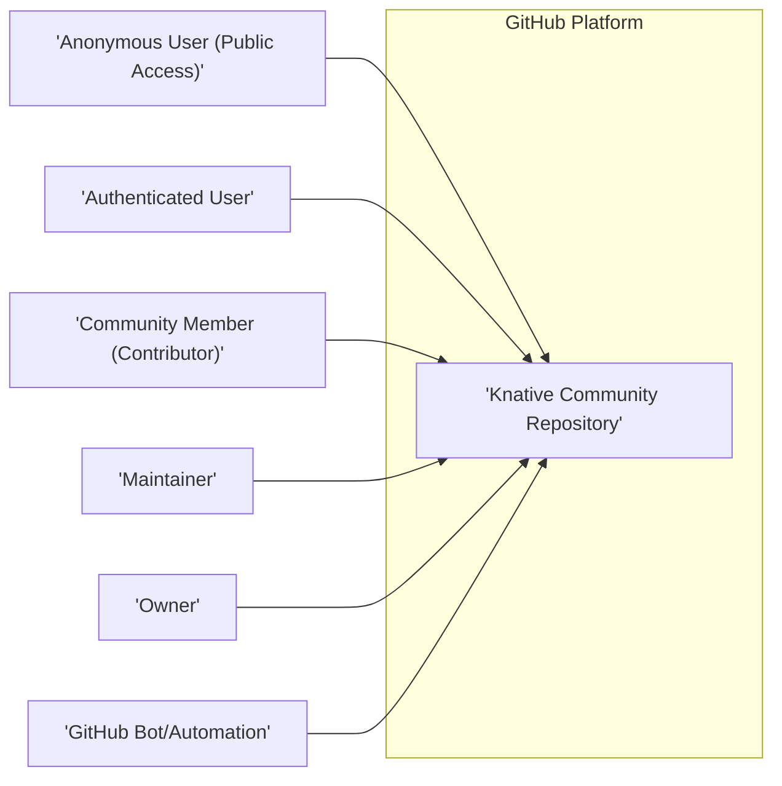
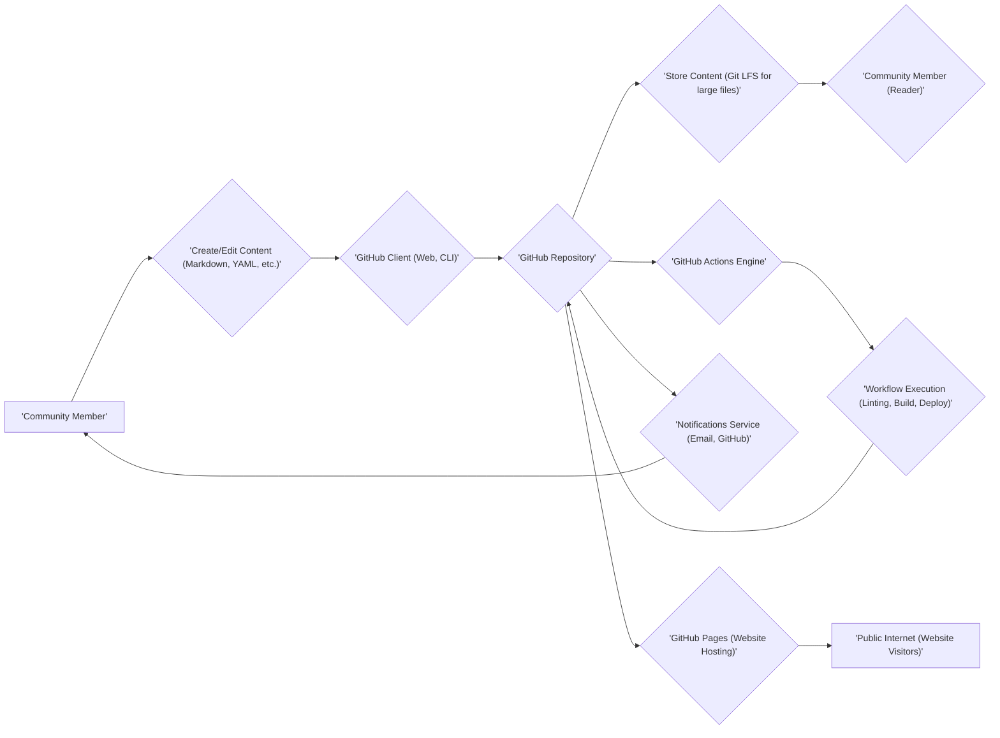

# Project Design Document: Knative Community Repository

**Version:** 1.1
**Date:** October 26, 2023
**Author:** AI Software Architect

## 1. Introduction

This document provides an enhanced and detailed design overview of the Knative Community GitHub repository ([https://github.com/knative/community](https://github.com/knative/community)). This document aims to clearly articulate the repository's structure, purpose, and key interactions to facilitate effective threat modeling. It outlines the various components, data flows, and potential security considerations associated with the repository and its usage, providing a more granular view for security analysis.

## 2. Goals and Objectives

The primary goals of the Knative Community repository are:

* To serve as a central, authoritative hub for information, discussions, and resources related to the Knative project.
* To facilitate transparent and collaborative engagement among Knative community members with diverse roles and interests.
* To meticulously document community processes, guidelines, and established best practices for contribution and participation.
* To provide a structured platform for proposing, discussing, and iterating on new ideas, features, and improvements for Knative.
* To maintain a comprehensive archive of historical information, decisions, and discussions pertaining to the project's evolution.

## 3. Scope

This design document focuses specifically on the GitHub repository itself and the interactions directly related to it. It includes a deeper dive into:

* The detailed structure and organization of the repository, including specific file types and their purpose.
* The different types of content hosted within the repository and their intended audience.
* The granular roles and permissions of users interacting with the repository, including automated actors.
* The detailed workflows for contributing to and managing the repository, including specific GitHub features utilized.
* The tools, technologies, and GitHub features directly involved in the repository's operation and maintenance.

This document explicitly excludes:

* The intricate internal architecture and implementation details of the core Knative software components.
* The underlying infrastructure on which Knative is deployed and operates.
* External communication channels like Slack, mailing lists, or forums, except where they have direct, automated integrations with the GitHub repository.

## 4. High-Level Architecture

The Knative Community repository is fundamentally a content management and collaboration platform hosted on GitHub. The primary actors interacting with the repository possess varying levels of access and permissions, enabling a structured contribution and information flow.

* **Knative Community Repository:** The central, version-controlled repository hosted on GitHub, containing diverse files and folders.
* **Anonymous User (Public Access):** Users without a GitHub account who can view publicly available content.
* **Authenticated User:** Users logged into GitHub who can generally view public content and may have limited interaction capabilities.
* **Community Member (Contributor):** Users with specific permissions to open issues, create branches, submit pull requests, and comment on existing content.
* **Maintainer:** Users with elevated permissions to merge pull requests, manage issues (labeling, closing), and configure certain repository settings.
* **Owner:** Users with the highest level of administrative control over the repository, including managing permissions and settings.
* **GitHub Bot/Automation:** Automated processes (e.g., GitHub Actions, third-party bots) that interact with the repository to perform predefined tasks based on triggers.

## 5. Detailed Design

### 5.1. Repository Structure (Detailed)

The repository is meticulously organized into directories and files, each with a defined purpose and often specific conventions. Key areas include:

* **`_docs`:**  A primary directory containing comprehensive documentation related to community processes, contributor guides, meeting notes from various groups, and other informational content intended for broad consumption.
    * **Subdirectories (Examples):** `contributing`, `governance`, `working-groups`, `archived`.
    * **File Types:** Primarily Markdown (`.md`), potentially images (`.png`, `.jpg`), and occasionally diagrams (using formats like Mermaid within Markdown).
* **`_working`:**  A designated space for documents, proposals, or ideas that are currently under development, discussion, or review and may not yet be considered finalized.
    * **Status:** Content here is typically considered draft and subject to change.
* **`wg-*` directories (e.g., `wg-sig-cli`, `wg-serving`):** Dedicated directories for specific Working Groups (WGs) or Special Interest Groups (SIGs) within the Knative community. Each typically has its own sub-structure for:
    * **Meeting Notes:** Records of WG/SIG meetings, decisions, and action items.
    * **Proposals:** Formal documents outlining proposed changes, features, or initiatives within the WG/SIG's scope.
    * **Roadmaps:** High-level plans and priorities for the WG/SIG.
* **`CODE_OF_CONDUCT.md`:** A foundational document outlining the expected behavior and ethical guidelines for all community members participating in the project.
* **`CONTRIBUTING.md`:** A crucial guide providing detailed instructions and best practices for individuals who wish to contribute to the Knative project, including code, documentation, and other forms of participation.
* **`GOVERNANCE.md`:** A document that formally defines the governance structure of the Knative project, outlining roles, responsibilities, and decision-making processes.
* **`README.md`:** The entry point for the repository, providing a concise overview of its purpose, links to essential resources, and guidance for navigation.
* **`.github` directory:** A special directory containing configuration files that customize GitHub features and workflows for the repository.
    * **`workflows`:** Contains YAML files defining GitHub Actions workflows for automation.
    * **`issue_template`:** Contains templates to guide users when creating new issues, ensuring necessary information is provided.
    * **`pull_request_template`:** Contains templates to guide users when creating pull requests, prompting for relevant details about the proposed changes.
* **Issue Tracker:** A built-in GitHub feature used for tracking bugs, feature requests, questions, and general discussions related to the Knative project and its community. Issues have states (open, closed), labels for categorization, and assignees.
* **Pull Requests:** A core GitHub mechanism used for proposing, reviewing, and merging code or documentation changes. Pull requests facilitate collaborative review and discussion before changes are integrated.

### 5.2. Content Types (Detailed)

The repository hosts a variety of content types, each serving a specific purpose and potentially posing different security considerations:

* **Markdown Files (`.md`):** The predominant format for documentation, meeting notes, proposals, guides, and general informational content. Markdown allows for rich text formatting and embedding of links and images. Potential for embedded malicious links.
* **YAML Files (`.yaml`, `.yml`):** Primarily used for configuration files, most notably for defining GitHub Actions workflows. These files can execute arbitrary code within the GitHub environment, posing a significant security risk if compromised.
* **Image Files (`.png`, `.jpg`, `.svg`):** Used to illustrate documentation and presentations. Potential for steganography or malicious content disguised as images (though less likely to be directly executed within the repository context).
* **Text Files (`.txt`):** May contain plain text information, such as lists of attendees or simple notes. Lower security risk compared to executable formats.

### 5.3. User Roles and Permissions (Granular)

GitHub's role-based access control system for repositories provides a granular way to manage permissions:

* **Anonymous Users:** Can view all publicly accessible content within the repository. No ability to interact or make changes.
* **Authenticated Users (GitHub Account):** Can view public content, star the repository, watch for notifications, and potentially open issues or comment on existing ones depending on repository settings.
* **Contributors (Write Access):** Have the ability to:
    * Create new branches.
    * Commit and push changes to their own branches.
    * Open pull requests to propose changes for merging.
    * Comment on issues and pull requests.
    * May have the ability to label issues and pull requests depending on configuration.
* **Maintainers (Maintain Access):** Possess all contributor permissions, plus the ability to:
    * Merge pull requests into protected branches.
    * Manage issues (labeling, closing, assigning).
    * Manage releases.
    * Edit repository wiki (if enabled).
    * Manage repository tags.
* **Owners (Admin Access):** Have the highest level of control, including all maintainer permissions, plus the ability to:
    * Manage repository settings (visibility, branch protection rules).
    * Manage repository collaborators and their permissions.
    * Delete the repository.

Specific permissions can be further refined through branch protection rules, which can enforce requirements like code reviews before merging.

### 5.4. Contribution Workflow (Detailed)

The contribution workflow is a structured process involving several stages and GitHub features:

1. **Identifying a Need/Opportunity:** A community member identifies a bug, a missing feature, a documentation gap, or an area for improvement.
2. **Opening a GitHub Issue:** A new issue is created using a predefined template (if available) to clearly articulate the problem, proposal, or question. The issue serves as a central point for discussion and tracking.
3. **Discussion and Agreement on the Issue:** Community members and maintainers engage in discussions within the issue comments to clarify the problem, explore potential solutions, and reach a consensus on the desired approach. Labels are often used to categorize and prioritize issues.
4. **Forking the Repository (If Necessary):** For code or significant documentation changes, a contributor typically creates a personal fork of the `knative/community` repository.
5. **Developing the Solution in a Branch:** The contributor creates a new branch within their fork (or directly in the main repository if they have write access) to develop the proposed changes.
6. **Submitting a Pull Request (PR):** Once the changes are ready for review, a pull request is created from the contributor's branch to the target branch (typically `main`) in the `knative/community` repository. The PR includes a description of the changes and links to the relevant issue. A pull request template guides the contributor in providing necessary information.
7. **Automated Checks (GitHub Actions):** Upon creation of the PR, automated checks defined in GitHub Actions workflows are triggered. These may include linting, formatting checks, or other validation steps.
8. **Review Process:** Maintainers and other community members review the pull request, examining the proposed changes, providing feedback, and suggesting revisions through comments and code review tools.
9. **Revision and Updates:** The contributor addresses the feedback received and updates the pull request with the necessary revisions.
10. **Approval and Merging:** Once the pull request meets the required standards and receives sufficient approvals (often enforced by branch protection rules), a maintainer merges the pull request into the target branch.
11. **Issue Closure:** After the pull request is merged, the associated issue is typically closed, indicating that the problem or proposal has been addressed.

### 5.5. Automation and Integrations (Detailed)

The repository leverages GitHub's automation capabilities and potentially integrates with external services:

* **GitHub Actions Workflows:** Automated workflows defined in `.github/workflows/*.yml` files are triggered by various events within the repository (e.g., opening a pull request, pushing code). These workflows can perform tasks such as:
    * **Documentation Linting:** Checking Markdown files for formatting and style consistency.
    * **Link Checking:** Verifying that links within documentation are valid.
    * **Static Analysis:** Analyzing code (if present) for potential issues.
    * **Website Generation and Deployment:** Automatically building and deploying a community website based on the repository's content to GitHub Pages or another hosting platform.
    * **Issue and Pull Request Management:** Automatically labeling, assigning, or closing issues and pull requests based on predefined criteria.
* **Issue and Pull Request Templates:** Predefined templates guide users when creating new issues or pull requests, ensuring they provide the necessary information and follow a consistent format.
* **GitHub Pages:**  Often used to host a static community website generated from the content within the repository (typically from the `_docs` directory).
* **Third-Party Bots:**  Potentially used for tasks like:
    * **Welcome Messages:** Automatically welcoming new contributors.
    * **Issue Triaging:** Automatically labeling or assigning issues based on keywords or content.
    * **Community Management:** Enforcing community guidelines or providing helpful information.

## 6. Data Flow (Detailed)

The data flow within the repository is a multi-stage process involving various actors and automated systems:

* **Community Member:** Initiates actions by creating or editing content using their local machine or GitHub's web interface.
* **Create/Edit Content:** Users interact with their local text editors or GitHub's web editor to modify files or create new ones in various formats.
* **GitHub Client (Web, CLI):** Users interact with the repository through GitHub's web interface or command-line tools (Git).
* **GitHub Repository:** The central, version-controlled repository hosted on GitHub's infrastructure.
* **Store Content (Git LFS for large files):** GitHub stores the repository's content, potentially using Git Large File Storage (LFS) for managing large binary files.
* **Community Member (Reader):** Accesses and consumes the stored content through GitHub's web interface or by cloning the repository.
* **GitHub Actions Engine:** GitHub's platform for executing automated workflows.
* **Workflow Execution (Linting, Build, Deploy):** Automated workflows are triggered by events and perform predefined tasks on the repository's content.
* **Notifications Service (Email, GitHub):** GitHub sends notifications to users based on their settings and activity within the repository (e.g., new issues, pull request updates).
* **GitHub Pages (Website Hosting):** GitHub's service for hosting static websites directly from the repository's content.
* **Public Internet (Website Visitors):** Users on the internet can access the community website hosted on GitHub Pages.

## 7. Security Considerations (Enhanced)

Threat modeling of the Knative Community repository requires a comprehensive understanding of potential vulnerabilities and attack vectors:

* **Unauthorized Access (Detailed):**
    * **Risk:** Malicious actors gaining unauthorized write access to the repository, enabling them to modify content, merge malicious code, or disrupt operations.
    * **Attack Vectors:** Compromised maintainer accounts, social engineering targeting maintainers, exploitation of vulnerabilities in GitHub's platform (less likely but possible).
    * **Mitigation:** Enforce strong password policies and multi-factor authentication (MFA) for all maintainers and owners. Regularly review the list of repository collaborators and their assigned permissions. Implement branch protection rules requiring code reviews and status checks before merging. Utilize GitHub's audit logs to monitor access and actions.
* **Content Injection/Tampering (Detailed):**
    * **Risk:** Malicious actors injecting malicious content (e.g., cross-site scripting (XSS) payloads in Markdown, malicious links) or tampering with existing legitimate content to spread misinformation or compromise users.
    * **Attack Vectors:** Submitting malicious pull requests, exploiting vulnerabilities in Markdown rendering engines (if a website is hosted), compromising bot accounts to inject content.
    * **Mitigation:** Implement rigorous pull request review processes, especially for contributions from unknown or less trusted sources. Utilize Content Security Policy (CSP) headers if a website is hosted to mitigate XSS risks. Employ static analysis tools to scan for potentially harmful content in pull requests. Sanitize user-generated content where necessary.
* **Social Engineering (Detailed):**
    * **Risk:** Attackers manipulating maintainers or contributors into performing actions that compromise the repository's security, such as granting unauthorized access, merging malicious changes, or revealing sensitive information.
    * **Attack Vectors:** Phishing emails targeting maintainers, impersonating trusted community members, building trust over time to introduce malicious changes.
    * **Mitigation:** Provide security awareness training to maintainers and contributors, emphasizing the importance of verifying identities and being cautious of unsolicited requests. Establish clear communication channels and protocols for sensitive actions. Encourage a culture of skepticism and verification.
* **Account Compromise (Detailed):**
    * **Risk:** Maintainer or bot accounts being compromised, leading to unauthorized actions such as merging malicious pull requests, modifying repository settings, or injecting malicious content.
    * **Attack Vectors:** Weak passwords, lack of MFA, phishing attacks, malware infections on personal devices.
    * **Mitigation:** Enforce strong password policies and MFA for all maintainers and bot accounts. Regularly review and rotate bot credentials. Limit the permissions granted to bot accounts to the minimum necessary. Monitor bot activity for suspicious behavior.
* **Denial of Service (DoS) (Detailed):**
    * **Risk:** Attackers overwhelming the repository with a large volume of spurious issues, pull requests, or comments, making it difficult for legitimate users to access and use the platform.
    * **Attack Vectors:** Automated scripts submitting大量 of requests, coordinated attacks by multiple actors.
    * **Mitigation:** Rely on GitHub's built-in rate limiting and abuse detection mechanisms. Implement community guidelines for responsible participation and reporting abuse. Consider using CAPTCHA or similar mechanisms for certain actions if necessary.
* **Information Disclosure (Detailed):**
    * **Risk:** Accidental or intentional exposure of sensitive information within the repository, such as API keys, credentials, or private communications.
    * **Attack Vectors:** Committing sensitive information directly to the repository, accidentally including sensitive data in documentation or comments.
    * **Mitigation:** Regularly scan the repository's history for accidentally committed secrets using tools like GitGuardian or TruffleHog. Educate contributors about avoiding the inclusion of sensitive data. Implement policies to prevent the storage of sensitive information within the repository.
* **Supply Chain Attacks (Indirect) (Detailed):**
    * **Risk:** Compromised dependencies or tools used in the automation workflows (GitHub Actions) could introduce malicious code or vulnerabilities into the repository or its outputs (e.g., the community website).
    * **Attack Vectors:** Using vulnerable or malicious GitHub Actions, compromised third-party dependencies.
    * **Mitigation:** Pin specific versions of GitHub Actions and dependencies in workflow files to prevent unexpected updates. Regularly review and update dependencies. Use trusted and reputable GitHub Actions from verified publishers. Implement security scanning for dependencies.
* **Bot Account Compromise (Detailed):**
    * **Risk:** Compromised bot accounts could be used to perform malicious actions, such as injecting spam, modifying content, or disrupting workflows.
    * **Attack Vectors:** Weak credentials, compromised integration tokens.
    * **Mitigation:** Securely store and manage bot credentials (e.g., using GitHub Secrets). Limit bot permissions to the minimum required for their functionality. Regularly audit bot activity.

## 8. Deployment Considerations

The Knative Community repository is inherently "deployed" on the GitHub platform. Deployment considerations primarily revolve around the configuration and management of the repository within GitHub's infrastructure and the deployment of any associated website:

* **Repository Visibility:** The repository is intentionally public to facilitate open collaboration.
* **Branch Protection Rules (Detailed):**  Carefully configure branch protection rules for critical branches (e.g., `main`) to enforce code reviews, required status checks (from GitHub Actions), and restrictions on force pushes.
* **GitHub Actions Configuration (Detailed):**  Securely configure GitHub Actions workflows, ensuring proper permissions, using secrets management for sensitive credentials, and reviewing workflow definitions for potential vulnerabilities.
* **Issue and Pull Request Templates:**  Maintain and update issue and pull request templates to ensure they are effective in guiding user input and collecting necessary information.
* **GitHub Pages Configuration:** If a community website is hosted on GitHub Pages, configure settings such as custom domain names and HTTPS enforcement. Implement appropriate security headers for the website.

## 9. Future Considerations

Potential future developments and considerations include:

* **Enhanced Security Audits:** Conducting regular security audits of the repository's configuration, permissions, and automation workflows.
* **Formal Security Policies:**  Developing and documenting formal security policies and procedures for the community repository.
* **Improved Bot Management:** Implementing more robust mechanisms for managing and monitoring bot accounts.
* **Community Security Training:** Providing security training and resources to community members, especially maintainers.
* **Integration with Security Scanning Tools:** Integrating with automated security scanning tools to proactively identify potential vulnerabilities.

This enhanced document provides a more granular and detailed design overview of the Knative Community repository, offering a stronger foundation for comprehensive threat modeling and ongoing security management.